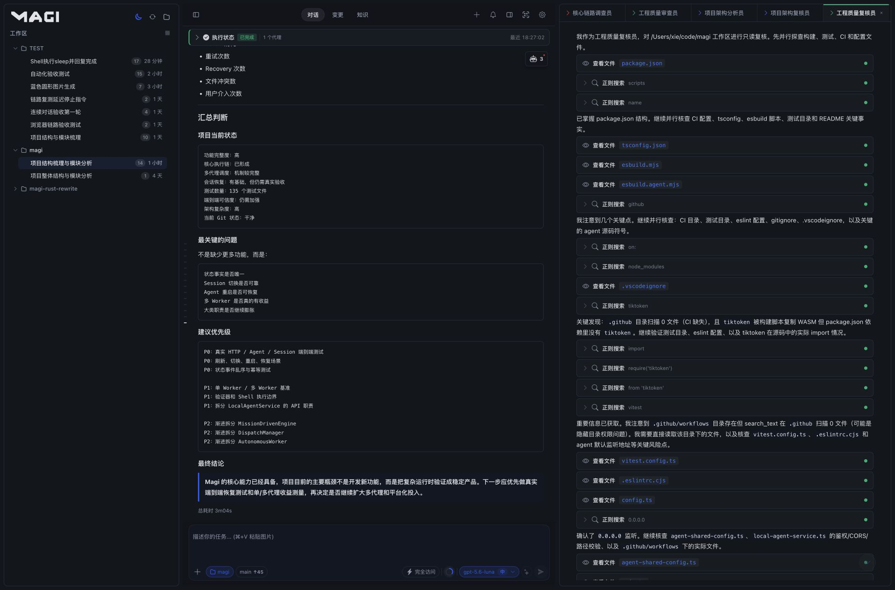
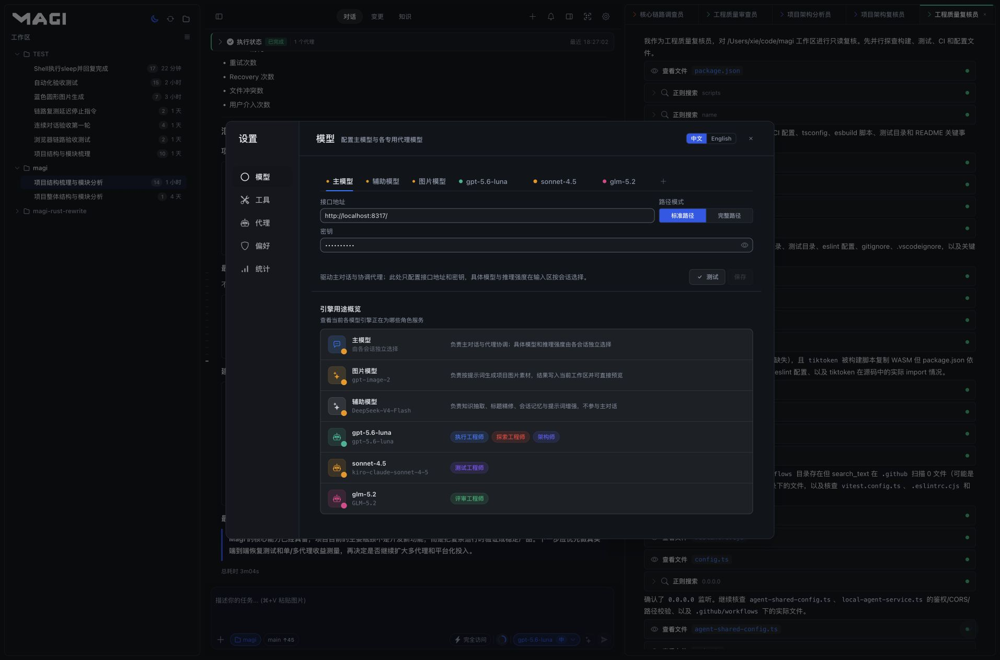
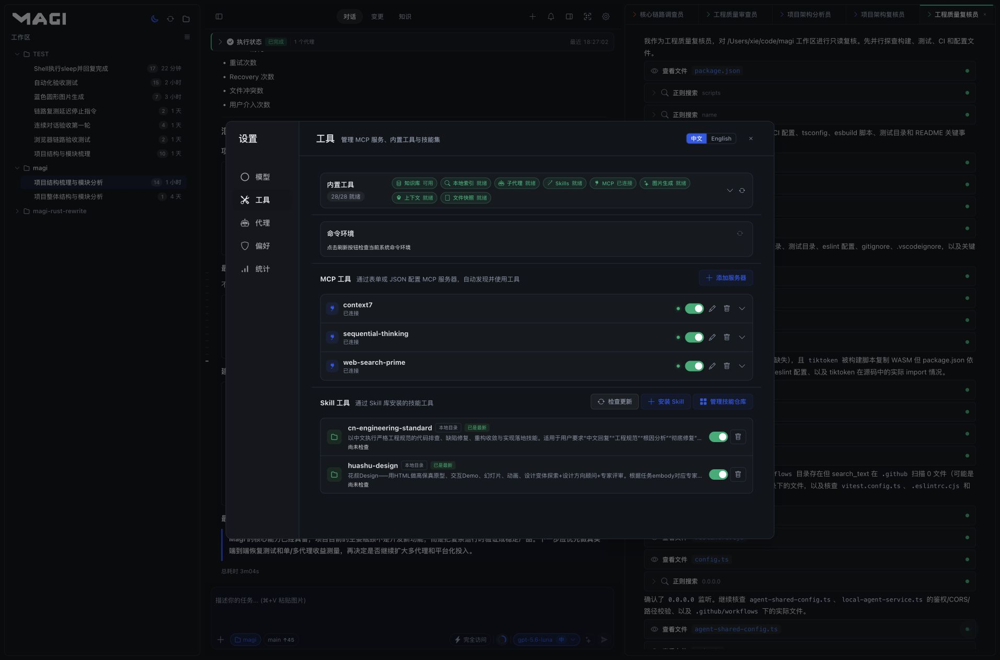
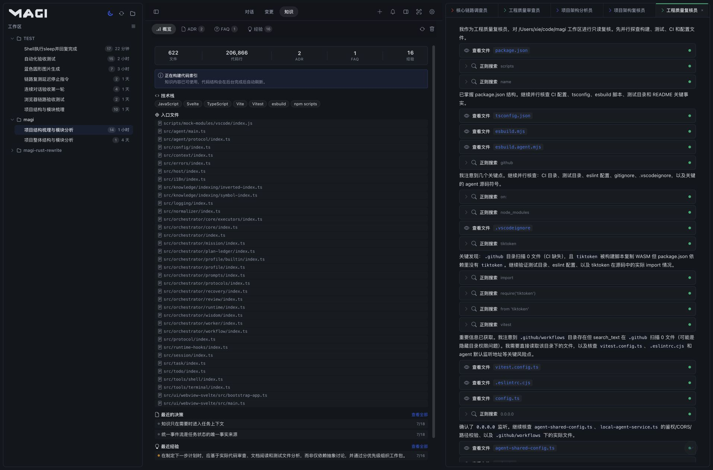
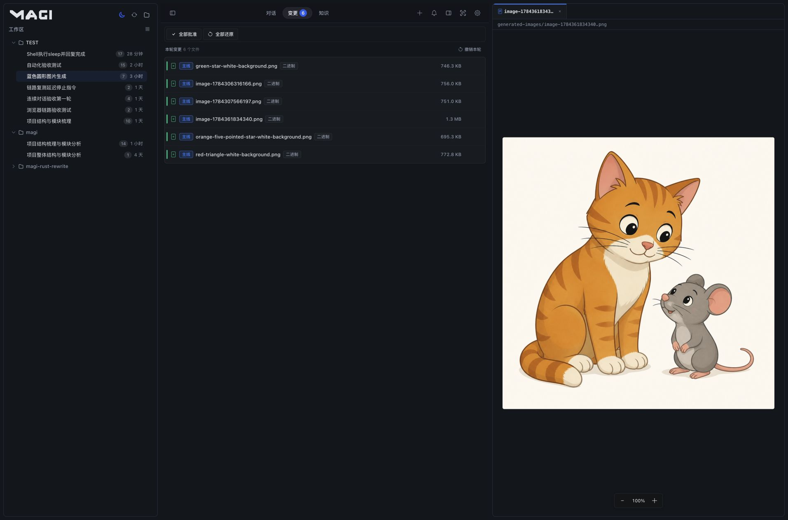
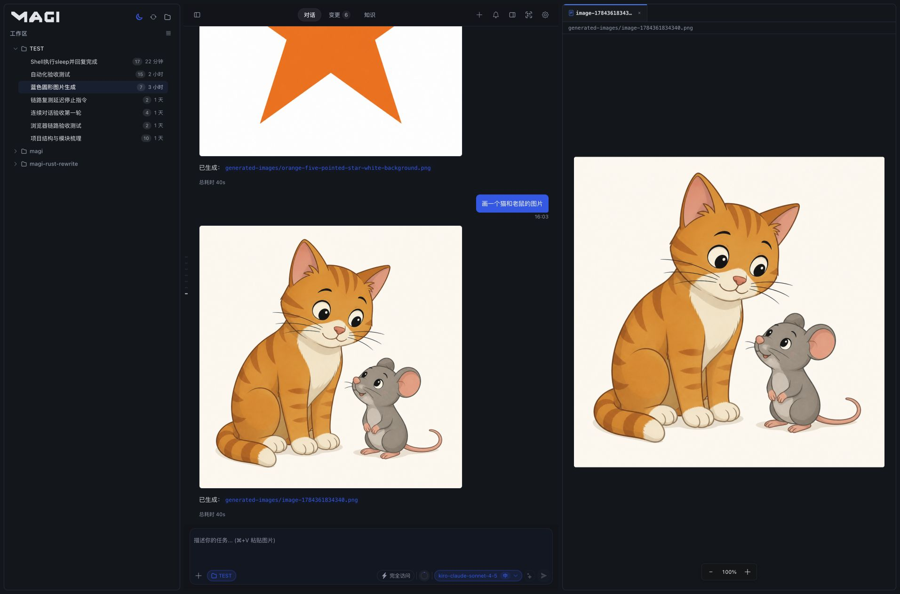

# Magi

**Your local AI engineering team.**

A local-first, self-hostable AI engineering workspace where one main agent coordinates the work, specialized agents collaborate by responsibility, and every tool, knowledge source, and permission boundary remains observable and controllable.

> **Turn a single request into a durable, observable, and reviewable engineering workflow.**

[中文](README.md) · [English](README.en.md) · [架构图](docs/architecture.html) · [License](LICENSE) · [GitHub](https://github.com/MistRipple/magi-code)

## English

### What Magi is for

Complex software work is rarely a single prompt. It requires understanding a codebase, decomposing an outcome, investigating in parallel, editing files, running checks, recovering from failures, preserving context, and producing results that can be reviewed.

Magi turns that full chain into a durable engineering workflow. The main agent owns the goal and coordination, specialized agents work on bounded responsibilities, and the runtime keeps tools, knowledge, permissions, and results connected to the same workspace.

### Product capabilities

#### One mainline, many specialists

The main agent understands the request, assigns work, waits for results, and produces the final synthesis. Built-in specialist roles include executor, explorer, architect, tester, and reviewer.

Each role can use its own model, and one role can run multiple agent instances in the same task. Subagents do not spawn deeper subagents; the mainline owns the topology so fan-out remains deliberate, visible, and bounded.

#### Goal mode for long-running work

Goal mode is durable task state, not a one-off planning message. It keeps the outcome, constraints, acceptance criteria, task ledger, progress, pause state, and terminal reason together.

Users can steer a running goal, pause it, resume it, edit it, or clear it. The mainline continues the same goal with its existing context instead of reconstructing the task from scratch on every turn.

#### Models assigned by responsibility

Magi separates model responsibilities instead of forcing the whole product through one model selector:

- Main model for the conversation and orchestration.
- Auxiliary model for titles, knowledge extraction, memory, and context compaction.
- Image model for image generation.
- Role models for executor, explorer, architect, tester, reviewer, and other agents.

Magi supports the standard OpenAI-compatible API format and the Anthropic Messages API format. Image generation uses the OpenAI-compatible Images API.

#### One governed tool runtime

File operations, patches, search, shell, processes, change previews, knowledge queries, image generation, Skills, and MCP tools share one catalog and execution policy.

Every call is evaluated against workspace and session scope, access profile, tool read/write policy, and execution governance. Streaming results, tool cards, final summaries, and runtime state are written back through the same event path for the mainline and subagents.

#### Context that stays connected

Magi assembles the active task context from the current conversation, workspace code index, project knowledge, goals, task ledger, agent runs, tool records, and user-selected references. The backend owns this assembly so the desktop app, browser, mobile client, and public tunnel see the same state.

#### One service, many clients

The desktop application starts the Magi daemon. The desktop window, local browser, LAN devices, and public tunnel connect to the same runtime. Closing the window hides it in the system tray by default; quitting from the tray stops the service and all access paths.

Magi targets Windows, Linux, and macOS while retaining Web, LAN, and optional public-tunnel access.

#### Visible engineering operations

Magi keeps the important runtime state visible: streaming output from the mainline and each subagent, agent lifecycle, tool cards, file previews, changes, Goal progress, task status, context usage, knowledge access, and runtime diagnostics.

### Product evidence

These are full-window captures from the local Chrome browser using the `magi` workspace and sanitized demonstration data.

### Why teams use Magi

Magi is built for software work that must remain understandable and recoverable over time:

- **Bring your own model stack** with independent connections for orchestration, support, image generation, and specialist roles.
- **Coordinate bounded specialists** with explicit responsibilities, controlled fan-out, and one mainline responsible for synthesis.
- **Keep the full execution trail visible**, from the original goal to task progress, tool calls, file changes, validation, and final evidence.
- **Turn project knowledge into a working asset** through code indexing, ADRs, FAQs, and continuously accumulated engineering experience.
- **Apply one governance model everywhere** across files, Shell, search, MCP, Skills, image generation, permissions, and access profiles.
- **Own the runtime and its data** with a local daemon, self-hosted deployment, and user-managed workspace and session state.
- **Continue from any client** because desktop, browser, LAN, and tunnel access share the same authoritative runtime.
- **Support real delivery workflows** with cancellation, recovery, failure diagnostics, change review, and release verification.

### Use cases

- Architecture analysis and module-level review of large codebases.
- Refactors that benefit from parallel exploration, implementation, testing, and review.
- Team workflows where different models serve different responsibilities.
- Development goals that run for hours or longer.
- Local developers who want control over project context and runtime deployment.
- Environments where the same task must be inspected from desktop, browser, phone, or LAN devices.

### Quick start

Requirements: stable Rust, Node.js 22 or newer, npm, and the Tauri 2 platform dependencies needed for desktop builds.

~~~bash
git clone https://github.com/MistRipple/magi-code.git
cd magi-code
npm --prefix web ci
./scripts/dev-daemon.sh
~~~

Open http://127.0.0.1:38123/web.html.

For development, start only the daemon. It starts or reuses the fixed-port Vite server and serves the UI, API, and SSE through the same 38123 origin.

### Desktop build

~~~bash
npm --prefix web run build
cargo run -p magi-desktop
~~~

The Tauri 2 desktop host targets macOS DMG, Linux AppImage/Deb, and Windows NSIS. Pushing a version-matching `v*` tag triggers GitHub Actions to build the installers, signed updater archives, and a Release containing `latest.json`. Installed desktop builds check for updates on startup; after confirmation they download, verify, install, and relaunch the new version. Runtime data under `~/.magi` stays outside the application bundle and is preserved across updates.

Release builds require the `TAURI_SIGNING_PRIVATE_KEY` GitHub Repository Secret and may use `TAURI_SIGNING_PRIVATE_KEY_PASSWORD`. The private key is used only by GitHub Actions and is never committed or bundled; the public key is stored in `apps/desktop/tauri.conf.json` for client-side verification.

### Configure models and roles

After launch, open **Settings -> Models** to configure the main connection, auxiliary model, OpenAI-compatible image model, and independent role bindings. Choose the read-only, restricted, or full-access profile that matches the task.

Model settings are stored in the local Magi state directory and should never be committed to the repository.

### Repository layout

~~~text
apps/daemon/                         Headless service entry point
apps/desktop/                        Tauri desktop host
crates/magi-api/                     HTTP, SSE, and public APIs
crates/magi-conversation-runtime/   Conversation, context, and task dispatch
crates/magi-agent-role/              Agent role definitions and registry
crates/magi-tool-runtime/            Built-in tools, permissions, and catalog
crates/magi-knowledge-store/         Code index and project knowledge
crates/magi-context-runtime/         Context source selection and assembly
crates/...                           Sessions, goals, tasks, memory, usage, snapshots
web/                                  Svelte Web UI
docs/                                 Architecture documentation and graph
scripts/                              Development and graph-generation scripts
~~~

### Verification

~~~bash
cargo fmt --all -- --check
cargo check -p magi-daemon
cargo test --workspace
npm --prefix web test
npm --prefix web run check
npm --prefix web run build
~~~

### Engineering principles

- The daemon is the single business kernel; the desktop host does not duplicate business logic.
- Backend state and protocol are authoritative for frontend presentation.
- Each capability has one production path, without duplicate implementations or compatibility fallbacks.
- Tool execution must pass workspace, access-profile, path-boundary, permission, and governance checks.
- Subagents cannot create more subagents; the mainline owns the agent topology.
- Model settings, knowledge records, and runtime data belong to the local user environment by default.

### Repository and license

- GitHub: [MistRipple/magi-code](https://github.com/MistRipple/magi-code)
- Issues: [Report an issue](https://github.com/MistRipple/magi-code/issues)
- Releases: [Download releases](https://github.com/MistRipple/magi-code/releases)

The core Magi code is licensed under the [GNU GPL v3](LICENSE). Commercial licensing is available for closed-source integrations; contact the author for details.

---

**Magi was made possible by the early supporters who helped it grow.**

##### Sponsors

<table>
  <tr>
    <td align="center">
      <a href="https://github.com/Poonwai">
         
        <b>Poonwai</b>
      </a>
    </td>
    <td align="center">
      <a href="https://github.com/agassiz">
         
        <b>agassiz</b>
      </a>
    </td>
    <td align="center">
      <a href="https://github.com/StoneFancyX">
         
        <b>StoneFancyX</b>
      </a>
    </td>
  </tr>
</table>

##### Sponsor service

**Token support**: [BinCode relay](https://stonefancyx.com/)

### Contact

Feature suggestions, bug reports, and business inquiries are welcome.

  
  &nbsp;&nbsp;
  

> [!NOTE]
> **Left**: personal WeChat for business inquiries and feedback | **Right**: Magi test group QR code

Magi uses **dual licensing**:

1. **Open-source license**: the core code is available under the [GNU GPL v3](LICENSE). You may use, modify, and distribute it for free; distributed derivative software must remain open source under the GPL.
2. **Commercial license**: teams that need to integrate Magi into a closed-source commercial product can contact the author for a separate commercial license.

For commercial licensing or other questions:

- **WeChat**: MistRipple
- **GitHub**: [MistRipple](https://github.com/MistRipple)
