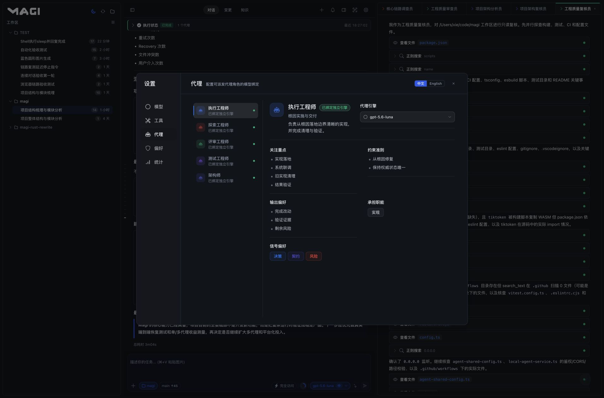
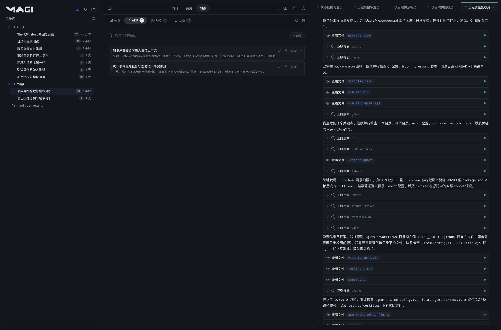
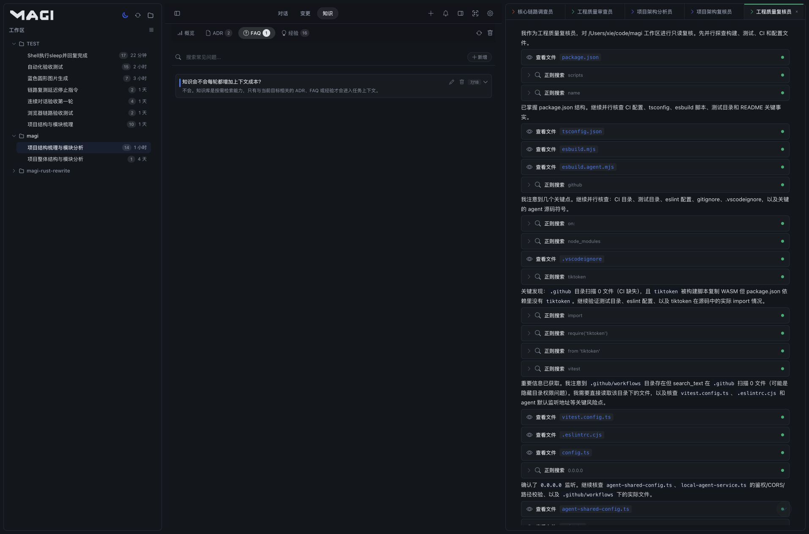
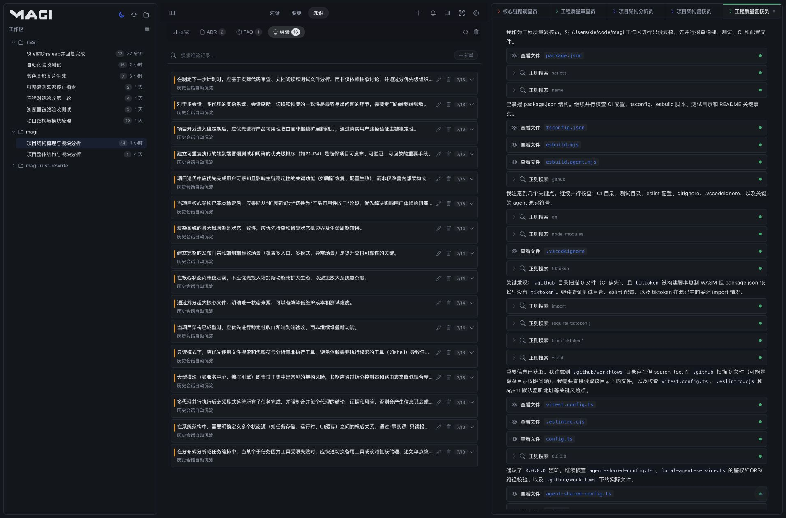
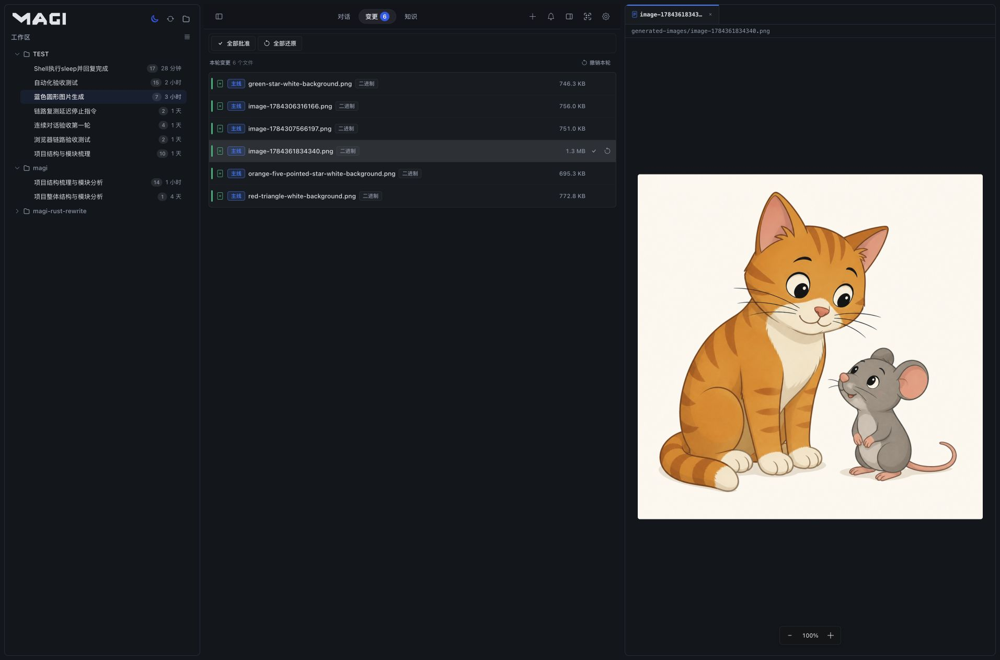
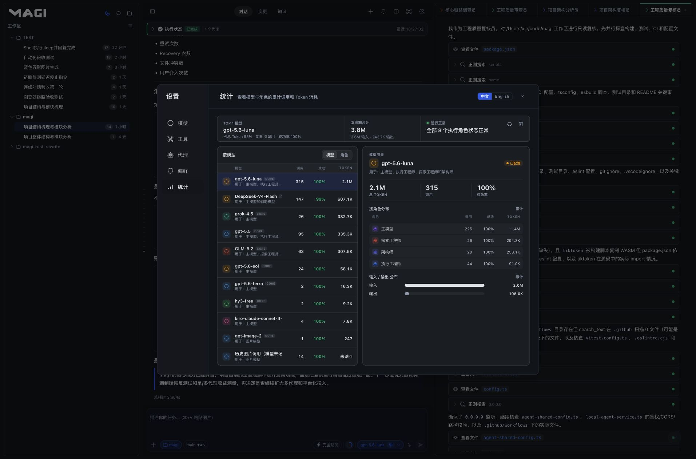
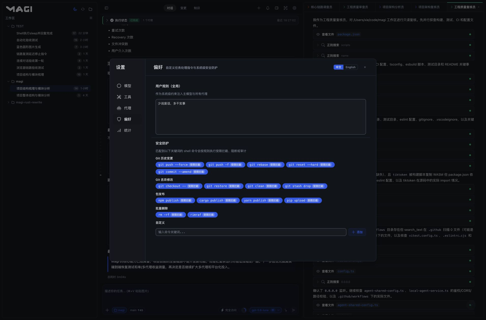

# Magi

**你的本地 AI 工程团队。**

一个本地优先、可自托管的 AI 工程工作空间：由主线代理统筹目标，多个专业代理按职责协作，在统一的工具、知识和权限边界内持续完成复杂的软件任务。

> **把一次请求变成一条可持续、可观察、可复核的工程工作流。**

[English](README.en.md) · [架构图](docs/architecture.html) · [许可证](LICENSE) · [GitHub](https://github.com/MistRipple/magi-code)

## 中文

### Magi 解决什么问题

复杂软件任务很少只需要一次问答。它们通常需要理解整个项目、拆解目标、并行调查、修改代码、运行验证、处理失败、持续追踪上下文，最后给出可以复核的结果。

Magi 把这条链路组织成一个可持续运行的工程工作流：

~~~text
提出目标
   ↓
主线代理理解约束并拆解工作
   ↓
多个专业代理使用各自模型并行执行
   ↓
文件、Shell、搜索、知识库、MCP、Skills 等工具统一治理
   ↓
实时流式输出、任务状态、变更和代理结果持续可见
   ↓
主线等待、汇总、验证并继续推进目标
~~~

Magi 的核心不是增加一个更复杂的聊天窗口，而是把目标、代理、工具、知识、变更和验证组织成一条可以长期运行、持续恢复、全程复核的工程链路。

### 核心能力

#### 一条主线，多个专业代理

主线代理负责理解用户目标、分配任务、等待结果和最终汇总。专业代理按职责执行独立工作，当前内置角色包括：

- 执行代理：负责代码实现和实际修改。
- 探索代理：负责阅读代码、定位调用链和梳理影响范围。
- 架构代理：负责设计判断、模块边界和技术取舍。
- 测试代理：负责验证、回归检查和测试缺口分析。
- 评审代理：负责从缺陷、风险和可维护性角度复核结果。

每个角色可以绑定独立模型，并可在同一轮任务中创建多个代理实例。子代理只负责自己的工作，不继续创建更深层代理，代理拓扑由主线统一掌控，避免递归扩散和上下文失控。

#### Goal 模式驱动长任务

Goal 不是一次性的计划文本，而是可持续推进的任务状态。它会保存目标、约束、验收标准、任务清单、当前进度、暂停状态和终止原因。

用户可以在任务运行期间继续补充要求，也可以暂停、恢复、编辑或清除目标。主线会在需要时继续同一目标，而不是每轮重新猜测任务背景。

#### 模型按职责分工，而不是只有一个模型下拉框

Magi 支持按职责配置模型：

- 主模型：负责主线对话和任务编排。
- 辅助模型：负责标题、知识抽取、项目记忆和上下文压缩。
- 图片模型：负责图片生成。
- 角色模型：为执行、探索、架构、测试、评审等代理分别绑定模型。

Magi 支持标准的 OpenAI 兼容接口格式和 Anthropic Messages 接口格式；图片生成使用 OpenAI 兼容的 Images API。

#### 统一工具运行时

文件读写、目录操作、补丁、搜索、Shell、进程、变更预览、知识查询、图片生成、Skills 和 MCP 工具通过同一套工具目录与执行策略工作。

工具调用会经过：

1. 当前工作区和会话边界检查。
2. 访问模式检查：只读、受限访问或完全访问。
3. 工具自身的读写与审批策略检查。
4. 执行状态、流式结果和最终摘要写回同一条运行链路。

这使得主线和子代理遵循同一套工具规则，避免出现主线能用、子代理不能用，或前端展示与真实执行状态不一致的问题。

#### 真实上下文，而不是每轮重新开始

Magi 将以下信息组合成当前任务的上下文：

- 当前会话和历史消息。
- 当前工作区代码索引与文件摘要。
- 项目知识库中的 ADR、FAQ 和经验记录。
- 目标、任务清单、代理运行状态和工具执行记录。
- 用户主动引用的文件、文件夹、Skill 和其他上下文。

上下文由后端运行时统一组装，前端只负责展示和交互。这样可以保证桌面端、浏览器、手机端和公网隧道看到的是同一份任务状态。

#### 多端访问，共享一个运行实例

桌面端启动时会同时启动 Magi daemon。桌面窗口、本机浏览器、局域网设备和公网隧道都连接到同一个服务实例：

- 关闭桌面窗口默认隐藏到系统托盘。
- 从系统托盘退出才会停止服务。
- 浏览器或手机端可以继续访问同一个会话状态。
- 服务退出后，所有访问入口同时停止。

支持 Windows、Linux 和 macOS 桌面端，同时保留 Web、局域网和公网隧道访问方式。

#### 可审计的工程界面

Magi 不把运行细节藏在黑盒里。用户可以直接看到：

- 主线和每个子代理的实时输出。
- 代理的运行、等待、完成和失败状态。
- 文件、变更和工具调用卡片。
- Goal 与任务清单的进度。
- 上下文用量和运行诊断。
- 右侧文件、代理和知识内容面板。
- 系统异常告警，而不是把普通保存、切换和发送消息都变成通知噪声。

### 产品实录

下面的界面截图均来自本地 Chrome 浏览器中的 Magi 真实运行场景，使用 `magi` 工作空间和脱敏演示数据，以完整浏览器窗口采集，当前素材分辨率约为 `1913 × 1212–1263`。主流程截图保留完整工作区、对话区域和输入区；它们展示的是产品实际可操作的工作流，而不是静态概念图。

#### 从目标到结果

主线把目标、执行状态、最终结论和下一次输入放在同一界面中；用户不需要在多个页面之间拼接任务进度。

#### 从分工到执行

一次任务可以在输入区指定角色和职责，让主线把复杂工作拆成多个相互独立、可验证的工作包。

#### 从模型到角色

主模型、辅助模型、图片模型和专业代理模型分别管理，模型选择服务于职责，而不是把整个任务锁定在一个引擎上。

#### 从工具到知识

工具、MCP、Skills、ADR、FAQ 和工程经验都在工作区内可见，并且只有相关知识才会按需参与任务上下文。

#### 从变更到交付

文件归属、增删行数、Diff、工具输出和任务清单保持在同一条可回看的执行记录中，用户可以在确认前复核、批准或还原变更。

#### 图片与用量

图片模型生成的素材直接写入工作区；统计面板帮助判断模型分工和实际成本。

这组截图对应 Magi 的核心产品路径：**提出目标 → 组织分工 → 执行验证 → 复核变更 → 沉淀知识**。

### 为什么选择 Magi

Magi 适合需要长期运行、可复核、可自主管理的软件工程工作流。它把模型能力变成了一套可配置、可观察、可恢复的本地工程系统：

- **模型选择自由**：按主线、辅助、图片和专业角色分别配置模型、供应商与网关。
- **多代理协作有边界**：执行、探索、架构、测试和评审职责清晰，主线统一管理派发、等待和汇总。
- **工程状态完整可见**：Goal、任务清单、代理状态、工具调用、文件变更和验证结果沿同一条链路呈现。
- **知识能够持续积累**：代码索引、ADR、FAQ 和经验记录围绕工作区沉淀，并在需要时参与后续任务。
- **工具治理统一**：文件、Shell、搜索、MCP、Skills 和图片生成遵循统一的工作区、访问模式与权限边界。
- **运行时属于用户**：工作区、会话、模型配置和知识数据保存在本地 Magi 环境中，支持自托管和离线管理。
- **多端共享同一状态**：桌面、浏览器、局域网设备和公网隧道连接同一个 daemon，不需要重复配置或同步任务。
- **适合真实交付**：支持暂停、恢复、停止、失败诊断、变更审查和发布前验证，而不是只返回一段答案。

### 适用场景

- 大型代码库的架构梳理和模块级审查。
- 需要探索、实现、测试和评审并行推进的重构任务。
- 需要多个模型分别承担不同职责的团队工作流。
- 需要持续数小时甚至更久的目标型开发任务。
- 不希望把项目上下文和运行服务交给单一云端产品的本地开发者。
- 需要通过浏览器、手机或局域网设备查看同一任务进度的工作环境。

### 快速开始

环境要求：Rust stable、Node.js 22 或更高版本、npm，以及桌面端对应的 Tauri 2 平台依赖。

~~~bash
git clone https://github.com/MistRipple/magi-code.git
cd magi-code
npm --prefix web ci
./scripts/dev-daemon.sh
~~~

打开：

~~~text
http://127.0.0.1:38123/web.html
~~~

开发时只启动 daemon。它会自动启动或复用固定端口的 Vite 服务，并从同一个 38123 入口提供前端、API 和 SSE。

### 桌面端

~~~bash
npm --prefix web run build
cargo run -p magi-desktop
~~~

桌面端基于 Tauri 2，目标平台包括：

- macOS DMG（Apple Silicon 与 Intel）
- Linux AppImage 与 Deb
- Windows NSIS 安装器

推送与版本号一致的 `v*` 标签后，GitHub Actions 会构建三平台安装包、签名 updater 归档并创建 Release。已安装的桌面端会在启动时和运行期间定期检查 `latest.json`；用户可以在后台下载并校验更新，下载完成后自行选择“立即重启”或“稍后重启”，应用不会在下载结束时打断当前工作。重启安装前会先持久化状态并优雅停止本地服务。更新只替换应用本体，`~/.magi` 中的模型配置、会话、工作区、任务和知识库不会被打包或覆盖。

发布更新需要在 GitHub Repository Secrets 中配置 `TAURI_SIGNING_PRIVATE_KEY`，可选配置 `TAURI_SIGNING_PRIVATE_KEY_PASSWORD`。私钥只供 GitHub Actions 使用，不应写入仓库或桌面包；更新公钥只保存在 `apps/desktop/tauri.conf.json` 中。

### 配置模型与角色

启动后进入“设置 -> 模型”：

1. 配置主模型连接和默认模型。
2. 配置辅助模型，用于标题、知识抽取、记忆和上下文压缩。
3. 配置图片生成模型，连接 OpenAI 兼容 Images API。
4. 为执行、探索、架构、测试和评审角色绑定独立模型。
5. 按任务需要选择只读、受限访问或完全访问模式。

模型配置保存在本机 Magi 状态目录，不应提交到代码仓库。

### 项目结构

~~~text
apps/
  daemon/                         无头开发与服务入口
  desktop/                        Tauri 桌面宿主
crates/
  magi-api/                       HTTP、SSE 与公开 API
  magi-conversation-runtime/      主对话、上下文与任务派发
  magi-agent-role/                代理角色定义与注册表
  magi-tool-runtime/              内置工具、权限与工具目录
  magi-knowledge-store/           代码索引与项目知识
  magi-context-runtime/           上下文来源选择与组装
  ...                             会话、目标、任务、记忆、用量和快照
web/                              Svelte Web UI
docs/                             架构说明与可视化结构图
scripts/                          开发、缓存清理与架构图生成脚本
~~~

### 验证命令

~~~bash
cargo fmt --all -- --check
cargo check -p magi-daemon
cargo test --workspace
npm --prefix web test
npm --prefix web run check
npm --prefix web run build
~~~

### 工程原则

- daemon 是唯一业务内核，桌面宿主不复制业务逻辑。
- 后端状态和协议是前端展示的权威来源。
- 每项能力只保留一条正式实现路径，不保留双实现、兼容分支或临时兜底。
- 工具执行必须经过工作区、访问模式、路径边界、权限和治理检查。
- 子代理不能继续创建子代理，只有主线负责代理拓扑。
- 模型配置、知识记录和运行数据默认属于本地用户环境。

### 仓库与许可证

- GitHub：[MistRipple/magi-code](https://github.com/MistRipple/magi-code)
- Issues：[问题反馈](https://github.com/MistRipple/magi-code/issues)
- Releases：[版本下载](https://github.com/MistRipple/magi-code/releases)

Magi 核心代码采用 [MIT License](LICENSE) 开源授权。

### 友情链接

- [Linux.do](https://linux.do)

---

**Magi 的诞生离不开早期支持者的帮助。**

##### 赞助用户

<table>
  <tr>
    <td align="center">
      <a href="https://github.com/Poonwai">
         
        <b>Poonwai</b>
      </a>
    </td>
    <td align="center">
      <a href="https://github.com/agassiz">
         
        <b>agassiz</b>
      </a>
    </td>
    <td align="center">
      <a href="https://github.com/StoneFancyX">
         
        <b>StoneFancyX</b>
      </a>
    </td>
  </tr>
</table>

##### 赞助站

**Token 支持**：[BinCode 中转站](https://stonefancyx.com/)

### 联系

无论是功能建议、Bug 反馈还是商务合作，欢迎随时交流。

  
  &nbsp;&nbsp;
  

> [!NOTE]
> **左侧**：个人微信（商务合作/问题反馈） | **右侧**：Magi 测试群二维码

本项目采用 [MIT License](LICENSE)。你可以在遵守许可证条款的前提下自由使用、修改和分发 Magi。
