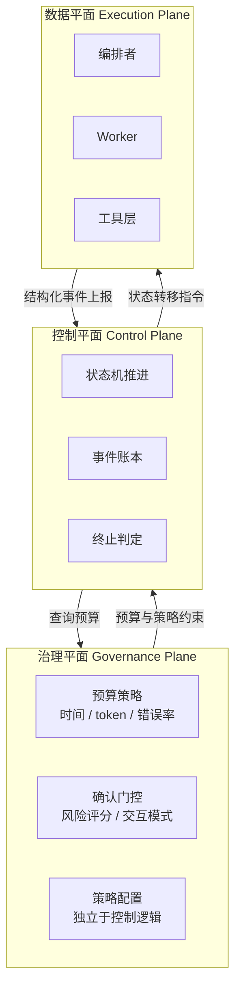
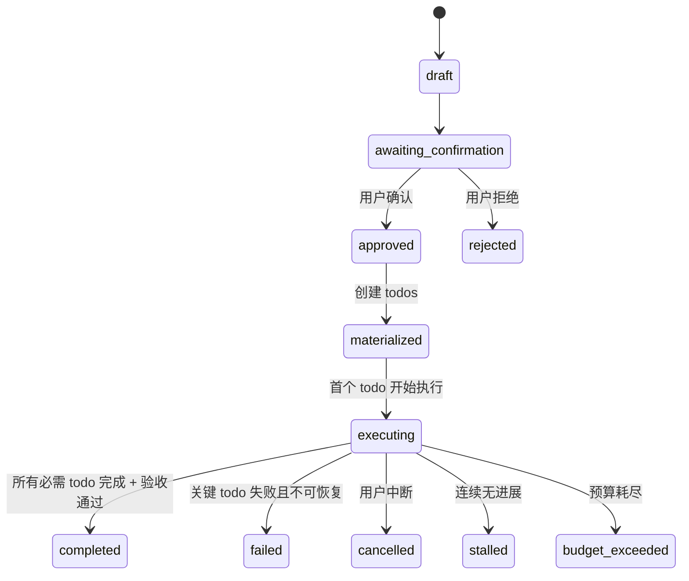
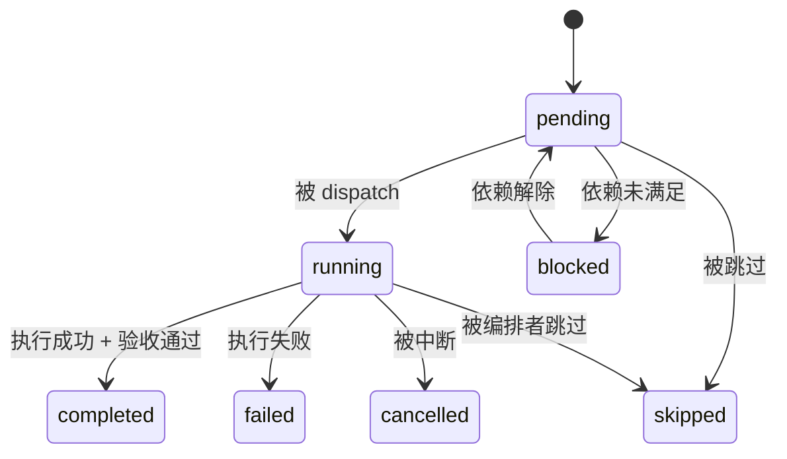
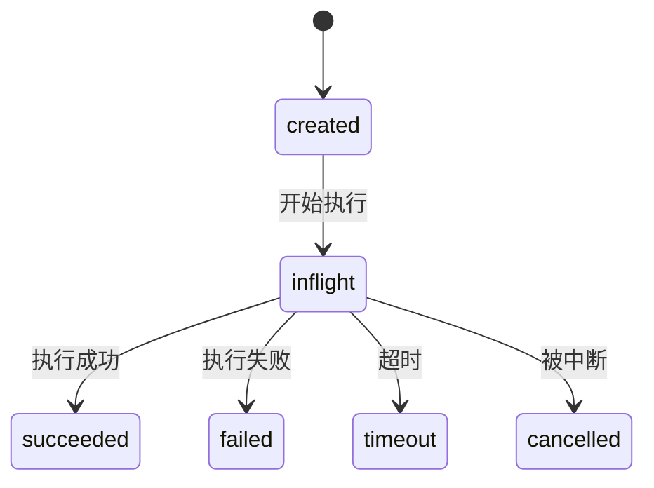
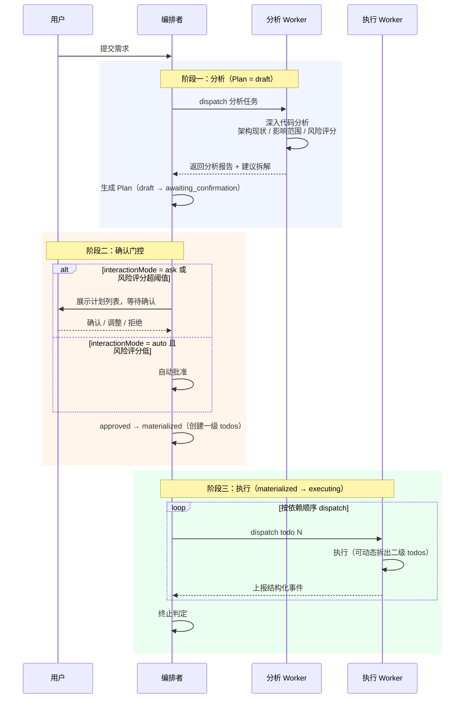
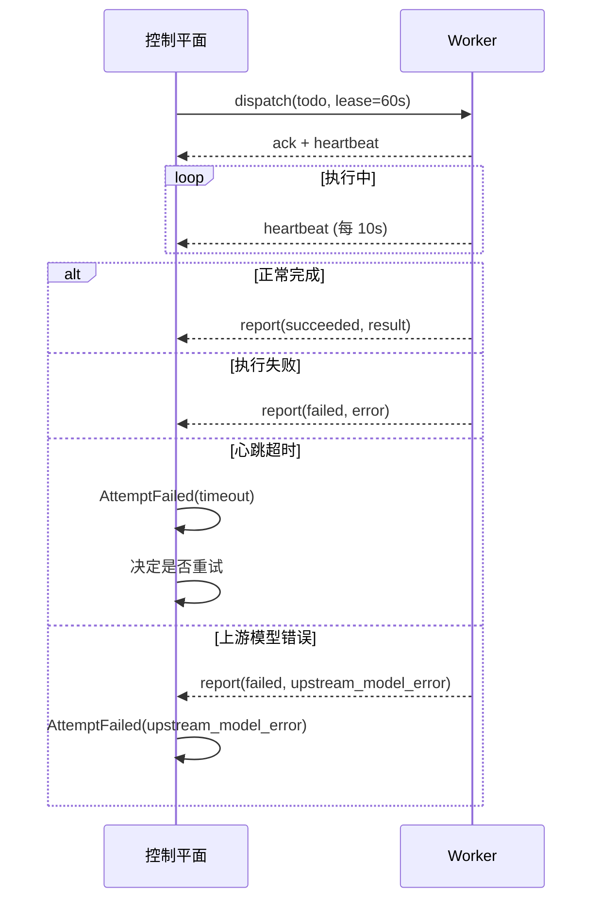

# 编排循环终止机制 — 升级方案

> 核心：把终止机制从 if-else 逻辑，升级为**状态机 + 事件账本 + 预算治理**三层架构。一次性切换，但必须通过双轨验证闸门后再启用。

---

## 1. 架构目标

以下五项必须同时满足：

| 目标 | 定义 |
|---|---|
| **Safety** | 不会把未完成任务误判为完成 |
| **Liveness** | 任何执行最终都会到终态，不会无限循环 |
| **Determinism** | 相同事件序列得到相同终态 |
| **Single Source of Truth** | 终止判定只依赖一个权威状态源 |
| **Explainability** | 每次终止都能给出机器可读 reason code 与证据链 |

---

## 2. 三层架构



| 平面 | 职责 | 不做什么 |
|---|---|---|
| **控制平面** | 状态机推进，终止判定。输入事件，输出状态转移 | 不做业务判断 |
| **数据平面** | Worker/Tool 实际执行，统一上报结构化事件 | 不做终止决策 |
| **治理平面** | 预算与策略（时间、token、错误率、人工确认门控）独立配置 | 不混入控制逻辑 |

---

## 3. 统一状态模型

替代当前"轮次 + 补丁"的设计。三级状态机：Plan → Todo → Attempt。

### Plan 状态机



### Todo 状态机



### Attempt 状态机

对单次执行尝试建模，使重试、超时、幂等有统一挂载点。



### 终止原因强类型

```
TerminationReason =
  | 'completed'              // 正常完成
  | 'failed'                 // 关键 todo 失败
  | 'cancelled'              // 用户中断
  | 'stalled'                // 连续无进展
  | 'budget_exceeded'        // 预算耗尽
  | 'external_wait_timeout'  // 外部等待超时
  | 'external_abort'         // 系统外部中断
  | 'upstream_model_error'   // 上游模型不可用
```

---

## 4. 终止判定

终止判定是控制平面的核心职责。不允许 `all terminal => completed` 的错误语义——completed 与 failed 必须分离。

### 正常完成

所有**必需** Todo 到达 terminal 状态，**且**验收标准全部满足。

### 异常终止

命中任一 reason code：

| Reason Code | 触发条件 |
|---|---|
| `failed` | 关键路径上的 todo 失败且不可恢复 |
| `stalled` | 连续 W 个窗口无进展（见第 5 节） |
| `budget_exceeded` | 时间 / token / 错误率超出治理平面配置的预算 |
| `external_wait_timeout` | 外部等待超出 SLA（审批/外部依赖长期无响应） |
| `upstream_model_error` | 上游模型持续不可用 |

### 中断终止

| Reason Code | 触发条件 |
|---|---|
| `cancelled` | 用户主动中断 |
| `external_abort` | 系统外部中断 |

### 终止判定权威快照（Single Source of Truth）

终止判定不直接读取 TodoManager/PlanLedger/Review/BlockerRegistry 的即时状态，而是统一读取控制平面生成的快照：

```
TerminationSnapshot {
  snapshotId: string
  planId: string
  attemptSeq: number
  progressVector: P(t)
  reviewState: { accepted: number, total: number }
  blockerState: { open: number, score: number }
  budgetState: { elapsedMs: number, tokenUsed: number, errorRate: number }
  sourceEventIds: string[]
  computedAt: number
}
```

- 上游模块只负责产出事件，不直接参与终止裁决；
- 终止判定仅基于 `TerminationSnapshot`（单一真相源）；
- 每次快照附带 `sourceEventIds`，保证可审计与可重放。

### 终止原因优先级（并发命中裁决）

同一采样点可能同时命中多个 reason code，必须使用固定优先级保证 Determinism：

| 优先级（1 最高） | Reason Code |
|---|---|
| 1 | `cancelled` |
| 2 | `external_abort` |
| 3 | `budget_exceeded` |
| 4 | `external_wait_timeout` |
| 5 | `upstream_model_error` |
| 6 | `failed` |
| 7 | `stalled` |
| 8 | `completed` |

裁决规则：
- 先按优先级选主因；
- 同优先级时取最早触发事件；
- 若事件时间一致，取字典序最小 reason code（确保确定性）。

---

## 5. 无进展检测

必须定义为数学规则，不依赖主观判断。

### 进展向量

```
P(t) = (
    terminal_required_todos,   // 已终态的必需 todo 数
    accepted_criteria,         // 已通过的验收标准数
    critical_path_resolved,    // 关键路径解决率（0~1）
    unresolved_blockers        // 当前未解决阻塞数（越小越好）
)
```

### 关键路径解决率量化（critical_path_resolved）

为避免该指标变成不可实现的“理论值”，定义如下：

1. **基线关键路径集合 C0（一次性冻结）**
   - 数据来源：`PlanLedger.items + dependsOn` 生成 DAG。
   - 在 `plan: materialized` 时计算一次并冻结为 `C0`，执行中不重算，避免指标抖动。
   - 默认权重：`effortWeight=1`；如分析阶段提供估时，则写入 `effortWeight`。

2. **节点解决判定 resolved(i)**
   - `completed` 计入解决。
   - `skipped` 只有 `waiverApproved=true`（显式豁免）才计入解决。
   - 其余状态均不计入解决。

3. **计算公式**

```
critical_path_resolved(t) =
  sum(effortWeight_i, i ∈ C0 且 resolved(i))
  /
  sum(effortWeight_i, i ∈ C0)
```

该值单调不减，范围 `[0,1]`，可直接用于窗口比较。

### 动态拆分下的关键路径重基线（Path Rebase）

执行中允许动态拆分/新增 todo，必须定义重基线规则，否则关键路径指标会失真。

1. **父节点拆分**
   - 若 `todo_parent` 拆分为子节点集合 `children`，则以 `children` 替换原节点；
   - 默认权重继承：`Σ weight(children) = weight(parent)`（按子任务估时比例分配，缺省均分）。

2. **新增 required 节点**
   - 若新增节点不属于任何父节点拆分，先标记为 `path_candidate`；
   - 在 `Attempt` 边界执行关键路径重算，若最长路径增幅超过阈值 `Δ_cp`（建议 10%），触发重基线。

3. **重基线产物**
   - 生成 `C(k+1)` 与 `cp_version = k+1`；
   - 记录事件 `CriticalPathRebased`，附 `reason` 与 `affectedTodoIds`；
   - 终止判定比较窗口时，统一在同一 `cp_version` 下比较，避免“版本切换导致伪回退”。

### 未解决阻塞量化（unresolved_blockers）

引入统一阻塞账本 `BlockerRegistry`，杜绝“从日志猜状态”。

1. **阻塞事件结构**

```
Blocker {
  blockerId: string
  source: 'todo_dependency' | 'review_reject' | 'report_question' | 'tool_failure' | 'upstream_model' | 'approval_pending' | 'contract_mismatch'
  severity: 'low' | 'medium' | 'high' | 'critical'
  todoId?: string
  createdAt: number
  resolvedAt?: number
  reasonCode: string
  externalWait: boolean
}
```

2. **计数规则**
   - `unresolved_blockers(t) = count(open blockers where externalWait=false)`
   - `open` 定义：`resolvedAt` 为空。
   - 外部等待（如人工审批、外部系统返回）不计入 stalled 判定。

3. **阻塞强度（辅助判定）**

```
blocker_score(t) =
  Σ( severityWeight(severity_b) * ln(1 + ageMinutes_b) )
  for b in open blockers and externalWait=false
```

建议权重：`low=1, medium=2, high=4, critical=8`。

### 判定规则

**有进展**：P(t) 相对 P(t-1) 满足单调改进规则：
- 至少一个维度严格改善；
- 且不存在维度恶化（`terminal_required_todos`、`accepted_criteria`、`critical_path_resolved` 下降，或 `unresolved_blockers` 上升）。

**stalled 触发**：连续 W 个检测窗口无进展，且：
- 无外部等待态；
- `blocker_score` 在窗口内不下降（防止“表面无变化但阻塞在实质缓解”被误杀）。

### 检测窗口与采样点

- 采样点：每次 Attempt 结束（`succeeded/failed/timeout/cancelled`）后采样一次；
- 窗口大小：`W` 由治理平面配置（建议默认 5）；
- 作用域：仅统计当前 `planId` 对应的 required todos 与 blockers，不跨 session/历史计划。
- `cp_version` 变化时触发一次重采样，对齐到最新关键路径基线后再进入窗口比较。

### 数据来源

| 维度 | 数据来源 |
|---|---|
| `terminal_required_todos` | TodoManager 查询 |
| `accepted_criteria` | Worker Review 验收结果 |
| `critical_path_resolved` | PlanLedger 依赖图（冻结 C0） + TodoManager 状态 + `waiverApproved` |
| `unresolved_blockers` | BlockerRegistry 中 open 且 `externalWait=false` 的条目数 |

### 必需新增字段（落地约束）

| 字段 | 所属 | 说明 |
|---|---|---|
| `effortWeight:number` | PlanItem/Todo | 关键路径权重，默认 1 |
| `required:boolean` | PlanItem/Todo | 是否必需项 |
| `waiverApproved:boolean` | Todo | skip 是否被批准 |
| `externalWait:boolean` | Blocker | 是否外部等待态 |

---

## 6. 深度模式确认机制

不是"deepTask 必须人工确认"，而是**策略驱动确认**。

### 交互模式

| interactionMode | 行为 |
|---|---|
| `ask` | 强制人工确认，Plan 必须经用户批准才能 materialize |
| `auto` | 按风险评分自动批准。评分超阈值时 fallback 到 ask |

### 风险评分维度

| 维度 | 权重说明 |
|---|---|
| 影响文件数 | 预估修改的文件数量 |
| 跨模块数 | 涉及的独立模块/目录数 |
| 写权限工具比例 | dispatch 中需要写操作的工具占比 |
| 历史失败率 | 同类任务的历史失败率 |

### 三源估计与置信度

风险评分不允许单点依赖分析 Worker，必须至少融合三类信号：

| 信号 | 来源 | 作用 |
|---|---|---|
| A | 分析 Worker 报告 | 提供语义级影响范围 |
| B | 静态估计（检索 + 依赖图扩散） | 提供结构级边界 |
| C | 历史基线（PKB 相似任务） | 提供经验校准 |

### 风险分与置信度公式

```
risk_score =
  w1*normalize(affected_files)
  + w2*normalize(cross_modules)
  + w3*write_tool_ratio
  + w4*historical_failure_rate
```

### 关键维度的可计算口径（affected_files / cross_modules）

为避免“分析 Worker 不准导致评分漂移”，两个核心维度必须有结构化融合规则：

1. **单源估计**
   - `A_files` / `A_modules`：分析 Worker 输出的候选文件与模块集合。
   - `B_files` / `B_modules`：静态检索（code_search_semantic + 依赖图扩散）得到的集合。
   - `C_files` / `C_modules`：PKB 相似任务历史集合。

2. **融合估计**

```
affected_files =
  | union(topK(A_files, B_files, C_files), by source confidence) |

cross_modules =
  | normalizeModuleSet(affected_files) |
```

其中 `normalizeModuleSet` 以仓库模块边界（如 package/service/domain 根目录）归一化，避免路径粒度差异导致跨模块数虚高。

3. **偏差监测**
   - 若 `A_files` 与 `B_files` 的 Jaccard 相似度低于阈值，标记 `signal_agreement` 降档；
   - 若仅单源可用，不允许进入自动批准路径（即使 `risk_score` 低）。

```
confidence =
  0.4*source_coverage      // A/B/C 到位比例
  + 0.4*signal_agreement   // 三源一致性（方差反向）
  + 0.2*historical_calibration // 分析 Worker 历史估计误差反向分
```

### 默认阈值与归一化口径（强约束）

未配置时采用以下默认值，禁止“按实现方主观理解”：

| 参数 | 默认值 | 说明 |
|---|---|---|
| `C_min` | `0.55` | 低于该值强制人工确认 |
| `C_ok` | `0.75` | 自动批准所需最低置信度 |
| `R_low` | `0.35` | 低风险阈值 |
| `R_high` | `0.70` | 高风险阈值 |
| `Δ_cp` | `0.10` | 关键路径重基线触发增幅 |

归一化口径：
- `normalize(affected_files) = min(affected_files / 40, 1)`；
- `normalize(cross_modules) = min(cross_modules / 8, 1)`；
- `historical_failure_rate` 以最近 90 天同类任务统计。

### 审批门控矩阵（强约束）

| 条件 | 决策 |
|---|---|
| `interactionMode=ask` | 强制人工确认 |
| `confidence < C_min` | 强制人工确认（兜底） |
| `risk_score >= R_high` | 强制人工确认 |
| `risk_score <= R_low` 且 `confidence >= C_ok` | 自动批准 |
| 其他灰区 | 人工确认 |

**兜底规则**：评分置信度不足（例如分析报告缺字段、A/B/C 冲突明显）必须 fallback 到 `ask`，禁止自动批准高不确定计划。

### 评分数据质量约束

- 若 `affected_files` 或 `cross_modules` 缺失，`source_coverage` 降档；
- 若 A 与 B 偏差超过阈值（例如 > 50%），`signal_agreement` 直接判低；
- 若历史样本不足，`historical_calibration` 记保守值，不抬升置信度。

### 规划流程



### 常规模式

常规模式下不强制前置规划，也不需要用户确认。编排者直接 dispatch 任务，todos 自然在 dispatch 时产生。终止判定逻辑与深度模式完全一致。

---

## 7. Worker / 编排协议

防卡死的关键。

### 协议要素

| 要素 | 说明 |
|---|---|
| **idempotency_key** | 所有 dispatch/report 携带，防重复提交 |
| **lease** | Worker 获取任务时取得租约，租约过期未续则视为失联 |
| **heartbeat** | Worker 执行中定期上报心跳，证明存活 |
| **timeout** | 租约超时 / 心跳超时 / 执行超时，三级超时 |
| **external_wait_sla** | 外部等待（审批/外部依赖）最大等待时长，超时触发 `external_wait_timeout` |
| **ack/nack** | Worker 明确确认接收或拒绝任务 |

### 异常处理

Worker 超时或上游模型报错 → 立即形成 `AttemptFailed(timeout / upstream_model_error)` 事件 → 控制平面直接转移状态 → 不等待自然回收。
外部等待超过 `external_wait_sla` → 立即形成 `AttemptFailed(external_wait_timeout)` 事件，禁止无限挂起。



---

## 8. 观测与审计

必须内建，不是事后补充。

### 终止输出

每次终止必须输出：

```
{
  reason_code: TerminationReason,
  evidence_ids: string[],        // 触发终止的事件 ID 列表
  progress_vector: P(t),         // 终止时的进展快照
  plan_id: string,
  duration_ms: number,
  token_usage: { input, output }
}
```

### 指标体系

| 指标 | 说明 |
|---|---|
| 终止分布 | 各 reason code 的占比 |
| 平均收敛时间 | 从 executing 到 terminal 的平均耗时 |
| stalled 率 | stalled 终止占总终止的比例 |
| 误终止率 | 终止后用户手动重启同一任务的比例 |
| 人工介入率 | 需要用户确认/中断的比例 |

### Trace 链路

全链路串联：`planId → assignmentId → todoId → attemptId`

---

## 9. 移除的机制

以下机制在新架构中**全部移除**：

| 移除项 | 移除原因 |
|---|---|
| Orchestrator 轮次上限（50 / 150） | 被状态机终止判定替代 |
| 轮次预警提示（距上限 5 轮时注入） | 轮次上限不再存在 |
| 只读空转守卫（连续 8 轮只读工具检测） | 被无进展检测统一覆盖 |
| 连续失败注入提示 / 累计失败终止 | 被无进展检测统一覆盖 |
| deepTask 差异化轮次参数 | 终止逻辑统一，不再区分模式 |
| Worker Review 轮次上限（2 / 8） | 被无进展检测统一覆盖 |
| `resolveReviewPolicy` 模式分支 | 不再需要 |

---

## 10. 与当前设计的对比

| 维度 | 当前设计 | 新架构 |
|---|---|---|
| 终止驱动 | LLM 自主判断 + 轮次兜底 | 状态机 + 事件驱动 |
| 终止判定依据 | 过程指标（轮次、失败次数） | 任务状态（todo 终态 + 验收） |
| 终止条件数量 | 6+（轮次、失败、空转、预警…） | 3 类（正常 / 异常 / 中断），reason code 强类型 |
| 任务完整性 | 弱（可能被轮次截断） | 强（未完成不允许判定为 completed） |
| 深度模式规划 | 无显式规划阶段 | 分析 → 策略驱动确认 → materialize → 执行 |
| Worker 卡死保护 | idle timeout 兜底 | lease + heartbeat + 三级超时 |
| 异常检测 | 按原因分类（失败、空转） | 统一进展向量，数学规则判定 |
| 预算管理 | 混入控制逻辑 | 治理平面独立配置 |
| 可观测性 | 日志 | reason code + 证据链 + 指标体系 + 全链路 trace |
| 概念复杂度 | 高（多种守卫互相叠加） | 低（三层分离，各司其职） |

---

## 11. 一次性切换的发布闸门

虽然采用一次性切换，但上线必须经过固定闸门，防止架构级回归：

| 阶段 | 闸门 |
|---|---|
| 离线重放 | 历史事件回放一致性：新旧终止结果偏差率 < 1% |
| 影子双轨 | 线上只读双算 7 天：reason code 一致率 ≥ 99% |
| 正式切换 | 打开新判定，保留 1 个版本回滚开关 |
| 切换后观测 | 连续 72 小时监控 stalled 率/误终止率，不达标自动回滚 |

---

## 12. 改造清单（任务推进节点检查）

用于实际推进时的阶段闸门检查。每个阶段必须满足“完成定义（DoD）”才能进入下一阶段。

### 阶段 A：模型与契约落地

| 检查项 | 通过标准 | 产出物 |
|---|---|---|
| `TerminationReason` 扩展 | 包含 `external_wait_timeout` 且全链路可序列化 | 类型定义 PR |
| `TerminationSnapshot` 定义 | 字段与文档一致，支持持久化和回放 | 快照 schema + 存储接口 |
| 终止优先级表实现 | 并发命中裁决 deterministic（含 tie-break） | `resolveTerminationReason()` |
| 事件 ID 贯通 | `planId → assignmentId → todoId → attemptId` 可追踪 | 事件结构升级 |

**DoD（阶段通过）**
- 单元测试覆盖：优先级裁决、快照序列化、reason code 映射。
- 评审结论：无“双真相源”访问路径。

### 阶段 B：控制平面改造

| 检查项 | 通过标准 | 产出物 |
|---|---|---|
| 统一快照构建 | 终止判定只读取 `TerminationSnapshot` | SnapshotBuilder |
| 无进展窗口检测 | 按 `P(t)` + `blocker_score` 规则触发 stalled | ProgressEvaluator |
| 关键路径重基线 | `cp_version` 切换可用，窗口比较不误判 | PathRebaseEngine |
| 外部等待超时 | `external_wait_sla` 命中后触发 `external_wait_timeout` | WaitSLAWatcher |

**DoD（阶段通过）**
- 集成测试覆盖：动态拆分、外部等待、重基线后的 stalled 判定。
- 日志/事件审计可回放到同一终止结果。

### 阶段 C：治理平面改造

| 检查项 | 通过标准 | 产出物 |
|---|---|---|
| 风险评分三源融合 | A/B/C 缺失和冲突可降置信度 | RiskScorer |
| 阈值默认值落地 | `C_min/C_ok/R_low/R_high/Δ_cp` 可配置且有默认 | GovernanceConfig |
| 自动批准门控 | 仅在 `risk <= R_low && confidence >= C_ok` 自动批准 | ApprovalPolicy |
| 低置信度兜底 | `confidence < C_min` 强制 `ask` | PolicyGuard |

**DoD（阶段通过）**
- 回归测试覆盖：低风险自动批、高风险强制人工、低置信度回退。
- 配置变更可热加载或重启后稳定生效（行为一致）。

### 阶段 D：执行协议改造

| 检查项 | 通过标准 | 产出物 |
|---|---|---|
| `idempotency_key` 全链路 | dispatch/report 重放不重复执行 | 协议字段升级 |
| lease + heartbeat | 心跳丢失可判定失联，触发 Attempt timeout | WorkerLeaseManager |
| ack/nack 机制 | Worker 接收状态可观测，拒绝可回退调度 | Dispatch ACK 流程 |
| 上游错误快终止 | 上游模型错误立即转 `AttemptFailed` 并反馈编排者 | FailFastAdapter |

**DoD（阶段通过）**
- 故障注入测试：网络抖动、上游 5xx、超时、Worker 无响应。
- 不出现“Worker 已失败但编排者卡住”场景。

### 阶段 E：观测与发布闸门

| 检查项 | 通过标准 | 产出物 |
|---|---|---|
| 指标上报 | 终止分布、stalled 率、误终止率、人工介入率齐全 | Metrics Dashboard |
| 证据链输出 | 每次终止输出 `reason_code + evidence_ids + P(t)` | Termination Report |
| 离线重放 | 新旧偏差率 < 1% | Replay 报告 |
| 影子双轨 | reason 一致率 ≥ 99% | Shadow 观测报告 |

**DoD（阶段通过）**
- 满足第 11 节全部闸门后才允许切主路径。
- 预案就绪：一键回滚开关 + 回滚 SOP。

### 推进看板模板（执行建议）

| 阶段 | 状态 | Owner | 开始时间 | 预计完成 | 实际完成 | 风险 | 备注 |
|---|---|---|---|---|---|---|---|
| A 模型与契约 | pending |  |  |  |  |  |  |
| B 控制平面 | pending |  |  |  |  |  |  |
| C 治理平面 | pending |  |  |  |  |  |  |
| D 执行协议 | pending |  |  |  |  |  |  |
| E 观测与发布 | pending |  |  |  |  |  |  |

### 节点评审结论模板（每阶段必填）

```
阶段：A/B/C/D/E
结论：通过 / 有条件通过 / 驳回
未通过项：
1.
2.
整改截止时间：
复核人：
```

---

## 13. 实施状态与验证状态（2026-03-08）

> 本节用于和代码现状对齐，避免“方案已写完但无法判断落地进度”。

### 13.1 阶段状态看板（最新）

| 阶段 | 状态 | 结论 | 已落地能力 | 未完成项 / 风险 |
|---|---|---|---|---|
| A 模型与契约 | completed | 通过 | `TerminationReason` 扩展、`TerminationSnapshot`、并发 reason 优先级裁决、`Attempt` 强类型契约已落地 | 无阻断项 |
| B 控制平面 | completed | 通过 | 统一快照判定、进展向量比较、关键路径重基线、预算终止/外部中断/上游错误终止、`PlanLedger Attempt` 状态机推进已落地 | 无阻断项 |
| C 治理平面 | completed | 通过 | `MissionDrivenEngine.execute()` 已接入治理评分门控；`auto` 模式下按 `risk/confidence` 自动批准或强制人工确认；`forceManual` 与治理摘要已贯穿到 `confirmationRequest`；低置信度评估异常自动回退人工；治理阈值已支持 `~/.magi/config.json` 与环境变量配置 | 无阻断项 |
| D 执行协议 | completed | 通过 | Dispatch 全链路 `ack/nack + lease + heartbeat + execution timeout` 已落地；Worker 心跳上报与编排转发已接通；协议超时 fail-fast + 中断 worker + 回传编排者；协议状态在任务终态即时清理；`idempotency_key` 已接入持久化账本 + 文件锁原子 claim（跨进程/多实例同共享存储去重） | 无阻断项 |
| E 观测与发布 | completed | 通过 | 新增 `.magi/metrics/termination.jsonl` 终止指标落盘（reason/evidence/progress_vector/plan_id/duration/token）；新增 replay 脚本；新增 shadow 开关钩子（`MAGI_TERMINATION_SHADOW`）与一致性日志；新增 dashboard / shadow gate / AB gate / real-sample gate 校验脚本；新增基线初始化脚本 `metrics:termination-baseline:init`；新增 CI 闸门链路 `.github/workflows/termination-governance-gate.yml` | 无阻断项 |

### 13.2 本轮根因修复记录

1. C 阶段未生效根因：
   - 评分逻辑已实现，但 `execute()` 审批分支仍是“`ask` 才人工、`auto` 全自动”。
   - 已修复为：`ask` 模式始终人工；`auto` 模式按治理评分决策；`forceManual` 支持强制人工确认。

2. D 阶段挂死风险根因：
   - Worker 异常/失联时缺少统一 ACK/租约协议判定，可能出现“任务已僵死但编排仍等待”。
   - 已修复为：Dispatch 协议状态机落地（ACK 超时、lease 过期、NACK、执行超时均 fail-fast），并在任务终态即时清理协议状态。

3. E 阶段可观测缺口根因：
   - 终止判定仅存在于内存态，缺少可重放证据链。
   - 已修复为：终止指标 JSONL 落盘 + replay 脚本；shadow 双轨开关与一致性日志补齐（默认关闭）。

4. D 阶段重放重复派发根因：
   - `idempotencyKey` 仅在内存协议态存在，进程重启后无法识别历史派发，可能重复执行。
   - 已修复为：新增 `DispatchIdempotencyStore` 本地持久化账本；`worker_dispatch` 支持显式/隐式幂等键并在调度入口进行重放判定。

5. E 阶段发布闸门首次落地根因：
   - 严格 `release:termination-gate` 依赖 baseline 文件和最小样本，首次接入时会因“无基线/样本不足”直接阻断。
   - 已修复为：新增 `metrics:termination-baseline:init`，明确将 baseline 建立流程产品化；严格闸门保持不降级，本地演练可通过环境变量降低样本阈值。

6. D 阶段跨实例并发竞争根因：
   - `resolveByKey + remember` 为两步操作，跨进程并发时存在 TOCTOU，可能重复派发。
   - 已修复为：新增 `claimOrGet` 原子占位与失败回滚 `removeByTaskId`，并引入文件锁（含陈旧锁回收）保证共享存储上的互斥语义。

7. E 阶段仓储耦合根因：
   - `MissionDrivenEngine` 直接写 JSONL 文件，导致事件持久化与业务逻辑耦合，难以统一扩展。
   - 已修复为：新增 `TerminationMetricsRepository` 接口与 `FileTerminationMetricsRepository` 实现，编排引擎改为依赖仓储接口。

8. E 阶段真实样本闸门回归不稳定根因：
   - `verify-termination-real-sample-gate.cjs` 在被 `require` 时会无条件执行 `main()`，且阈值读取顺序为“环境变量优先”，导致回归脚本被外部环境污染。
   - 已修复为：改为 `require.main === module` 才执行 `main()`；`verify-termination-ab-gate` 与 `verify-termination-real-sample-gate` 统一为“显式 options 优先，环境变量其次，默认值最后”，并补充阈值数值校验。

9. E 阶段发布闸门完整性根因：
   - `release:termination-gate` 仅覆盖 replay/dashboard/shadow/AB，真实样本闸门未纳入主发布链路。
   - 已修复为：新增 `release:termination-gate:core`，并将 `release:termination-gate` 升级为 `core + verify:release:termination-real-sample-gate`；`verify:ci:termination-gate` 使用 `core + real-sample 回归脚本`，保证 CI 冷启动可执行且不放松正式发布闸门。

10. C 阶段治理阈值可运维性根因：
   - `C_min/C_ok/R_low/R_high` 固定为代码常量，无法通过配置中心或环境变量做发布期调优。
   - 已修复为：阈值支持 `~/.magi/config.json`（`orchestrator.governanceThresholds`）和环境变量（`MAGI_GOV_C_MIN/MAGI_GOV_C_OK/MAGI_GOV_R_LOW/MAGI_GOV_R_HIGH`）；非法值自动回退默认阈值并告警日志。

11. B 阶段工具后“首轮失败即终止”根因：
   - 预算门禁中的 `errorRate` 直接参与判定，首轮工具全失败时 `errorRate=1`，会在一次工具失败后立刻命中 `budget_exceeded`。
   - 已修复为：新增错误率门禁最小样本轮次（`ERROR_RATE_MIN_SAMPLES=3`），错误率预算仅在样本足够后生效，避免“一轮失败即停”。

12. D 阶段工具链路“有结果但无结论文本”根因：
   - 编排器工具循环中，部分合成结论（如摘要劫持终止、工具结果降级总结）只作为返回值，未进入流式消息通道，前端表现为“工具返回后对话停住”。
   - 已修复为：为未流式下发的 `finalText` 增加兜底流式回灌；同时 WebviewProvider 对引擎 fail-open 的 out-of-band 结果进行主对话区补发，确保用户可见。

13. B 阶段 `intervention` 门禁中断风险根因：
   - Phase C 审计命中 `intervention` 时仍抛异常进入失败分支，虽然有 fail-open 返回，但主链路语义上仍属于“异常退出”。
   - 已修复为：改为门禁降级告警（写入 `executionWarnings`），不再直接抛错中断执行链路。

14. D 阶段工具判错语义偏差根因：
   - `process_read` 作为“读取终端状态/输出”的观测工具，却沿用了“被观测进程失败=工具失败”的判定，导致“工具返回了有效结果但 UI 显示 failed”，并放大终止门禁噪声。
   - 已修复为：`process_read` 成功读取即返回 `isError=false`；标准化层按工具类型判定，`process_read` 在读取成功时强制归类为 `success`（参数错误仍为 `rejected`）。

15. B 阶段“多工具通用提前收口”根因：
   - 编排终止策略在 `requiredTotal=0`（未进入 Todo 任务流）时，采用“只要 assistant 有文本就 completed”规则；该规则会覆盖 MCP 工具、内置检索工具等所有非 Todo 场景，表现为“工具一用就停”。
   - 已修复为：`requiredTotal=0` 下引入“继续意图”判别（如“继续下一轮/next round/continue/proceed”）；命中继续意图时不判 completed，而是注入继续执行提示并推进下一轮；仅在连续两轮“无 Todo + 无工具 + 继续话术”时判 `stalled` 防止无限循环。

16. D 阶段“软失败被当硬错误”根因：
   - 工具结果标准化后，`blocked/rejected/aborted` 在协议层、流式展示层、前端状态映射层均被与 `error/timeout/killed` 同等当作错误，导致“工具有响应但模型/界面认为失败”，并放大“工具后停止”的误判概率。
   - 已修复为：统一硬失败语义（仅 `error/timeout/killed`）；`tool_result.is_error`、Normalizer 完成态、前端工具卡状态同步改造为硬失败判定；软失败保留结构化状态与诊断信息，但不再作为硬错误传递给模型终止链路。

17. B 阶段“工具轮命中终止后直接断流”根因：
   - 编排器在“工具执行轮”命中 `completed/failed` 后会直接 `break`，模型尚未消费 tool_result 并生成最终结论，前端表现为“工具一返回就停、输出突然截断”。
   - 已修复为：新增终止收尾轮（Terminal Handoff Round）：工具轮命中 `completed/failed` 时，先强制进入一轮 `no-tools` 结论生成，再执行终止裁决，确保链路可见结果完整闭环。

18. D 阶段“摘要劫持门禁误停”根因：
   - `isSummaryHijackText` 曾以主模式单点命中直接判劫持，且连续命中后硬终止，会将部分正常输出误判为门禁事件并中断会话。
   - 已修复为：收紧劫持识别为“组合高置信度命中”（主模板 + 约束/成对标签）；门禁策略改为 fail-open（连续命中时强制禁工具并继续），不再直接硬终止会话。

19. B 阶段“无 Todo 工具循环不收敛”根因：
   - 在 `requiredTotal=0` 且每轮都有工具调用时，原逻辑仅依赖时长/token预算，不会触发 `stalled`，导致“重复检索—继续—再检索”的生产级长循环。
   - 已修复为：新增无 Todo 工具循环收敛门禁（连续轮次阈值 + 重复签名阈值），命中后强制进入 `no-tools` 结论轮，要求“输出结论或建立 todo 轨道”，避免无限工具回环。

20. D 阶段 Worker 空转“只警告不收敛”根因：
   - Worker 只读空转与无实质输出在达到最终阈值时仅注入警告文本，未真正收回工具能力，导致长时间重复调用同类工具。
   - 已修复为：最终阈值触发时强制 `forceNoToolsNextRound=true`，下一轮禁工具并要求输出结论；同时补齐“无文本结论”兜底文案，避免空文本异常终止。

21. B 阶段“工具轮终止后文本重复回灌”根因：
   - 当工具轮直接命中终止（如 `stalled/budget_exceeded`）时，`assistantText` 已在当轮流式输出，但 `finalTextDelivered` 仅在“无工具轮”置位，导致循环外 fallback 再次回灌同段文本，出现重复输出。
   - 已修复为：将 `finalTextDelivered=true` 前移到工具/无工具共用文本路径（`assistantText.trim()` 即置位），确保 fallback 只用于“未下发文本”的场景。

22. B 阶段“工具后首个无工具轮被提前 completed”根因：
   - 在 `requiredTotal=0` 场景下，旧规则为“无工具 + 有文本 + 非 continue 话术 => completed”，导致工具后的中间态文本（如 `Round 1`）被当作最终结论，出现“工具一返回就停”。
   - 已修复为：无 Todo 轨道下引入“continue/final/ambiguous”三态判定；存在工具证据时，`ambiguous` 不允许直接 completed，先注入澄清提示继续推进，仅在显式 final 或达到收敛阈值时终止。

23. B 阶段“无 Todo 轨道预算门禁误杀”根因：
   - 旧实现在 `requiredTotal=0`（纯探索/检索）场景仍启用 `duration/token/upstream/external_wait` 硬门禁，长上下文下会在“工具返回后”直接命中终止，表现为“工具一返回就停”。
   - 已修复为：预算/外部等待/上游错误硬门禁仅在 `requiredTotal>0` 的任务轨道生效；无 Todo 轨道改由“工具循环收敛 + 模糊文本澄清”治理，避免工具轮误停。

24. B 阶段“门禁单点尖峰误判”根因：
   - 在 required Todo 轨道下，预算与 external_wait 门禁按“单轮命中立即终止”执行；当快照存在瞬时尖峰（短时超阈）时，会出现“任务仍在推进却被门禁截断”的误判。
   - 已修复为：引入门禁去抖（连续命中阈值）与硬阈值双层策略：预算/external_wait 默认需连续 2 轮命中才终止；仅在超出硬阈值（预算 1.2x、external_wait 1.5x SLA）时立即终止。

25. C 阶段“模式语义理解成本高”根因：
   - `ask/auto`（交互策略）与 `deepTask`（治理强度）属于不同维度，但入口表达不清晰时，用户容易将二者误当作同一层模式。
   - 已修复为：保留双轴模型与双控件入口（`Ask/Auto` + `Deep`），并通过控件分组与文案提示明确语义分工；后端继续统一按 `interactionMode + deepTask` 决策，避免入口样式变化影响治理链路。

### 13.3 全链路验证矩阵（最新一轮）

- 报告文件：控制台输出 + `.magi/metrics/termination.jsonl`
- 执行时间：2026-03-09 16:35:30 +0800
- 结果：`release:preflight` PASS；终止门禁、对话连续性、工具回合收尾、shell task fallback、模型异常治理均通过
- 补充验证（2026-03-09）：`npm run -s verify:e2e:tool-termination-resilience` PASS（软失败/硬失败语义回归）
- 补充验证（2026-03-09）：`npm run -s verify:e2e:gate-fail-open` PASS（门禁 fail-open + 终止收尾轮 + 无 Todo 工具循环收敛 + Worker 空转收敛）
- 补充验证（2026-03-09）：`npm run -s verify:e2e:tool-round-runtime-no-duplicate` PASS（运行态验证：工具轮 budget 终止场景无二次 fallback 回灌）
- 补充验证（2026-03-09）：`npm run -s verify:e2e:no-todo-post-tool-ambiguous` PASS（运行态验证：工具后模糊中间态不会提前 completed）
- 补充验证（2026-03-09）：`npm run -s verify:e2e:no-todo-tool-budget-no-hard-stop` PASS（运行态验证：无 Todo 轨道预算超阈值不再在工具轮硬终止）
- 补充验证（2026-03-09）：`npm run -s verify:e2e:orchestrator-gate-debounce` PASS（运行态验证：required Todo 轨道下 budget/external_wait 单轮尖峰不再误终止）
- 补充验证（2026-03-09）：`npm run -s verify:e2e:conversation-continuity-gate` PASS（门禁异常降级为会话不中断）
- 补充验证（2026-03-09）：`npm run -s verify:e2e:shell-task-fallback` PASS（宿主缺少 script/pgrep 时 task 模式自动降级直连子进程）
- 补充验证（2026-03-09 17:33 +0800）：门禁核心链路复跑 PASS（`orchestrator-gate-debounce`、`no-todo-tool-budget-no-hard-stop`、`no-todo-post-tool-ambiguous`、`orchestrator-token-budget-scope`、`gate-fail-open`、`conversation-continuity-gate`、`tool-round-runtime-no-duplicate`、`tool-round-duplicate-output`、`tool-termination-resilience`、`termination-real-sample-gate`、`orchestrator-termination`）。
- 回归脚本治理（2026-03-09）：`tool-round-runtime-no-duplicate` 的 mock 场景改为“required todo 轨道 + 硬预算终止”；修复后不再因 fake client 无视禁工具信号导致无限工具轮/OOM，验证信号与真实门禁路径一致。
- 架构收敛（2026-03-09 01:24 +0800）：新增 `orchestrator-decision-engine` 作为门禁统一决策内核，adapter 仅负责上下文组装与动作执行；新增 `decision_trace` 贯通到运行态与终止指标落盘，支持逐轮审计“继续/收尾/终止”决策路径。
- 产品入口收敛（2026-03-09）：输入区保持 `Ask/Auto` + `Deep` 双轴入口，并强化语义边界（交互策略 vs 治理强度）；后端双轴协议保持不变。验证 `npm run -s compile`、`npm run -s build:webview`、`npm run -s release:preflight` 全部 PASS。
- 模式入口专项验收（2026-03-09）：补充执行 `verify:e2e:mode-governance`、`verify:e2e:plan-governance-gate`、`verify:e2e:conversation-continuity-gate`、`verify:e2e:no-todo-post-tool-ambiguous`、`verify:e2e:no-todo-tool-budget-no-hard-stop`、`verify:e2e:orchestrator-gate-debounce`、`verify:e2e:tool-round-runtime-no-duplicate`、`verify:e2e:tool-termination-resilience` 全部 PASS。
- 严格性负向验证：`npm run -s release:termination-gate` 在默认 seed 数据下按预期失败（`真实样本不足`），证明真实样本闸门已生效

| 命令 | 结果 |
|---|---|
| `npm run -s compile` | PASS |
| `npm run -s verify:e2e:dispatch-idempotency` | PASS |
| `npm run -s verify:e2e:dispatch-protocol` | PASS |
| `npm run -s verify:e2e:plan-governance-gate` | PASS |
| `npm run -s verify:e2e:orchestrator-termination` | PASS |
| `npm run -s verify:e2e:conversation-continuity-gate` | PASS |
| `npm run -s verify:e2e:gate-fail-open` | PASS |
| `npm run -s verify:e2e:tool-termination-resilience` | PASS |
| `npm run -s verify:e2e:tool-round-duplicate-output` | PASS |
| `npm run -s verify:e2e:tool-round-runtime-no-duplicate` | PASS |
| `npm run -s verify:e2e:no-todo-post-tool-ambiguous` | PASS |
| `npm run -s verify:e2e:no-todo-tool-budget-no-hard-stop` | PASS |
| `npm run -s verify:e2e:orchestrator-gate-debounce` | PASS |
| `npm run -s verify:e2e:shell-task-fallback` | PASS |
| `npm run -s verify:e2e:model-error-governance` | PASS |
| `npm run -s verify:e2e:model-error-matrix` | PASS |
| `npm run -s verify:e2e:mode-governance` | PASS |
| `npm run -s verify:e2e:plan-ledger-attempt-lifecycle` | PASS |
| `npm run -s verify:e2e:worker-fail-fast` | PASS |
| `npm run -s verify:e2e:termination-ab-gate` | PASS |
| `npm run -s verify:e2e:termination-real-sample-gate` | PASS |
| `npm run -s verify:e2e:termination-shadow-gate` | PASS |
| `npm run -s verify:ci:termination-gate` | PASS |
| `npm run -s release:preflight` | PASS |
| `npm run -s build:extension` | PASS |
| `npm run -s build:webview` | PASS |
| `npm run -s verify:e2e:termination-replay` | PASS |
| `npm run -s metrics:termination-dashboard` | PASS |
| `.github/workflows/termination-governance-gate.yml` | 已接入 |

### 13.4 节点评审结论（本轮）

```
阶段：A/B/C/D/E
结论：A 通过，B 通过，C 通过，D 通过，E 通过
未通过项：无
整改截止时间：无
复核人：Codex
```

### 13.5 发布闸门执行顺序（当前基线流程）

1. 先积累候选样本：`.magi/metrics/termination.jsonl` 中 shadow 样本达到默认最小值（20）。
2. 初始化基线（首次或需要重建基线时）：
   - `npm run -s metrics:termination-baseline:init`
3. 运行严格发布闸门：
   - `npm run -s release:termination-gate`
4. CI 闸门链路（自动）：
   - `.github/workflows/termination-governance-gate.yml`
   - `npm run -s verify:ci:termination-gate`
5. 说明：
   - `release:termination-gate` 为正式发布严格闸门（包含 real-sample gate）。
   - `verify:ci:termination-gate` 为 CI 冷启动可运行链路（`core gate + real-sample regression`）。
   - `release:preflight` 是提交前综合预检，默认走 CI 兼容链路，不等价于正式发布闸门。

### 13.6 治理阈值配置（发布可调）

配置文件：`~/.magi/config.json`

```json
{
  "orchestrator": {
    "governanceThresholds": {
      "C_min": 0.55,
      "C_ok": 0.75,
      "R_low": 0.35,
      "R_high": 0.70
    }
  }
}
```

环境变量（优先于配置文件）：
- `MAGI_GOV_C_MIN`
- `MAGI_GOV_C_OK`
- `MAGI_GOV_R_LOW`
- `MAGI_GOV_R_HIGH`

### 13.7 本轮按 5 步规范复核记录（2026-03-09）

#### 1. 表象分析（Symptom Analysis）
- 用户诉求：确认本轮实现是否严格遵循用户工程规范，避免“功能堆叠”和“流程偏离”。
- 重点表象：需要证明“模式入口语义修复”不会引入对话中断、误门禁或链路回退问题。

#### 2. 机理溯源（Context & Flow）
- 目标链路：输入区 `Ask/Auto` + `Deep` 双轴入口 -> 前端分别发送 `setInteractionMode` 与 `updateSetting(deepTask)` -> 后端沿用双轴判定（交互模式 + 治理强度）。
- 核心约束：
  1. `deep + ask` 才触发计划确认门禁。
  2. `auto` 下交互请求自动闭环，不阻断会话。
  3. UI 仅在 `ask` 展示确认弹窗。

#### 3. 差距诊断（Gap Diagnosis）
- 对比结果：未发现“模式入口语义修复导致门禁误触发”或“工具后会话中断”的新增偏差。
- 验证覆盖：
  1. 编译构建：`compile`、`build:webview` 通过。
  2. 关键回归：`mode-governance`、`plan-governance-gate`、`conversation-continuity-gate`、`no-todo-*`、`orchestrator-gate-debounce`、`tool-*` 全部通过。
  3. 综合预检：`release:preflight` 通过。

#### 4. 根本原因分析（Root Cause Analysis）
- 原问题根因是入口层未明确区分“交互策略”和“治理强度”的产品语义，导致用户心智混淆与误操作。
- 本轮未改变后端协议和终止治理内核，避免引入新分叉；仅在产品入口层做语义收敛，因此风险集中且可控。

#### 5. 彻底修复与债清偿（Fundamental Fix & Cleanup）
- 源头修复：输入区保持双轴入口但明确语义边界（`Ask/Auto` 控制交互确认，`Deep` 控制治理强度）；后端继续统一决策，避免分叉实现。
- 债务清理：
  1. 移除预设模式 UI 逻辑，回归双轴入口实现（`ask/auto toggle + deep button`）。
  2. 保持中英文文案与门禁策略文案一致，避免模式语义漂移。
  3. 在设计文档中追加“专项验收 + 5 步复核记录”，形成可追溯证据链。
