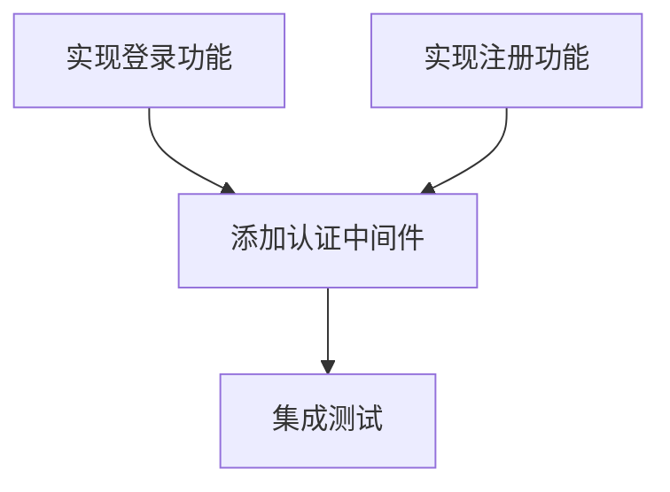

# TaskDependencyGraph 集成文档

**文档日期**: 2026-01-18
**文档级别**: P1 (重要)
**文档作者**: Claude Sonnet 4.5

---

## 概述

TaskDependencyGraph 是 MultiCLI 的核心依赖管理组件，负责分析任务间的依赖关系、检测文件冲突、生成执行批次，确保任务按正确的顺序执行。

**核心功能**:
- ✅ DAG (有向无环图) 实现
- ✅ 拓扑排序 (Kahn 算法)
- ✅ 循环依赖检测
- ✅ 文件冲突检测和自动串行化
- ✅ 并行执行批次计算
- ✅ 关键路径分析

---

## 架构设计

### 数据结构

```typescript
/** 任务节点 */
interface TaskNode {
  id: string;                    // 任务 ID
  name: string;                  // 任务名称
  dependencies: string[];        // 依赖的任务 ID 列表
  dependents: string[];          // 被依赖的任务 ID 列表（反向边）
  status: TaskStatus;            // 任务状态
  targetFiles?: string[];        // 目标文件列表
  data?: unknown;                // 任务数据（通常是 SubTask）
}

/** 并行执行批次 */
interface ExecutionBatch {
  batchIndex: number;            // 批次编号
  taskIds: string[];             // 该批次可并行执行的任务 ID 列表
}

/** 依赖图分析结果 */
interface DependencyAnalysis {
  hasCycle: boolean;             // 是否有循环依赖
  cycleNodes?: string[];         // 循环依赖涉及的任务
  topologicalOrder: string[];    // 拓扑排序结果
  executionBatches: ExecutionBatch[];  // 并行执行批次
  criticalPath: string[];        // 关键路径（最长依赖链）
  fileConflicts?: FileConflictInfo[];  // 文件冲突检测结果
}

/** 文件冲突信息 */
interface FileConflictInfo {
  file: string;                  // 冲突的文件路径
  taskIds: string[];             // 涉及此文件的任务 ID 列表
  conflictType: 'read-write' | 'write-write';  // 冲突类型
}
```

---

## 集成位置

### 主要使用者：WorkerPool

**位置**: [src/orchestrator/worker-pool.ts](../src/orchestrator/worker-pool.ts)

TaskDependencyGraph 在 WorkerPool 中有两个主要使用场景：

#### 1. executeWithDependencyGraph() - 完整依赖分析执行

**位置**: [src/orchestrator/worker-pool.ts:980-1074](../src/orchestrator/worker-pool.ts#L980-L1074)

**用途**: 执行带有依赖关系的子任务列表

**流程**:
```typescript
async executeWithDependencyGraph(
  taskId: string,
  subTasks: SubTask[],
  context?: string | ((subTask: SubTask) => string | undefined)
): Promise<ExecutionResult[]> {
  // 1. 构建依赖图
  const graph = new TaskDependencyGraph();

  // 2. 添加所有任务到图中
  for (const subTask of subTasks) {
    const targetFiles = this.resolveTargetFilesForGraph(subTask);
    graph.addTask(subTask.id, subTask.description, subTask, targetFiles);
  }

  // 3. 添加显式依赖关系
  for (const subTask of subTasks) {
    if (subTask.dependencies && subTask.dependencies.length > 0) {
      graph.addDependencies(subTask.id, subTask.dependencies);
    }
  }

  // 4. 检测文件冲突并自动添加依赖关系
  const addedDeps = graph.addFileDependencies('sequential');

  // 5. 处理未知目标文件的任务（强制串行）
  const unknownTaskIds = this.addUnknownTargetDependencies(graph, subTasks);

  // 6. 分析依赖图
  const analysis = graph.analyze();

  // 7. 检查循环依赖
  if (analysis.hasCycle) {
    throw new Error(`任务存在循环依赖: ${analysis.cycleNodes?.join(', ')}`);
  }

  // 8. 发出依赖图分析事件（供 UI 展示）
  this.emit('dependencyAnalysis', {
    taskId,
    analysis,
    mermaid: graph.toMermaid(),
    unknownTaskIds,
  });

  // 9. 按批次执行任务
  const allResults: ExecutionResult[] = [];
  for (const batch of analysis.executionBatches) {
    const batchTasks = batch.taskIds
      .map(id => graph.getTask(id)?.data as SubTask)
      .filter((t): t is SubTask => t !== undefined);

    // 并行执行批次内的任务
    const batchResults = await this.executeBatchParallel(
      taskId, batchTasks, context, dependentsCount
    );
    allResults.push(...batchResults);

    // 更新图中的任务状态
    for (const result of batchResults) {
      graph.updateTaskStatus(
        result.subTaskId,
        result.success ? 'completed' : 'failed'
      );
    }
  }

  return allResults;
}
```

#### 2. createDependencyGraph() - 创建依赖图（供外部使用）

**位置**: [src/orchestrator/worker-pool.ts:1208-1225](../src/orchestrator/worker-pool.ts#L1208-L1225)

**用途**: 创建依赖图但不执行，供外部分析使用

```typescript
createDependencyGraph(subTasks: SubTask[]): TaskDependencyGraph {
  const graph = new TaskDependencyGraph();

  // 添加任务
  for (const subTask of subTasks) {
    const targetFiles = this.resolveTargetFilesForGraph(subTask);
    graph.addTask(subTask.id, subTask.description, subTask, targetFiles);
  }

  // 添加依赖
  for (const subTask of subTasks) {
    if (subTask.dependencies && subTask.dependencies.length > 0) {
      graph.addDependencies(subTask.id, subTask.dependencies);
    }
  }

  // 自动添加文件冲突依赖
  graph.addFileDependencies('sequential');
  this.addUnknownTargetDependencies(graph, subTasks);

  return graph;
}
```

---

## 核心功能详解

### 1. 文件冲突检测

**方法**: `detectFileConflicts()`

**功能**: 检测多个任务修改同一文件的情况

**实现**:
```typescript
detectFileConflicts(): FileConflictInfo[] {
  const conflicts: FileConflictInfo[] = [];

  for (const [file, taskIds] of this.fileToTasks) {
    if (taskIds.size > 1) {
      // 多个任务修改同一文件，产生冲突
      conflicts.push({
        file,
        taskIds: Array.from(taskIds),
        conflictType: 'write-write',
      });
    }
  }

  return conflicts;
}
```

**使用场景**:
- 自动检测并行任务的文件冲突
- 防止数据覆盖和竞态条件

---

### 2. 自动依赖添加

**方法**: `addFileDependencies(strategy)`

**功能**: 基于文件冲突自动添加依赖关系，确保串行执行

**策略**:
- `'sequential'`: 按任务 ID 排序，链式依赖 (task[0] → task[1] → task[2])
- `'first-wins'`: 第一个任务无依赖，其他任务都依赖第一个

**实现**:
```typescript
addFileDependencies(strategy: 'first-wins' | 'sequential' = 'sequential'): number {
  const conflicts = this.detectFileConflicts();
  let addedCount = 0;

  for (const conflict of conflicts) {
    const taskIds = conflict.taskIds;

    if (strategy === 'sequential') {
      // 按任务 ID 排序，确保稳定的执行顺序
      taskIds.sort();

      // 添加链式依赖: task[0] -> task[1] -> task[2] -> ...
      for (let i = 1; i < taskIds.length; i++) {
        const success = this.addDependency(taskIds[i], taskIds[i - 1]);
        if (success) {
          addedCount++;
          console.log(
            `[TaskDependencyGraph] 文件冲突自动添加依赖: ${taskIds[i]} 依赖 ${taskIds[i - 1]} (文件: ${conflict.file})`
          );
        }
      }
    }
  }

  return addedCount;
}
```

**使用场景**:
- 自动解决文件冲突
- 保证数据一致性
- 避免手动管理依赖关系

---

### 3. 拓扑排序和批次计算

**方法**: `analyze()`

**功能**: 使用 Kahn 算法进行拓扑排序，并计算并行执行批次

**算法**:
```typescript
analyze(): DependencyAnalysis {
  // 使用 Kahn 算法进行拓扑排序
  const inDegree = new Map<string, number>();
  const topologicalOrder: string[] = [];
  const executionBatches: ExecutionBatch[] = [];

  // 初始化入度
  for (const [id, node] of this.nodes) {
    inDegree.set(id, node.dependencies.length);
  }

  // 找出所有入度为 0 的节点（第一批可执行的任务）
  let currentBatch: string[] = [];
  for (const [id, degree] of inDegree) {
    if (degree === 0) {
      currentBatch.push(id);
    }
  }

  let batchIndex = 0;
  const processed = new Set<string>();

  while (currentBatch.length > 0) {
    // 记录当前批次
    executionBatches.push({
      batchIndex,
      taskIds: [...currentBatch],
    });

    // 将当前批次加入拓扑排序结果
    topologicalOrder.push(...currentBatch);

    // 准备下一批次
    const nextBatch: string[] = [];

    for (const taskId of currentBatch) {
      processed.add(taskId);
      const node = this.nodes.get(taskId);
      if (!node) continue;

      // 减少所有依赖此任务的节点的入度
      for (const dependentId of node.dependents) {
        const newDegree = (inDegree.get(dependentId) || 0) - 1;
        inDegree.set(dependentId, newDegree);

        // 如果入度变为 0，加入下一批次
        if (newDegree === 0 && !processed.has(dependentId)) {
          nextBatch.push(dependentId);
        }
      }
    }

    currentBatch = nextBatch;
    batchIndex++;
  }

  // 检查是否有循环依赖
  const hasCycle = processed.size < this.nodes.size;
  let cycleNodes: string[] | undefined;

  if (hasCycle) {
    cycleNodes = Array.from(this.nodes.keys()).filter(id => !processed.has(id));
  }

  // 计算关键路径
  const criticalPath = this.findCriticalPath();

  // 检测文件冲突
  const fileConflicts = this.detectFileConflicts();

  return {
    hasCycle,
    cycleNodes,
    topologicalOrder,
    executionBatches,
    criticalPath,
    fileConflicts,
  };
}
```

**输出示例**:
```
任务总数: 5
执行批次: 3
  Batch 0: [task1, task2]      // 并行执行
  Batch 1: [task3, task4]      // 等待 Batch 0 完成后并行执行
  Batch 2: [task5]             // 等待 Batch 1 完成后执行
关键路径: task1 -> task3 -> task5
```

---

### 4. 关键路径分析

**方法**: `findCriticalPath()`

**功能**: 找出最长依赖链（关键路径）

**用途**:
- 识别影响整体执行时间的任务链
- 优化任务调度
- 性能分析

**算法**:
```typescript
private findCriticalPath(): string[] {
  const distances = new Map<string, number>();
  const predecessors = new Map<string, string | null>();

  // 初始化
  for (const id of this.nodes.keys()) {
    distances.set(id, 0);
    predecessors.set(id, null);
  }

  // 获取拓扑排序
  const analysis = this.getTopologicalOrder();
  if (!analysis) return [];

  // 计算最长路径
  for (const taskId of analysis) {
    const node = this.nodes.get(taskId);
    if (!node) continue;

    for (const dependentId of node.dependents) {
      const currentDist = distances.get(taskId) || 0;
      const dependentDist = distances.get(dependentId) || 0;

      if (currentDist + 1 > dependentDist) {
        distances.set(dependentId, currentDist + 1);
        predecessors.set(dependentId, taskId);
      }
    }
  }

  // 找出最远的节点
  let maxDist = 0;
  let endNode = '';
  for (const [id, dist] of distances) {
    if (dist > maxDist) {
      maxDist = dist;
      endNode = id;
    }
  }

  // 回溯构建关键路径
  const criticalPath: string[] = [];
  let current: string | null = endNode;
  while (current) {
    criticalPath.unshift(current);
    current = predecessors.get(current) || null;
  }

  return criticalPath;
}
```

---

## 使用示例

### 示例 1: 基本使用

```typescript
import { TaskDependencyGraph } from './task-dependency-graph';

// 创建依赖图
const graph = new TaskDependencyGraph();

// 添加任务
graph.addTask('task1', '实现登录功能', null, ['src/auth/login.ts']);
graph.addTask('task2', '实现注册功能', null, ['src/auth/register.ts']);
graph.addTask('task3', '添加认证中间件', null, ['src/middleware/auth.ts']);
graph.addTask('task4', '集成测试', null, ['tests/auth.test.ts']);

// 添加依赖关系
graph.addDependency('task3', 'task1');  // task3 依赖 task1
graph.addDependency('task3', 'task2');  // task3 依赖 task2
graph.addDependency('task4', 'task3');  // task4 依赖 task3

// 分析依赖图
const analysis = graph.analyze();

console.log('执行批次:');
analysis.executionBatches.forEach(batch => {
  console.log(`  Batch ${batch.batchIndex}: ${batch.taskIds.join(', ')}`);
});

console.log('关键路径:', analysis.criticalPath.join(' -> '));

// 输出:
// 执行批次:
//   Batch 0: task1, task2
//   Batch 1: task3
//   Batch 2: task4
// 关键路径: task1 -> task3 -> task4
```

### 示例 2: 文件冲突自动处理

```typescript
const graph = new TaskDependencyGraph();

// 添加任务（都修改同一文件）
graph.addTask('task1', '添加用户字段', null, ['src/models/user.ts']);
graph.addTask('task2', '添加用户方法', null, ['src/models/user.ts']);
graph.addTask('task3', '添加用户验证', null, ['src/models/user.ts']);

// 自动检测文件冲突并添加依赖
const addedDeps = graph.addFileDependencies('sequential');
console.log(`自动添加了 ${addedDeps} 个依赖关系`);

// 分析依赖图
const analysis = graph.analyze();

console.log('执行批次:');
analysis.executionBatches.forEach(batch => {
  console.log(`  Batch ${batch.batchIndex}: ${batch.taskIds.join(', ')}`);
});

// 输出:
// 自动添加了 2 个依赖关系
// 执行批次:
//   Batch 0: task1
//   Batch 1: task2
//   Batch 2: task3
```

### 示例 3: 循环依赖检测

```typescript
const graph = new TaskDependencyGraph();

graph.addTask('task1', 'Task 1');
graph.addTask('task2', 'Task 2');
graph.addTask('task3', 'Task 3');

// 创建循环依赖
graph.addDependency('task2', 'task1');
graph.addDependency('task3', 'task2');
graph.addDependency('task1', 'task3');  // 循环！

const analysis = graph.analyze();

if (analysis.hasCycle) {
  console.error('检测到循环依赖:', analysis.cycleNodes);
  // 输出: 检测到循环依赖: ['task1', 'task2', 'task3']
}
```

---

## 事件和可视化

### dependencyAnalysis 事件

**发出位置**: [src/orchestrator/worker-pool.ts:1034-1039](../src/orchestrator/worker-pool.ts#L1034-L1039)

**事件数据**:
```typescript
{
  taskId: string;                      // 任务 ID
  analysis: DependencyAnalysis;        // 依赖分析结果
  mermaid: string;                     // Mermaid 格式的依赖图
  unknownTaskIds: string[];            // 未知目标文件的任务
}
```

**监听示例**:
```typescript
workerPool.on('dependencyAnalysis', (data) => {
  console.log('依赖分析完成:');
  console.log('  任务总数:', data.analysis.topologicalOrder.length);
  console.log('  执行批次:', data.analysis.executionBatches.length);
  console.log('  关键路径:', data.analysis.criticalPath.join(' -> '));

  // 在 UI 中展示依赖图
  displayDependencyGraph(data.mermaid);
});
```

### Mermaid 可视化

**方法**: `toMermaid()`

**输出格式**:


---

## 最佳实践

### 1. 始终提供 targetFiles

```typescript
// ✅ 好的做法
graph.addTask('task1', '修改用户模型', subTask, ['src/models/user.ts']);

// ❌ 不好的做法
graph.addTask('task1', '修改用户模型', subTask);  // 无法检测文件冲突
```

### 2. 使用 sequential 策略处理文件冲突

```typescript
// ✅ 推荐：稳定的执行顺序
graph.addFileDependencies('sequential');

// ⚠️ 可选：第一个任务优先
graph.addFileDependencies('first-wins');
```

### 3. 检查循环依赖

```typescript
const analysis = graph.analyze();

if (analysis.hasCycle) {
  throw new Error(`任务存在循环依赖: ${analysis.cycleNodes?.join(', ')}`);
}
```

### 4. 监控关键路径

```typescript
const analysis = graph.analyze();

console.log('关键路径:', analysis.criticalPath.join(' -> '));
console.log('关键路径长度:', analysis.criticalPath.length);

// 优化建议：关注关键路径上的任务，优化它们的执行时间
```

---

## 性能考虑

### 时间复杂度

| 操作 | 时间复杂度 | 说明 |
|------|-----------|------|
| addTask | O(1) | 添加节点 |
| addDependency | O(1) | 添加边 |
| detectFileConflicts | O(F) | F = 文件数量 |
| addFileDependencies | O(T²) | T = 任务数量（最坏情况） |
| analyze (拓扑排序) | O(V + E) | V = 节点数，E = 边数 |
| findCriticalPath | O(V + E) | V = 节点数，E = 边数 |

### 空间复杂度

- 节点存储: O(V)
- 边存储: O(E)
- 文件映射: O(F × T)

### 优化建议

1. **限制任务数量**: 建议单次执行不超过 50 个子任务
2. **缓存分析结果**: 如果依赖关系不变，可以缓存 analyze() 结果
3. **增量更新**: 任务状态变更时，只更新受影响的节点

---

## 故障排查

### 问题 1: 检测不到文件冲突

**原因**: 未提供 targetFiles

**解决方案**:
```typescript
// 确保提供 targetFiles
const targetFiles = this.resolveTargetFilesForGraph(subTask);
graph.addTask(subTask.id, subTask.description, subTask, targetFiles);
```

### 问题 2: 循环依赖

**原因**: 任务间存在循环引用

**解决方案**:
```typescript
const analysis = graph.analyze();
if (analysis.hasCycle) {
  console.error('循环依赖的任务:', analysis.cycleNodes);
  // 检查并修复依赖关系
}
```

### 问题 3: 执行顺序不符合预期

**原因**: 依赖关系定义不正确

**解决方案**:
```typescript
// 使用 Mermaid 可视化依赖图
console.log(graph.toMermaid());

// 检查拓扑排序结果
const analysis = graph.analyze();
console.log('拓扑排序:', analysis.topologicalOrder);
```

---

## 相关文档

- [任务系统设计分析报告](./任务系统设计分析报告.md)
- [多系统综合验证报告](./多系统综合验证报告.md)
- [文件快照系统架构分析v2](./文件快照系统架构分析v2.md)

---

## 总结

TaskDependencyGraph 是 MultiCLI 任务调度的核心组件，提供了：

✅ **完整的依赖管理**: DAG 实现、拓扑排序、循环检测
✅ **自动冲突解决**: 文件冲突检测和自动串行化
✅ **并行优化**: 批次计算和关键路径分析
✅ **可视化支持**: Mermaid 格式输出
✅ **事件驱动**: 依赖分析事件供 UI 展示

**使用建议**:
- 始终提供 targetFiles 以启用文件冲突检测
- 使用 sequential 策略处理文件冲突
- 监控关键路径以优化性能
- 检查循环依赖以避免死锁

---

**文档生成时间**: 2026-01-18 03:00
**文档作者**: Claude Sonnet 4.5
**状态**: ✅ P1 文档完成
