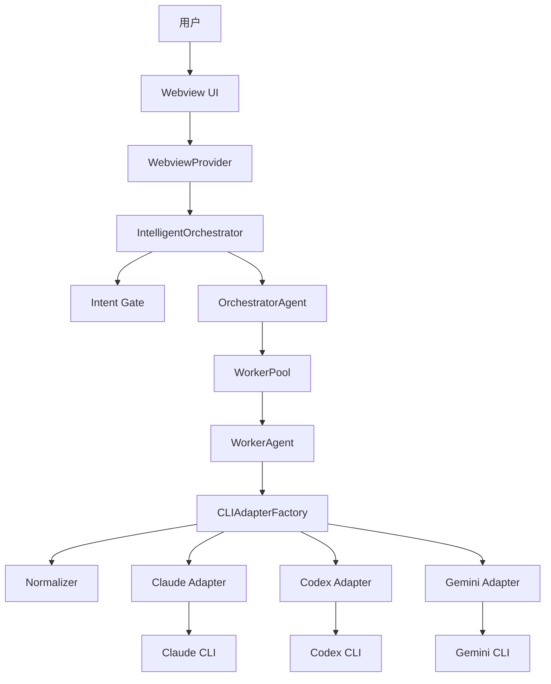
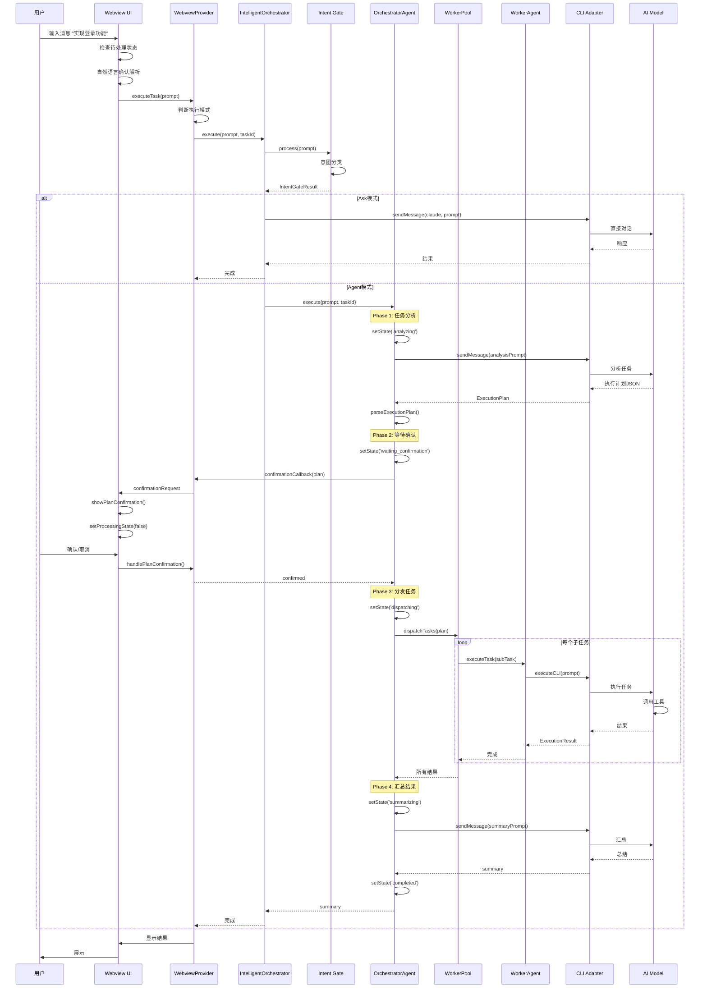

/**
 * MultiCLI 编排系统完整架构分析
 * 
 * 作者：高级架构工程师
 * 日期：2026-01-17
 * 
 * 本文档从代码层面彻底分析用户消息的完整生命周期，
 * 包括所有组件的交互、数据流、消息格式转换等。
 */

# MultiCLI 编排系统架构深度分析

## 目录
1. [系统概览](#系统概览)
2. [用户消息完整生命周期](#用户消息完整生命周期)
3. [核心组件详解](#核心组件详解)
4. [消息流转机制](#消息流转机制)
5. [工具调用机制](#工具调用机制)
6. [结果反馈流程](#结果反馈流程)

---

## 1. 系统概览

### 1.1 架构分层

```
┌─────────────────────────────────────────────────────────────┐
│                        用户界面层                              │
│  (Webview - index.html)                                      │
│  - 消息输入/显示                                               │
│  - 确认卡片交互                                                │
│  - 自然语言处理                                                │
└─────────────────────────────────────────────────────────────┘
                            ↕
┌─────────────────────────────────────────────────────────────┐
│                      通信协调层                                │
│  (WebviewProvider)                                           │
│  - executeTask() 入口                                         │
│  - 消息路由                                                    │
│  - 状态同步                                                    │
└─────────────────────────────────────────────────────────────┘
                            ↕
┌─────────────────────────────────────────────────────────────┐
│                      编排决策层                                │
│  (IntelligentOrchestrator + OrchestratorAgent)              │
│  - Intent Gate (意图识别)                                     │
│  - 任务分析                                                    │
│  - 计划生成                                                    │
│  - Worker 调度                                                │
└─────────────────────────────────────────────────────────────┘
                            ↕
┌─────────────────────────────────────────────────────────────┐
│                      执行协调层                                │
│  (WorkerPool + WorkerAgent)                                 │
│  - 任务分发                                                    │
│  - 依赖管理                                                    │
│  - 并发控制                                                    │
└─────────────────────────────────────────────────────────────┘
                            ↕
┌─────────────────────────────────────────────────────────────┐
│                      CLI 适配层                               │
│  (CLIAdapterFactory + Adapters)                             │
│  - Claude/Codex/Gemini 适配器                                │
│  - 消息标准化 (Normalizer)                                    │
│  - 工具调用解析                                                │
└─────────────────────────────────────────────────────────────┘
                            ↕
┌─────────────────────────────────────────────────────────────┐
│                      外部 CLI 层                              │
│  (Claude CLI / Codex CLI / Gemini CLI)                      │
│  - 实际的 AI 模型交互                                          │
│  - 工具执行                                                    │
└─────────────────────────────────────────────────────────────┘
```

### 1.2 核心组件关系



---

## 2. 用户消息完整生命周期

### 2.1 阶段概览

```
用户输入 → 前端处理 → 意图识别 → 模式选择 → 任务分析 → 
计划生成 → 用户确认 → 任务分发 → Worker执行 → 工具调用 → 
结果收集 → 结果汇总 → 用户展示
```

### 2.2 详细流程图



---

## 3. 核心组件详解

### 3.1 WebviewProvider (通信协调层)

**文件位置**: `src/ui/webview-provider.ts`

**核心职责**:
1. 接收用户输入
2. 路由到正确的执行模式
3. 管理确认回调
4. 同步状态到前端

**关键方法**:

```typescript
// 入口方法
async executeTask(prompt: string, forceCli?: CLIType, imagePaths?: string[]): Promise<void>

// 判断执行模式
const useIntelligentMode = !forceCli && !this.selectedCli;

if (useIntelligentMode) {
    await this.executeWithIntelligentOrchestrator(prompt, imagePaths);
} else {
    await this.executeWithDirectCli(prompt, forceCli || this.selectedCli!, imagePaths);
}
```

**状态管理**:
- `activeSessionId`: 当前会话ID
- `pendingConfirmation`: 待确认的Promise resolver
- `intelligentOrchestrator`: 编排器实例

---

### 3.2 IntelligentOrchestrator (编排决策层)

**文件位置**: `src/orchestrator/intelligent-orchestrator.ts`

**核心职责**:
1. 管理交互模式 (ask/agent/auto)
2. 协调 OrchestratorAgent
3. 处理任务生命周期

**交互模式**:

```typescript
// ask 模式：仅对话
if (this.interactionMode === 'ask') {
    return await this.executeAskMode(userPrompt, taskId);
}

// agent/auto 模式：完整编排
const result = await this.orchestratorAgent.execute(userPrompt, taskId);
```

**Ask 模式流程**:
```
用户输入 → Claude直接回答 → 返回结果
```

**Agent 模式流程**:
```
用户输入 → Intent Gate → 任务分析 → 计划生成 → 
用户确认 → Worker执行 → 结果汇总
```

---

### 3.3 Intent Gate (意图识别)

**文件位置**: `src/orchestrator/intent-gate.ts`

**核心职责**:
识别用户意图，决定处理模式

**意图类型**:
- `QUESTION`: 问答类 → Ask模式
- `TRIVIAL`: 简单操作 → Direct模式
- `EXPLORATORY`: 探索分析 → Explore模式
- `EXPLICIT`: 明确任务 → Task模式
- `OPEN_ENDED`: 开放任务 → Task模式
- `AMBIGUOUS`: 模糊需求 → Clarify模式

**处理流程**:

```typescript
process(prompt: string): IntentGateResult {
    // 1. 意图分类
    const classification = this.classifier.classify(prompt);
    
    // 2. 确定处理模式
    const recommendedMode = this.determineHandlerMode(classification);
    
    // 3. 判断是否跳过任务分析
    const skipTaskAnalysis = this.shouldSkipTaskAnalysis(classification, recommendedMode);
    
    // 4. 判断是否需要澄清
    const needsClarification = this.shouldRequestClarification(classification);
    
    return { classification, recommendedMode, skipTaskAnalysis, needsClarification };
}
```

**示例**:
- "什么是React Hooks?" → QUESTION → Ask模式
- "实现用户登录功能" → EXPLICIT → Task模式
- "优化一下代码" → AMBIGUOUS → Clarify模式

---

### 3.4 OrchestratorAgent (任务编排核心)

**文件位置**: `src/orchestrator/orchestrator-agent.ts`

**核心职责**:
1. 任务分析
2. 计划生成
3. Worker调度
4. 结果汇总

**执行阶段**:

```typescript
async execute(userPrompt: string, taskId: string): Promise<string> {
    // Phase 1: 任务分析
    this.setState('analyzing');
    const plan = await this.analyzeTask(userPrompt);
    
    // Phase 2: 等待用户确认
    this.setState('waiting_confirmation');
    const confirmed = await this.waitForConfirmation(plan);
    
    // Phase 3: 分发任务给 Worker
    this.setState('dispatching');
    await this.dispatchTasks(plan);
    
    // Phase 4: 监控执行
    this.setState('monitoring');
    await this.monitorExecution(plan);
    
    // Phase 5: 验证阶段
    this.setState('verifying');
    const verificationResult = await this.runVerification(taskId);
    
    // Phase 6: 汇总结果
    this.setState('summarizing');
    const summary = await this.summarizeResults(userPrompt, results, verificationResult);
    
    this.setState('completed');
    return summary;
}
```

**任务分析详解**:

```typescript
private async analyzeTask(userPrompt: string): Promise<ExecutionPlan | null> {
    // 1. 构建分析 Prompt
    const analysisPrompt = buildOrchestratorAnalysisPrompt(
        userPrompt, 
        availableWorkers, 
        projectContext
    );
    
    // 2. 调用 Claude 分析
    const response = await this.cliFactory.sendMessage(
        'claude',
        analysisPrompt,
        undefined,
        { source: 'orchestrator', streamToUI: true }
    );
    
    // 3. 解析执行计划
    const plan = this.parseExecutionPlan(response.content);
    
    return plan;
}
```

**执行计划结构**:

```typescript
interface ExecutionPlan {
    id: string;
    analysis: string;                    // 需求分析
    isSimpleTask: boolean;               // 是否简单任务
    needsCollaboration: boolean;         // 是否需要协作
    subTasks: SubTask[];                 // 子任务列表
    executionMode: 'sequential' | 'parallel';  // 执行模式
    featureContract: string;             // 功能契约
    acceptanceCriteria: string[];        // 验收标准
}

interface SubTask {
    id: string;
    description: string;                 // 任务描述
    assignedWorker: CLIType;             // 分配的Worker
    reason: string;                      // 分配原因
    targetFiles: string[];               // 目标文件
    dependencies: string[];              // 依赖的任务ID
    priority?: number;                   // 优先级
    kind: 'architecture' | 'implementation' | 'repair';  // 任务类型
}
```

---

## 4. 消息流转机制

### 4.1 消息标准化 (Normalizer)

**文件位置**: `src/normalizer/`

**核心职责**:
将各 CLI 的原始输出转换为标准消息格式

**标准消息格式**:

```typescript
interface StandardMessage {
    id: string;                          // 消息ID
    traceId: string;                     // 追踪ID
    type: MessageType;                   // 消息类型
    source: MessageSource;               // 来源 (orchestrator/worker)
    cli: CLIType;                        // CLI类型
    lifecycle: MessageLifecycle;         // 生命周期状态
    timestamp: number;                   // 时间戳
    blocks: ContentBlock[];              // 内容块
    metadata?: any;                      // 元数据
}

enum MessageType {
    TEXT = 'text',
    THINKING = 'thinking',
    TOOL_CALL = 'tool_call',
    PLAN = 'plan',
    PROGRESS = 'progress',
    ERROR = 'error',
    RESULT = 'result'
}

enum MessageLifecycle {
    STREAMING = 'streaming',
    COMPLETED = 'completed',
    FAILED = 'failed',
    INTERRUPTED = 'interrupted'
}
```

**Normalizer 工作流程**:

```typescript
// 1. 开始流式消息
const messageId = normalizer.startStream(traceId, source);

// 2. 处理输出块
normalizer.processChunk(messageId, chunk);

// 3. 结束流式消息
normalizer.endStream(messageId, error);
```

**消息路由**:

```
Normalizer → standardMessage 事件 → WebviewProvider → 前端

根据 source 字段路由:
- source === 'orchestrator' → threadMessages (主对话面板)
- source === 'worker' → cliOutputs[cli] (CLI面板)
```

### 4.2 前端消息处理

**文件位置**: `src/ui/webview/index.html`

**消息处理流程**:

```javascript
// 1. 接收标准消息
window.addEventListener('message', event => {
    const msg = event.data;
    
    if (msg.type === 'standardMessage') {
        handleStandardMessage(msg.message);
    }
});

// 2. 处理标准消息
function handleStandardMessage(message) {
    // 根据 source 路由
    const isOrchestrator = message.source === 'orchestrator';
    
    // 特殊消息类型处理
    if (message.type === 'plan') {
        showPlanPreview(content, planId, timestamp, review);
        return;
    }
    
    // 转换为 Webview 消息格式
    const webviewMsg = standardToWebviewMessage(message);
    
    // 添加到对应面板
    if (isOrchestrator) {
        threadMessages.push(webviewMsg);
    } else {
        cliOutputs[cli].push(webviewMsg);
    }
    
    // 更新UI
    renderMainContent();
}
```

---

## 5. 工具调用机制

### 5.1 工具调用流程

```
Worker → CLI Adapter → AI Model → 工具调用 → 
工具执行 → 结果返回 → AI Model → 继续生成
```

### 5.2 工具解析

**Normalizer 解析工具调用**:

```typescript
// Claude Normalizer 示例
protected parseChunk(context: ParseContext, chunk: string): StreamUpdate[] {
    const updates: StreamUpdate[] = [];
    
    // 检测工具调用
    const toolCallMatch = chunk.match(/<tool_call>(.*?)<\/tool_call>/s);
    if (toolCallMatch) {
        const toolCall = this.parseToolCall(toolCallMatch[1]);
        context.blocks.push({
            type: 'tool_call',
            name: toolCall.name,
            input: toolCall.input
        });
        
        updates.push({
            messageId: context.messageId,
            timestamp: Date.now(),
            updateType: 'add_block',
            block: toolCall
        });
    }
    
    return updates;
}
```

### 5.3 工具执行

工具由 CLI 本身执行，不由编排系统执行。

**支持的工具**:
- `read_file`: 读取文件
- `write_file`: 写入文件
- `list_directory`: 列出目录
- `search_files`: 搜索文件
- `run_bash_command`: 执行命令
- `edit_file`: 编辑文件

---

## 6. 结果反馈流程

### 6.1 Worker 结果收集

```typescript
// WorkerAgent 完成任务
const result: ExecutionResult = {
    workerId: this.id,
    workerType: this.type,
    taskId,
    subTaskId: subTask.id,
    result: response.content,
    success: !response.error,
    duration: Date.now() - startTime,
    modifiedFiles: response.fileChanges?.map(f => f.filePath),
    error: response.error,
};

// 汇报给 Orchestrator
this.messageBus.reportTaskCompleted(this.id, this.orchestratorId, result);
```

### 6.2 结果汇总

```typescript
private async summarizeResults(
    userPrompt: string,
    results: ExecutionResult[],
    verificationResult?: VerificationResult | null
): Promise<string> {
    // 构建汇总 Prompt
    const summaryPrompt = buildOrchestratorSummaryPrompt(userPrompt, results);
    
    // 调用 Claude 汇总
    const response = await this.cliFactory.sendMessage(
        'claude',
        summaryPrompt,
        undefined,
        { source: 'orchestrator', streamToUI: true }
    );
    
    return response.content;
}
```

### 6.3 前端展示

```javascript
// 汇总消息显示在主对话面板
if (message.type === 'result' && message.source === 'orchestrator') {
    threadMessages.push({
        role: 'assistant',
        content: message.content,
        source: 'orchestrator',
        type: 'summary'
    });
    
    renderMainContent();
}
```

---

## 7. 完整示例：用户消息的生命周期

### 7.1 示例场景

**用户输入**: "实现一个用户登录功能，包括前端表单和后端API"

### 7.2 详细执行流程

#### Step 1: 前端接收 (Webview)

```javascript
// src/ui/webview/index.html
document.getElementById('execute-btn').addEventListener('click', () => {
    const promptText = input.value.trim(); // "实现一个用户登录功能..."

    // 检查是否有待确认状态
    if (hasPendingConfirmation()) {
        // 自然语言确认处理
        const userInput = promptText.toLowerCase();
        if (confirmKeywords.includes(userInput)) {
            handlePlanConfirmation(true);
            return;
        }
    }

    // 创建用户消息
    const userMsg = {
        role: 'user',
        content: promptText,
        timestamp: Date.now()
    };
    threadMessages.push(userMsg);

    // 设置处理状态
    setProcessingState(true);

    // 发送到后端
    vscode.postMessage({
        type: 'executeTask',
        prompt: promptText
    });
});
```

#### Step 2: WebviewProvider 路由

```typescript
// src/ui/webview-provider.ts
private async handleMessage(message: WebviewToExtensionMessage): Promise<void> {
    switch (message.type) {
        case 'executeTask':
            await this.executeTask(message.prompt);
            break;
    }
}

private async executeTask(prompt: string): Promise<void> {
    // 判断执行模式
    const useIntelligentMode = !this.selectedCli;

    if (useIntelligentMode) {
        // 智能编排模式
        await this.executeWithIntelligentOrchestrator(prompt, []);
    } else {
        // 直接执行模式
        await this.executeWithDirectCli(prompt, this.selectedCli!, []);
    }
}

private async executeWithIntelligentOrchestrator(prompt: string): Promise<void> {
    const task = this.taskManager.createTask(prompt);
    this.taskManager.updateTaskStatus(task.id, 'running');

    // 调用智能编排器
    const result = await this.intelligentOrchestrator.execute(prompt, task.id);

    // 保存消息历史
    this.saveMessageToSession(prompt, result, undefined, 'orchestrator');
}
```

#### Step 3: IntelligentOrchestrator 模式选择

```typescript
// src/orchestrator/intelligent-orchestrator.ts
async execute(userPrompt: string, taskId: string): Promise<string> {
    this.isRunning = true;

    try {
        // ask 模式：仅对话
        if (this.interactionMode === 'ask') {
            return await this.executeAskMode(userPrompt, taskId);
        }

        // agent/auto 模式：使用编排者执行
        const result = await this.orchestratorAgent.execute(userPrompt, taskId);

        this.taskManager.updateTaskStatus(taskId, 'completed');
        return result;

    } finally {
        this.isRunning = false;
    }
}
```

#### Step 4: OrchestratorAgent 任务分析

```typescript
// src/orchestrator/orchestrator-agent.ts
async execute(userPrompt: string, taskId: string): Promise<string> {
    // 初始化上下文
    this.currentContext = {
        taskId,
        userPrompt,
        results: [],
        startTime: Date.now(),
    };

    // Phase 1: 任务分析
    this.setState('analyzing');
    const plan = await this.analyzeTask(userPrompt);

    // analyzeTask 内部流程：
    // 1. 构建分析 Prompt
    const analysisPrompt = `
你是一个智能任务编排者。请分析以下用户需求，生成执行计划。

用户需求：${userPrompt}

可用 Worker：
- claude: 擅长架构设计、复杂逻辑
- codex: 擅长代码生成、文件操作
- gemini: 擅长数据处理、API集成

请以 JSON 格式返回执行计划：
{
  "analysis": "需求分析",
  "subTasks": [
    {
      "id": "1",
      "description": "创建登录表单组件",
      "assignedWorker": "codex",
      "reason": "前端代码生成",
      "targetFiles": ["src/components/LoginForm.tsx"],
      "dependencies": []
    },
    {
      "id": "2",
      "description": "实现登录API接口",
      "assignedWorker": "claude",
      "reason": "后端逻辑设计",
      "targetFiles": ["src/api/auth.ts"],
      "dependencies": ["1"]
    }
  ],
  "executionMode": "sequential",
  "featureContract": "用户可以通过表单输入用户名密码登录",
  "acceptanceCriteria": [
    "前端表单包含用户名和密码输入框",
    "后端API验证用户凭证",
    "登录成功后返回token"
  ]
}
`;

    // 2. 调用 Claude 分析
    const response = await this.cliFactory.sendMessage(
        'claude',
        analysisPrompt,
        undefined,
        { source: 'orchestrator', streamToUI: true }
    );

    // 3. 解析执行计划
    const plan = this.parseExecutionPlan(response.content);
    /*
    plan = {
        id: "plan_1737120660000",
        analysis: "需要创建前端登录表单和后端API接口",
        subTasks: [
            {
                id: "1",
                description: "创建登录表单组件",
                assignedWorker: "codex",
                targetFiles: ["src/components/LoginForm.tsx"],
                dependencies: []
            },
            {
                id: "2",
                description: "实现登录API接口",
                assignedWorker: "claude",
                targetFiles: ["src/api/auth.ts"],
                dependencies: ["1"]
            }
        ],
        executionMode: "sequential",
        featureContract: "用户可以通过表单输入用户名密码登录",
        acceptanceCriteria: [...]
    }
    */

    return plan;
}
```

#### Step 5: 用户确认

```typescript
// Phase 2: 等待用户确认
this.setState('waiting_confirmation');
const confirmed = await this.waitForConfirmation(plan);

// waitForConfirmation 内部：
private async waitForConfirmation(plan: ExecutionPlan): Promise<boolean> {
    const formattedPlan = formatPlanForUser(plan);
    /*
    formattedPlan = `
    ## 执行计划

    **需求分析**: 需要创建前端登录表单和后端API接口

    **子任务**:
    1. 创建登录表单组件 (codex)
       - 目标文件: src/components/LoginForm.tsx

    2. 实现登录API接口 (claude)
       - 目标文件: src/api/auth.ts
       - 依赖: 任务1

    **功能契约**: 用户可以通过表单输入用户名密码登录

    **验收标准**:
    - 前端表单包含用户名和密码输入框
    - 后端API验证用户凭证
    - 登录成功后返回token
    `
    */

    // 调用确认回调（在 WebviewProvider 中设置）
    const confirmed = await this.confirmationCallback(plan, formattedPlan);

    return confirmed;
}

// WebviewProvider 中的确认回调：
this.intelligentOrchestrator.setConfirmationCallback(async (plan, formattedPlan) => {
    return new Promise<boolean>((resolve) => {
        this.pendingConfirmation = { resolve };

        // 发送确认请求到前端
        this.postMessage({
            type: 'confirmationRequest',
            plan: plan,
            formattedPlan: formattedPlan,
        });
    });
});

// 前端显示确认卡片：
function showPlanConfirmation(plan, formattedPlan) {
    const confirmationMsg = {
        role: 'system',
        type: 'plan_confirmation',
        content: formattedPlan,
        plan: plan,
        isPending: true
    };
    threadMessages.push(confirmationMsg);

    // 关键：等待确认时停止处理状态
    setProcessingState(false);

    renderMainContent();
}

// 用户点击确认或输入"确认"：
function handlePlanConfirmation(confirmed) {
    vscode.postMessage({
        type: 'confirmPlan',
        confirmed: confirmed
    });

    if (confirmed) {
        setProcessingState(true);
    }
}

// WebviewProvider 处理确认响应：
private handlePlanConfirmation(confirmed: boolean): void {
    if (this.pendingConfirmation) {
        this.pendingConfirmation.resolve(confirmed);
        this.pendingConfirmation = null;
    }
}
```

#### Step 6: 任务分发

```typescript
// Phase 3: 分发任务给 Worker
this.setState('dispatching');
await this.dispatchTasks(plan);

// dispatchTasks 内部：
private async dispatchTasks(plan: ExecutionPlan): Promise<void> {
    const hasDependencies = plan.subTasks.some(t => t.dependencies?.length > 0);

    if (hasDependencies) {
        // 使用依赖图调度
        await this.dispatchWithDependencyGraph(plan.subTasks);
    } else if (plan.executionMode === 'parallel') {
        // 并行执行
        await this.dispatchParallel(plan.subTasks);
    } else {
        // 顺序执行
        await this.dispatchSequential(plan.subTasks);
    }
}

// 依赖图调度：
private async dispatchWithDependencyGraph(subTasks: SubTask[]): Promise<void> {
    const results = await this.workerPool.executeWithDependencyGraph(
        this.currentContext!.taskId,
        subTasks
    );

    for (const result of results) {
        await this.finalizeResult(result);
    }
}
```

#### Step 7: WorkerPool 执行

```typescript
// src/orchestrator/worker-pool.ts
async executeWithDependencyGraph(
    taskId: string,
    subTasks: SubTask[]
): Promise<ExecutionResult[]> {
    // 1. 构建依赖图
    const graph = new TaskDependencyGraph();
    for (const subTask of subTasks) {
        graph.addTask(subTask.id, subTask.description, subTask);
    }
    for (const subTask of subTasks) {
        if (subTask.dependencies?.length > 0) {
            graph.addDependencies(subTask.id, subTask.dependencies);
        }
    }

    // 2. 分析依赖图
    const analysis = graph.analyze();
    /*
    analysis = {
        hasCycle: false,
        executionBatches: [
            { batchIndex: 0, taskIds: ["1"] },  // 第一批：任务1
            { batchIndex: 1, taskIds: ["2"] }   // 第二批：任务2（依赖任务1）
        ],
        criticalPath: ["1", "2"]
    }
    */

    // 3. 按批次执行
    const allResults: ExecutionResult[] = [];

    for (const batch of analysis.executionBatches) {
        const batchTasks = batch.taskIds
            .map(id => graph.getTask(id)?.data as SubTask)
            .filter(t => t !== undefined);

        // 并行执行批次内的任务
        const batchResults = await this.executeBatchParallel(
            taskId,
            batchTasks
        );

        allResults.push(...batchResults);
    }

    return allResults;
}
```

#### Step 8: WorkerAgent 执行任务

```typescript
// src/orchestrator/worker-agent.ts
async executeTask(taskId: string, subTask: SubTask): Promise<ExecutionResult> {
    this.setState('executing');

    // 1. 构建执行 Prompt
    const prompt = this.buildExecutionPrompt(subTask);
    /*
    prompt = `
你是一个专业的代码生成助手。请完成以下任务：

任务描述: 创建登录表单组件
目标文件: src/components/LoginForm.tsx

要求：
- 使用 React + TypeScript
- 包含用户名和密码输入框
- 包含提交按钮
- 添加基本的表单验证

请直接生成代码。
    `
    */

    // 2. 调用 CLI 执行
    const response = await this.executeCLI(prompt);

    // 3. 构建执行结果
    const result: ExecutionResult = {
        workerId: this.id,
        workerType: this.type,  // "codex"
        taskId,
        subTaskId: subTask.id,
        result: response.content,
        success: !response.error,
        duration: Date.now() - startTime,
        modifiedFiles: ["src/components/LoginForm.tsx"]
    };

    // 4. 汇报任务完成
    this.messageBus.reportTaskCompleted(this.id, this.orchestratorId, result);

    return result;
}

private async executeCLI(prompt: string): Promise<CLIResponse> {
    return await this.cliFactory.sendMessage(
        this.type,  // "codex"
        prompt,
        undefined,
        { source: 'worker', streamToUI: true }
    );
}
```

#### Step 9: CLI Adapter 处理

```typescript
// src/cli/adapter-factory.ts
async sendMessage(
    type: CLIType,
    message: string,
    imagePaths?: string[],
    options?: AdapterOutputScope
): Promise<CLIResponse> {
    const adapter = this.getOrCreate(type);  // CodexAdapter

    // 设置输出作用域
    const scope = options ? { ...options } : null;
    if (scope) {
        this.outputScopes.set(type, scope);
    }

    try {
        // 调用适配器发送消息
        return adapter.sendMessage(message, imagePaths);
    } finally {
        if (scope) {
            this.outputScopes.delete(type);
        }
    }
}

// 适配器事件处理：
private setupAdapterEvents(adapter: ICLIAdapter, type: CLIType, role: AdapterRole): void {
    adapter.on('output', (chunk: string) => {
        const scopeKey = this.getScopeKey(type, role);
        const scope = this.outputScopes.get(scopeKey);
        const source: MessageSource = (scope?.source as MessageSource) || 'worker';

        // 通过 Normalizer 处理原始输出
        const normalizer = this.getOrCreateNormalizer(type, source);
        let messageId = this.activeMessageIds.get(scopeKey);

        if (!messageId) {
            const traceId = this.generateTraceId();
            messageId = normalizer.startStream(traceId, source);
            this.activeMessageIds.set(scopeKey, messageId);
        }

        // 处理输出块
        normalizer.processChunk(messageId, chunk);
    });

    adapter.on('response', (response: CLIResponse) => {
        const messageId = this.activeMessageIds.get(scopeKey);
        if (messageId) {
            const normalizer = this.getOrCreateNormalizer(type, source);
            normalizer.endStream(messageId, response.error);
            this.activeMessageIds.delete(scopeKey);
        }
    });
}
```

#### Step 10: Normalizer 标准化

```typescript
// src/normalizer/codex-normalizer.ts
startStream(traceId: string, source?: MessageSource): string {
    const messageId = generateMessageId();

    const message = createStreamingMessage(
        source || this.config.defaultSource,  // 'worker'
        this.config.cli,  // 'codex'
        traceId,
        { id: messageId }
    );

    // 发送标准消息事件
    this.emit('message', message);

    return messageId;
}

processChunk(messageId: string, chunk: string): void {
    const context = this.activeContexts.get(messageId);
    context.rawBuffer += chunk;

    // 解析输出块
    const updates = this.parseChunk(context, chunk);

    for (const update of updates) {
        this.emit('update', update);
    }
}

endStream(messageId: string, error?: string): StandardMessage | null {
    const context = this.activeContexts.get(messageId);

    this.finalizeContext(context);
    const message = this.buildFinalMessage(context, error);

    this.emit('complete', messageId, message);

    return message;
}
```

#### Step 11: 消息路由到前端

```typescript
// CLIAdapterFactory 转发标准消息事件：
normalizer.on('message', (message: StandardMessage) => {
    this.emit('standardMessage', message);
});

// WebviewProvider 监听并转发到前端：
this.cliFactory.on('standardMessage', (message: any) => {
    this.postMessage({
        type: 'standardMessage',
        message,
        sessionId: this.activeSessionId
    });
});

// 前端处理标准消息：
window.addEventListener('message', event => {
    const msg = event.data;

    if (msg.type === 'standardMessage') {
        handleStandardMessage(msg.message);
    }
});

function handleStandardMessage(message) {
    const isOrchestrator = message.source === 'orchestrator';
    const cli = message.cli || 'claude';

    // 转换为 Webview 消息格式
    const webviewMsg = standardToWebviewMessage(message);

    if (isOrchestrator) {
        // 编排者消息 -> Thread 面板
        threadMessages.push(webviewMsg);
    } else {
        // Worker 消息 -> CLI 面板
        if (!cliOutputs[cli]) {
            cliOutputs[cli] = [];
        }
        cliOutputs[cli].push(webviewMsg);
    }

    // 设置处理状态
    if (message.lifecycle === 'streaming') {
        setProcessingState(true);
    }

    renderMainContent();
}
```

#### Step 12: 结果汇总

```typescript
// 所有子任务完成后，OrchestratorAgent 汇总结果：
this.setState('summarizing');
const summary = await this.summarizeResults(userPrompt, this.completedResults);

private async summarizeResults(
    userPrompt: string,
    results: ExecutionResult[]
): Promise<string> {
    // 构建汇总 Prompt
    const summaryPrompt = `
你是一个智能任务编排者。请汇总以下任务的执行结果。

用户需求：${userPrompt}

执行结果：
${results.map(r => `
- 任务: ${r.subTaskId}
  Worker: ${r.workerType}
  状态: ${r.success ? '成功' : '失败'}
  修改文件: ${r.modifiedFiles?.join(', ')}
  输出: ${r.result}
`).join('\n')}

请生成一份简洁的总结报告。
    `;

    const response = await this.cliFactory.sendMessage(
        'claude',
        summaryPrompt,
        undefined,
        { source: 'orchestrator', streamToUI: true }
    );

    this.emitUIMessage('summary', response.content);

    return response.content;
}

// 完成
this.setState('completed');
return summary;
```

#### Step 13: 前端展示结果

```typescript
// 汇总消息通过 standardMessage 发送到前端
// source === 'orchestrator' → 显示在主对话面板

function handleStandardMessage(message) {
    if (message.type === 'result' && message.source === 'orchestrator') {
        const webviewMsg = {
            role: 'assistant',
            content: extractTextFromBlocks(message.blocks),
            source: 'orchestrator',
            type: 'summary',
            timestamp: message.timestamp
        };

        threadMessages.push(webviewMsg);

        // 任务完成，清理状态
        setProcessingState(false);

        renderMainContent();
    }
}
```

---

## 8. 关键设计模式

### 8.1 消息标准化模式

**问题**: 不同 CLI 输出格式不一致

**解决方案**: Normalizer 模式

```
原始输出 → Normalizer → StandardMessage → 统一处理
```

### 8.2 状态机模式

**OrchestratorAgent 状态转换**:

```
idle → analyzing → waiting_confirmation → dispatching →
monitoring → verifying → summarizing → completed/failed
```

### 8.3 依赖图调度模式

**问题**: 任务间有依赖关系

**解决方案**: 拓扑排序 + 批次执行

```
任务依赖图 → 拓扑排序 → 执行批次 → 批次内并行执行
```

### 8.4 Promise-based 确认模式

**问题**: 异步等待用户确认

**解决方案**: Promise + Callback

```typescript
// 后端
const confirmed = await this.confirmationCallback(plan, formattedPlan);

// 前端
this.pendingConfirmation = { resolve };
// ... 用户操作 ...
this.pendingConfirmation.resolve(confirmed);
```

---

## 9. 性能优化点

### 9.1 消息批处理

**问题**: 高频消息导致前端卡顿

**解决方案**: 消息批处理器

```typescript
// 50ms 内的消息合并发送
if (!this.orchestratorStreamFlushTimer) {
    this.orchestratorStreamFlushTimer = setTimeout(() => {
        const pending = this.orchestratorStreamPending;
        this.orchestratorStreamPending = '';
        this.sendStreamEvent({ content: pending });
    }, 50);
}
```

### 9.2 状态去重

**问题**: 重复的状态更新

**解决方案**: 状态比较

```typescript
private setState(state: OrchestratorState): void {
    if (this._state !== state) {
        this._state = state;
        this.emit('stateChange', state);
    }
}
```

### 9.3 消息去重

**问题**: 重复的消息显示

**解决方案**: 消息ID追踪

```typescript
const existingMsg = messages.find(m => m.standardMessageId === message.id);
if (existingMsg) {
    Object.assign(existingMsg, updatedMsg);
} else {
    messages.push(webviewMsg);
}
```

---

## 10. 总结

### 10.1 核心流程回顾

```
用户输入
  ↓
前端处理 (自然语言确认、状态检查)
  ↓
WebviewProvider 路由 (智能模式 vs 直接模式)
  ↓
IntelligentOrchestrator 模式选择 (ask vs agent)
  ↓
Intent Gate 意图识别 (问答 vs 任务)
  ↓
OrchestratorAgent 任务分析 (调用 Claude 生成计划)
  ↓
用户确认 (Promise-based 异步等待)
  ↓
WorkerPool 任务分发 (依赖图调度)
  ↓
WorkerAgent 执行任务 (调用 CLI)
  ↓
CLI Adapter 消息处理 (Normalizer 标准化)
  ↓
消息路由 (orchestrator → Thread, worker → CLI)
  ↓
结果汇总 (Claude 生成总结)
  ↓
前端展示 (状态清理、UI更新)
```

### 10.2 关键设计特点

1. **分层架构**: 清晰的职责分离
2. **消息标准化**: Normalizer 统一处理
3. **状态驱动**: 明确的状态转换
4. **异步协调**: Promise-based 确认机制
5. **灵活路由**: 基于 source 的消息路由
6. **依赖管理**: 拓扑排序 + 批次执行
7. **工具集成**: CLI 原生工具调用
8. **性能优化**: 批处理、去重、状态比较

### 10.3 扩展点

1. **新增 CLI**: 实现 ICLIAdapter 接口 + Normalizer
2. **新增交互模式**: 在 IntelligentOrchestrator 中添加
3. **新增意图类型**: 在 Intent Gate 中扩展
4. **新增验证器**: 实现 VerificationRunner 接口
5. **新增调度策略**: 在 WorkerPool 中添加

---

**文档版本**: v1.0
**最后更新**: 2026-01-17
**作者**: 高级架构工程师

