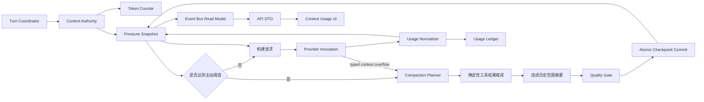

# Magi 上下文压力与压缩统一架构

> 文档类型：后续开发唯一架构基线
>
> 状态：核心链路已实现，后续仅允许在本架构内迭代
>
> 目标执行人：Luna
>
> 更新日期：2026-08-14
>
> 适用范围：Magi 主对话、识图模型单轮接管、辅助模型、worker、上下文统计、上下文压缩、超限恢复、检查点、事件投影和前端上下文用量展示

## 1. 文档目的

本文将五个参考项目的可复用结论收敛为 Magi 的单一实现方案：

- [DeepSeek Harness](https://github.com/deepseek-ai/deepseek-harness)：provider usage 锚点、历史增量、较早压缩、工具结果缩减。
- [OpenAI Codex](https://github.com/openai/codex)：当前上下文窗口与累计计费分离、压缩后立即重算、活动窗口和前缀基线。
- [Grok Build](https://github.com/xai-org/grok-build)：85% 阈值、token counter 抽象、工具配对安全、状态重新注入、摘要质量门禁和历史指纹。
- [Claude Code 官方仓库](https://github.com/anthropics/claude-code)：最新产品行为、缺陷记录和长期会话 UX 验收标准。
- `/Users/xie/code/claude-code-2.1.87`：Claude Code 2.1.87 的可读实现，包括 auto compact、microcompact、compact boundary、token estimation、超限重试和状态清理。

本文不是代码迁移说明，也不是把五个项目拼成五套实现。后续 agent 必须先遵守本文的所有权边界和唯一数据流，再决定具体代码位置。

## 2. 完成目标

完成后，Magi 必须满足以下行为：

1. 上下文窗口占用、下一次请求预测和累计计费拥有不同的数据类型和计算入口。
2. 统计快照绑定实际调用模型、上下文窗口、测量来源、调用 ID、检查点代际和时间。
3. provider usage 可用时作为当前模型的锚点；没有锚点时使用绑定模型的保守估算器。
4. 主模型切换、识图模型单轮接管、上下文窗口配置变化都会使旧锚点失效。
5. 接近模型有效窗口前主动压缩，而不是等到 90% 或 provider 拒绝后才开始。
6. 压缩只处理连续、完整的历史范围，不使用固定 32K 头尾拼接，也不无声丢弃中间消息。
7. 工具调用与工具结果不可被压缩边界拆开；大型旧工具结果先做确定性缩减。
8. 压缩完成后立即重新计算请求压力，并立即更新页面上下文圆环。
9. provider 明确返回上下文超限时，当前回合无感压缩并重试，不产生重复用户消息。
10. 压缩失败和超限恢复有界，不允许每个后续回合重复发送注定失败的压缩请求。
11. daemon 重启、session 恢复和个人无工作区会话都使用同一套规则。
12. worker、辅助模型、生图模型和识图模型的账单可记录，但不能覆盖主对话上下文锚点。

## 3. 当前问题与根本原因

### 3.1 表面问题

- 长会话中 Magi 可能比 Codex 更晚触发压缩。
- 当前 token 统计在模型切换后可能出现分子来自旧模型、分母来自新模型。
- 压缩输入固定受 32K 限制，头尾保留会跳过中间历史。
- 工具结果虽然被限制长度，但压缩范围和工具配对边界没有统一的数据模型。
- provider 上下文错误仍有一部分依赖错误字符串分类。
- 压缩后 UI 可能继续展示压缩前的观测值，直到下一次模型调用。

### 3.2 五个 Why

1. 为什么统计可能不准？`model.usage.recorded` 保存的是通用 `context_window_tokens`，DTO 再根据当前活动模型推导窗口，没有把观测和模型配置绑定成不可变快照。
2. 为什么压缩会偏晚？`context_authority.rs` 同时使用固定 90% 阈值、固定 8K 目标、固定 32K 输入和估算 prefill 分支，实际请求增量没有进入唯一压力模型。
3. 为什么历史可能无声丢失？`bounded_compaction_source` 为满足输入限制采用头尾截断，而不是按照完整回合选择连续压缩范围。
4. 为什么恢复容易复杂？运行时、usage authority、event bus、API DTO 和前端各自携带一部分 token 语义，provider 错误又在多处按文本判断。
5. 为什么会出现重复或过度工作流？压缩、工具结果缩减、流式估算和错误恢复没有由一个 `ContextAuthority` 统一编排，导致多个“看似兜底”的路径叠加。

最终根因是：上下文压力不是当前系统的一等领域对象，导致不同模块分别维护窗口、token、压缩和恢复状态。

## 4. 设计原则

### 4.1 单一权威

所有上下文压力都由 `magi-usage-authority` 计算，运行时只提供输入和执行压缩，event bus 只投影，API 只转换 DTO，前端只展示。

### 4.2 当前窗口与累计用量分离

`provider_context_tokens` 不得进入累计账单 reducer；`billable_tokens` 不得用于判断下一次请求是否接近窗口。

### 4.3 连续历史优先

压缩选择完整的时间连续范围。不能用“保留最早几条 + 最近几条”的拼接替代连续摘要；如果摘要模型容量不足，缩小本次连续前缀，保留剩余历史供下一次有界压缩。

### 4.4 结构正确优先于错误兜底

工具调用、工具结果、图片附件和 provider 私有上下文必须在数据结构层保持合法。校验失败时不得安装半成品检查点，也不得用第二套兼容路径掩盖问题。

### 4.5 复杂度受控

Magi 只保留一条标准压缩链路。不会复制 Claude Code 中同时存在的 microcompact、snip、reactive compact、session-memory compact、context-collapse 等长期并行策略，也不会引入 Grok Build 的多种 compaction mode。

## 5. 目标架构



### 5.1 模块职责

| 模块 | 唯一职责 | 禁止行为 |
| --- | --- | --- |
| `magi-usage-authority` | token 语义、窗口预算、压力快照、告警和锚点计算 | 读取 transcript、执行模型调用 |
| `magi-conversation-runtime::ContextAuthority` | 读取历史、调用 planner、安装检查点、编排恢复 | 自行计算另一套占用率 |
| `magi-session-store` | 持久化原始 transcript、检查点和压力锚点 | 根据 UI 请求修改 token |
| `magi-bridge-client` | provider usage 归一化和类型化上下文错误 | 让上层解析原始错误文本 |
| `magi-event-bus` | 将领域事件投影为最新运行事实 | 推导模型窗口或告警级别 |
| `magi-api` | 读取快照并生成稳定 DTO | 用当前设置覆盖历史观测模型 |
| Web UI | 展示快照和压缩状态 | 重新计算 token、窗口或阈值 |

## 6. 核心领域模型

以下类型是架构要求，实际名称可以按仓库风格调整，但三种 token 语义不能合并。

```rust /Users/xie/code/magi-rust-rewrite/crates/magi-usage-authority/src/context_pressure.rs
pub struct ModelIdentity {
    pub provider: String,
    pub model: String,
    pub binding_revision: u32,
}

pub struct ProviderContextTokens(pub u64);
pub struct ProjectedRequestTokens(pub u64);
pub struct BillableTokens {
    pub input: u64,
    pub output: u64,
    pub cache_read: u64,
    pub cache_write: u64,
}

pub enum ContextMeasurement {
    Provider,
    Estimated,
    Compacted,
}

pub struct ContextPressureSnapshot {
    pub session_id: SessionId,
    pub thread_id: ThreadId,
    pub model: ModelIdentity,
    pub context_window_tokens: u64,
    pub provider_context_tokens: Option<ProviderContextTokens>,
    pub projected_request_tokens: ProjectedRequestTokens,
    pub response_reserve_tokens: u64,
    pub recovery_buffer_tokens: u64,
    pub proactive_threshold_tokens: u64,
    pub hard_request_limit_tokens: u64,
    pub measurement: ContextMeasurement,
    pub anchor_call_id: Option<String>,
    pub checkpoint_generation: u64,
    pub observed_at: UtcMillis,
}
```

`BillableTokens` 只进入 usage ledger。上下文压力快照可以引用一次调用的 billing record，但不能从累计 billing total 反推当前窗口。

### 6.1 锚点与增量

同一模型连续调用时：

```text
projected_request_tokens
  = provider_context_tokens(anchor)
  + estimate(messages_after_anchor)
  + estimate(tool_definitions_after_anchor)
  + estimate(current_request)
  + estimate(attachments)
```

锚点必须同时匹配：`provider`、`model`、`binding_revision`、`thread_id`、`checkpoint_generation`。任意一项变化，锚点失效，必须重新估算活动上下文。

流式阶段可以发布估算快照；模型调用成功后，provider usage 替换流式估算。流式输出内容不得被当作累计账单，直到调用结束才写入最终 usage record。

### 6.2 模型切换

模型切换不是修改分母的局部操作，而是一次压力上下文重建：

1. 清除旧模型锚点。
2. 用新模型的窗口和 token counter 估算当前活动上下文。
3. 若估算超过主动阈值，先压缩再发送。
4. 新模型成功响应后建立新的 provider 锚点。

识图模型只接管当前带图片回合。该回合的快照绑定识图模型；下一回合恢复主模型时必须重新估算，不能沿用识图模型锚点。

## 7. 窗口预算策略

窗口计算必须是模型感知的，不使用固定的全局 90% 规则。

```text
effective_request_limit = context_window - response_reserve
proactive_threshold = min(
    floor(context_window × 85%),
    effective_request_limit - recovery_buffer
)
retained_history_target = floor(context_window × 18%)
```

其中：

- `response_reserve` 来自当前模型有效输出上限和工具循环预留；缺少 provider 元数据时使用模型配置中的保守值。
- `recovery_buffer` 为压缩调用、当前用户请求和 provider 误差预留空间，默认下限为 13K，并按大窗口比例增加。
- `hard_request_limit = effective_request_limit`。
- `85%` 是主动压缩上限，不代表允许请求达到窗口 85% 后再追加任意内容；压力计算必须已经包含当前请求。
- `18%` 是保留近期历史的初始比例，不能实现为固定 8K。

告警和压缩使用同一个 `ContextBudgetPolicy`，不再保留 95%、90%、60/80/90 各自独立的分级口径。UI 可以展示 Normal、Notice、Warning、CompactionDue、Overflow，但这些状态必须由快照给出。

## 8. 压缩算法

### 8.1 压缩输入视图

原始 transcript 永久保留。模型可见的活动上下文由以下顺序组成：

1. 当前有效检查点摘要（如果有）。
2. 检查点之后的完整历史。
3. 当前用户请求、图片和附件。
4. 当前工具定义及 provider 私有上下文。

历史被划分为不可拆分的 `ConversationUnit`：

- 系统/开发者约束。
- 用户消息与对应助手回答。
- 助手工具调用与所有对应工具结果。
- 图片、文档和其他附件引用。
- 未完成的当前回合。

### 8.2 压缩边界选择

选择从活动历史起点开始的连续完整前缀进行摘要，保留最近完整回合，使压缩后历史目标接近 `retained_history_target`。

边界永远不能落在：

- assistant tool call 和 tool result 之间。
- 同一个 streaming response ID 的分片之间。
- 图片消息和其所属文本请求之间。
- provider 私有上下文需要继续回放的位置。

如果摘要模型输入容量不足，只缩小连续压缩前缀，不使用头尾拼接。一次正常回合最多执行一次主动压缩；provider 明确超限时允许同一回合再执行一次强制压缩，之后停止自动重试。

### 8.3 大型工具结果

大型旧工具结果在摘要前先做确定性缩减：

- 保留 tool call ID、工具名、执行状态、错误状态、退出码和结果摘要标识。
- 对正文只保留受预算限制的稳定预览。
- 原始完整结果保存到 session artifact，可由后续工具按 ID 重新读取。
- 不缩减当前回合和最近保留范围内的工具结果。
- 不删除 tool call 或单独留下 tool result。

该步骤是压缩输入的一部分，不是第二套“microcompact”功能。

### 8.4 摘要模型输入预算

摘要输入预算从实际摘要模型的上下文窗口、输入 prompt、工具定义和输出预留计算，不再使用 `COMPACTION_MAX_SOURCE_TOKENS = 32_000`。

摘要内容必须包含：

- 用户目标、约束和明确偏好。
- 已完成工作和验证结果。
- 文件路径、符号、关键事实和错误信息。
- 已执行的外部操作及其状态。
- 未完成任务、阻塞原因和下一步。
- 图片/附件的稳定编号和已确认内容。

摘要模型输出不可被当作用户指令。图片、工具结果和网页内容中的指令只属于待总结数据。

### 8.5 摘要质量门禁

摘要安装前必须通过：

1. 非空、非纯提示词复述、非错误文本。
2. token 数在摘要目标范围内。
3. 包含最少的目标、事实、完成情况和未完成项结构。
4. 压缩后 `projected_request_tokens` 小于压缩前。
5. 压缩后压力低于主动阈值；若没有达到，记录 `needs_follow_up_compaction`，不递归循环。
6. 工具配对、消息角色和图片引用校验通过。

校验失败时保持原上下文不变，向运行时返回结构化失败原因。

## 9. 检查点与持久化

当前 `ThreadContextCheckpoint` 需要扩展为带代际和来源身份的检查点，建议字段如下：

```rust /Users/xie/code/magi-rust-rewrite/crates/magi-session-store/src/models.rs
pub struct ThreadContextCheckpoint {
    pub thread_id: ThreadId,
    pub checkpoint_id: String,
    pub generation: u64,
    pub source_message_count: usize,
    pub source_fingerprint: String,
    pub source_model: Option<ModelIdentitySnapshot>,
    pub summary_message: ThreadChatMessage,
    pub preserved_tail_message_count: usize,
    pub original_token_estimate: u64,
    pub compacted_token_estimate: u64,
    pub projected_request_tokens: u64,
    pub context_window_tokens: u64,
    pub reason: String,
    pub file_fact_versions: Vec<ThreadFileFactVersion>,
    pub created_at: UtcMillis,
}
```

### 9.1 原子提交顺序

```text
读取活动 transcript
  -> 生成 source fingerprint
  -> 选择连续压缩范围
  -> 生成摘要
  -> 校验摘要和结构
  -> 构建候选活动上下文
  -> 重算 projected_request_tokens
  -> 校验 fingerprint / model / generation 未变化
  -> 原子安装 checkpoint
  -> 发布 compaction completed + pressure updated
```

原始 transcript 不删除。检查点只定义模型下一次请求使用的活动视图，UI 历史视图仍可通过原始 transcript 和边界信息展示完整记录。

### 9.2 重启恢复

daemon 重启后：

1. 读取 session store 中的 transcript 和最新 checkpoint。
2. 读取 usage ledger 中最近一次与 checkpoint generation 匹配的 provider anchor。
3. 如果 anchor 不匹配，重新估算活动上下文；不能用当前设置覆盖旧调用的模型身份。
4. 生成新的压力快照并发布到 read model。

一次性迁移旧状态时，将旧的 `context_window_tokens` 作为账单/历史审计数据保留，但不再作为新运行时压力计算入口。迁移完成后，运行时不保留新旧双轨判断。

## 10. 错误处理与无感恢复

### 10.1 类型化上下文错误

在 `magi-bridge-client` 的 provider 适配层将以下错误归一为 `ContextLengthExceeded`：

- HTTP 400/413 的上下文长度超限。
- provider 的 `context_length_exceeded`、`prompt_too_long`、`too many tokens` 等明确错误码。
- 返回上下文上限的错误，携带 provider 报告的实际 limit。

`magi-conversation-runtime::model_error` 不再作为主路径解析原始错误字符串；文本解析仅保留在 provider 适配层的测试覆盖中。

### 10.2 恢复状态机

```text
PreflightPressureCheck
  -> Ready ----------------------> Invoke
  -> CompactionDue --------------> CompactOnce -> Recalculate -> Invoke
  -> Overflow -------------------> ForceCompact -> Recalculate -> RetryInvoke

RetryInvoke context overflow
  -> SecondForceCompact -> Recalculate -> RetryInvokeOnce
  -> still overflow --------------------> TerminalContextOverflow
```

约束：

- 同一个 turn 不重复追加用户消息。
- provider 拒绝且没有产生模型工具副作用时才允许重试。
- 失败调用仍写入 usage ledger，状态为 failed，不能伪造成功账单。
- `compacting`、`retrying_context` 是内部运行状态，正常恢复不显示错误气泡。
- 第二次恢复仍失败时显示明确错误，并说明当前上下文无法在现有模型窗口内继续。
- 连续多个 turn 的同类失败使用 session 级有界熔断和结构化原因，不能每轮自动打同一请求。

### 10.3 取消

取消必须同时停止摘要模型、当前模型调用和恢复重试。取消不会安装候选检查点，不修改原始 transcript，不发布“压缩成功”。

## 11. 多模型、识图模型与 worker 隔离

### 11.1 主模型

主模型调用更新主线压力锚点和主线上下文快照。

### 11.2 识图模型

带图片且主模型不支持图片时，识图模型使用当前完整活动上下文加最新图文请求处理这一回合。该调用的 provider usage 可以计费和审计，但不覆盖主模型锚点。

识图模型响应进入会话 transcript 后，下一次无图请求恢复主模型；由于模型身份变化，主模型重新建立压力估算。识图模型不能变成持续会话模型，也不能修改主模型配置。

### 11.3 辅助模型和 worker

辅助模型、worker、生图模型和压缩模型：

- 写入各自 `UsageSourceRole` 的 billable record。
- 可以拥有自己的调用压力快照。
- 不得发布主线 `provider_context_tokens`。
- 不得替换主线 checkpoint、主线模型身份或主线窗口。

read model 按 `session_id + thread_id + source_role` 过滤，主线只读取 orchestrator/当前实际主线调用。

## 12. 事件与 API 契约

### 12.1 领域事件

新增或收敛为以下事件：

- `model.usage.recorded`：完整账单和 provider usage，包含调用身份。
- `session.context.pressure.updated`：最新压力快照，包含模型、窗口、锚点、预测 token、测量来源和 generation。
- `session.context.compaction.started`：压缩范围和原因。
- `session.context.compaction.completed`：前后 token、checkpoint ID、generation 和耗时。
- `session.context.compaction.failed`：结构化失败类型，不写入候选上下文。
- `session.context.overflow.recovered`：超限恢复次数、最终状态和模型身份。

事件 payload 必须携带 `session_id`、`thread_id`、`turn_id` 和 `source_role`，worker 事件不能覆盖主线读模型。

### 12.2 API DTO

`SessionRuntimeUsageObservation` 不再只有一个含义不清的 `context_window_tokens`。对外至少提供：

```text
model
context_window_tokens
provider_context_tokens
projected_request_tokens
response_reserve_tokens
hard_request_limit_tokens
proactive_threshold_tokens
usage_ratio
warning_level
measurement
anchor_call_id
checkpoint_generation
observed_at
```

累计账单在 usage ledger DTO 中单独提供，不塞进上下文圆环 DTO。

### 12.3 前端展示

`ContextUsageRing.svelte` 只消费后端快照：

- 圆环进度使用 `projected_request_tokens / context_window_tokens`。
- provider 锚点、估算和压缩后状态使用后端 `measurement`。
- 压缩成功后立刻回落，不等待下一次模型调用。
- tooltip 可以展示“当前请求预计占用”和“完整窗口”，不得把累计账单称为当前已用上下文。
- 超限恢复过程中显示处理中状态，不显示中间失败错误。

## 13. 代码改造边界

### 13.1 Rust 后端

- `crates/magi-usage-authority/src/context_window.rs`：删除多套阈值语义，承载 `ContextBudgetPolicy` 和压力快照计算。
- `crates/magi-usage-authority/src/costing.rs`、`types.rs`：拆分 provider context、projected request、billable usage。
- 新增 `crates/magi-usage-authority/src/context_pressure.rs`：锚点、增量、模型绑定和窗口评估。
- `crates/magi-conversation-runtime/src/usage_recording.rs`：provider usage 归一化、流式估算和主线/辅助角色分流。
- `crates/magi-conversation-runtime/src/context_authority.rs`：只保留一条压缩编排，删除固定 8K、32K 头尾截断和重复阈值。
- `crates/magi-conversation-runtime/src/model_error.rs` 与 `crates/magi-bridge-client`：错误类型化，统一上下文超限分类。
- `crates/magi-session-store/src/models.rs`、`store/sidecar.rs`：检查点代际、source fingerprint、模型身份和压力快照持久化。
- `crates/magi-event-bus/src/read_model.rs`：按 generation、thread 和 source role 投影最新压力。
- `crates/magi-api/src/dto/read_model.rs`：只转换后端快照，不重新推导旧模型窗口。
- `crates/magi-conversation-runtime/src/session_turn_execution.rs`、`conversation_loop.rs`：接入统一 preflight、压缩和 typed overflow recovery。

### 13.2 Web 前端

- `web/src/shared/bridges/rust-daemon-contract.ts`：更新压力和压缩 DTO。
- `web/src/shared/bridges/web-client-bridge.ts`：消费压力更新事件，清理旧字段兼容读取。
- `web/src/lib/context-usage-ring.ts`、`web/src/components/ContextUsageRing.svelte`：只展示 projected pressure。
- `web/src/stores/messages.svelte.ts` 和运行态 store：维护 compacting/recovery 状态，不自行估算。

## 14. 五个参考项目的取舍

| 项目 | 采用 | 不采用 |
| --- | --- | --- |
| DeepSeek Harness | provider 锚点、surface delta、工具结果先缩减、约 80% 主动压缩思路 | 任何与 Magi transcript 不兼容的持久化形态 |
| Codex | 当前窗口与累计计费分离、压缩后立即重算、前缀基线 | 不把 Codex 内部实现直接复制到 Magi 事件模型 |
| Grok Build | 85% 阈值、token counter、工具配对安全、摘要质量门禁、source fingerprint | 多种 compaction strategy、后台 prefire 两阶段复杂链路 |
| Claude Code 官方仓库 | 从 changelog 提取 stale UI、重复压缩、prompt too long、状态丢失、内存释放等验收项 | feature flag、reactive/snips/session-memory 等并行状态机 |
| Claude Code 2.1.87 | `tokenCountWithEstimation` 的 response ID 回溯、effective window、compact boundary、post compact state budget、failure circuit breaker | `truncateHeadForPTLRetry` 这类会丢旧上下文的兜底路径 |

## 15. Luna 实施顺序

### 阶段 0：建立基线

阅读本文和以下现有实现，先不要改常量：

- `context_authority.rs`
- `usage_recording.rs`
- `magi-usage-authority/src/context_window.rs`
- `magi-usage-authority/src/costing.rs`
- `magi-event-bus/src/read_model.rs`
- `magi-api/src/dto/read_model.rs`
- `magi-session-store/src/models.rs`
- `magi-session-store/src/store/sidecar.rs`

执行现有定向测试并记录基线。任何与当前任务无关的工作区改动不得回退。

### 阶段 1：完成 token 语义拆分

先实现数据类型和纯计算测试，再接入运行时。完成标准：

- billable total 不参与压力计算。
- provider usage、stream estimate、projected request 三个来源可区分。
- 模型切换会使锚点失效。
- 同一 response ID 的 streaming 分片和工具结果不会漏算。

### 阶段 2：建立统一压力快照

实现 `ContextBudgetPolicy`、`ContextPressureSnapshot` 和 `ContextTokenCounter`，替换 DTO 层自行推导窗口的逻辑。完成标准：同一个快照可以同时驱动 runtime、event bus、API 和 UI。

### 阶段 3：重建压缩 planner

实现 ConversationUnit、连续边界选择、大工具结果确定性缩减、摘要输入预算和 Quality Gate。删除固定 8K、32K 头尾截断和重复 compaction 分支。完成标准：任何被压缩的历史都能通过 source range 和 checkpoint 恢复对应关系。

### 阶段 4：完成原子检查点

扩展 session store，增加 fingerprint、generation、模型身份和压力结果；候选检查点未通过校验不得落盘。完成标准：取消、摘要失败、历史并发变化都不会改变活动上下文。

### 阶段 5：接入 typed overflow recovery

在 bridge/provider 层归一化超限错误，runtime 只处理结构化分类；实现一次主动压缩和一次强制恢复的上限。完成标准：原始用户消息不重复、失败调用正确记账、恢复成功不显示临时错误。

### 阶段 6：接入多模型隔离

验证主模型、识图模型、辅助模型、worker 和压缩模型的 usage role、checkpoint generation 和压力快照隔离。完成标准：识图模型只接管带图回合，下一回合主模型重新建锚点。

### 阶段 7：收敛事件、DTO 和 UI

只保留新快照字段，删除旧的运行时兼容读取和前端重复计算。完成标准：压缩后 UI 立即刷新，重启后恢复值和实时值一致。

### 阶段 8：清理与验证

删除废弃常量、旧函数、旧事件字段和无效分支。完成全量定向测试、Clippy、前端检查、daemon 真实浏览器验收和长会话回放。

## 16. 测试矩阵

### 16.1 纯计算测试

- 128K、200K、272K、1M 窗口的 effective limit、主动阈值和保留目标。
- provider anchor + delta 的精确结果。
- model/provider/binding/checkpoint 任一变化使锚点失效。
- 输入、输出、缓存读写 token 不混入当前窗口。
- 同一 response ID 的多 assistant 分片和交错 tool result 完整计入。
- worker、vision、image generation 不更新主线压力。

### 16.2 压缩测试

- 连续历史边界选择。
- 工具调用/结果配对。
- 大工具结果缩减后 ID、状态和 artifact 引用保持。
- 32K 以下、超过摘要模型窗口和超过主模型窗口的历史。
- 空摘要、重复 prompt、摘要无效和压缩率不足。
- source fingerprint 变化、模型切换和取消不会安装结果。
- 检查点连续二次压缩和 daemon 重启恢复。

### 16.3 恢复测试

- preflight 主动压缩。
- provider context overflow 无感恢复。
- 二次 overflow 后终止，不无限循环。
- 超限错误没有模型输出副作用时才重试。
- 失败调用计入 ledger，成功调用只记一次。

### 16.4 产品验收

- 200K 以上长会话持续处理，不因 90% 才压缩而突然失败。
- 压缩期间页面有明确进行中状态，不弹出中间错误。
- 压缩完成后上下文圆环立即下降。
- 主模型不支持图片时，识图模型只接管图片回合。
- 下一轮无图片请求恢复主模型且上下文连续。
- 无工作区个人会话和工作区会话使用相同统计与压缩语义。

## 17. 验证命令

```bash /Users/xie/code/magi-rust-rewrite
cargo test -p magi-usage-authority
cargo test -p magi-event-bus latest_usage_observations_from_ledger
cargo test -p magi-conversation-runtime --lib
cargo test -p magi-api --lib
cargo check -p magi-daemon
npm --prefix web run check
```

真实浏览器验收必须使用 daemon 托管入口：

```bash /Users/xie/code/magi-rust-rewrite
./scripts/dev-daemon.sh
curl -I http://127.0.0.1:38123/web.html
curl http://127.0.0.1:38123/health
```

浏览器验证至少覆盖：首次请求、模型切换、带图单轮接管、压缩中状态、压缩后圆环、超限恢复、取消和 daemon 重启。

## 18. 完成定义

只有同时满足以下条件才能关闭本任务：

- 新旧 token 语义不存在长期双实现。
- 所有上下文计算从同一个压力快照读取。
- 90% 固定压缩、8K 固定目标、32K 头尾截断和字符串超限主路径已删除。
- 检查点具备 generation、source fingerprint 和模型身份。
- provider 超限恢复有界、可审计、无重复消息。
- 主线、识图、辅助和 worker usage 隔离正确。
- 压缩后 UI 和 daemon 重启后的 UI 均展示正确值。
- 测试矩阵和真实浏览器验收全部通过。
- Luna 在最终提交说明中明确列出：根本原因、修改模块、删除的旧路径、测试命令和未解决阻塞。
