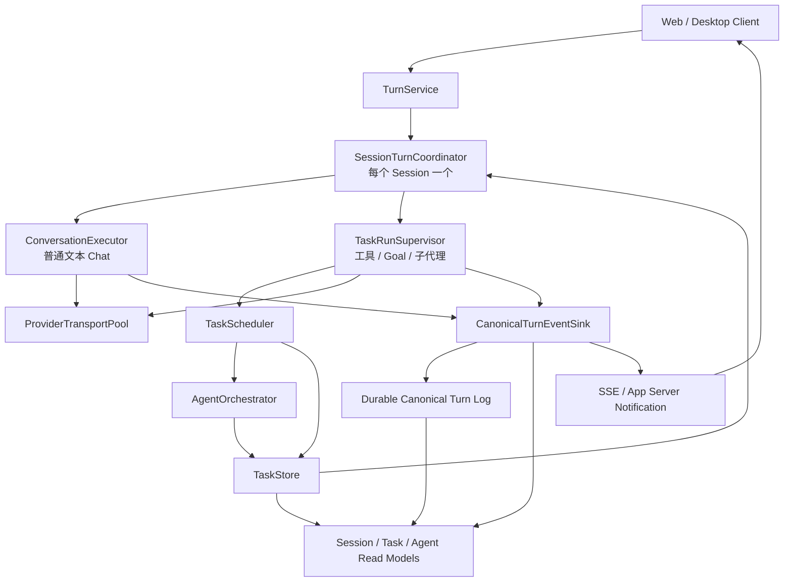

# Magi 消息响应核心架构重设计

> 文档类型：产品级架构设计与实现基线  
> 文档状态：已复审，核心路径已实现，待完整验收
> 编写日期：2026-09-14  
> 最近审核：2026-09-15
> 适用范围：主对话消息发送、普通 Chat、工具执行、Goal、子代理、流式响应、任务恢复、Web/Desktop 通知  
> 实现约束：只收敛到本文定义的一套正式架构，不保留旧链路与新链路长期并行，不通过延迟参数、前端假状态或兼容分支掩盖生命周期问题

审核结论：原设计的方向正确，但如果按“完整事件溯源 + 双领域日志 + CQRS 投影 + 跨域 outbox”一次性落地，超出了 Magi 当前本地单进程产品的实际需要，实施风险和工作量都过高。本文已收敛为可在现有代码上真实落地的方案：复用现有 canonical 持久化和 TaskStore，只新增单一 Turn Coordinator、执行 profile、完成通知和必要的序号/幂等字段；不新增远程数据库、消息队列、第二套任务日志或完整 CQRS 平台。

本轮审查后的判断是：方案可以作为实现基线，前提是严格按“一个 Turn 所有者、两种执行 profile、一个 canonical Turn 事实源、TaskStore 只管任务”实施，不把文档中的概念名词扩展成额外基础设施。

## 1. 设计结论

Magi 当前的消息响应问题不是某一个函数慢，而是产品对象和执行对象没有分开：普通对话被包装成任务，任务状态参与主对话终态判断，流式输出直接驱动同步持久化，Session、Task、Conversation、Runner 和前端 Projection 同时持有部分状态。

目标架构必须改成：

```text
Session
  └── Turn
        ├── Conversation Execution（普通文本 Chat）
        └── Task Run（工具、代码、Goal、子代理）

Canonical Turn Log
  ├── Session Read Model
  ├── Conversation History Read Model
  ├── Task Read Model
  ├── Agent Read Model
  └── SSE / App Server Notification
```

核心规则：

1. 每个 Session 只有一个 `SessionTurnCoordinator`，负责当前 Turn 的生命周期、输入队列、取消和终态。
2. 普通 Chat 不创建 TaskStore 根任务；只有确实需要工程执行时才创建 Task Run。
3. 所有 Turn 状态、消息内容和完成通知都经过唯一的 `CanonicalTurnEventSink`，前端和其他模块只消费投影。
4. TaskStore 只管理任务树、租约和任务恢复，不决定主对话 Turn 是否完成。

这套设计保留 Magi 的工程工作能力，同时把普通对话从任务调度、租约、Git 准备和终态观察链中解耦。它解决的是执行模型本身，不是在现有链路上继续增加补丁。

## 2. 产品定位与边界

Magi 是本地优先的 AI 工程工作空间。主对话既可以回答问题，也可以发起工程工作。因此“对话”和“任务”必须在产品体验上统一，在内部执行上分层。

### 2.1 产品对象

| 对象 | 产品含义 | 生命周期所有者 |
|---|---|---|
| Session | 用户看到的会话和消息时间线 | Session Read Model / Coordinator |
| Turn | 用户发起的一轮交互 | SessionTurnCoordinator |
| Task Run | 一轮需要工程执行的运行实例 | TaskRunSupervisor |
| Task | Task Run 中的一个可调度工作节点 | TaskStore / TaskScheduler |
| Agent Role | 子代理的角色、能力、模型绑定和提示配置 | AgentRoleRegistry |
| Turn Event | Turn 的持久事实和实时通知 | CanonicalTurnEventSink / Canonical Turn Log |
| Projection | 从 canonical 记录或 TaskStore 生成的读取模型 | 现有读取模型更新器 |

### 2.2 Turn 执行级别

`Turn` 在创建时必须确定唯一的 `execution_profile`：

```text
conversation
task
```

| Profile | 用途 | 是否创建 Task Run | 是否允许工程工具 |
|---|---|---:|---:|
| `conversation` | 普通问答、解释、文本生成和受限只读能力 | 否 | 仅允许会话级只读能力 |
| `task` | 文件、代码、Git、Goal、计划、工具、子代理 | 是 | 是 |

普通 Chat 不因为内部需要记录历史，就伪造一个 `LocalAgent` 任务。`conversation` profile 可以使用不创建 Task Run、不会修改工作区的会话级能力，例如知识检索、图片理解和明确允许的浏览器只读能力；文件写入、Shell、Git、审批、Goal、计划和子代理必须在接纳时进入 `task` profile。

执行 profile 由接纳阶段的结构化分类器决定，分类器必须同时读取用户显式意图、附件/引用、会话能力和当前权限。分类不确定时选择 `task` 并在准备阶段明确展示原因，不能让模型在执行中隐式升级 profile。

Goal 自动推进、Continue、子代理等待和恢复都属于 Task Run 的内部行为；它们不再创建独立的普通 Chat 链路。

### 2.3 Profile 选择规则

| 请求特征 | 接纳 profile | 说明 |
|---|---|---|
| 解释、写作、问答、总结，且不要求工作区动作 | `conversation` | 可使用受限会话级只读能力 |
| 明确要求读取工作区文件、执行命令、修改代码或 Git 操作 | `task` | 必须建立 Task Run 和相应安全上下文 |
| 明确要求 Goal、计划、并行验证或子代理 | `task` | 协作和计划是 Task Run 能力 |
| 附件或浏览器引用本身只需要解析/理解 | `conversation` | 不因存在引用自动创建 Task Run |
| 同时包含回答和工作区修改 | `task` | 由同一个 Task Run 生成回答和执行记录 |
| 分类器无法确定是否需要工程动作 | `task` | 在 `preparing` 阶段向用户说明选择，不运行时升级 |

Profile 选择结果必须写入 Turn accepted 事件，后续执行器只能读取该结果。任何模块都不能根据后续模型文本重新分类并切换 profile。

### 2.4 产品体验原则

- 用户只面对一套主对话和统一消息时间线。
- 内部执行 profile 不要求用户理解 TaskStore、lease、Runner 或 canonical event。
- “已接纳”“准备中”“运行中”“等待用户”“受阻”“失败”“完成”必须有稳定、可解释的产品语义。
- 子代理状态是主 Turn 的执行详情，不是另一套主对话状态。
- 普通 Chat 与工程任务共享同一套 Turn ID、事件协议、取消、恢复和前端 reducer。

## 3. 当前架构问题与根因

### 3.1 普通 Chat 被任务化

当前主线入口 [sessions.rs](/Users/xie/code/magi-rust-rewrite/crates/magi-api/src/routes/sessions.rs:2461) 仍把 Chat/Execute 统一交给任务派发。即使 `use_tools=false`，主线仍然会创建 TaskStore 记录、执行链和 Runner；只是不执行部分 workspace 准备。

在 [dispatch_submission.rs](/Users/xie/code/magi-rust-rewrite/crates/magi-conversation-runtime/src/dispatch_submission.rs:685) 中，主线任务固定使用 `TaskKind::LocalAgent`。这让普通文本回复暴露在任务租约、Runner 调度、checkpoint 和终态观察的额外失败面中。

### 3.2 一轮 Turn 有多个部分权威

当前一轮交互同时存在于：

- `SessionStore.current_turn`；
- canonical turn；
- TaskStore task status 和 lease；
- ExecutionRegistry；
- SessionTurnCoordinator 的 steer 输入队列；
- ConversationRegistry 的 task Conversation；
- RunnerManager handle；
- terminal observer；
- `ThreadChatMessage` 模型历史。

[registry.rs](/Users/xie/code/magi-rust-rewrite/crates/magi-conversation-runtime/src/registry.rs:19) 现在只为 task/worker 持有 Conversation；普通 Session Turn 由 SessionTurnCoordinator/TurnService 接纳，不再创建 session Conversation。steer 输入队列和工具授权已由 Coordinator 持有，Registry 仅提供窄转发以兼容 Task runtime 的依赖形态。

### 3.3 流式输出绑定同步完整写回

[session_turn_execution.rs](/Users/xie/code/magi-rust-rewrite/crates/magi-conversation-runtime/src/session_turn_execution.rs:2153) 的 Provider delta 回调会直接触发 SessionStore item 写回。canonical 事务在 [sidecar.rs](/Users/xie/code/magi-rust-rewrite/crates/magi-session-store/src/store/sidecar.rs:551) 使用全局提交锁，底层写入还可能执行同步磁盘操作。

因此 Provider 已经有首个 delta 时，UI 仍可能等待 canonical 完整重建和文件同步。一个 Session 的高频输出也可能阻塞其他 Session。

### 3.4 任务完成依赖轮询和二次收口

`EventBasedResultReceiver` 的旧接口曾由 Runner 在下一轮 cycle 轮询任务结果，任务终态之后又要通过 terminal observer 和 session finalizer 收口。

这会造成：

- 固定调度延迟；
- 任务已完成但 Turn 尚未完成；
- 结果已到但 Runner 尚未消费；
- 重启、取消和迟到结果之间出现竞态；
- 同一终态需要多个模块重复判断。

### 3.5 App Server 和 HTTP 业务入口重复

当前 Desktop 的 App Server `turn/start` 会转调 HTTP session turn 路径，见 [app_server.rs](/Users/xie/code/magi-rust-rewrite/crates/magi-api/src/app_server.rs:1943)。这使协议层和业务层互相调用，无法保证 Desktop 和 Web 使用完全一致的接纳语义。

目标是让两种传输适配器都直接调用同一个 `TurnService`。

### 3.6 模型历史存在双写

canonical Turn 与 `ThreadChatMessage` 分别承载界面事实和模型历史。用户消息、assistant 内容和工具结果从不同回调写入两套结构，重启、取消和工具失败时可能产生内容或顺序差异。

目标架构中，模型历史必须是 Canonical Turn Log 的投影，不再拥有独立写入口。

## 4. 唯一目标架构



实现边界：先在现有 crate 内按职责建立模块，不预先拆出新的 crate。建议新增或收敛为以下最小模块：

```text
magi-api/
  turn_service.rs                 # HTTP/App Server 共用接纳入口
  routes/sessions.rs              # 仅做协议适配
magi-conversation-runtime/
  session_turn_coordinator.rs     # 每个 Session 一个单写者
  conversation_executor.rs        # conversation profile
  task_run_supervisor.rs          # task profile
  task_completion_notifier.rs     # TaskStore 提交后通知
  turn_stream_buffer.rs            # 有界增量缓冲
magi-session-store/
  canonical_turn.rs               # 现有 canonical 持久化的序号、幂等和恢复字段
```

只有当现有 crate 的依赖边界无法编译通过时，才拆 crate；拆分本身不代表架构完成。

本方案明确不引入：完整事件溯源平台、独立 Task Domain Log、跨进程消息队列、分布式事务、通用工作流引擎和新的数据库。它们不是解决当前响应延迟与状态归属问题的必要条件。

实际开发时可以先在现有 crate 内收敛模块，再根据依赖关系拆 crate。不能为了目录美观先搬文件，却保留原有职责关系。

## 5. 核心模块职责

### 5.1 `TurnService`

统一的业务接纳入口。HTTP 和 App Server 都调用它。

只负责：

- 解析和基础校验；
- session/workspace 范围校验；
- request ID 幂等；
- 判断 start、steer、continue、cancel 或 queue；
- 向 SessionTurnCoordinator 发送命令；
- 返回 accepted receipt。

禁止等待：

- 模型采样；
- Git 扫描；
- Snapshot 创建；
- 工具定义完整构建；
- 辅助模型压缩；
- Task Run 完成。

### 5.2 `SessionTurnCoordinator`

每个 Session 一个实例，采用 Actor 或单写者模型。它是当前 Turn 的唯一运行时所有者。

它拥有：

- `active_turn`；
- durable queued turns；
- Turn command mailbox；
- 当前 execution attempt 句柄；
- steer/continue 输入队列；
- 取消令牌；
- Turn 终态；
- 下一条 Turn 的启动边界。

它不持有状态锁执行外部 IO。模型、Git、工具和子代理完成后都通过 command 或 event 回到 Coordinator。

Coordinator 的唯一性由 `session_id` 建立，不能同时存在 SessionStore current turn、ConversationRegistry active input 和 Runner handle 三个独立生命周期所有者。

### 5.3 `ConversationExecutor`

处理 `conversation` profile：

- 从 Conversation History Read Model 读取上下文；
- 调用共享 ProviderTransport；
- 产生 assistant item delta；
- 处理取消和 Provider 错误；
- 将最终内容交给 CanonicalTurnEventSink。

它不创建 TaskStore、lease、Runner、Snapshot 或 Git execution context。

### 5.4 `TaskRunSupervisor`

处理 `task` profile：

- 创建 Task Run 和 root task；
- 执行 Snapshot、Git、权限、上下文和工具准备；
- 将任务提交给 TaskScheduler；
- 接收 Task/Agent 完成事件；
- 将 Task Run 的阶段结果反馈给 Coordinator。

它不能直接关闭 Turn。Turn 终态由 Coordinator 统一产生。

### 5.5 `TaskStore` 与 `TaskScheduler`

TaskStore 只保存任务树、租约、状态、checkpoint 和恢复数据。TaskScheduler 负责资源调度和 Worker 分配。

任务状态回调必须在 TaskStore 事务提交完成后异步发布，禁止在 task mutation 临界区内直接执行 SessionStore 写入、磁盘同步或跨模块回调。

### 5.6 `CanonicalTurnEventSink`

所有 Turn 事实经过唯一的 Turn Event Sink；Task 状态先提交 TaskStore，再由 TaskCompletionNotifier 通知 Coordinator。TaskStore 不直接写 Session Projection，Coordinator 也不通过扫描 TaskStore 推断 Turn 终态：

```text
TurnCommand / ProviderDelta
  -> CanonicalTurnEventSink
  -> Canonical Turn Log
  -> Read Model Projection
  -> SSE / App Server Notification

TaskStore
  -> TaskCompletionNotifier
  -> SessionTurnCoordinator
  -> CanonicalTurnEventSink（只记录 Turn 侧关联事实）
```

职责：

- 校验事件顺序和状态转移；
- 分配 Session 内连续事件序号；
- 合并流式内容；
- 发布实时事件；
- 按策略批量持久化；
- 在终态时持久化完整快照；
- 触发 Session、Conversation 以及 Turn 侧任务引用投影更新；Task 和 Agent 的完整状态由 TaskStore 驱动。

Turn Event Sink 只负责 Turn 事实及其投影；Task Projection 的任务字段以 TaskStore 提交结果为准，Turn Projection 中只保存与本 Turn 相关的任务引用、阶段和聚合状态。跨域事件必须带 `causation_id`，避免同一 Task 终态被重复转换为多个 Turn 终态。

### 5.7 Provider Client 共享层

复用现有 Provider client 和 Tokio runtime，按进程共享 HTTP 连接池；每轮只创建请求级 stream 和取消句柄。该层负责请求、流式读取、超时、取消和错误归一化，不负责 Turn 状态和持久化。除非现有实现确实重复创建 client 或 runtime，否则不另起一个传输运行时项目。

## 6. 领域数据模型

以下是目标模型的最小字段集合。具体 Rust 类型可以按现有 `magi-core` ID 类型实现，但字段语义必须保持一致。

```text
TurnRecord {
    turn_id: TurnId,
    session_id: SessionId,
    turn_seq: u64,
    request_id: String,
    request_fingerprint: String,
    execution_profile: Conversation | Task,
    status: Accepted | Preparing | Running | Streaming |
            WaitingInput | Blocked | Finalizing | Completed |
            Failed | Cancelled,
    execution_phase: Ready | Queued | Preparing | Executing |
                     Waiting | Finalizing | Terminal,
    execution_attempt_id: Option<ExecutionAttemptId>,
    task_run_id: Option<TaskRunId>,
    root_task_id: Option<TaskId>,
    user_item_id: ItemId,
    active_item_ids: Vec<ItemId>,
    accepted_at: UtcMillis,
    completed_at: Option<UtcMillis>,
    failure: Option<TurnFailure>,
}
```

```text
TaskRunRecord {
    task_run_id: TaskRunId,
    turn_id: TurnId,
    root_task_id: TaskId,
    status: Queued | Preparing | Running | Waiting | Blocked |
            Completed | Failed | Cancelled,
    execution_snapshot_id: String,
}
```

```text
TurnEventEnvelope {
    schema_version: String,
    event_id: EventId,
    session_id: SessionId,
    turn_id: TurnId,
    event_seq: u64,
    turn_seq: u64,
    event_kind: TurnEventKind,
    occurred_at: UtcMillis,
    causation_id: Option<String>,
    correlation_id: String,
    payload: JsonValue,
}
```

### 6.1 不可违反的模型约束

1. 同一 `session_id` 内 `event_seq` 单调递增且不重复。
2. 同一 `turn_id` 只能有一个终态事件。
3. 终态事件之后不能出现该 Turn 的 delta、task 或 phase 事件。
4. `task_run_id` 和 `root_task_id` 只在 `execution_profile=task` 时存在。
5. `request_id` 相同且 fingerprint 相同必须返回原 Turn receipt。
6. `request_id` 相同但 fingerprint 不同必须返回幂等冲突，不得创建第二个 Turn。
7. `ThreadChatMessage` 是事件投影，不能作为独立事实源写入。
8. execution attempt 必须绑定不可变的 context snapshot，迟到结果只能关联原 attempt。
9. Task 终态不能直接覆盖 Turn 终态。
10. Coordinator 不得根据多个投影表反推事实；投影只能由事件重建。

## 7. Turn 状态机和命令语义

### 7.1 状态转移

```text
accepted
  -> preparing
  -> running
  -> streaming
  -> waiting_input
  -> finalizing
  -> completed

preparing/running/streaming/waiting_input
  -> blocked
  -> failed
  -> cancelled

blocked -> preparing | waiting_input | failed | cancelled
```

`waiting_input` 和 `blocked` 的边界必须固定：`waiting_input` 表示模型或任务已经正常到达可继续的交互点，用户输入会继续当前 Turn；`blocked` 表示权限、Git、资源、Provider 状态不确定或持久化错误等外部条件阻止执行，必须先完成解除阻塞动作。二者都不能由前端自行推导。

`execution_phase` 是执行进度，`status` 是 Turn 生命周期。它们可以组合但不能互相替代，例如 `status=accepted, execution_phase=queued` 表示提交已可靠接纳但尚未获得执行资源；`status=blocked, execution_phase=waiting` 表示 Turn 仍存在且等待外部处理。

状态含义：

| 状态 | 语义 |
|---|---|
| `accepted` | 已通过基础校验并可靠持久化，可以在重启后恢复 |
| `preparing` | 正在准备执行所需上下文、Git、Snapshot、工具或 Task Run |
| `running` | 执行器已启动，尚未产生可见模型内容 |
| `streaming` | 已收到至少一个可见模型 delta |
| `waiting_input` | 等待用户 steer、continue 或恢复输入 |
| `blocked` | 等待权限、Git 冲突、资源或其他外部处理 |
| `finalizing` | 正在写入最终 item、使用量和终态事件 |
| `completed` | 当前 Turn 完整结束 |
| `failed` | 无法继续的执行失败 |
| `cancelled` | 用户或系统取消 |

队列不再使用模糊的 Turn 状态表示。请求只要持久化成功就是 `accepted`，是否等待资源由 `execution_phase=queued` 和 queue projection 表达。

### 7.2 命令定义

```text
StartTurn { request, execution_profile }
SteerTurn { turn_id, input }
ContinueTurn { turn_id, input }
CancelTurn { turn_id, reason }
RecoverTurn { turn_id }
ProviderDelta { attempt_id, item_id, delta }
ProviderCompleted { attempt_id, usage }
ProviderFailed { attempt_id, failure }
TaskEvent { task_id, task_event }
ExecutionFinished { turn_id, result }
```

命令规则：

- 空闲 Session 收到 `StartTurn`，创建新的 Turn；
- active Turn 收到显式 steer，输入进入当前 Turn mailbox；
- active Turn 收到普通新消息，创建新的 durable queued Turn；
- blocked Turn 收到 continue，恢复同一个 Turn 的新 execution attempt；
- 已完成 Turn 不能接收迟到 steer；
- Cancel 只由 Coordinator 产生最终取消事件，外部 API 不直接改写 Turn 状态；
- 所有 execution 回调都必须带 attempt ID，过期 attempt 的迟到结果被明确拒绝。
- Coordinator 发送外部执行命令后必须保存 attempt 状态；如果命令发送成功但进程在回执前退出，恢复逻辑按“状态不确定”处理，不能把缺少回执当成失败或成功。

## 8. 消息执行时序

### 8.1 普通 Chat

```text
Client
  -> TurnService.start
  -> SessionTurnCoordinator.admit
  -> CanonicalTurnEventSink.append(turn.accepted + user item)
  -> 返回 accepted receipt
  -> 后台 ConversationExecutor
  -> ContextService 获取冻结上下文
  -> ProviderTransportPool 发起流式请求
  -> CanonicalTurnEventSink 发布 assistant item delta
  -> ProviderCompleted
  -> CanonicalTurnEventSink 持久化完整内容
  -> Coordinator 产生 turn.completed
  -> 客户端收到 completed notification
```

HTTP 返回 accepted 时不得等待 Provider、模型上下文压缩或正文生成。

### 8.2 Task、Goal 与子代理

```text
Client
  -> TurnService.start
  -> Coordinator 写入 accepted
  -> TaskRunSupervisor 创建 Task Run
  -> preparing：权限 / Snapshot / Git / context / tool catalog
  -> TaskScheduler 创建并调度 root task
  -> AgentOrchestrator 按需创建 child task
  -> TaskCompletionNotifier 回到 Coordinator
  -> Provider / Tool / Agent 事件进入 CanonicalTurnEventSink
  -> Task Run 完成或阻塞
  -> Coordinator 生成最终响应
  -> CanonicalTurnEventSink 产生 turn.completed / blocked / failed
```

子代理不是独立的普通对话，也不创建第二套消息协议。子代理 item 通过 `turn_id + task_id + worker_id + role_id` 关联到主 Turn。

### 8.3 Steer

```text
Client -> TurnService.steer(expected_turn_id)
       -> Coordinator 校验 active turn
       -> 持久化 user steer item
       -> 写入 active attempt mailbox
       -> 当前模型/工具边界读取 steer
       -> 继续同一 Turn
```

steer 接纳和 user item 持久化必须在同一 Coordinator 命令中完成，避免输入已显示但执行器未收到，或执行器收到但历史未保存。

## 9. 事件协议

### 9.1 事件类型

```text
turn.accepted
turn.phase_changed
turn.item_started
turn.item_delta
turn.item_completed
task.created
task.queued
task.running
task.blocked
task.completed
task.failed
turn.completed
turn.failed
turn.cancelled
```

事件列表中的 `task.*` 由 TaskStore 产生，`turn.*` 由 CanonicalTurnEventSink 产生；两者通过 `turn_id` 和 `causation_id` 关联，客户端可以统一订阅但不能混用事实源。

### 9.2 `turn.item_delta`

```json
{
  "eventKind": "turn.item_delta",
  "sessionId": "session-1",
  "turnId": "turn-1",
  "eventSeq": 18,
  "itemId": "item-assistant-1",
  "itemVersion": 7,
  "baseContentLength": 128,
  "contentLength": 152,
  "delta": "新增内容"
}
```

前端按照 `itemId + itemVersion + baseContentLength` 应用增量。版本不连续或 base length 不匹配时，客户端请求当前 Turn 快照，不自行拼接猜测内容。

长度单位必须在协议中固定为 Unicode scalar count 或 UTF-8 byte length，并由 Rust 与 TypeScript 共用契约测试；不能让 Rust `chars().count()` 与 JavaScript UTF-16 length 混用。

### 9.3 终态事件

`turn.completed`、`turn.failed` 和 `turn.cancelled` 必须携带：

```text
turn_id
final_status
completed_at
final_item_snapshot
usage（可选）
failure（失败时）
execution_attempt_id
```

终态事件写盘成功后才向外发布完成通知。正常路径不需要 terminal observer 再次收口。

### 9.4 错误合同

执行失败和阻塞统一使用：

```text
TurnFailure {
    phase: Admission | Preparation | Context | Provider |
           Tool | Agent | Git | Persistence | Recovery,
    error_code: String,
    retryable: bool,
    user_action: Option<String>,
    public_message: String,
}
```

API Key、完整 Provider URL、堆栈和内部路径只进入受控日志，不进入用户可见事件。

### 9.5 事件 Schema 演进

事件 `schema_version` 必须采用显式主版本和次版本。读取端可以兼容同一主版本内的新增可选字段；遇到不支持的主版本时必须停止该 Session 的重放并报告需要升级，不能按“尽量读取”继续运行。事件 payload 中禁止复用字段表达不同语义，字段废弃后保留迁移器，直到所有受支持版本完成转换。

Canonical Turn Log、Web 类型和 App Server Schema 必须共享现有 canonical 事件契约；TaskStore 使用独立的任务状态契约。优先通过合同测试保持一致，不为本方案引入新的代码生成系统。任何破坏性字段变更都必须同时更新迁移说明、恢复测试和断线测试。

## 10. 持久化、流式写回与恢复

### 10.1 事实和投影

Canonical Turn Log 是 Turn 的持久事实源；TaskStore 是 Task 的持久状态源。两者通过 `turn_id`、`task_run_id` 和 `causation_id` 关联。Session 和 Conversation History 从 Canonical Turn Log 更新，Task Center 和 Agent Center 从 TaskStore 更新；不新增第二套任务日志。

```text
Canonical Turn Log
  -> Session Projection
  -> Conversation History Projection

TaskStore
  -> Task Projection
  -> Agent Run Projection

AgentRoleRegistry
  -> Agent Role Configuration Read Model
```

读取模型可以使用现有 SessionStore 和 TaskStore 的数据结构，但必须明确 SessionStore 中的 Turn 数据来自 Canonical Turn Log，TaskStore 中的任务数据来自 TaskStore 自身提交结果，角色配置来自 AgentRoleRegistry。Agent Center 展示的是 Agent Role 配置与 Agent Run 状态的组合读取模型，不能把二者重新合并成一份可变事实。任何读取模型都不能独立生成互相冲突的 Turn 事实。

### 10.2 增量持久化策略

- accepted、phase 边界和终态必须可靠写入；
- 普通 delta 先进入 `TurnStreamBuffer` 和事件发送队列；
- 事件日志 writer 按短周期或字节阈值批量写入；
- 批量写入使用 Session/分区级 writer，移除跨 Session 的全局 canonical 锁；
- 终态强制 flush，并保存完整最终 item；
- 事件发送和磁盘 flush 不能阻塞 Provider delta 消费；
- EventBus 只负责实时传输，不能作为恢复依据。

如果实时事件队列满，只允许合并同一 item 的连续 delta；不得丢失 phase、task 状态和终态事件。Provider 消费速度不能被无限制的内存队列掩盖：当合并后仍然达到上限时，Coordinator 暂停该 attempt 的 delta 消费或取消执行，并发布明确的背压/失败事件。客户端发现 event sequence 缺口时，必须通过快照和事件尾部恢复。

### 10.3 持久级别

| 事件 | 持久要求 | 对外发布条件 |
|---|---|---|
| turn accepted | 同步 durable，事件与幂等记录同一提交 | 持久化成功后 |
| phase changed | durable，可合并无语义变化的重复阶段 | 顺序分配完成后 |
| item delta | 批量持久化 | 可先实时发布 |
| item completed | durable，包含完整 item | 持久化成功后 |
| task terminal | TaskStore durable | TaskStore 提交成功后唤醒 Coordinator |
| turn terminal | 同步 durable + 完整最终快照 | Turn 事件提交成功后 |

### 10.4 提交一致性和恢复

Canonical Turn Log 复用现有 SessionStore 的 canonical 持久化能力，只补齐以下字段：`event_seq`、`item_version`、`request_id`、`request_fingerprint`、`execution_attempt_id` 和投影 checkpoint。不要为了“事件溯源”再创建一套独立日志格式。

提交顺序固定为：

```text
Coordinator 校验状态和幂等
  -> 写入 Turn canonical 记录（accepted/phase/terminal 必须 durable）
  -> 更新对应读取模型 checkpoint
  -> 提交完成后发布 EventBus / SSE / WebSocket
```

普通 delta 进入有界 `TurnStreamBuffer`，按短周期或字节阈值合并写回；终态必须 flush 并保存完整 item。EventBus 只负责实时传输，断线恢复读取 canonical 记录和终态快照。事件重复写入按 `event_id` 或 `(turn_id, item_id, item_version)` 去重，序号不连续时从当前 Turn 快照重新同步。

### 10.5 Turn 与 Task 的关联

Magi 当前是本地单进程 daemon，Turn Coordinator、TaskStore 和通知器在同一进程内运行，不引入跨服务事务和独立 outbox。TaskStore 的状态变更先完成 durable checkpoint，再通过 `TaskCompletionNotifier` 唤醒对应 Coordinator；通知丢失时，daemon 重启只恢复仍处于活动状态且明确关联了 `turn_id` 的 Task Run，不扫描全库猜测 Turn 状态。

如果未来拆成多进程或远程 Worker，再单独设计 outbox；本次重构不预埋 outbox 表、消息队列或分布式一致性协议。

### 10.6 现有数据迁移

采用一次受控的版本迁移，不重新构建全部历史事件：

1. 为已有 canonical turn 补齐 `event_seq`、幂等字段和 `execution_profile`；无法确定的历史值按只读历史处理。
2. 活动 Turn 只恢复为 `preparing` 或 `blocked`（reason=`recovery_required`），不得直接标记完成。
3. 已完成 Task 保留原 Task ID；能解析 `turn_id` 的建立关联，无法解析的保留在任务历史中。
4. 迁移先写临时文件并校验，再原子替换版本索引；失败保留原数据。
5. 新运行时切换后不再写旧 sidecar 的活动 Turn 字段。

迁移脚本必须可重复执行，并校验终态唯一性、序号连续性和 Turn/Task 关联。历史消息无需为了新架构全部重放。

### 10.7 daemon 重启

启动时：

1. 读取 canonical turn 记录和 TaskStore checkpoint；
2. 重建 Session Coordinator；
3. 对未完成 Turn 检查当前 execution attempt；
4. 未发出 Provider 请求的 Turn 继续 preparation；状态不确定的 Turn 进入 `blocked`（reason=`recovery_required`），等待明确恢复命令；
5. 关联 Task Run 由 TaskStore 恢复，完成通知重新注册；
6. Coordinator 只依据自己的 Turn 记录和明确关联的 Task 状态产生继续、失败或等待用户事件。

恢复不通过多个投影表互相覆盖，也不自动重复可能已经发送到 Provider 的请求。

## 11. 模型上下文和历史一致性

模型上下文只允许来自 Conversation History Projection：

```text
Canonical Turn Log
  -> Conversation History Projection
  -> ContextService
  -> Provider Request
```

`ThreadChatMessage` 可以继续作为历史读取模型，但不能在 Provider 回调、工具回调和 SessionStore 路径中分别写入。

每次执行在开始时绑定一个 `context_snapshot_id`。该快照包含：

- 会话历史版本；
- 模型身份和配置 revision；
- 工具目录 revision；
- 技能和 MCP revision；
- 知识上下文 revision；
- 权限和 Git context revision。

模型切换、工具变化、权限变化、知识变化或历史变化时，旧快照不能继续用于新的 execution attempt。

## 12. 子代理和角色配置

子代理只属于 Task Run。`AgentOrchestrator` 必须使用现有角色注册表，不为用户角色建立第二套注册或执行逻辑。

创建 child task 的正式顺序：

```text
解析请求
  -> 角色存在且可派发
  -> 能力属于角色允许集合
  -> 模型绑定可用
  -> 当前父 Task 和 Task Run 有效
  -> 容量和资源检查
  -> Git / workspace 前置检查
  -> 固化角色配置快照
  -> 原子创建 child task
  -> 发布 task.created
```

预检失败时不得创建 Task、lease、Thread 或 SpawnGraph 边。角色配置在 child task 创建时固化快照，后续用户修改角色不会改变正在运行的任务。

子代理完成后由 `TaskCompletionNotifier` 通知父 Coordinator。`agent_wait` 等待明确的 child task 状态，不再通过 Runner 的周期轮询发现结果。

子代理状态合同继续使用：

```text
queued
running
blocked
completed
failed
cancelled
rejected（创建前拒绝，不产生 child task）
```

## 13. API 与 Desktop/Web 传输

### 13.1 统一业务入口

```text
HTTP POST /api/session/turn
App Server turn/start
        ↓
     TurnService
```

App Server 不得再通过 HTTP 调用 session 路由。两个适配器可以有不同的序列化形式，但不得有不同的接纳、幂等和状态判断。

### 13.2 `turn/start` 返回合同

```json
{
  "accepted": true,
  "status": "accepted",
  "turnId": "turn-1",
  "requestId": "request-1",
  "executionProfile": "conversation",
  "eventSequence": 42,
  "queue": null,
  "canonicalTurn": {}
}
```

Task profile 只增加 `taskRunId` 和 `rootTaskId`，不改变 accepted 语义。

`accepted` 表示请求已可靠接纳，不表示 Provider 已开始，也不表示任务已经成功。

### 13.3 通知与重连

Desktop 在同一条 App Server 长连接上接收：

- turn accepted；
- phase changed；
- item delta；
- task/agent 状态；
- turn completed/failed/cancelled。

Web 可以继续使用 SSE，但通过 `afterSequence` 重放事件。事件订阅晚于发送也不能造成数据丢失，因为事件已经进入持久日志。

## 14. 前端产品行为

前端只消费 Turn Projection 和 Turn Event：

- accepted：立即显示用户消息和“准备中”状态；
- preparing：显示具体准备阶段；
- streaming：增量更新当前 item；
- blocked：显示阻塞原因和可执行动作；
- failed：显示失败阶段和是否可以重试；
- completed：以终态事件为唯一完成依据。

前端禁止：

- 根据 child task 是否存在猜测 Turn 状态；
- 通过定时器轮询判断完成；
- 在 canonical event 缺失时自行创建错误消息；
- 为原始模式和摘要模式维护两套消息事实；
- 用 bootstrap 刷新代替正常完成事件；
- 用 loading 动画掩盖接纳或首 delta 延迟。

摘要模式、原始模式、主线消息和子代理详情都从同一 Projection 读取，只在呈现层决定折叠和布局。

## 15. 取消、失败和恢复语义

### 15.1 取消

取消由 Coordinator 发起，并传播到：

```text
Coordinator
  -> ModelTransport cancellation
  -> TaskScheduler cancellation
  -> Tool process cancellation
  -> Browser/Git resource release
```

取消成功后由 Coordinator 产生唯一 `turn.cancelled`。外部中断 API 不直接修改多个 store。

### 15.2 接纳失败与执行失败

- 接纳失败：没有创建 Turn，API 返回错误。
- 执行失败：Turn 已经存在，沿原 Turn 发布 `turn.failed`。
- 阻塞：Turn 仍存在，发布 `blocked` 和明确用户动作。
- Provider 状态不确定：进入 `blocked`（reason=`recovery_required`），禁止自动重复请求。
- 任务失败：先产生 task failure，再由 Coordinator 决定主 Turn 是改派、主线接管、blocked 还是 failed。

### 15.3 迟到结果

所有 Provider、Tool 和 Task 回调必须携带 `execution_attempt_id`。Coordinator 只接受当前 attempt 的事件。迟到结果可记录到审计日志，但不得修改当前 Turn、下一轮 Turn 或前端可见消息。

## 16. 必须删除的旧职责

| 当前职责 | 目标处理方式 |
|---|---|
| 普通 Chat 创建 LocalAgent 根任务 | 删除，改为 ConversationExecutor |
| Runner 决定主 Turn 完成 | 删除，Coordinator 决定 |
| terminal observer 二次收口 | 删除，终态直接从 Coordinator 产生 |
| EventBasedResultReceiver 轮询结果 | 改为 TaskCompletionNotifier |
| ConversationRegistry 同时维护 session/task Conversation | 已收敛为 task Conversation；session Turn 和 steer 队列由 Coordinator/TurnService 负责 |
| 每个 delta 完整 canonical upsert | 改为 TurnStreamBuffer + CanonicalTurnEventSink |
| 全局 canonical commit lock | 改为 Session/分区级 writer |
| TaskStore 回调中直接写 SessionStore | 改为提交后异步事件 |
| App Server 调用 HTTP 路由 | 改为共享 TurnService |
| ThreadChatMessage 独立写入 | 改为事件日志投影 |
| bootstrap 参与正常终态发现 | 删除，bootstrap 只用于初始化和恢复 |

这部分必须做真正的职责迁移，并删除旧实现。不能长期保留“旧 TaskRunner 路径 + 新 Chat 路径”的双轨兼容模式，也不能在新路径失败时回退到旧路径。

## 17. 实现顺序

以下记录反映 2026-09-15 工作区的真实状态。`[x]` 只表示对应退出条件已有代码和自动化验证；未完成项保持 `[ ]`，不得以兼容路径代替。

### 17.1 领域合同

- [x] 建立独立的 `TurnRecord`、`TaskRunRecord`、`TurnEventEnvelope` 类型，并由 canonical restore、Task completion notification 和 Turn sink 使用。
- [x] 固定 Coordinator、canonical Turn 和 TaskStore 的状态迁移合同。
- [x] 固定 request ID + fingerprint 幂等规则。
- [x] 固定事件序号、execution attempt 和终态冲突规则。
- [x] 更新 App Server Schema 和 Web 类型生成源。

本阶段已改文件：`crates/magi-conversation-runtime/src/turn_contract.rs`、`crates/magi-conversation-runtime/src/session_turn_coordinator.rs`、`crates/magi-api/src/dto/session_turn.rs`、`contracts/app-server/app-server.schema.json`、`crates/magi-app-server-protocol/src/generated.rs`、`web/src/shared/app-server-protocol.generated.ts`。验证命令：`cargo test -p magi-conversation-runtime --lib session_turn_coordinator`、`cargo test -p magi-conversation-runtime --lib turn_contract`、`npm run protocol:check`。结果：正式记录类型可从 canonical Turn 恢复稳定身份，Coordinator command 具备 Start/SetStatus/Steer/Continue/Cancel/Recover/Finish/Abort 分支，协议生成检查通过。

### 17.2 事件事实源

- [x] 扩展现有 canonical 持久化，补齐 Turn 序号、幂等、profile、attempt、item version 和恢复字段。
- [x] 建立唯一的 `CanonicalTurnEventSink` 结构；Turn 接纳、替换、继续、取消、中断和根任务完成合同，以及写入、状态和事件发布均收敛到 `CanonicalTurnEventSink` API，生产 Conversation、Task finalizer、steer、continue、App Server browser tool 和 dispatch 状态写回均通过该边界。
- [x] Session/Conversation 与 Task/Agent 读取模型按单向事实源更新；`ThreadChatMessage` 只由 canonical projection 重建。
- [x] accepted 和终态事实可在 daemon 启动时恢复。
- [x] 建立覆盖真实 SSE/WebSocket 载体的 Turn 快照断线恢复 harness；`MagiTurnHarness` 通过真实 daemon router body 和 App Server WebSocket 完成断线、重连、订阅和 canonical snapshot 重放。

本阶段已改文件：`crates/magi-session-store/src/store/mod.rs`、`crates/magi-session-store/src/store/sidecar.rs`、`crates/magi-conversation-runtime/src/session_writeback.rs`、`crates/magi-conversation-runtime/src/session_turn_finalize.rs`、`crates/magi-conversation-runtime/src/turn_contract.rs`、`crates/magi-conversation-runtime/src/task_completion_notifier.rs`、`crates/magi-conversation-runtime/src/dispatch_submission.rs`、`crates/magi-api/src/state.rs`、`crates/magi-api/src/routes/sessions.rs`、`crates/magi-api/src/routes/goals.rs`、`crates/magi-api/src/routes/dispatch_flow.rs`、`crates/magi-api/src/session_continue.rs`、`crates/magi-api/src/app_server.rs`、`crates/magi-daemon/src/daemon/runtime.rs`、`crates/magi-daemon/src/daemon/browser_host.rs`、`crates/magi-daemon/src/daemon/tests.rs`、`crates/magi-api/src/turn_harness.rs`。验证命令：`cargo test --workspace --all-targets`、`cargo test -p magi-conversation-runtime --lib`、`cargo test -p magi-api --lib turn_harness`。结果：Rust workspace 测试通过；canonical projection 可从持久化 Turn 恢复 Coordinator 身份，生产写回先经 `CanonicalTurnEventSink` 再发布事件；`MagiTurnHarness` 已通过真实 `TurnService` 验证普通 Chat 流式 delta、canonical projection、无 TaskStore root task、真实 SSE/WebSocket 载体断线重连、EventBus 快照重放、Provider 空流/失败/超时/首帧前重试、Task profile 主链、Task 工具、单个和多个子代理、Goal profile 的 Task 失败收口、取消、资源排队及队列 requestId/fingerprint 幂等、request replay、fingerprint conflict 和重启后 replay，并新增 workspace Git branch 漂移和未解决 merge conflict 在 Provider 调用前失败收口的真实 harness；`upsert_active_execution_chain` 仅在 canonical 明确领先时修复迟到 sidecar，保留合法写回及 canonical writer 错误传播；Task preparation 失败在缺少 orchestrator thread 时仍可写入终态错误；Task 结果接收器在 Sink panic 和回调内替换 Sink 时仍恢复 pending 结果并保持后续通知可接管。剩余工作是清理仅用于测试夹具的直接 SessionStore 写入，并补齐权限阻塞和 Electron DOM 全矩阵。

### 17.3 Coordinator

- [x] 每个 Session 建立唯一 `SessionTurnCoordinator`。
- [x] 将 start、steer、continue、cancel、recover 完全统一为 Coordinator command；生产 start、Steer、Continue、Recover、Cancel、Abort、Finish 以及 preparing/running 状态均通过携带并校验同一 `TurnAttempt` 的 command 入口，canonical restore 和断线恢复也复用 Recover command；Coordinator 内部的 mutation helper 已收为私有，仅由 command 分发。
- [ ] 删除所有外部模块直接修改 current Turn 的路径。生产用户中断已统一经 `CanonicalTurnEventSink::interrupt_turn_by_user` 写入并保留 `interruptionSource=user`，生产会话关闭、Goal pause、daemon restart 和接受失败也经 sink 收口；剩余直接写入仅限测试 fixture 和 sink 内部。当前进一步统一了 canonical 恢复与 `TurnRecord` 投影的身份读取及历史 profile 推断，避免恢复状态与事件投影分叉；测试夹具写入仍待清理。
- [x] 实现 attempt ID 校验、迟到结果拒绝和终态冲突。
- [x] Continue 在接纳新 Turn 前收口旧 attempt，并在新 Turn 上注册 Task attempt。

本阶段已改文件：`crates/magi-conversation-runtime/src/session_turn_coordinator.rs`、`crates/magi-conversation-runtime/src/turn_contract.rs`、`crates/magi-api/src/routes/sessions.rs`、`crates/magi-api/src/routes/dispatch_flow.rs`、`crates/magi-api/src/session_continue.rs`、`crates/magi-api/src/routes/goals.rs`、`crates/magi-api/src/task_turn_finalize.rs`、`crates/magi-conversation-runtime/src/session_writeback.rs`。验证命令：`cargo test -p magi-conversation-runtime --lib session_turn_coordinator`、`cargo test -p magi-api --lib`、`cargo test -p magi-daemon --lib`。结果：生产 start、preparing/running、steer、continue、recover、finish、cancel 和 abort 均走 `TurnCommand`；状态命令携带并校验 `TurnAttempt`，用户中断的 canonical 写回经 `CanonicalTurnEventSink` 保留来源 metadata，并发/迟到/恢复后队列推进测试通过。Coordinator 的 accept/set_status/finish/abort 仅保留为 command 内部私有实现，跨 crate fixture 也通过 `TurnCommand::Start` 接纳。剩余工作是清理测试 fixture 中直接构造 canonical Turn 的兼容写入口。

2026-09-18 的源码审计逐一核对了 `upsert_current_turn`、`update_current_turn_status_for_turn`、`cancel_current_turn`、`interrupt_current_turn_by_user`、`interrupt_current_turn_by_daemon_restart`、`append_current_turn_item_for_turn` 和 `accept_current_turn_with_timeline_entry` 的调用位置。`magi-conversation-runtime/src/session_writeback.rs` 中的调用属于 `CanonicalTurnEventSink` 实现，`magi-session-store/src/store/sidecar.rs` 中的调用属于 canonical mutation 定义；`magi-session-store/src/store/tests.rs`、daemon persistence/runtime tests、routes tests、App Server tests、Conversation/Task execution tests 和 harness 均位于 `#[cfg(test)]` fixture 边界。生产 daemon 启动收敛、Browser Host 断线、会话关闭、Goal pause、用户中断、Continue 和 Task finalizer 的对应路径均调用 sink。`upsert_active_execution_chain` 属于 execution-chain sidecar/recovery mutation，不是 current Turn 写入口。此次审计没有发现新的生产绕过路径，因此不删除合法迁移或存储单元测试；17.3 仍保持未完成，原因是测试 fixture 尚未全面迁移到 Coordinator/Sink 构造。

随后将 `routes/messages.rs`、`routes/workspaces.rs`、`routes/goals.rs` 以及 `routes/sessions.rs` 中可迁移的普通 Conversation/排队/查看/中断测试夹具统一改为共享的 `#[cfg(test)]` Coordinator + `CanonicalTurnEventSink` 构造器；`dispatch_submission` 的中断恢复夹具也改为显式 Start/SetStatus + sink 中断，保留 Task checkpoint 和独占 Thread 语义。随后又将 Browser Host 断线、daemon recovery route、session turn cancellation mock 和 dispatcher model configuration failure fixture 收敛到对应的 Coordinator/Sink 写回边界。需要完整 Task execution chain、旧 thread projection、daemon restart recovery 或持久化重建的其他夹具仍保留在各自的迁移/恢复测试边界内。新增 fixture 不改变生产代码路径，相关定向测试与 workspace 全量 Rust 测试均通过。17.3 和 17.7 仍未完成，剩余直接写入主要限于尚未迁移的复杂执行/恢复夹具、存储 canonical mutation 和 Sink 内部实现。

排队与审批测试 harness 也已改为先用 Coordinator 接纳、再由 `CanonicalTurnEventSink` 写入 running Turn；审批等待辅助函数同时等待 pending 状态和 `tool.approval.requested` 事件，避免异步事件发布窗口导致偶发误报。该修复只改变测试同步边界，不改变生产审批状态机。

daemon persistence 的 canonical flush fixture 也已改为 Coordinator + Sink 构造，保留其“flush 后可从 durable state 重载 canonical Turn”的持久化断言。

随后将 `conversation_loop` 的共享 Task 测试夹具改为显式 `TurnCommand::Start`、Task execution-chain canonical acceptance、`SetStatus(Preparing/Running)` 和 Sink 状态写回；模型取消测试也改为通过同一 Coordinator 关联的 `CanonicalTurnEventSink` 取消 Turn。该批迁移保持 Task 的主线 thread、任务 execution chain 和取消回调语义，定向 `conversation_loop` 与 cancellation 测试通过。daemon persistence 中用于 stale projection、workspace import 和 event-only recovery 的状态更新也统一经 Sink 的 sidecar 边界，迁移/恢复断言保持不变。

继续将 `session_turn_execution` 中的 vision takeover、steer、plan follow-up 和普通 Turn 隔离夹具改为对应 profile 的 Coordinator + canonical sink 接纳；steer 与 follow-up fixture 复用同一个 registry Coordinator，vision follow-up 使用独立 Turn 的输入边界。相关 session execution 定向测试和 workspace Rust 全量测试通过，仍保留未迁移的上下文恢复、历史投影及存储单元测试边界。

随后又迁移了会话错误、空流/流中断恢复、图片错误、placeholder 和 retry event 测试夹具；进一步将 `conversation_loop` 与 `session_turn_execution` 中剩余可迁移的普通 Task/Conversation Turn 构造统一为对应 profile 的 Coordinator + canonical sink 接纳，保留 Task 的 execution-chain、worker thread、上下文历史和终态时序语义。当前直接 `upsert_current_turn` 已不再出现在这两个执行测试模块中，剩余直接写入主要位于从预构造 `SessionStoreState` 读取历史/上下文的测试、context-compaction 与最终 item 时序等局部读写断言，以及 SessionStore/Goal 单元测试和 legacy projection/recovery fixture，未进入生产路径。该批迁移后的 workspace Rust 全量仍通过，17.3/17.7 继续保持未完成。

本轮全仓复查确认，除 `CanonicalTurnEventSink` 内部、SessionStore canonical mutation 与存储单元测试外，current Turn 直接 mutation 仅剩 SessionStore 存储单元测试；旧 thread projection 恢复 fixture 和 App Server canonical replay fixture 已改为通过 `CanonicalTurnEventSink` 接纳 Turn。`conversation_loop` 与 `session_turn_execution` 已无直接 `upsert_current_turn` 调用。Goal 中断行为测试已改为使用 `accept_current_turn_with_timeline_entry` 接纳 Turn，再验证底层 Goal 中断收口；其余需要直接构造持久化 canonical 状态的存储测试仍保留在 SessionStore 测试边界，因此 17.3 继续保持未完成。

2026-09-19 又补充了真实 ReadOnly 外部副作用工具阻断 harness：当任务原文明确点名 `file_write`、`file_copy`、`file_move`、`file_patch`、`apply_patch`、`file_mkdir`、`file_remove`、`image_generate` 或 `git_push`，但 ReadOnly 工具面按访问模式隐藏该工具时，Conversation loop 在 Provider 调用前 fail-closed，Turn/Task 均进入 `Failed`，不产生文件、目录、图像或 Git 副作用、不发布审批请求，也不进入 Provider 重试；错误事实写回 canonical assistant error item。为避免把普通“写入文件”语义误判为必须使用某个被隐藏的工具，缺失工具的前置失败仅适用于任务原文显式包含 canonical 工具名的 required chain；未点名的语义工具链仍由可用工具面自主选择。新增测试 `read_only_profile_rejects_explicit_file_patch_mkdir_and_remove_without_side_effect`、`read_only_profile_rejects_explicit_apply_patch_without_side_effect` 和 `read_only_profile_rejects_explicit_image_and_git_writes` 直接验证这些调用均无 Provider 请求或审批事件，文件/目录 marker 不产生。Restricted 工作区外新增 `apply_patch` 确定性拒绝及无副作用验证。定向测试和 workspace 全量 Rust 测试均通过。

### 17.4 Conversation 与 Task 执行分离

- [x] 普通 Chat 接入独立 Conversation 执行路径。
- [x] 工具、Goal、代码和子代理继续使用 TaskStore、Runner、lease 和执行上下文。
- [x] 普通 Chat 不创建 `LocalAgent` root task、Runner、lease、Snapshot 或 Git execution context。
- [x] TaskStore 只保存 Task profile 的任务树和租约事实。
- [x] execution profile 在 accepted 事实中固化，执行期间不隐式升级。

本阶段已改文件：`crates/magi-api/src/routes/sessions.rs`、`crates/magi-api/src/task_dispatch.rs`、`crates/magi-conversation-runtime/src/session_turn_execution.rs`、`crates/magi-conversation-runtime/src/dispatch_submission.rs`。验证命令：`cargo test -p magi-api --lib routes::sessions::tests`、`cargo test -p magi-daemon --lib`。结果：API 619 项、daemon 127 项测试通过；普通 Chat 的 canonical user item 没有 task 归属。随后 `MagiTurnHarness::real_turn_service_streams_and_projects_without_task` 通过真实 `TurnService` 完成普通 Chat，并直接断言 TaskStore 任务数、Runner、Snapshot session 和 Git execution context 均未创建；harness 的 Conversation 装配也不再实例化 TaskStore、TaskCompletionNotifier 或 RunnerManager。

### 17.5 模型流与任务通知

- [x] 复用进程级 Provider bridge client 和 Tokio runtime。
- [x] Provider delta 接入 `TurnStreamBuffer`，首帧、窗口、reset 和 terminal flush 有测试。
- [x] 增加 `TaskCompletionNotifier`，生产 Worker 结果先 durable 提交 TaskStore，再主动通知 Turn 侧。
- [x] 生产 Task 完成路径不再依赖 Runner 的周期轮询；结果读取仅保留在 `#[cfg(test)]` 测试嵌入辅助中，生产 `TaskRunner` 不再持有结果读取器。
- [x] 结果接收器在主动通知目标安装前缓冲的结果会按原顺序一次性交付；通知回调可重入，结果去重、待通知队列和主动通知由同一状态锁收口；Sink panic 会恢复 pending 和通知状态，回调内替换 Sink 后由新 Sink 继续排空。
- [x] 删除 terminal observer 对 Turn 终态的二次职责。
- [x] 生产 TaskStore 状态 callback 从 mutation guard 中移出，并在提交后异步执行。
- [x] 主动完成通知 Sink 的 panic 边界已收口：回调异常时恢复 pending 结果和通知状态；若回调期间已替换 Sink，则由新 Sink 继续排空队列，避免结果遗留。

本阶段已改文件：`crates/magi-conversation-runtime/src/task_completion_notifier.rs`、`crates/magi-conversation-runtime/src/task_runner.rs`、`crates/magi-conversation-runtime/src/task_runner_bridge.rs`、`crates/magi-conversation-runtime/src/turn_stream_buffer.rs`、`crates/magi-orchestrator/src/task_store.rs`、`crates/magi-daemon/src/daemon/runtime.rs`、`crates/magi-api/src/state.rs`。验证命令：`cargo fmt --all -- --check`、`cargo test -p magi-conversation-runtime --lib task_runner_bridge -- --test-threads=1`、`cargo test --workspace --all-targets --quiet`、`npm run protocol:check`、`npm --prefix web run check`、`npm --prefix web run build`、`npm test`、`npm run desktop:package -- --dir`。结果：TaskStore durable terminal 先经 `TaskCompletionNotifier` 通知，生产 daemon 已移除 `RunnerTerminalObserver`；结果接收器新增安装前缓冲 flush 与通知回调重入顺序测试；magi-conversation-runtime 523 项、magi-api 648 项、magi-daemon 127 项及 workspace 其余测试通过，Web check 0 errors/0 warnings，生产构建、golden 和 Electron directory package 通过。生产 `TaskRunner` 不再持有或调用结果读取器；测试专用读取辅助被限制在 `#[cfg(test)]`，不承担生产终态职责。

### 17.6 前端和 Desktop 收敛

- [x] HTTP 与 App Server 直接调用同一个 `TurnService`。
- [x] Desktop 在 App Server 长连接上接收同一套 Turn notification。
- [x] Web SSE 使用事件序号和 canonical snapshot 恢复。
- [x] 前端 reducer 按 Turn/item/version 应用增量。
- [x] 删除正常路径上为发现终态而进行的 bootstrap 刷新。
- [x] 原始/摘要模式共享 canonical Turn projection。

本阶段已改文件：`crates/magi-api/src/turn_service.rs`、`crates/magi-api/src/app_server.rs`、`web/src/web/agent-api.ts`、`web/src/shared/bridges/web-client-bridge.ts`、`web/src/shared/protocol/canonical-turn.ts`、`web/scripts/web-client-bridge-golden.mjs`。验证命令：`npm run protocol:check`、`npm --prefix web run check`、`npm --prefix web run build`、`npm test`。结果：svelte-check 0 errors/0 warnings，生产构建成功，Web/Desktop/Worker golden 全部通过；canonical terminal 直接驱动 reducer，并只刷新轻量会话摘要，正常终态不再触发 heavyweight bootstrap。缺 canonical 事实的异常终态仍进入一次无重连恢复。

### 17.7 旧实现清理与最终验收

- [x] 普通 Chat 的旧 Task 化入口已删除。
- [x] 删除 session Conversation 生命周期；`ConversationRegistry` 只保留 task/worker Conversation。
- [ ] 删除所有外部 current Turn 写入口。
- [x] 删除旧结果轮询与二次 finalizer 的生产职责。
- [x] 普通 Provider stream 完整 upsert 已改为有界缓冲和版本化通知。
- [ ] 清理失效兼容字段、分支、注释和测试夹具。最新复验确认缺失 `executionProfile` 的历史 Turn 在恢复和 `TurnRecord` 投影中共用 route/worker 推断，显式未知 profile 仍拒绝；历史字段读取和测试夹具仍保留在明确边界内。2026-09-19 又新增 `magi-tool-runtime` 的访问模式矩阵验收：逐一核对全部 76 个内置工具在 ReadOnly/Restricted/FullAccess 工具轴上的 Allow/Deny/NeedsApproval 结果，补充 shell 命令与路径范围轴、浏览器读写能力轴以及内部 process 工具的只读拒绝、受限审批和完全授权执行；`MagiTurnHarness` 同时新增 ReadOnly `shell_exec` 明确 `access_mode=read_only` 的真实工具轮验收。该批测试只收敛策略分类和代表性真实调用，仍不足以覆盖全部外部工具、副作用、Git 和 MCP 组合。
- [ ] 完成 Rust、Web、daemon、Electron 和真实 Provider 全矩阵端到端验证。
- [x] 记录本轮架构实现提交 SHA。

本阶段当前可验证结果：Rust workspace 全量测试、Web protocol/check/build、npm golden、Electron directory package 均已通过。重新启动 release daemon 后，daemon 托管入口返回 `/web.html` HTTP 200、`/health` `status=ok`；此前本地 OpenAI-compatible Provider 已实际收到 `stream=true` 请求并完成首 delta、canonical completed、request replay、fingerprint conflict 与 daemon 重启 replay；打包 Electron 已启动并加载同一 daemon 托管页面。新增 `crates/magi-api/src/turn_harness.rs` 后，`MagiTurnHarness` 已通过真实 `TurnService` 覆盖普通 Chat 流式投影、Task profile 主链、Task 工具成功执行、单个和多个子代理、自定义 Agent Role 快照、Goal profile 的 Provider 失败收口、steer、取消、真实 SSE/WebSocket 载体断线重连、EventBus 快照重放、Provider 空流/失败/超时/首帧前重试、request replay、fingerprint conflict、canonical restart replay，以及 workspace branch 漂移、merge conflict、ReadOnly profile 下写工具确定性权限阻塞、Restricted profile 下真实 HTTP 审批允许/拒绝、同一 Turn 的 `allow_for_turn` 授权复用和逐次 `allow_once` 授权、FullAccess profile 下写工具无审批执行、`file_remove` 拒绝保留文件、工作区外路径写入拒绝、待审批操作随 Turn 取消的收口、审批过期后的确定性拒绝、重复审批决定冲突和跨 Turn 拒绝记忆隔离；生产用户中断和 daemon 重启中断的 canonical 写回已统一经 `CanonicalTurnEventSink`，daemon 测试等待条件同时确认 Task terminal 与 canonical Turn terminal，降低并行执行时序误报；Coordinator 的 preparing/running 状态命令已改为 attempt-scoped，Task 接受失败的 Abort 也统一走 command；`upsert_active_execution_chain` 仅在 canonical 明确领先时修复迟到 sidecar，避免覆盖合法 mutation；Task preparation 在缺少 orchestrator thread 时仍可写入 canonical 失败终态；主动完成通知安装前的结果缓冲 flush、通知回调重入顺序、Sink panic 后 pending 恢复和回调内替换 Sink 后继续排空已有 `task_runner_bridge` 定向测试；普通 Chat harness 现在还断言 TaskStore 任务数、Runner、Snapshot session 与 Git execution context 均为零；权限完整矩阵和 Electron DOM 全矩阵仍未完成；资源排队及其 requestId/fingerprint 幂等、Git branch 漂移和 merge conflict 已由 `MagiTurnHarness` 覆盖，因此该阶段保持未完成。

已记录的相关提交包括：架构实现 `dbe4b5cd8c0908bbd91b30a4212d3b8620d07e36`（`收敛 Session Conversation 与 Turn 输入边界`），权限阻塞验收 `b398de2cb1f5fd7e76c4324b01b75fb5d1caf512`（`补充权限阻塞 Turn 验收`），Recover command 身份边界 `a5298ec44fb2ab64b983b47e0872d4025cd86e66`（`统一 Turn 恢复命令身份边界`），序号/profile 边界收紧 `912360ec05998fd135ddab29f34af76bb6f76f97`（`收紧 Turn 恢复序号与 profile 边界`），canonical Turn 身份解析收敛 `d79bdf0eee060fd74eacdc291b3468ac2964d10e`（`统一 canonical Turn 身份解析边界`），以及 Restricted 审批 harness 实现 `0c9160b98c7220fdf4280aab44356ed043adad66`（`补充 Restricted 工具审批验收`）。随后在 `crates/magi-api/src/turn_harness.rs` 增加 Restricted profile 的真实 HTTP `allow_once`/`deny` harness，验证审批请求/resolved 事件、文件副作用、Task/Turn 终态和拒绝后的单次 Provider 调用；`50950f4acc11acae5e8fe76a619c8bc1ac653bc6`（`收敛 Task 结果主动通知并发边界`）和 `6a6fd4de16613742075d0fc7d6a93402d523923c`（`合并 Task 结果待处理队列`）进一步保证主动 Sink 安装前的结果按序 flush、回调可重入且轮询/通知共享单一待处理队列。随后的 `1daeb975f5cd1b814e3edc96eb627b9fbcce1a76`（`补充完整访问模式权限验收`）、`27718be241541219e98cc5e223a291f07284bb70`（`补充逐次工具审批验收`）和 `45c74ca718a7dfa0475104ca940a5ffd2657788f`（`保障完成通知 Sink 异常可恢复`）分别补齐 FullAccess/Restricted 审批行为和主动通知异常恢复边界；`78c83fb66653d6a1f0d381ea77b9ea2acacce660`（`补充权限审批取消与删除验收`）新增 Task Turn 取消时无条件清理审批状态及 Restricted `file_remove`/取消 harness；`09aa28214043cec2c60d10b4e82e794fd07c8951`（`隔离跨 Turn 工具审批拒绝记忆`）使拒绝记忆按 session/turn/tool/参数指纹隔离，并补充旧 Turn 清理不影响新 Turn 拒绝记忆的定向测试。对应文档记录提交为 `529b9cb2b26a939e788ba6f262ea83e5e1f833d1`、`fe561292c9dda54d24d6dd7e0b81192b0cb6e8d2` 与 `12b5758bb282a8df4a99f7fb4fabb1885e1aecb9`。随后新增 workspace scope 的普通 Chat 真实 `TurnService` harness，确认明确拒绝工具执行的工作区对话使用 `conversation` profile，Turn 完成且 TaskStore、Runner、Snapshot session 和 Git execution context 均为零；并修正本地分类器对“不要/不执行工具”等否定语义的识别，避免否定句中的“执行/运行”动词把普通工作区聊天错误升级到 Task dispatch。审批测试、`MagiTurnHarness`、workspace Rust、Web 检查/构建、npm golden 和 Electron directory package 均通过；权限完整矩阵、Electron DOM 全矩阵、测试夹具清理和性能指标仍未完成。

2026-09-18 的后续复验将 `session_writeback` 中可迁移的 Conversation Turn 测试夹具统一为 `TurnCommand::Start`、`CanonicalTurnEventSink` 接纳、`SetStatus(Preparing/Running)` 和 sink 状态写回，覆盖流式 delta、并发工具批次、Goal/Plan、skill、审批及过期、通道断开、工具 panic、Snapshot 归因和普通 Turn summary；保留的直接 SessionStore 调用仅位于 Sink/raw writeback 内部边界。新增 Restricted 工作区权限验收确认 `file_patch` 与 `file_mkdir` 在工作区内自动允许、产生文件副作用且不发布审批请求或伪造 resolved 事件。`cargo test -p magi-api --lib turn_harness -- --test-threads=1`（33 项）、`cargo test -p magi-conversation-runtime --lib`（532 项）及 `cargo test --workspace --all-targets --quiet -- --test-threads=1`（magi-api 654、magi-conversation-runtime 532、magi-daemon 127，其余 workspace 测试通过）均通过；17.3、17.7、完整权限矩阵、Electron DOM/真实 Provider 全矩阵和五类场景 P50/P95 仍保持未完成。

随后增加了显式 ignored 的本地 mock Provider 五场景性能基准，固定每个场景 20 轮并输出 accepted、Provider 首 delta、首 EventBus 事件和 Turn 终态的 P50/P95/最大值，同时校验时序单调和事件序号存在。显式运行 `cargo test -p magi-api --lib turn_harness::tests::local_mock_provider_five_scenario_p50_p95_baseline -- --ignored --test-threads=1 --nocapture` 的结果为：新建个人普通会话 accepted P95 3ms、首 delta P95 3ms、首事件 P95 14ms、终态 P95 14ms；已有长历史分别为 2/4/16/17ms；工作区纯聊天为 0/1/13/13ms；工作区工具为 1/77/132/133ms；主代理+子代理为 1/112/130/130ms。该数据只证明本地 mock 基准可重复，不替代真实 Provider 五类场景 20 轮、前端 DOM 绘制和性能前后对比，后者仍未完成。

权限矩阵又补充了“拒绝后修改参数”的单元验收：同一 Session/Turn/工具的相同规范化参数继续命中拒绝记忆，修改路径后必须重新产生独立 pending approval，并可单独解决为 `allow_once`；因此拒绝记忆不会错误扩大到不同操作。

随后补充了真实 `MagiTurnHarness` 的 ReadOnly `file_read` 允许路径、ReadOnly 对 `file_copy`/`file_move` 的 fail-closed 阻断、Restricted 工作区内 `file_write`/`file_patch`/`file_mkdir`/`file_copy`/`file_move` 自动允许路径，以及 FullAccess 工作区外 `file_write`、工作区内 `file_patch`/`file_mkdir`/`file_copy`/`file_move`/`file_remove` 路径：只读工具可读取已有文件，写入、复制和移动在只读模式下不进入 Provider 且无副作用，受限工具可在工作区内完成这些文件操作，完全授权可执行未受任务路径策略限制的绝对路径文件操作；这些场景均完成 Turn 和 root Task、无审批事件，并保持读取、写入、复制、移动或删除结果正确。该证据与 Restricted 工作区外路径拒绝验收配对，区分了访问模式与任务路径策略的边界；完整权限组合矩阵仍未完成。

本轮对 `CanonicalTurnEventSink` 边界做了源码级收敛：仓库内没有外部 trait 对象调用，已删除无调用的重复 trait/impl，仅保留 `CanonicalTurnEventSink` 单一 API；相关 session writeback 与 workspace Rust 全量测试均通过。

2026-09-19 在该收敛之后重新执行了 `npm run protocol:check`、`npm --prefix web run check`、`npm test`、`npm --prefix web run build` 和 Electron `--dir` 打包。protocol 检查、Svelte check（0 errors/0 warnings）、Desktop 99 项、Browser Worker 57 项及 Web golden 全部通过，打包产物重新生成于 `target/electron-dist/mac-arm64/Magi.app`；本次属于回归与打包证据，仍不等同于完整 packaged GUI DOM 内容矩阵或真实 Provider 全矩阵。

2026-09-19 新增 `scripts/verify-electron-conversation-dom.mjs`（npm 命令：`npm run test:electron-conversation-dom`），从 `target/electron-dist/mac-arm64/Magi.app` 启动独立状态根和本地 OpenAI-compatible SSE Provider，通过 Renderer CDP 读取真实 DOM。最新稳定直接证据 `/tmp/magi-electron-dom-agent-9587.json` 共 47 项通过，覆盖初始空态和输入框、个人 Chat、工作区注册与普通 Chat、摘要模式 Turn 折叠、Task `tool_catalog` 工具轮与工具组二级展开、Goal 结构化引用、Goal/Plan 卡片及 Goal 卡片二级展开、子代理最终消息、子代理工具卡片及 child task id、代理运行中心展开、ReadOnly 明确 `file_write` 的 fail-closed 权限事实、daemon 非正常重启后的 runtime epoch 与 Renderer 内容恢复、Renderer reload 后历史恢复、个人历史会话切换以及取消终态。个人 Chat、工作区 Chat、Task 工具仍记录 `frontend_event_received`、`reducer_completed`、`projection_completed` 和每轮一次 `dom_painted`；脚本只向 `ps` 查询自身 Electron 子进程树并终止脚本自有 daemon，清理阶段等待自有 Electron 退出并重试删除临时状态目录，不接管用户已有进程。设置 `MAGI_ELECTRON_DOM_EVIDENCE_PATH` 可保存 JSON 直接证据。本次结果仍不足以勾选 Electron packaged GUI 全矩阵、真实 Provider 全矩阵或五类 Electron 性能 20 轮项目。

## 18. MagiTurnHarness 验证设计

已新增 `scripts/verify-real-provider-performance.mjs` 及 `npm run test:real-provider-performance`，使用独立 daemon、状态根和 workspace Git fixture，按请求保存 accepted、首个 `session.turn.item`、terminal canonical event 以及 daemon `magi.performance` 阶段日志。已用 `gpt-5.6-luna` 分场景完成五类场景各 20 轮成功采样，证据文件为 `/tmp/magi-real-provider-perf-personal20.json`、`/tmp/magi-real-provider-perf-workspace20.json`、`/tmp/magi-real-provider-perf-tool20.json` 和 `/tmp/magi-real-provider-perf-subagent20.json`。`web/src/stores/turn-store.svelte.ts` 现在在生产资源中保留有界内存 timing registry，并通过 `window.__magiPerformanceTiming.snapshot()` 提供只读 CDP 读取入口，记录 `frontend_event_received`、`reducer_completed`、`projection_completed` 和每个 Turn 一次的 `dom_painted`；该入口不保存用户文本、Provider 输出或凭证。已在打包 Electron 的三类单轮场景读取该 registry（见 `/tmp/magi-electron-dom-timing-9331.json`），五类 Electron 生产 Renderer timing 的 20 轮采样和性能前后对比仍未完成。

Codex 的 harness 值得借鉴的是完整链路验证方式，不是把测试 harness 复制到生产路径。

Magi 必须新增真实入口 harness：

```text
MagiTurnHarness
  -> 调用 TurnService / turn/start
  -> Mock Provider Streaming
  -> 捕获实际 Provider Request
  -> 消费 Turn Event
  -> 检查 Canonical Turn Log 和 Projection
  -> 模拟断线、重启和重复请求
```

必须覆盖：

1. 新 Session 普通 Chat；
2. 长历史普通 Chat；
3. Task/Goal 工具执行；
4. 单个和多个子代理；
5. 自定义 Agent Role 快照；
6. accepted 后立即断开和重连；
7. Provider 空流、失败、超时和重试；
8. steer、continue、cancel；
9. 权限阻塞、Git 阻塞和资源排队；
10. daemon 重启恢复；
11. 重复 request ID 和 fingerprint 冲突；
12. 事件序号缺口和快照重放；
13. 终态只产生一次；
14. 前端首次可见 delta 和最终 DOM 内容。

Harness 必须通过真实 `TurnService` 和真实事件投递路径验证，不能只调用 `CanonicalTurnEventSink` 或某个内部函数后宣称链路正常。

当前已落地的测试实现位于 `crates/magi-api/src/turn_harness.rs`：它装配真实 `ApiState`、`SessionStore`、`EventBus`、`SessionTurnCoordinator` 和 Conversation/Task dispatcher，通过 `TurnService::submit` 接纳请求；Provider 替身负责可观测累计 delta、工具调用轮次、空流、失败、首帧前暂态重试和可取消阻塞。普通 Chat 的真实链路测试还会记录同一轮的 accepted 返回、Provider 请求开始、首个 Provider delta、首个 EventBus 流事件和 canonical 终态观察时间，并校验事件序号存在且时间线单调；这只是单轮时序证据，不代表 P50/P95 达标。现有测试覆盖普通 Chat、首 delta、最终 canonical projection、普通 Chat 不装配 TaskStore/Runner、Task profile 主链、Task 工具成功执行、单个和多个子代理、自定义 Agent Role 快照、Goal profile 的 Provider 失败收口、steer、取消、真实 SSE/WebSocket 载体断线重连、EventBus 快照重放、request replay、fingerprint conflict、Provider 失败/空流/超时/重试、workspace Git branch 漂移和 merge conflict 阻塞、ReadOnly profile 下写工具确定性阻塞、Restricted profile 下真实 HTTP 审批允许/拒绝、同一 Turn 的 `allow_for_turn` 写工具授权复用、逐次 `allow_once` 写工具授权、Restricted `file_remove` allow_once 删除收口、FullAccess profile 下写工具无审批执行、`file_remove` 拒绝后的文件保留、工作区外路径写入拒绝、待审批操作随 Turn 取消的无副作用收口、跨会话审批决定拒绝，以及重建状态后的 canonical replay。Restricted 审批 harness 验证待审批工具调用通过 `tool.approval.requested` 进入 pending，真实 `/api/session/tool-approval` 的 `allow_once` 会产生文件副作用并继续最终答复，`deny` 不产生副作用且不重复调用 Provider；`allow_for_turn` 场景验证同一 Turn 内同名写工具只产生一次审批并执行两次，逐次 `allow_once` 场景验证两次调用分别审批且各自产生副作用，`file_remove` 拒绝保留目标文件，取消 pending Turn 会清理审批并阻止副作用，FullAccess 场景验证写入产生副作用且不发布审批请求。Task 结果接收器的安装前缓冲 flush、主动通知队列的单一有序收口、通知回调重入、Sink panic 后 pending 恢复与回调内替换 Sink 后继续排空也已由 `task_runner_bridge` 定向测试覆盖；测试读取辅助不进入生产 Runner。该实现仍是分阶段 harness，尚未覆盖完整 approval/权限矩阵和 Electron DOM 全矩阵；忙碌 session 的资源排队、队列身份重放、fingerprint 冲突和 dirty 工作区继续执行已有测试。

## 19. 性能与可靠性目标

| 指标 | 目标 |
|---|---:|
| 本地 accepted P95 | ≤ 100ms |
| Provider 首 delta 到 Magi 首通知额外开销 P95 | ≤ 100ms |
| 实时 delta 到前端 DOM 绘制 P95 | ≤ 100ms |
| 正常 Turn 终态重复次数 | 0 |
| 一个 Session 的输出阻塞其他 Session | 不允许 |
| 普通 Chat 创建 TaskStore 根任务 | 0 |
| 同 request ID 重试产生重复 Turn | 0 |
| 事件断线恢复后的内容重复或丢失 | 0 |

性能测量必须至少记录：

```text
submit_received
accepted_persisted
accepted_response_sent
coordinator_started
preparation_completed
provider_request_started
provider_headers_received
provider_first_delta
turn_event_published
frontend_event_received
frontend_dom_painted
turn_completed
```

Provider 自身 TTFT 必须与 Magi 内部开销分开统计。严格对照时使用相同的 prompt、历史、模型、工具面和请求参数。

## 20. 验证矩阵

| 维度 | 场景 |
|---|---|
| 会话 | 新建、短历史、长历史、压缩后历史 |
| Profile | conversation、task |
| 输入 | 文本、图片、文件引用、浏览器节点 |
| 工具 | 无工具、只读工具、写工具、审批工具 |
| 代理 | 无子代理、单代理、多代理、自定义角色 |
| 状态 | 正常、排队、blocked、failed、cancelled |
| 控制 | steer、continue、编辑重试、中断 |
| Provider | 正常流、空流、超时、断线、重试 |
| 恢复 | SSE 重连、WebSocket 重连、daemon 重启、Desktop 重启 |
| Git | 非 Git、clean、dirty、conflict、branch 漂移 |
| 呈现 | 原始模式、摘要模式、主线、Agent drawer |
| 载体 | daemon 托管 Web、Electron 本地包 |

此前基线版本已通过 Rust workspace、Web protocol/check/build、npm golden 和 Electron directory package；本轮新增代码已通过 `cargo fmt --all -- --check`、`git diff --check`、`cargo test -p magi-conversation-runtime --lib tool_approval -- --test-threads=1`、`cargo test -p magi-conversation-runtime --lib tool_batch -- --test-threads=1`、`cargo test -p magi-conversation-runtime --lib session_writeback -- --test-threads=1`、`cargo test -p magi-api --lib turn_harness -- --test-threads=1`、`cargo test --workspace --all-targets --quiet -- --test-threads=1`，并单独复验了审批允许、待审批取消、工作区外路径拒绝、审批过期及过期决定 HTTP 冲突。本轮进一步修复 `MagiTurnHarness` 的 Conversation 装配，使普通 Chat 不创建 TaskStore、TaskCompletionNotifier 或 RunnerManager，并通过 `real_turn_service_streams_and_projects_without_task` 断言任务数、Runner、Snapshot session 与 Git execution context 均为零；新增实现和文档后的 workspace 全量 Rust 测试仍为 `magi-api` 651、`magi-conversation-runtime` 532、`magi-daemon` 127 及其余 workspace 测试全部通过。`MagiTurnHarness` 新增 FullAccess 写工具无审批、Restricted 同一 Turn 的 `allow_for_turn` 复用、逐次 `allow_once` 及审批过期测试；前者确认文件副作用且无 `tool.approval.requested`，`allow_for_turn` 确认两次同名写工具调用只产生一次审批，逐次 `allow_once` 确认两次调用分别审批，过期审批确认无副作用、canonical ToolCall 记录 `tool_approval_expired` 且不产生 `tool.approval.resolved`；HTTP 路由过期决定返回 `409 Conflict` 且不发布 resolved 事件；另有 Task/Session approval channel 断开仍保持 `tool_approval_runtime_failed` 的回归测试、`file_remove` 拒绝保留文件、工作区外路径写入拒绝、待审批 Turn 取消无副作用、重复审批决定冲突、跨会话审批决定拒绝、跨 Turn 拒绝记忆隔离以及过期审批元数据按 task/Turn/session 清理的证据。完整权限组合、Electron packaged GUI DOM 内容断言、真实 Provider 全矩阵和性能 P95 采集仍未完成。结果接收器并发收敛的定向测试覆盖安装前缓冲结果按序 flush、通知回调重入、Sink panic 后 pending 恢复、回调内替换 Sink 后继续排空和轮询/主动通知共享 pending 队列。

最终验证至少包括：

```bash
cargo fmt --all -- --check
cargo test --workspace --all-targets
npm --prefix web run check
npm --prefix web run build
npm test
```

还必须从本地 Electron 发行包启动真实 daemon，使用真实 Provider 验证普通 Chat、工具、子代理、取消、重连和恢复。只验证 `/health` 和 `/web.html` 不能证明核心消息链路完成。

## 21. 完成定义

只有同时满足以下条件，才算完成架构重构：

- 普通 Chat 不再创建任务、lease 或 Runner；
- 每个 Session 只有一个 active Turn Coordinator；
- HTTP 和 App Server 使用同一 TurnService；
- Canonical Turn Log 成为唯一 Turn 事实源，TaskStore 成为唯一 Task 事实源；
- Session 和 Conversation 由 Turn 事件投影生成，Task 和 Agent 从 TaskStore 状态更新；
- 流式 delta 不执行同步完整 canonical 写回；
- Task 完成通过事件通知，不依赖周期轮询；
- Turn 终态只由 Coordinator 产生一次；
- 子代理挂载在 Task Run 下，角色快照和任务事件完整可追溯；
- cancel、steer、continue、断线和重启都有明确状态和恢复语义；
- 没有旧同步提交、旧双 Conversation、旧终态 observer 和旧兼容分支残留；
- Rust、Web、daemon、Electron 和真实 Provider 的 Harness 验证全部通过；
- 性能指标、事件一致性和权限/Git 安全同时达标。

当前实现已通过 workspace Rust、Web 检查/构建、npm golden 和 Electron directory package，
并补充了 Task 结果主动通知队列的并发顺序测试；但权限完整组合、Electron packaged GUI
DOM 内容、真实 Provider 全矩阵和性能 P95 指标尚无直接证据，因此完成定义仍未满足。

## 22. 方案审查结论与取舍

本方案审核结论为“合理，但必须按边界实施”。它没有选择把 Magi 改造成只负责文本流的聊天客户端，也没有选择继续把所有请求塞进 TaskRunner。原因是两种极端都会破坏 Magi 的产品定位：前者会丢失工程执行、权限、Git 和子代理能力，后者会让最常见的普通对话继续承受任务调度和持久化开销。

本方案也不要求引入远程数据库、分布式消息队列或完整 CQRS 平台。`Canonical Turn Log` 可以复用本地 append-only 文件和现有 SessionStore 的目录管理，TaskStore 继续使用现有 checkpoint 文件。只有在现有本地持久化无法满足事件序号、幂等和恢复要求时，才评估更换存储实现；不能为了架构名词先增加基础设施。

以下方案明确不采用：

- 保留 Chat 的 TaskRunner 旧路径，并在前面增加若干快速分支；这会保留两套生命周期，问题仍会在状态交界处出现。
- 让前端直接消费 Provider 流并把后端结果作为补偿；这会破坏权限、审计、重连和本地恢复。
- 只把轮询改成通知，但保留多个 Turn 状态所有者；通知只能减少等待，不能解决错误的状态归属。
- 让 Canonical Turn Log 和 TaskStore 互相复制全部数据；这会形成新的双写和跨域覆盖问题。
- 运行中按模型输出动态改变 execution profile；这会使安全边界、工具权限和恢复语义不可预测。

实现时应先在现有 crate 内建立明确边界和合同，验证事件日志、Coordinator 和 profile 分离确实工作，再决定是否拆分 crate。目录拆分不是架构完成的证明，能够在重启、重连、取消和迟到结果场景保持唯一事实源才是。

## 23. 工作量和风险判断

这是中大型架构重构，预计约 15～25 个工程人日，另需桌面包、真实 Provider 和故障恢复验收时间。超过 25 个工程人日通常意味着同时改动过多基础设施，应重新检查是否偏离本方案的最小实现边界。主要风险不是代码量，而是现有 SessionStore、TaskStore、ConversationRegistry 和前端 projection 之间存在大量隐式依赖。

风险控制原则：

- 先冻结领域合同和事件顺序，再迁移实现；
- 每迁移一个职责立即删除旧写入点；
- 不在 accepted 阶段跳过权限、Git 和恢复安全，只把重型准备移入明确的 preparing 状态；
- 不用提高事件频率替代事件模型重构；
- 不用前端 loading 或 bootstrap 刷新掩盖后端终态延迟；
- 所有恢复场景必须验证最终正文、任务状态和审计记录一致。

本文档定义的是 Magi 消息响应的正式目标架构。后续实现应以本文的对象边界、状态机、事件协议和删除清单为准，不再围绕当前 TaskRunner 全链路继续增加局部兼容逻辑。

## 24. 真实性与最小实现审查

本方案能否真实落地，以以下对应关系为准：

| 设计要求 | 现有能力复用 | 必要新增内容 | 明确不做 |
|---|---|---|---|
| Turn 唯一所有者 | 现有 Session/Conversation runtime | `SessionTurnCoordinator` 单写者和 mailbox | 不再增加第二个 Session 状态表 |
| 普通 Chat 快速响应 | 现有 Provider streaming 和 canonical item | `conversation` profile 直连执行器 | 不创建 LocalAgent、lease 或 Runner |
| 工程任务和子代理 | 现有 TaskStore、Runner、Agent Role | `task` profile 与完成通知 | 不复制 TaskStore 或角色注册表 |
| 流式可靠展示 | 现有 EventBus/SSE/WebSocket | 有界 delta buffer、item version、终态 flush | 不让前端直连 Provider |
| 断线与重启恢复 | 现有 canonical 持久化和 TaskStore checkpoint | Turn 序号、幂等字段、活动 Turn 恢复 | 不引入消息队列或分布式事务 |
| Web/Desktop 一致接纳 | 现有 HTTP 和 App Server | 共用 `TurnService` | App Server 不再调用 HTTP 路由 |

实现过程中出现以下任一情况，必须停止并重新评审，而不是继续扩展方案：

- 需要新增数据库、远程队列、跨进程 outbox 或独立 Task Domain Log；
- 普通 Chat 仍需要创建 Task、lease 或 Runner 才能返回；
- 同一个 Turn 仍由 SessionStore、TaskStore、Runner 或前端分别决定终态；
- 为兼容旧路径保留“新路径失败后回退旧路径”；
- 为解决延迟只增加 sleep、轮询频率、前端 loading 或 bootstrap 刷新。

最终验收不以“新增了多少模块”为标准，而以可观察行为为标准：普通 Chat 在本地 accepted 后立即进入流式执行；Task/子代理仍具备权限、审计和恢复能力；Provider 首 delta、前端首渲染、终态通知和重启恢复均可由 `MagiTurnHarness` 复现并通过。
