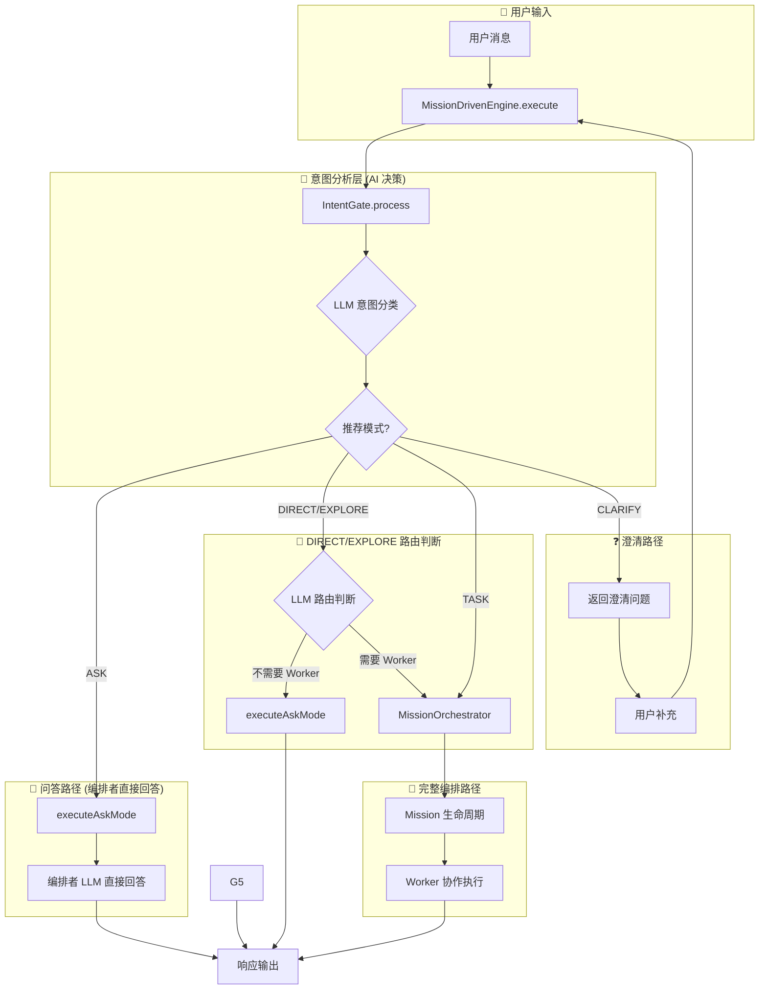

# MultiCLI 编排流程规范

> 版本: 1.0
> 日期: 2025-01-31
> 状态: **正式规范**

## 1. 产品定位

**MultiCLI**: 编排多个 AI Worker (Claude/Codex/Gemini) 协作完成复杂任务的 VS Code 扩展。

### 1.1 核心理念

| 原则 | 描述 |
|------|------|
| **编排者专注编排** | 编排者负责意图分析、任务分解、结果汇总，不执行代码操作 |
| **Worker 专注执行** | Worker 负责具体的代码读取、修改、创建等操作 |
| **AI 决策优先** | 意图分类由 AI (LLM) 完成，非硬编码规则 |
| **配置驱动** | Worker 选择、任务分类基于画像配置，可灵活调整 |

### 1.2 关键区分：编排者回答 vs Worker 执行

**核心逻辑：AI 决策 + 双信号校验**

- 编排者可使用工具处理非代码请求（检索/总结/推理/规划）
- **只有两类才派 Worker**：
  1) `codeTask = true`（涉及代码/文件操作）
  2) `profileCategory` 命中画像任务类型

```
┌─────────────────────────────────────────────────────────────────────┐
│            决策核心：AI 输出 codeTask + profileCategory               │
├─────────────────────────────────────────────────────────────────────┤
│                                                                     │
│  codeTask=false 且 profileCategory 为空 → 编排者直接回答               │
│  codeTask=true  或 profileCategory 命中 → 调用 Worker 执行             │
│                                                                     │
└─────────────────────────────────────────────────────────────────────┘
```

---

## 2. 编排架构概览

```
┌──────────────────────────────────────────────────────────────────────┐
│                          用户输入                                     │
└─────────────────────────────┬────────────────────────────────────────┘
                              ↓
┌──────────────────────────────────────────────────────────────────────┐
│                    MissionDrivenEngine.execute()                      │
│                         (统一入口)                                    │
└─────────────────────────────┬────────────────────────────────────────┘
                              ↓
┌──────────────────────────────────────────────────────────────────────┐
│                     IntentGate.process()                              │
│                    (AI 意图分类 - LLM)                                │
│  ┌────────────────────────────────────────────────────────────────┐  │
│  │  输出: ASK | DIRECT | EXPLORE | TASK | CLARIFY                 │  │
│  └────────────────────────────────────────────────────────────────┘  │
└─────────────────────────────┬────────────────────────────────────────┘
                              ↓
          ┌───────────────────┴───────────────────┐
          ↓                   ↓                   ↓
   ┌─────────────┐    ┌──────────────┐    ┌──────────────┐
   │  ASK 模式   │    │ DIRECT/EXPLORE│    │  TASK 模式   │
   │ 编排者回答  │    │   AI 路由判断 │    │ 完整编排流程 │
   └──────┬──────┘    └──────┬───────┘    └──────┬───────┘
          ↓                   ↓                   ↓
   executeAskMode    decideWorkerNeedWithLLM   MissionOrchestrator
          ↓              ↓         ↓                   ↓
     直接回答        否:编排者  是:Worker         Worker 协作
                      回答       执行
```

---

## 3. 意图分类层 (AI 决策)

### 3.1 意图类型定义

| 意图类型 | 定义 | 典型场景 |
|---------|------|----------|
| **question** | 不涉及代码操作的问询/生成 | "你是谁"、"给我生成一个流程图" |
| **trivial** | 极其简单的代码操作 | "把函数名改成 handleClick" |
| **exploratory** | 代码分析，不修改 | "分析一下这段代码的逻辑" |
| **task** | 复杂代码任务 | "重构用户认证模块" |
| **ambiguous** | 意图不明确 | "优化一下性能" |
| **open_ended** | 开放性讨论 | "你觉得这个设计怎么样" |

### 3.2 处理模式映射

| 意图类型 | 推荐模式 | 执行方式 |
|---------|---------|---------|
| question | **ASK** | 编排者直接回答 |
| trivial | **DIRECT** | 检查后决定 |
| exploratory | **EXPLORE** | 检查后决定 |
| task | **TASK** | 完整 Mission 流程 |
| ambiguous/open_ended | **CLARIFY** | 返回澄清问题 |

### 3.3 配置文件

**文件**: `src/orchestrator/prompts/intent-classification.ts`

该文件定义了 AI 意图分类的 Prompt 模板，包含：
- 意图类型定义
- 判断准则
- 示例（Few-shot Learning）

---

## 4. 执行路径详解

### 4.1 ASK 模式 (编排者直接回答)

```typescript
// 代码位置: src/orchestrator/core/mission-driven-engine.ts
if (intentResult.mode === IntentHandlerMode.ASK) {
  const result = await this.executeAskMode(userPrompt, taskId, sessionId);
  return result;
}
```

**特点**:
- 不调用 Worker
- 编排者 LLM 直接生成回答
- 适用于问答、问候、文本生成等

**适用场景**:
- "你是谁" / "你能做什么"
- "什么是 TypeScript"
- "给我生成一个流程图"
- "帮我写一个营销方案"

### 4.2 DIRECT/EXPLORE 模式 (AI 路由判断)

```typescript
// 代码位置: src/orchestrator/core/mission-driven-engine.ts
if (intentResult.mode === IntentHandlerMode.DIRECT) {
  const decision = await this.decideWorkerNeedWithLLM(userPrompt, IntentHandlerMode.DIRECT);
  if (!decision.needsWorker) {
    // 编排者直接回答（可用工具）
    return decision.directResponse ?? await this.executeAskMode(userPrompt, taskId, sessionId);
  }
  // 需要 Worker → 进入完整 Mission 流程
  intentResult = await this.missionOrchestrator.processRequest(userPrompt, sessionId, { forceMode: IntentHandlerMode.TASK });
  // 之后走 MissionOrchestrator 的规划-执行路径
}
```

**判断依据**：编排者 LLM 输出 JSON

```json
{
  "codeTask": true/false,
  "profileCategory": "命中的任务类型名称，未命中为空字符串",
  "needsTooling": true/false,
  "directResponse": "当不需要 Worker 时必须提供",
  "reason": "简短判断理由"
}
```

**派发规则（唯一正确路径）**：
- `needsWorker = codeTask || profileCategory 命中`
- 其余情况 → 编排者直接回答（可使用工具）

**画像任务类型列表**（来源：`src/orchestrator/profile/defaults/categories.ts`）

| 类型 | 显示名 | 描述 | 默认 Worker |
| --- | --- | --- | --- |
| architecture | 架构设计 | 系统架构、模块设计、接口定义 | claude |
| backend | 后端开发 | API 实现、数据库、服务端逻辑 | claude |
| frontend | 前端开发 | UI 组件、页面、样式、交互 | gemini |
| implement | 功能实现 | 实现新功能、编写业务逻辑 | codex |
| refactor | 代码重构 | 优化代码结构、提升可维护性 | claude |
| bugfix | Bug 修复 | 问题修复、错误处理 | codex |
| debug | 问题排查 | 调试、问题定位、日志分析 | claude |
| data_analysis | 数据分析 | 数据处理、脚本、统计、可视化 | codex |
| test | 测试编写 | 单元测试、集成测试 | codex |
| document | 文档编写 | README、注释、API 文档 | gemini |
| review | 代码审查 | 代码审查、质量检查 | claude |
| general | 通用任务 | 其他未分类任务 | claude |
| integration | 集成联调 | 跨模块集成、接口对接 | claude |
| simple | 简单任务 | 小修改、格式调整 | codex |

### 4.3 TASK 模式 (完整编排流程)

```
用户请求
    ↓
IntentGate → TASK
    ↓
MissionOrchestrator.processRequest()
    ↓
创建 Mission
    ↓
任务分解 (理解目标 + 规划协作)
    ↓
分配 Assignments (基于画像配置选择 Worker)
    ↓
Worker 执行 (带进度汇报)
    ↓
结果验证与总结
```

**适用场景**:
- "重构用户认证模块，提取公共逻辑"
- "实现新的登录功能"
- "修复 #123 issue 并编写测试"

### 4.4 CLARIFY 模式 (澄清)

当意图不明确时，返回澄清问题让用户补充信息：

```typescript
if (intentResult.mode === IntentHandlerMode.CLARIFY) {
  // 调用 clarificationCallback 获取用户补充信息
  // 拼接补充信息后重新执行
  const clarifiedPrompt = `${userPrompt}\n\n补充信息：${answers}`;
  return this.execute(clarifiedPrompt, taskId, sessionId);
}
```

---

## 5. Worker 选择机制

### 5.1 设计原则

- **画像驱动**: 所有 Worker 选择基于 `ProfileLoader` 配置
- **无硬编码**: 不存在 `return 'claude'` 或 `switch-case` 硬编码
- **动态降级**: Worker 不可用时，根据画像配置选择替代

### 5.2 选择流程

```
任务请求
    ↓
matchCategoryWithProfile(prompt)
    ↓
匹配任务分类 (categories.ts 关键词)
    ↓
获取分类的 defaultWorker
    ↓
检查 Worker 可用性
    ↓
可用 → 使用该 Worker
不可用 → selectFallbackWorker() 从画像获取替代
```

### 5.3 配置文件

| 文件 | 作用 |
|------|------|
| `src/orchestrator/profile/defaults/categories.ts` | 任务分类 → 默认 Worker 映射 |
| `src/orchestrator/profile/defaults/claude.json` | Claude 画像：擅长分类、关键词 |
| `src/orchestrator/profile/defaults/codex.json` | Codex 画像 |
| `src/orchestrator/profile/defaults/gemini.json` | Gemini 画像 |

---

## 6. 消息路由规范

### 6.1 消息来源与区域

| 来源 | 显示区域 | 说明 |
|------|---------|------|
| orchestrator | 主对话区 | 编排者叙事、规划、总结 |
| worker (claude/codex/gemini) | Worker Tab | 执行过程、代码变更 |
| system | 主对话区 | 系统通知、阶段变化 |
| subTaskCard | 主对话区 | 子任务完成摘要卡片 |

### 6.2 主对话区内容规范

**必须包含**:
- 编排者分析/规划摘要
- 任务分配说明
- SubTaskCard (子任务完成摘要)
- 最终总结

**禁止包含**:
- Worker 执行过程细节
- 工具调用详情
- 中间状态变化

---

## 7. 完整流程图



---

## 8. 关键代码位置索引

| 功能 | 文件路径 |
|------|---------|
| 统一入口 | `src/orchestrator/core/mission-driven-engine.ts` |
| 意图分析 | `src/orchestrator/intent-gate.ts` |
| 意图分类 Prompt | `src/orchestrator/prompts/intent-classification.ts` |
| 快速执行器 | `src/orchestrator/core/quick-executor.ts` |
| Mission 编排 | `src/orchestrator/core/mission-orchestrator.ts` |
| 任务分类配置 | `src/orchestrator/profile/defaults/categories.ts` |
| 分类匹配器 | `src/orchestrator/profile/category-matcher.ts` |
| 画像加载器 | `src/orchestrator/profile/profile-loader.ts` |
| 消息中心 | `src/orchestrator/core/message-hub.ts` |

---

## 9. MessageHub 统一消息出口

> **重要**：MessageHub 是所有 UI 消息的唯一出口，已合并原 UnifiedMessageBus 的去重/节流能力。
> 详细设计见 `docs/unified-message-channel-design.md`。

### 9.1 核心职责

| 职责 | 说明 |
|------|------|
| 语义 API | `progress()`, `result()`, `workerOutput()`, `error()` |
| 控制 API | `phaseChange()`, `taskAccepted()`, `sendControl()` |
| 去重/节流 | 消息 ID 去重、内容哈希去重、流式节流（100ms） |
| 状态管理 | `ProcessingState` 权威来源 |

### 9.2 消息分类

```typescript
enum MessageCategory {
  CONTENT = 'content',   // 内容消息（LLM 响应、结果）
  CONTROL = 'control',   // 控制消息（阶段、任务状态）
  NOTIFY = 'notify',     // 通知消息（Toast）
  DATA = 'data',         // 数据消息（状态同步）
}
```

### 9.3 禁止事项

- ❌ 禁止直接调用 `postMessage`（必须使用 MessageHub）
- ❌ 禁止绕过消息分类（所有消息必须有明确 category）
- ❌ 禁止分散管理 `isProcessing`（由 MessageHub 统一管理）

---

## 10. 验收检查清单

### 10.1 意图分类

- [ ] "你是谁" → ASK 模式 → 编排者直接回答
- [ ] "给我生成一个流程图" → ASK 模式 → 编排者直接回答
- [ ] "把这个函数改名" → DIRECT 模式 → Worker 执行
- [ ] "分析这段代码" → EXPLORE 模式 → Worker 执行
- [ ] "重构登录模块" → TASK 模式 → 完整 Mission 流程

### 10.2 Worker 选择

- [ ] 无硬编码的 Worker 名称作为选择逻辑
- [ ] 所有 Worker 选择来自 ProfileLoader
- [ ] Worker 不可用时从画像配置获取替代
- [ ] DIRECT/EXPLORE 路由由 LLM 决策（codeTask/profileCategory）

### 10.3 消息路由

- [ ] 主对话区只有编排者叙事
- [ ] Worker 输出只在对应 Tab
- [ ] 无重复/丢失消息

---

## 11. 版本历史

| 版本 | 日期       | 变更                                                 |
|------|------------|------------------------------------------------------|
| 1.0  | 2025-01-31 | 初始版本：完整编排流程规范                           |
| 1.1  | 2025-02-01 | 新增第 9 节 MessageHub 统一消息出口，反映合并架构    |
