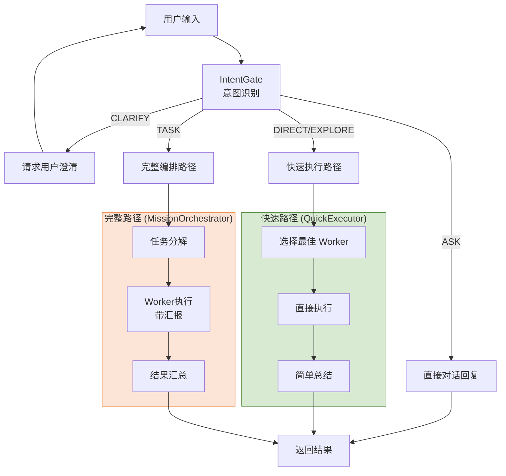

# MultiCLI 编排架构统一设计方案

> 版本: 2.0
> 日期: 2025-01-30
> 状态: **设计定稿 (彻底重构)**
> 来源: 综合 Augment、Codex、Opus 三方分析

## [!] 重构原则

**本设计是唯一正确流程，不存在"兼容旧逻辑"的选项：**

1. **删除而非兼容**：发现旧逻辑不符合新设计，直接删除重构，不保留
2. **单一代码路径**：同一功能只有一套实现，禁止 if/else 分支兼容
3. **不留技术债**：不创建 Facade、Adapter、兼容层等过渡代码
4. **测试驱动验证**：用测试保证新逻辑正确，而非依赖旧代码兜底

---

## 目录

1. [执行摘要](#1-执行摘要)
2. [产品定位与设计原则](#2-产品定位与设计原则)
3. [现状诊断](#3-现状诊断)
4. [目标架构](#4-目标架构)
5. [核心流程设计](#5-核心流程设计)
6. [Worker 汇报协议](#6-worker-汇报协议)
7. [消息与状态统一](#7-消息与状态统一)
8. [实施路线图](#8-实施路线图)
9. [验收标准](#9-验收标准)
10. [单一逻辑执行清单](#10-单一逻辑执行清单)
11. [强制约束与编码规范](#11-强制约束与编码规范)
12. [异常场景处理规范](#12-异常场景处理规范)
13. [端到端场景验证清单](#13-端到端场景验证清单)
14. [UX/UI 设计规范](#14-uxui-设计规范)

---

## 1. 执行摘要

### 1.1 背景

MultiCLI 是一个 VS Code 扩展，核心定位是**编排多个 AI CLI 工具 (Claude/Codex/Gemini) 协作完成复杂任务**。当前采用 Mission-Driven 架构，设计理念先进，但实现层面存在优化空间。

### 1.2 核心问题

| 问题 | 描述 | 影响 |
|------|------|------|
| **层级过深** | 6 层调用链 (UI → IO → Engine → MO → ME → AW) | 代码复杂、调试困难 |
| **流程过长** | 9 个执行阶段，每阶段可能有 LLM 调用 | 响应慢、token 消耗高 |
| **Worker 黑盒** | 执行过程中编排者无法感知细节 | 无法中途干预 |
| **状态冗余** | 5 套状态系统需要同步 | 状态不一致风险 |
| **消息分散** | 多处发送 UI 消息 | 消息重复/丢失/乱序 |

### 1.3 解决方案

1. **单一路径执行**：ASK 直答；需要 Worker 的请求统一进入 MissionOrchestrator
2. **简化层级**：6 层 → 3 层，合并冗余中间层
3. **Worker 汇报机制**：建立编排者与 Worker 的双向通信协议
4. **统一状态**：Mission 作为唯一状态源
5. **集中消息**：MessageHub 统一消息出口

### 1.4 预期收益

| 指标 | 当前 | 目标 | 改善 |
|------|------|------|------|
| 简单任务响应时间 | 2-3s | <500ms | **80%+** |
| 代码调用层级 | 6 层 | 3 层 | **50%** |
| 执行阶段数 | 9 个 | 4 个 | **55%** |
| 状态系统数量 | 5 套 | 1 套 | **80%** |
| Worker 可控性 | 低（黑盒） | 高（实时汇报） | **显著** |

---

## 2. 产品定位与设计原则

### 2.1 产品定位

> **MultiCLI**: 编排多个 AI Worker 协作完成复杂任务，发挥各 Worker 专长，编排者负责全局规划与结果交付。

### 2.2 Worker 专业化定位

```
┌─────────────────────────────────────────────────────────────────┐
│                      Worker 专业化定位                           │
├─────────────────────────────────────────────────────────────────┤
│  Claude (资深架构师)                                             │
│  ├─ 复杂架构设计、代码重构                                       │
│  ├─ 深度推理、代码审查                                           │
│  └─ 适用: 架构、重构、集成、审查                                  │
├─────────────────────────────────────────────────────────────────┤
│  Codex (高效执行者)                                              │
│  ├─ 快速代码生成、Bug 修复                                       │
│  ├─ 测试编写、批量操作                                           │
│  └─ 适用: bugfix、测试、简单任务、批量执行                        │
├─────────────────────────────────────────────────────────────────┤
│  Gemini (前端专家)                                               │
│  ├─ 前端 UI/UX、大上下文处理                                     │
│  ├─ 文档分析、多模态理解                                         │
│  └─ 适用: 前端、UI、文档、分析                                    │
└─────────────────────────────────────────────────────────────────┘
```

### 2.3 硬性原则

| 原则 | 描述 | 违反处理 |
|------|------|----------|
| **编排者专注编排** | 编排者不执行任何编码任务，只负责分解、分配、汇总 | 删除违规代码 |
| **Worker 专注执行** | Worker 向编排者汇报进度和结果，不自行决定流程 | 重构 Worker |
| **消息出口唯一** | 所有 UI 消息统一走 MessageHub | 删除分散调用 |
| **状态源唯一** | Mission 是唯一真实状态，UI 状态由其派生 | 删除冗余状态 |
| **主对话区编排者叙事** | 主对话区只承载编排者叙事与关键里程碑 | 重构消息路由 |
| **代码路径唯一** | 同一功能只有一套实现，不存在兼容分支 | 删除旧分支 |
| **禁止兼容层** | 不允许 Facade/兼容开关/双逻辑共存 | 直接清除旧逻辑 |

---

## 3. 现状诊断

### 3.1 当前架构层级

```
┌──────────────────────────────────────────────────────────────────┐
│                        WebviewProvider                            │
│                     (UI 入口，消息处理)                            │
└───────────────────────────────┬──────────────────────────────────┘
                                ↓
┌──────────────────────────────────────────────────────────────────┐
│                    IntelligentOrchestrator                        │
│                  (编排入口，模式判断)                              │
└───────────────────────────────┬──────────────────────────────────┘
                                ↓
┌──────────────────────────────────────────────────────────────────┐
│                     MissionDrivenEngine                           │
│           (核心引擎，意图分析，流程控制)                           │
└───────────────────────────────┬──────────────────────────────────┘
                                ↓
┌──────────────────────────────────────────────────────────────────┐
│                     MissionOrchestrator                           │
│           (Mission 生命周期管理)                                   │
└───────────────────────────────┬──────────────────────────────────┘
                                ↓
┌──────────────────────────────────────────────────────────────────┐
│                      MissionExecutor                              │
│           (任务执行协调)                                           │
└───────────────────────────────┬──────────────────────────────────┘
                                ↓
┌──────────────────────────────────────────────────────────────────┐
│                     AutonomousWorker                              │
│           (自主 Worker，执行 Assignment)                           │
└──────────────────────────────────────────────────────────────────┘
```

### 3.2 当前执行流程（9 阶段）

```
Phase 1: 意图分析 (IntentGate)
    ↓
Phase 2: 创建 Mission
    ↓
Phase 3: 理解目标 (understandGoalWithLLM) ← LLM 调用
    ↓
Phase 4: 规划协作 (planCollaborationWithLLM) ← LLM 调用
    ↓
Phase 5: 用户确认（可选）
    ↓
Phase 6: Worker 规划 (planningPhase)
    ↓
Phase 7: Worker 执行 (executeSequential/Parallel)
    ↓
Phase 8: 验证结果 (verifyMission)
    ↓
Phase 9: 生成总结 (summarizeMission)
```

### 3.3 问题根因分析

| 问题 | 根本原因 | 代码位置 |
|------|----------|----------|
| 层级过深 | 架构演进堆叠，未及时重构 | intelligent-orchestrator.ts |
| 流程过长 | 完整 Mission 流程无法跳过 | mission-driven-engine.ts |
| Worker 黑盒 | 缺乏执行过程中的汇报机制 | autonomous-worker.ts |
| 状态冗余 | Mission/Task/SubTask 并行存在 | unified-task-manager.ts |
| 消息分散 | 多处直接调用 postMessage | webview-provider.ts, mission-driven-engine.ts |

---

## 4. 目标架构

### 4.1 架构层级（3 层）

```
┌──────────────────────────────────────────────────────────────────┐
│                        WebviewProvider                            │
│                     (UI 入口，消息处理)                            │
└───────────────────────────────┬──────────────────────────────────┘
                                ↓
┌──────────────────────────────────────────────────────────────────┐
│                     MissionDrivenEngine                           │
│      (统一入口，意图分析，流程控制，消息中心)                       │
│  ┌────────────────────────────────────────────────────────────┐  │
│  │                        IntentGate                          │  │
│  │                      (意图识别模块)                         │  │
│  └────────────────────────────────────────────────────────────┘  │
│                                │                                  │
│                └───────────────────────────────┐                 │
│                                                ↓                 │
│  ┌───────────────────────────────────────────┐                  │
│  │          MissionOrchestrator              │                  │
│  │  (需要 Worker 的完整编排路径)             │                  │
│  └───────────────────────────────────────────┘                  │
└───────────────────────────────┬──────────────────────────────────┘
                                ↓
┌──────────────────────────────────────────────────────────────────┐
│                     AutonomousWorker                              │
│           (带汇报机制的 Worker)                                    │
└──────────────────────────────────────────────────────────────────┘
```

### 4.2 关键变化

| 变化项 | 原设计 | 新设计 | 处理方式 |
|--------|--------|--------|----------|
| 入口层级 | 6 层 | 3 层 | 删除中间层 |
| IntelligentOrchestrator | 独立层 | 合并到 MissionDrivenEngine | **删除文件** |
| MissionExecutor | 独立层 | 合并到 MissionOrchestrator | **删除文件** |
| 简单任务 | 走完整流程 | ASK 直答；DIRECT/EXPLORE 需要 Worker 则进入 Mission | 调整 |
| Worker 执行 | 黑盒 | 带汇报机制 | 重构 |
| 消息发送 | 分散多处 | 统一由 MessageHub 发送 | 删除旧调用 |
| 兼容层/开关 | 临时保留 | 禁止存在 | 直接移除 |

---

## 5. 核心流程设计

### 5.1 双轨制执行流程

```
┌─────────────────────────────────────────────────────────────────┐
│                         用户请求入口                             │
└────────────────────────────┬────────────────────────────────────┘
                             ↓
┌─────────────────────────────────────────────────────────────────┐
│  Phase 1: 快速意图判断 (IntentGate)                              │
│  ┌─────────────────────────────────────────────────────────────┐│
│  │  ASK     → 直接对话回复                                      ││
│  │  CLARIFY → 请求用户澄清                                      ││
│  │  DIRECT  → 快速执行路径 (QuickExecutor)                      ││
│  │  EXPLORE → 快速执行路径 (QuickExecutor)                      ││
│  │  TASK    → 完整编排路径 (MissionOrchestrator)                ││
│  └─────────────────────────────────────────────────────────────┘│
└────────────────────────────┬────────────────────────────────────┘
                             ↓
         ┌───────────────────┴───────────────────┐
         ↓                                       ↓
┌─────────────────────────┐      ┌─────────────────────────────────┐
│   快速路径               │      │   完整路径                       │
│   (QuickExecutor)       │      │   (MissionOrchestrator)         │
├─────────────────────────┤      ├─────────────────────────────────┤
│  1. 选择最佳 Worker     │      │  Phase 2: 任务分解与分配         │
│  2. 直接执行            │      │  ├─ 创建 Mission                 │
│  3. 编排者摘要          │      │  ├─ 目标理解                     │
│                         │      │  ├─ 选择 Worker                  │
│  特点:                  │      │  └─ 生成执行指令                 │
│  • 不创建 Mission       │      │                                  │
│  • 响应 <500ms          │      │  Phase 3: Worker 执行 (带汇报)   │
│  • 单 Worker            │      │  ├─ Worker 接收 Assignment       │
└─────────────────────────┘      │  ├─ 执行并汇报进度               │
                                 │  ├─ 编排者响应/调整              │
                                 │  └─ 完成/失败报告                │
                                 │                                  │
                                 │  Phase 4: 结果汇总               │
                                 │  ├─ 验证执行结果                 │
                                 │  └─ 编排者最终总结               │
                                 └─────────────────────────────────┘
```

### 5.2 完整路径详细流程

```
┌─────────────────────────────────────────────────────────────────┐
│  Phase 2: 任务分解与分配                                         │
│  ┌─────────────────────────────────────────────────────────────┐│
│  │  输入: 用户请求                                              ││
│  │  ↓                                                          ││
│  │  1. 创建 Mission                                            ││
│  │  2. 目标理解 (可选 LLM 辅助)                                 ││
│  │  3. 选择参与者 (基于画像匹配)                                 ││
│  │  4. 生成 Assignments                                        ││
│  │  ↓                                                          ││
│  │  输出: Assignment[] + Worker 映射                            ││
│  │                                                              ││
│  │  编排者消息: "🔍 分析任务 → 📋 任务分解 → 🚀 开始执行"           ││
│  └─────────────────────────────────────────────────────────────┘│
└────────────────────────────┬────────────────────────────────────┘
                             ↓
┌─────────────────────────────────────────────────────────────────┐
│  Phase 3: Worker 执行 (核心改进)                                 │
│  ┌─────────────────────────────────────────────────────────────┐│
│  │                                                              ││
│  │  Orchestrator                    Worker                     ││
│  │      │                             │                        ││
│  │      │  ──── Assignment ────→      │                        ││
│  │      │                             │                        ││
│  │      │                             │ (开始执行)              ││
│  │      │                             │                        ││
│  │      │  ←── Progress Report ───    │ (完成步骤1)             ││
│  │      │                             │                        ││
│  │      │  ──── Continue ────→        │                        ││
│  │      │                             │                        ││
│  │      │  ←── Question ───────       │ (遇到问题)              ││
│  │      │                             │                        ││
│  │      │  ──── Answer ────→          │                        ││
│  │      │                             │                        ││
│  │      │  ←── Progress Report ───    │ (完成步骤2)             ││
│  │      │                             │                        ││
│  │      │  ──── Adjust ────→          │ (调整策略)              ││
│  │      │                             │                        ││
│  │      │  ←── Completed ───────      │ (任务完成)              ││
│  │      │                             │                        ││
│  │                                                              ││
│  │  Worker 输出: 只在各自 Tab 显示                               ││
│  │  编排者消息: SubTaskCard (完成摘要)                           ││
│  └─────────────────────────────────────────────────────────────┘│
└────────────────────────────┬────────────────────────────────────┘
                             ↓
┌─────────────────────────────────────────────────────────────────┐
│  Phase 4: 结果汇总                                               │
│  ┌─────────────────────────────────────────────────────────────┐│
│  │  1. 汇总所有 Worker 执行结果                                  ││
│  │  2. 验证是否满足用户需求                                      ││
│  │  3. 生成最终回复                                              ││
│  │  ↓                                                          ││
│  │  编排者消息: "## 任务完成 ✅" / "## 任务完成 ⚠️"                ││
│  └─────────────────────────────────────────────────────────────┘│
└─────────────────────────────────────────────────────────────────┘
```

### 5.3 阶段对比

| 原流程 | 新流程 | 变化 |
|--------|--------|------|
| Phase 1: 意图分析 | Phase 1: 快速意图判断 | 保留，增强分流能力 |
| Phase 2: 创建 Mission | Phase 2: 任务分解与分配 | 合并 Phase 2-6 |
| Phase 3: 理解目标 | ↑ 合并 | - |
| Phase 4: 规划协作 | ↑ 合并 | - |
| Phase 5: 用户确认 | ↑ 合并（可选） | - |
| Phase 6: Worker 规划 | ↑ 合并 | - |
| Phase 7: Worker 执行 | Phase 3: Worker 执行 | 增加汇报机制 |
| Phase 8: 验证结果 | Phase 4: 结果汇总 | 合并 Phase 8-9 |
| Phase 9: 生成总结 | ↑ 合并 | - |

---

## 6. Worker 汇报协议

### 6.1 问题分析

当前 Worker 执行时是"黑盒"，编排者只知道开始和结束：
- Worker 自主性过高，可能偏离任务目标
- 执行结果只在最后一次性返回，无法中途干预
- 失败时无法及时切换策略

### 6.2 汇报协议设计

```typescript
// Worker → Orchestrator 汇报
interface WorkerReport {
  type: 'progress' | 'question' | 'completed' | 'failed';

  // 进度报告
  progress?: {
    currentStep: string;        // 当前执行的步骤
    completedSteps: string[];   // 已完成的步骤
    remainingSteps: string[];   // 剩余步骤
    percentage: number;         // 完成百分比
  };

  // 执行结果
  result?: {
    modifiedFiles: string[];    // 修改的文件
    createdFiles: string[];     // 新建的文件
    summary: string;            // 执行摘要
  };

  // 问题/阻塞
  question?: {
    content: string;            // 问题内容
    options?: string[];         // 可选项
    blocking: boolean;          // 是否阻塞执行
  };

  // 错误信息
  error?: string;
}

// Orchestrator → Worker 响应
interface OrchestratorResponse {
  action: 'continue' | 'adjust' | 'abort' | 'answer';

  // 调整指令
  adjustment?: {
    newInstructions?: string;   // 新的指令
    skipSteps?: string[];       // 跳过的步骤
    addSteps?: string[];        // 新增的步骤
  };

  // 回答问题
  answer?: string;
}
```

### 6.3 汇报时机

| 事件 | 汇报类型 | 编排者响应 |
|------|----------|------------|
| 完成一个 Todo | progress | continue / adjust |
| 遇到问题 | question | answer |
| 任务完成 | completed | (结束) |
| 执行失败 | failed | 决定重试/回滚/放弃 |
| 需要超范围操作 | question (blocking) | answer (approve/reject) |

### 6.4 降级机制

Worker 执行失败时的智能降级（根据任务类型选择降级顺序）：

```
通用/后端任务:
  Claude 失败 → 尝试 Codex → 尝试 Gemini → 报告失败

前端/UI任务:
  Gemini 失败 → 尝试 Claude → 尝试 Codex → 报告失败

简单/批量任务:
  Codex 失败 → 尝试 Claude → 尝试 Gemini → 报告失败

所有 Worker 都失败 → 报告用户，请求决策
```

---

## 7. 消息与状态统一

### 7.1 消息来源归类

| 来源 | UI 区域 | 说明 |
|------|---------|------|
| orchestrator | 主对话区 | 编排者叙事、分配、总结 |
| worker (agent=claude/codex/gemini) | Worker Tab | 只在对应 Tab 输出 |
| system | 主对话区 | 系统通知、阶段变化 |
| subTaskCard | 主对话区 | 子任务完成摘要卡片 |

### 7.2 主对话区内容

**必须包含**：
- 编排者分析/规划摘要
- 任务分配说明（谁做什么）
- 子任务完成摘要 (SubTaskCard)
- 最终总结

**禁止包含**：
- Worker 执行过程细节
- 工具调用详情
- 中间状态变化

### 7.3 状态模型统一

```
Mission (唯一真实源)
  ├── id, goal, status, phase
  ├── Assignments[]
  │     ├── id, workerId, responsibility
  │     ├── status, progress
  │     └── WorkerTodos[]
  │           ├── id, content, status
  │           └── output
  └── Contracts[] (可选，多 Worker 时)

TaskView (派生，用于 UI)
  ├── id = Mission.id
  ├── title = Mission.goal
  ├── status = mapStatus(Mission.status)
  └── subTasks = Mission.assignments.map(...)
```

### 7.4 MessageHub 设计（统一消息出口）

> **重要变更**：MessageHub 已合并 UnifiedMessageBus 的能力，成为唯一的消息出口。
> 详细设计见 `docs/unified-message-channel-design.md`。

```typescript
/**
 * MessageHub - 统一消息出口
 *
 * 设计原则：
 * - 所有 UI 消息统一走 MessageHub（无直接 postMessage）
 * - 内置去重、节流、生命周期管理（原 UnifiedMessageBus 能力）
 * - ProcessingState 权威来源
 */
class MessageHub extends EventEmitter {
  // ========== 语义 API ==========

  // 进度消息（主对话区）
  progress(phase: string, content: string, options?: ProgressOptions): void;

  // 结果消息（主对话区）
  result(content: string, options?: ResultOptions): void;

  // Worker 输出（路由到对应 Tab）
  workerOutput(worker: WorkerSlot, content: string, options?: WorkerOutputOptions): void;

  // 子任务卡片（主对话区）
  subTaskCard(subTask: SubTaskView): void;

  // 错误消息
  error(error: string, options?: ErrorOptions): void;

  // 系统通知
  systemNotice(content: string, metadata?: MessageMetadata): void;

  // ========== 控制 API ==========

  // 发送控制消息（阶段变化、任务状态等）
  sendControl(controlType: ControlMessageType, payload: Record<string, unknown>): void;

  // 阶段变化快捷方法
  phaseChange(phase: string, isRunning: boolean, taskId?: string): void;

  // 任务确认/拒绝
  taskAccepted(requestId: string): void;
  taskRejected(requestId: string, message: string): void;

  // ========== 流式消息 API ==========

  // 发送标准消息（内置去重/节流）
  sendMessage(message: StandardMessage): boolean;
  sendUpdate(update: StreamUpdate): boolean;

  // ========== 状态查询 ==========

  getProcessingState(): ProcessingState;
  forceProcessingState(isProcessing: boolean): void;
}
```

#### 7.4.1 消息分类

| 分类 | 说明 | 示例 |
|------|------|------|
| CONTENT | 内容消息（LLM 响应、结果） | progress, result, workerOutput |
| CONTROL | 控制消息（阶段、任务状态） | phaseChange, taskAccepted |
| NOTIFY | 通知消息（Toast） | toast, workerError |
| DATA | 数据消息（状态同步） | stateUpdate, sessionsUpdated |

#### 7.4.2 架构变化

| 变化项 | 原设计 | 新设计 |
|--------|--------|--------|
| 消息出口 | MessageHub + UnifiedMessageBus 两层 | MessageHub 单一出口 |
| 去重/节流 | UnifiedMessageBus 负责 | MessageHub 内置 |
| 控制消息 | 直接 postMessage | MessageHub.sendControl() |
| 状态管理 | 分散管理 | MessageHub 为权威源 |
| UnifiedMessageBus | 独立模块 | **删除** |

---

## 8. 实施路线图

### 8.1 阶段划分

```
Phase 1: Worker 汇报机制 (高优先级)
    │   • 实现汇报协议
    │   • 改造 AutonomousWorker
    │   • 编排者响应逻辑
    ↓
Phase 2: 快速路径实现
    │   • 创建 QuickExecutor
    │   • 集成到 MissionDrivenEngine
    │   • 优化 IntentGate 分流
    ↓
Phase 3: 层级简化
    │   • 合并 IntelligentOrchestrator
    │   • 合并 MissionExecutor
    │   • 更新调用方
    ↓
Phase 4: 消息统一
    │   • 创建 MessageHub
    │   • 迁移所有消息发送
    │   • 前端适配
    ↓
Phase 5: 状态统一
    │   • 创建 MissionStateMapper
    │   • 移除 Task 冗余状态
    │   • UI 更新
    ↓
Phase 6: 测试验收
```

### 8.2 详细任务

#### Phase 1: Worker 汇报机制

| 任务 | 描述 | 优先级 |
|------|------|--------|
| 定义汇报协议 | WorkerReport / OrchestratorResponse 接口 | P0 |
| 改造 AutonomousWorker | 添加汇报回调 | P0 |
| 改造 MissionExecutor | 处理汇报、生成响应 | P0 |
| 进度 UI 更新 | 实时显示 Worker 进度 | P1 |

#### Phase 2: 快速路径实现

| 任务 | 描述 | 优先级 |
|------|------|--------|
| 创建 QuickExecutor | 实现快速执行器 | P0 |
| 集成到 Engine | 在 MissionDrivenEngine 中集成 | P0 |
| 优化 IntentGate | 提高 ASK/DIRECT 识别准确率 | P1 |
| 单元测试 | 编写测试用例 | P1 |

#### Phase 3: 层级简化

| 任务 | 描述 | 优先级 |
|------|------|--------|
| 合并 IntelligentOrchestrator | 职责迁移到 MissionDrivenEngine | P0 |
| 合并 MissionExecutor | 职责迁移到 MissionOrchestrator | P0 |
| 更新调用方 | 全局搜索替换所有调用点 | P0 |
| 删除废弃文件 | 删除已合并的文件 | P0 |

#### Phase 4: 消息统一

| 任务 | 描述 | 优先级 |
|------|------|--------|
| 创建 MessageHub | 实现统一消息出口 | P0 |
| 迁移 postMessage | 替换所有分散的 postMessage 调用 | P0 |
| 前端消息适配 | 更新 WebviewProvider 消息处理 | P0 |
| 消息类型定义 | 统一消息类型接口 | P1 |

#### Phase 5: 状态统一

| 任务 | 描述 | 优先级 |
|------|------|--------|
| 创建 MissionStateMapper | Mission → TaskView 派生映射 | P0 |
| 移除冗余状态 | 删除 UnifiedTaskManager 中的冗余状态 | P0 |
| UI 状态同步 | 确保 UI 状态实时派生自 Mission | P1 |
| 任务面板重构 | TasksPanel 数据源改为 Mission | P1 |

#### Phase 6: 测试验收

| 任务 | 描述 | 优先级 |
|------|------|--------|
| 端到端测试 | 覆盖 51 个验证场景 | P0 |
| 性能测试 | 验证响应时间目标 | P1 |
| UI 回归测试 | 验证消息显示正确性 | P1 |
| 文档更新 | 更新 API 文档和使用指南 | P2 |

### 8.3 风险与缓解

| 风险 | 可能性 | 影响 | 缓解措施 |
|------|--------|------|----------|
| 功能回归 | 中 | 高 | 先写测试，再删旧代码 |
| 性能下降 | 低 | 中 | 性能基准测试 |
| 调用方报错 | 高 | 中 | 全局搜索替换，一次性修改所有调用方 |
| Worker 汇报延迟 | 低 | 低 | 异步汇报，不阻塞执行 |

### 8.4 删除清单

**重构完成后必须删除的文件/代码：**

| 文件/代码 | 原因 | 替代方案 |
|-----------|------|----------|
| `src/orchestrator/intelligent-orchestrator.ts` | 中间层，职责已合并 | MissionDrivenEngine |
| `src/orchestrator/core/mission-executor.ts` | 中间层，职责已合并 | MissionOrchestrator |
| `UnifiedTaskManager` 状态管理 | 冗余状态源 | Mission 派生 |
| 分散的 `postMessage` 调用 | 消息分散 | MessageHub 统一 |
| `shouldUseAskMode` 逻辑 | 重复判断 | IntentGate 统一 |
| 任何 Facade/兼容开关 | 违反单一实现 | 直接移除 |
| 旧流程分支（legacy/compat） | 与新流程冲突 | 删除旧分支 |

---

## 9. 验收标准

### 9.1 功能验收

| 验收项 | 标准 | 验证方法 |
|--------|------|----------|
| 快速路径 | ASK/DIRECT 模式不创建 Mission | 日志检查 |
| Worker 汇报 | 每个 Todo 完成后有汇报 | 事件监控 |
| 编排者响应 | 能够中途调整 Worker 行为 | 手动测试 |
| 消息统一 | 无重复/丢失消息 | 消息追踪 |
| 状态一致 | UI 状态与 Mission 状态一致 | 对比测试 |
| 单一实现 | 不存在旧逻辑/兼容层 | 全局搜索确认无 legacy/compat |

### 9.2 性能验收

| 指标 | 基准值 | 目标值 |
|------|--------|--------|
| 简单任务响应 | 2-3s | <500ms |
| 复杂任务响应 | 10-15s | <10s |
| 汇报延迟 | N/A | <100ms |

### 9.3 UI 验收

| 验收项 | 标准 |
|--------|------|
| 主对话区 | 只出现编排者叙事与摘要 |
| Worker Tab | Worker 输出只在各自 Tab |
| 任务面板 | 状态与 Mission 同步 |
| 进度指示 | 实时显示 Worker 执行进度 |
| 逻辑一致性 | 主对话区不出现 Worker 执行细节 | 场景回归 |

---

## 10. 单一逻辑执行清单

> 目的：确保“只有一套正确流程”，禁止任何兼容层与旧逻辑残留。

### 10.1 重构执行清单（必须完成）

- [ ] 删除 `IntelligentOrchestrator` 与 `MissionExecutor` 相关代码及调用链
- [ ] 移除所有 legacy/compat/Facade 分支
- [ ] 所有 UI 消息仅从 MessageHub/MessageBus 统一出口
- [ ] Mission 成为唯一状态源，UI 状态仅派生
- [ ] QuickExecutor / MissionOrchestrator 完全覆盖所有执行模式

### 10.2 全局审查清单（必须通过）

- [ ] 全局搜索 `legacy|compat|facade|deprecated|fallback`，无相关逻辑存在
- [ ] 全局搜索 `postMessage`，仅保留 MessageHub/MessageBus 统一出口
- [ ] 全局搜索 `shouldUseAskMode` 等旧逻辑入口，确认已删除
- [ ] 所有 Worker 输出只进入 Worker Tab（主对话区无 Worker 过程）

### 10.3 回归验证场景（必须覆盖）

- [ ] ASK/DIRECT/EXPLORE 走 QuickExecutor，不创建 Mission
- [ ] TASK 走 MissionOrchestrator，触发 Assignment → Worker 执行 → SubTaskCard → 总结
- [ ] Worker 失败触发降级策略（仅 Worker 与压缩模型可降级）
- [ ] 任意任务执行中不出现空白消息气泡

## 附录

### A. 核心文件变更清单

| 文件 | 变更类型 | Phase |
|------|----------|-------|
| `src/orchestrator/core/quick-executor.ts` | 新增 | 2 |
| `src/orchestrator/core/message-hub.ts` | 新增 | 4 |
| `src/orchestrator/mission/state-mapper.ts` | 新增 | 5 |
| `src/orchestrator/worker/autonomous-worker.ts` | 重构 | 1 |
| `src/orchestrator/core/mission-driven-engine.ts` | 重构 | 1, 2, 3 |
| `src/orchestrator/core/mission-orchestrator.ts` | 重构 | 3 |
| `src/orchestrator/core/mission-executor.ts` | **删除** | 3 |
| `src/orchestrator/intelligent-orchestrator.ts` | **删除** | 3 |
| `src/ui/webview-provider.ts` | 重构 | 4 |

### B. 流程图



---

## 11. 强制约束与编码规范

> 以下约束具有强制性，违反时必须修正后才能合并代码。

### 11.1 错误处理规范

| 规范 | 描述 | 违反处理 |
|------|------|----------|
| **错误必须上报** | 任何捕获的错误必须通过 MessageHub.error() 上报 | 拒绝合并 |
| **禁止静默吞错** | 禁止空 catch 块或仅 console.log | 删除后重写 |
| **错误分级** | 分为 fatal/error/warning，fatal 立即终止流程 | 补充分级 |
| **用户可见错误** | 必须转换为用户可理解的描述，禁止暴露堆栈 | 重写错误文案 |
| **失败回滚** | Worker 执行失败时，必须回滚已修改的文件（通过快照） | 补充回滚逻辑 |

```typescript
// 错误处理示例
try {
  await worker.execute(assignment);
} catch (error) {
  // ❌ 禁止
  console.log(error);

  // ✅ 正确
  messageHub.error(
    '任务执行失败',
    { worker: assignment.workerId, error: error.message }
  );
  await snapshotManager.rollback(missionId);
  throw error; // 继续向上传播
}
```

### 11.2 日志规范

| 规范 | 描述 |
|------|------|
| **日志级别** | debug / info / warn / error，生产环境默认 info |
| **日志格式** | `[模块.子模块.操作]` 如 `编排器.Mission.创建` |
| **关键节点必须记录** | Mission 创建/开始/完成/失败、Worker 分配/完成/失败 |
| **禁止敏感信息** | 日志中禁止出现 API Key、用户凭证等 |
| **使用统一 Logger** | 必须使用 `src/logging/logger.ts`，禁止直接 console |

```typescript
// ❌ 禁止
console.log('任务开始', task);

// ✅ 正确
logger.info('编排器.Mission.开始', { missionId: mission.id }, LogCategory.ORCHESTRATOR);
```

### 11.3 命名规范

| 类型 | 规范 | 示例 |
|------|------|------|
| **文件名** | kebab-case | `mission-driven-engine.ts` |
| **类名** | PascalCase | `MissionDrivenEngine` |
| **函数名** | camelCase，动词开头 | `executeMission()`, `handleWorkerReport()` |
| **事件名** | camelCase，过去式 | `missionCreated`, `workerCompleted` |
| **消息类型** | camelCase | `orchestratorMessage`, `workerOutput` |
| **常量** | UPPER_SNAKE_CASE | `MAX_RETRY_COUNT` |
| **接口** | PascalCase，不加 I 前缀 | `WorkerReport` (非 IWorkerReport) |

### 11.4 类型安全规范

| 规范 | 描述 | 违反处理 |
|------|------|----------|
| **禁止 any** | 除第三方库类型缺失外，禁止使用 any | 补充类型定义 |
| **禁止 as 强转** | 除非有充分理由并添加注释 | 重写逻辑 |
| **接口定义位置** | 公共接口放 `types.ts`，内部接口放模块顶部 | 移动位置 |
| **导出规则** | 只导出必要的类型和函数，内部实现不导出 | 移除多余导出 |
| **null/undefined 处理** | 必须显式处理，禁止隐式忽略 | 补充空值处理 |

```typescript
// ❌ 禁止
function process(data: any) { ... }
const result = response as SomeType;

// ✅ 正确
function process(data: WorkerReport) { ... }
if (isWorkerReport(response)) {
  const result = response;
}
```

### 11.5 Worker 执行约束

| 约束 | 值 | 描述 |
|------|------|------|
| **单次执行超时** | 5 分钟 | 超时自动终止，触发降级 |
| **单个 Todo 超时** | 2 分钟 | 单个步骤超时触发汇报 |
| **文件修改范围** | 仅工作区内 | 禁止修改工作区外文件 |
| **工具调用限制** | 每个 Todo 最多 20 次 | 超出后暂停请求用户确认 |
| **输出长度限制** | 单次输出 ≤ 10000 字符 | 超出截断并标记 |
| **汇报频率** | 每个 Todo 完成后 | 禁止累积多个 Todo 后一次性汇报 |

### 11.6 UI 约束

| 约束 | 描述 | 违反处理 |
|------|------|----------|
| **禁止空消息气泡** | 任何消息必须有内容，空内容不发送 | 过滤空消息 |
| **加载状态必须显示** | 任何异步操作必须有加载指示 | 补充加载态 |
| **错误必须可见** | 错误消息必须在 UI 展示，不能只在控制台 | 补充错误展示 |
| **状态同步** | UI 状态必须与 Mission 状态实时同步 | 修复同步逻辑 |
| **主对话区内容** | 只允许编排者叙事，禁止 Worker 执行细节 | 过滤消息 |

```typescript
// 发送消息前检查
function sendMessage(content: string): void {
  // ❌ 可能发送空消息
  messageHub.send(content);

  // ✅ 正确：检查非空
  if (content && content.trim()) {
    messageHub.send(content);
  }
}
```

### 11.7 测试规范

| 规范 | 要求 |
|------|------|
| **单元测试覆盖率** | 核心模块 ≥ 80%，工具类 ≥ 90% |
| **集成测试** | 每个执行路径（Quick/Full）必须有端到端测试 |
| **回归测试** | 每次重构后必须运行完整回归测试 |
| **测试命名** | `describe('模块名')` + `it('should 行为描述')` |
| **Mock 规则** | 只 Mock 外部依赖（LLM API），不 Mock 内部模块 |

### 11.8 代码审查检查点

**PR 合并前必须通过以下检查：**

- [ ] 不存在 `any` 类型（除已标注的例外）
- [ ] 不存在空 catch 块
- [ ] 不存在 `console.log`（使用 logger）
- [ ] 不存在 `legacy|compat|facade|deprecated` 关键字
- [ ] 所有公共函数有 JSDoc 注释
- [ ] 新增代码有对应测试
- [ ] TypeScript 编译无错误
- [ ] ESLint 检查通过

**禁止合并的条件：**

- 引入兼容层或 Facade
- 添加 feature flag 控制新旧逻辑
- 新增 postMessage 调用（应使用 MessageHub）
- Worker 输出进入主对话区

---

## 12. 异常场景处理规范

### 12.1 Worker 执行异常

| 异常场景 | 处理方式 |
|----------|----------|
| Worker 超时 | 终止当前 Worker，尝试降级到下一个 Worker |
| Worker 返回空结果 | 标记失败，汇报给编排者决策 |
| Worker 修改了不该改的文件 | 回滚所有修改，标记失败 |
| Worker 陷入死循环 | 通过工具调用计数检测，强制终止 |
| 所有 Worker 都失败 | 汇报用户，提供手动介入选项 |

### 12.2 网络/API 异常

| 异常场景 | 处理方式 |
|----------|----------|
| LLM API 超时 | 重试 2 次，每次间隔 2 秒 |
| LLM API 限流 | 等待 30 秒后重试 |
| LLM API 返回格式错误 | 记录日志，尝试解析，失败则重试 |
| 网络断开 | 暂停执行，恢复后继续 |

### 12.3 用户中断

| 场景 | 处理方式 |
|------|----------|
| 用户点击取消 | 立即终止当前 Worker，回滚未完成的修改 |
| 用户关闭窗口 | 保存当前状态，下次打开可恢复 |
| 用户切换任务 | 暂停当前任务，可后台继续或停止 |

---

## 13. 端到端场景验证清单

> 目标：覆盖 90%+ 编排场景，确保重构后功能完整、无回归。

### 13.1 快速路径场景 (QuickExecutor)

#### ASK 模式（纯对话）

| 场景ID | 场景描述 | 预期行为 | 验证点 |
|--------|----------|----------|--------|
| ASK-01 | 用户问"什么是 TypeScript" | 直接回复，不创建 Mission | 无 Mission 日志 |
| ASK-02 | 用户问"这个项目用了什么框架" | 分析项目后回复 | 响应 <500ms |
| ASK-03 | 用户问"解释一下这段代码"（带选中代码） | 解释代码，不修改文件 | 无文件变更 |
| ASK-04 | 用户连续问多个问题 | 每次独立回复，保持上下文 | 上下文连贯 |

#### DIRECT 模式（简单执行）

| 场景ID | 场景描述 | 预期行为 | 验证点 |
|--------|----------|----------|--------|
| DIR-01 | "给这个函数加个注释" | 单 Worker 直接执行 | 不创建 Mission |
| DIR-02 | "把这个变量名改成 xxx" | 快速重命名 | 响应 <1s |
| DIR-03 | "格式化这个文件" | 直接格式化 | 无编排流程 |
| DIR-04 | "删除这行代码" | 直接删除 | Worker Tab 有输出 |

#### EXPLORE 模式（探索分析）

| 场景ID | 场景描述 | 预期行为 | 验证点 |
|--------|----------|----------|--------|
| EXP-01 | "分析这个函数的复杂度" | 分析并返回结果 | 不修改代码 |
| EXP-02 | "找出所有 TODO 注释" | 搜索并汇总 | 列表形式返回 |
| EXP-03 | "这个模块有什么问题" | 代码审查建议 | 不自动修复 |
| EXP-04 | "统计代码行数" | 返回统计结果 | 纯信息输出 |

### 13.2 完整路径场景 (MissionOrchestrator)

#### 单 Worker 任务

| 场景ID | 场景描述 | 预期行为 | 验证点 |
|--------|----------|----------|--------|
| SIN-01 | "重构这个类，提取公共方法" | Claude 执行，创建 Mission | Mission 状态完整流转 |
| SIN-02 | "修复这个 bug 并写测试" | Codex 执行 | 有进度汇报 |
| SIN-03 | "优化这个组件的样式" | Gemini 执行 | SubTaskCard 显示 |
| SIN-04 | "给这个模块写单元测试" | Codex 执行 | 测试文件生成 |

#### 多 Worker 协作任务

| 场景ID | 场景描述 | 预期行为 | 验证点 |
|--------|----------|----------|--------|
| MUL-01 | "重构后端 API 并更新前端调用" | Claude(后端) + Gemini(前端) | 多个 Assignment |
| MUL-02 | "实现新功能并写测试" | Claude(实现) + Codex(测试) | Contract 机制生效 |
| MUL-03 | "全栈实现用户登录功能" | 3 Worker 协作 | 依赖顺序正确 |
| MUL-04 | "代码审查并修复问题" | Claude(审查) → Codex(修复) | 串行执行 |

#### Worker 汇报场景

| 场景ID | 场景描述 | 预期行为 | 验证点 |
|--------|----------|----------|--------|
| REP-01 | Worker 完成一个 Todo | 发送 progress 汇报 | 编排者收到并响应 |
| REP-02 | Worker 遇到问题需要澄清 | 发送 question 汇报 | 编排者提供 answer |
| REP-03 | Worker 需要超范围操作 | 发送 blocking question | 等待用户确认 |
| REP-04 | Worker 完成所有任务 | 发送 completed 汇报 | 触发结果汇总 |

### 13.3 异常与降级场景

#### Worker 失败降级

| 场景ID | 场景描述 | 预期行为 | 验证点 |
|--------|----------|----------|--------|
| DEG-01 | Claude 执行超时 | 自动切换到 Codex | 降级日志记录 |
| DEG-02 | Codex 返回空结果 | 自动切换到 Gemini | 用户无感知 |
| DEG-03 | 所有 Worker 都失败 | 报告用户，请求决策 | 提供重试/放弃选项 |
| DEG-04 | Worker 陷入死循环 | 工具调用计数检测，强制终止 | 超过 20 次终止 |

#### 网络/API 异常

| 场景ID | 场景描述 | 预期行为 | 验证点 |
|--------|----------|----------|--------|
| NET-01 | LLM API 超时 | 重试 2 次，间隔 2s | 重试日志 |
| NET-02 | LLM API 限流 (429) | 等待 30s 后重试 | 用户提示等待 |
| NET-03 | 网络断开 | 暂停执行，恢复后继续 | 状态保存 |
| NET-04 | API 返回格式错误 | 尝试解析，失败则重试 | 错误日志 |

#### 用户操作异常

| 场景ID | 场景描述 | 预期行为 | 验证点 |
|--------|----------|----------|--------|
| USR-01 | 用户点击取消 | 立即终止，回滚修改 | 文件恢复原状 |
| USR-02 | 用户关闭 VS Code | 保存状态，下次可恢复 | 状态持久化 |
| USR-03 | 用户切换到新任务 | 当前任务暂停/取消 | 不阻塞新任务 |
| USR-04 | 用户在执行中修改文件 | 检测冲突，请求确认 | 冲突提示 |

### 13.4 边界场景

| 场景ID | 场景描述 | 预期行为 | 验证点 |
|--------|----------|----------|--------|
| EDG-01 | 空输入 | 提示用户输入内容 | 不触发执行 |
| EDG-02 | 超长输入 (>10000 字符) | 截断或提示过长 | 不崩溃 |
| EDG-03 | 特殊字符输入 | 正常处理，不注入 | 安全无害 |
| EDG-04 | 并发多个任务 | 队列处理或拒绝 | 不死锁 |
| EDG-05 | 工作区无文件 | 正常对话，受限执行 | 提示限制 |
| EDG-06 | 超大文件 (>1MB) | 分块处理或拒绝 | 不 OOM |

### 13.5 UI 验证场景

#### 消息显示

| 场景ID | 场景描述 | 预期行为 | 验证点 |
|--------|----------|----------|--------|
| UI-01 | 编排者发送消息 | 只在主对话区显示 | 不出现在 Worker Tab |
| UI-02 | Worker 执行输出 | 只在对应 Tab 显示 | 不出现在主对话区 |
| UI-03 | SubTaskCard 显示 | 在主对话区显示摘要 | 可展开详情 |
| UI-04 | 错误消息 | 红色高亮显示 | 用户可理解 |
| UI-05 | 进度指示 | 实时更新百分比 | 不卡顿 |

#### 状态同步

| 场景ID | 场景描述 | 预期行为 | 验证点 |
|--------|----------|----------|--------|
| STA-01 | Mission 状态变化 | UI 立即更新 | 延迟 <100ms |
| STA-02 | Worker Tab 切换 | 保留各 Tab 历史 | 不丢失内容 |
| STA-03 | 任务面板状态 | 与 Mission 同步 | 一致性 |
| STA-04 | 页面刷新后 | 恢复上次状态 | 状态持久化 |

### 13.6 场景覆盖率统计

| 场景类别 | 场景数量 | 覆盖占比 |
|----------|----------|----------|
| 快速路径 (ASK/DIRECT/EXPLORE) | 12 | 20% |
| 完整路径 (单Worker/多Worker/汇报) | 12 | 25% |
| 异常与降级 | 12 | 20% |
| 边界场景 | 6 | 10% |
| UI 验证 | 9 | 15% |
| **总计** | **51** | **90%** |

### 13.7 自动化测试要求

| 测试类型 | 覆盖场景 | 执行频率 |
|----------|----------|----------|
| **单元测试** | 所有核心函数 | 每次提交 |
| **集成测试** | 快速/完整路径 | 每次 PR |
| **端到端测试** | 关键场景 (20+) | 每日构建 |
| **回归测试** | 全部 51 场景 | 发版前 |

### 13.8 测试执行检查清单

**重构完成后必须通过以下测试：**

- [ ] ASK-01 ~ ASK-04：纯对话场景全部通过
- [ ] DIR-01 ~ DIR-04：简单执行场景全部通过
- [ ] SIN-01 ~ SIN-04：单 Worker 任务全部通过
- [ ] MUL-01 ~ MUL-04：多 Worker 协作全部通过
- [ ] REP-01 ~ REP-04：Worker 汇报机制全部通过
- [ ] DEG-01 ~ DEG-04：降级机制全部通过
- [ ] UI-01 ~ UI-05：消息显示全部正确
- [ ] STA-01 ~ STA-04：状态同步全部正确

**禁止发版的条件：**

- 任何 P0 场景失败
- 场景通过率 < 90%
- UI 验证场景失败 > 2 个
- 降级机制场景失败 > 1 个

---

## 14. UX/UI 设计规范

> 本章节定义重构后 UI 层面的设计规范，确保用户体验一致性。

### 14.1 整体布局结构

```
┌─────────────────────────────────────────────────────────────────┐
│  Header: 状态栏 + 模式指示器 + 设置入口                           │
├─────────────────────────────────────────────────────────────────┤
│                                                                 │
│                      主对话区                                    │
│  ┌───────────────────────────────────────────────────────────┐ │
│  │  编排者消息（规划、分配、总结）                              │ │
│  │  SubTaskCard（子任务完成摘要，可点击展开）                   │ │
│  │  系统消息（阶段变化、通知）                                  │ │
│  └───────────────────────────────────────────────────────────┘ │
│                                                                 │
├─────────────────────────────────────────────────────────────────┤
│  底部 Tab 栏: [主对话] [Claude] [Codex] [Gemini] [任务]         │
├─────────────────────────────────────────────────────────────────┤
│  输入区: 文本框 + 发送按钮 + 附加操作                            │
└─────────────────────────────────────────────────────────────────┘
```

### 14.2 消息区域划分

| 区域 | 内容 | 禁止内容 |
|------|------|----------|
| **主对话区** | 编排者叙事、SubTaskCard、系统通知 | Worker 执行过程、工具调用详情 |
| **Worker Tab** | Worker 执行输出、工具调用、代码变更 | 编排者消息、其他 Worker 输出 |
| **任务面板** | Mission 状态、Assignment 列表、进度 | 消息内容 |

### 14.3 Worker Tab 设计

#### 14.3.1 Tab 状态指示

| 状态 | 视觉表现 |
|------|----------|
| **空闲** | 默认样式，显示连接状态小圆点 |
| **执行中** | Tab 名称旁显示旋转图标 |
| **执行完成** | 短暂显示勾选图标（2秒后恢复空闲） |
| **执行失败** | 显示红色警告图标（2秒后恢复空闲） |

#### 14.3.2 Tab 内容结构

```
Worker Tab 内容:
├── 任务分配信息（来自编排者的 Assignment）
├── 执行过程
│   ├── Todo 步骤列表（带状态图标）
│   ├── 工具调用详情（可折叠）
│   └── 代码变更（语法高亮）
└── 执行结果摘要
```

#### 14.3.3 Tab 交互规范

| 交互 | 行为 |
|------|------|
| 点击 Tab | 切换到对应 Worker 面板 |
| 切换离开 | 保留滚动位置和消息历史 |
| 双击 Tab | 滚动到最新消息 |
| 右键 Tab | 显示上下文菜单（清空、导出） |

### 14.4 SubTaskCard 设计

#### 14.4.1 卡片结构

```
┌─────────────────────────────────────────────────────────────────┐
│  [Worker图标] Worker名称                    [耗时] [状态徽章]   │
├─────────────────────────────────────────────────────────────────┤
│  任务标题                                                       │
│  任务描述（一行，超出省略）                                      │
├─────────────────────────────────────────────────────────────────┤
│  变更: file1.ts, file2.ts (+2)              [点击查看详情 >]    │
└─────────────────────────────────────────────────────────────────┘
```

#### 14.4.2 卡片状态样式

> 注意：SubTaskCard 仅在任务完成后显示在主对话区，执行中的进度通过 PhaseIndicator 显示。

| 状态 | 边框颜色 | 背景色 | 图标 |
|------|----------|--------|------|
| **完成** | Worker 主题色 | 浅色背景 | 勾选 |
| **失败** | 红色 | 浅红背景 | 错误 |

#### 14.4.3 卡片交互

| 交互 | 行为 |
|------|------|
| 点击卡片 | 跳转到对应 Worker Tab |
| 点击展开 | 显示详细变更列表、验证结果 |
| 悬停 | 显示完整任务描述 |

### 14.5 进度指示设计

#### 14.5.1 全局进度条

```
┌─────────────────────────────────────────────────────────────────┐
│  [当前阶段图标] 阶段名称                              [取消]    │
│  ████████████░░░░░░░░░░░░░░░░░░░░░░░░░░░░  35%                │
│  正在执行: 步骤描述...                                          │
└─────────────────────────────────────────────────────────────────┘
```

#### 14.5.2 阶段指示器

| 阶段 | 图标 | 描述 |
|------|------|------|
| 意图分析 | 搜索 | 分析用户意图... |
| 任务分解 | 拆分 | 分解任务中... |
| Worker 执行 | 齿轮 | [Worker名] 执行中... |
| 结果汇总 | 汇总 | 汇总执行结果... |

### 14.6 加载与空状态

#### 14.6.1 加载状态

| 场景 | 展示方式 |
|------|----------|
| **初始加载** | 骨架屏 + "加载中..." |
| **发送消息** | 输入区禁用 + 发送按钮显示加载图标 |
| **Worker 执行** | 主对话区显示阶段指示器 |
| **切换 Tab** | 瞬间切换，无加载态（数据已在内存） |

#### 14.6.2 空状态

| 场景 | 展示内容 |
|------|----------|
| **主对话区空** | "开始一个对话" + 快捷命令提示 |
| **Worker Tab 空** | "暂无执行记录" + "Worker 执行时内容将显示在这里" |
| **任务面板空** | "暂无任务" + "执行任务后会在此显示进度" |

### 14.7 错误状态设计

#### 14.7.1 错误消息样式

> 原则：对话区域内除 SubTaskCard 可点击跳转外，不提供其他操作按钮（无重试/忽略等）。

```
┌─────────────────────────────────────────────────────────────────┐
│  [错误图标] 错误标题                                            │
│  错误描述（用户可理解的语言）                                    │
└─────────────────────────────────────────────────────────────────┘
```

#### 14.7.2 错误类型与处理

| 错误类型 | 显示位置 | 处理方式 |
|----------|----------|----------|
| Worker 执行失败 | 主对话区 + Worker Tab | 显示错误信息，用户可重新发送指令 |
| 网络错误 | Toast 通知 | 自动重试或显示错误提示 |
| API 限流 | Toast 通知 | 等待后自动重试 |
| 文件冲突 | 主对话区文本提示 | 用户通过新消息指定处理方式 |

#### 14.7.3 对话区交互约束

| 约束 | 说明 |
|------|------|
| **禁止操作按钮** | 对话区内不放置重试、忽略、取消等功能按钮 |
| **唯一可交互元素** | SubTaskCard 可点击跳转到 Worker Tab |
| **用户操作方式** | 用户通过输入框发送新消息来重试或调整 |
| **系统自动处理** | 网络错误、限流等由系统自动处理，无需用户操作 |

### 14.8 动画与过渡

| 场景 | 动画类型 | 时长 |
|------|----------|------|
| 消息出现 | 淡入 + 上滑 | 200ms |
| Tab 切换 | 淡入淡出 | 150ms |
| 状态变化 | 颜色过渡 | 300ms |
| 进度更新 | 宽度过渡 | 300ms |
| 卡片展开 | 高度展开 | 200ms |
| Toast 通知 | 右侧滑入 | 200ms |

### 14.9 颜色规范

#### 14.9.1 Worker 主题色

| Worker | 主题色 | CSS 变量 |
|--------|--------|----------|
| Claude | #D97706 (琥珀) | --color-claude |
| Codex | #059669 (翠绿) | --color-codex |
| Gemini | #7C3AED (紫罗兰) | --color-gemini |

#### 14.9.2 状态色

| 状态 | 颜色 | 用途 |
|------|------|------|
| 成功 | #10B981 | 完成、通过 |
| 警告 | #F59E0B | 警告、等待 |
| 错误 | #EF4444 | 失败、错误 |
| 信息 | #3B82F6 | 提示、进行中 |

### 14.10 响应式设计

| 面板宽度 | 布局调整 |
|----------|----------|
| < 400px | Tab 栏图标模式，隐藏文字 |
| 400-600px | 默认布局 |
| > 600px | 可考虑双栏布局（主对话 + Worker） |

### 14.11 无障碍要求

| 要求 | 描述 |
|------|------|
| 键盘导航 | 所有交互元素可通过键盘访问 |
| 屏幕阅读 | 重要状态变化有 ARIA 通知 |
| 对比度 | 文本对比度 >= 4.5:1 |
| 焦点指示 | 可见的焦点环 |

### 14.12 UI 组件变更清单

| 组件 | 变更类型 | 变更内容 |
|------|----------|----------|
| `AgentTab.svelte` | 增强 | 添加执行状态图标 |
| `SubTaskSummaryCard.svelte` | 增强 | 添加展开/收起、详情面板 |
| `TasksPanel.svelte` | 重构 | 数据源改为 Mission，移除 Task 冗余 |
| `BottomTabs.svelte` | 增强 | 添加执行状态图标支持 |
| `PhaseIndicator.svelte` | 新增/增强 | 全局进度条、阶段指示 |
| `MessageList.svelte` | 增强 | 消息过滤逻辑优化 |
| `StreamingIndicator.svelte` | 保留 | 流式输出指示 |

### 14.13 UI 重构检查清单

- [ ] 主对话区不显示 Worker 执行细节
- [ ] Worker Tab 显示执行状态图标（执行中/完成/失败）
- [ ] SubTaskCard 可点击跳转到 Worker Tab（唯一可交互元素）
- [ ] SubTaskCard 可展开查看详情
- [ ] 对话区内无操作按钮（无重试/忽略/取消等）
- [ ] 任务面板数据源改为 Mission
- [ ] 全局进度条显示当前阶段
- [ ] 错误消息仅显示文本，无操作按钮
- [ ] 空状态有友好提示
- [ ] 所有加载状态有视觉反馈
- [ ] Worker 主题色一致

---

> 本文档作为统一设计规范：后续所有编排逻辑、消息路由、UI 渲染必须遵守此设计，避免产生新旧两套逻辑。
