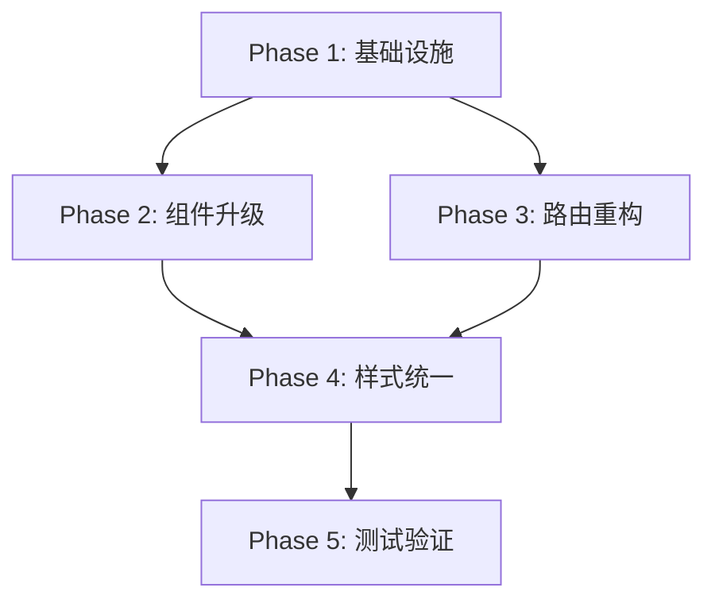

# MultiCLI 前端消息显示系统 UX/UI 重构升级方案

> 版本: v1.0
> 日期: 2026-01-31
> 状态: 提案

---

## 目录

1. [背景与动机](#1-背景与动机)
2. [现状分析](#2-现状分析)
3. [问题诊断](#3-问题诊断)
4. [目标架构](#4-目标架构)
5. [消息分类体系](#5-消息分类体系)
6. [路由规则规范](#6-路由规则规范)
7. [组件渲染规范](#7-组件渲染规范)
8. [实施计划](#8-实施计划)
9. [验收标准](#9-验收标准)
10. [重构原则（唯一流程）](#10-重构原则唯一流程)

---

## 1. 背景与动机

### 1.1 当前痛点

MultiCLI 的编排流程涉及复杂的消息流转：用户输入 → 编排者分析 → 任务规划 → Worker 执行 → 结果汇总。当前的前端消息显示存在以下问题：

- **显示混乱**：同类型消息在不同位置显示，用户难以追踪任务进度
- **信息丢失**：结构化内容（如文件变更、计划）被简化为纯文本
- **路由规则分散**：消息应该显示在哪里的逻辑分布在多个文件中
- **类型与展示脱节**：9 种 MessageType 在 UI 层没有明确的视觉区分

### 1.2 重构目标

1. **清晰的信息层次**：用户能快速理解当前任务状态和进度
2. **一致的视觉语言**：相同类型的消息有统一的展示样式
3. **可追溯的任务流**：主对话区与 Worker 面板的关联清晰
4. **可扩展的架构**：新增消息类型无需修改多处代码

### 1.3 重构原则（唯一流程）

**本设计是唯一正确流程，不存在"兼容旧逻辑"的选项：**

1. **删除而非兼容**：发现旧逻辑不符合新设计，直接删除重构，不保留
2. **单一代码路径**：同一功能只有一套实现，禁止 if/else 分支兼容
3. **不留技术债**：不创建 兼容层等过渡代码
4. **测试驱动验证**：用测试保证新逻辑正确，而非依赖旧代码兜底

---

## 2. 现状分析

### 2.1 消息流向架构

```
┌─────────────────────────────────────────────────────────────────┐
│                         后端 (Backend)                           │
├─────────────────────────────────────────────────────────────────┤
│  Orchestrator  ──────┬──────►  Worker (Claude/Codex/Gemini)     │
│       │              │                    │                      │
│       ▼              │                    ▼                      │
│  StandardMessage     │            WorkerReport                   │
└──────────┬───────────┴────────────────────┬─────────────────────┘
           │                                │
           ▼                                ▼
┌─────────────────────────────────────────────────────────────────┐
│              unified-message-bus.ts (消息标准化)                  │
└──────────────────────────────┬──────────────────────────────────┘
                               │
                               ▼
┌─────────────────────────────────────────────────────────────────┐
│                webview-provider.ts (发送到 Webview)              │
└──────────────────────────────┬──────────────────────────────────┘
                               │
                               ▼
┌─────────────────────────────────────────────────────────────────┐
│              message-handler.ts (消息路由与处理)                  │
│  ┌─────────────────────────────────────────────────────────┐    │
│  │  handleMessage() ─► 40+ case 分支                        │    │
│  │       │                                                  │    │
│  │       ├─► handleStandardMessage()                        │    │
│  │       │         │                                        │    │
│  │       │         ▼                                        │    │
│  │       │   resolveMessageTarget()                         │    │
│  │       │         │                                        │    │
│  │       │    ┌────┴────┐                                   │    │
│  │       │    ▼         ▼                                   │    │
│  │       │ thread   agentOutputs                            │    │
│  │       │                                                  │    │
│  │       └─► handleMissionPlanned() ─► missionPlan          │    │
│  │       └─► handlePhaseChanged() ─► currentPhase           │    │
│  │       └─► ... (其他处理)                                  │    │
│  └─────────────────────────────────────────────────────────┘    │
└──────────────────────────────┬──────────────────────────────────┘
                               │
              ┌────────────────┼────────────────┐
              ▼                ▼                ▼
┌─────────────────┐  ┌─────────────────┐  ┌─────────────────┐
│  ThreadPanel    │  │   AgentTab      │  │   TasksPanel    │
│  (主对话区)      │  │  (Worker 面板)   │  │   (任务列表)     │
├─────────────────┤  ├─────────────────┤  ├─────────────────┤
│ threadMessages  │  │ agentOutputs    │  │ missionPlan     │
│                 │  │ .claude/codex/  │  │ .assignments    │
│                 │  │  gemini         │  │   .todos        │
└────────┬────────┘  └────────┬────────┘  └────────┬────────┘
         │                    │                    │
         ▼                    ▼                    ▼
┌─────────────────────────────────────────────────────────────────┐
│                    MessageItem.svelte (消息渲染)                  │
│  ┌─────────────────────────────────────────────────────────┐    │
│  │  根据 block.type 渲染:                                    │    │
│  │    - text      → TextBlock                               │    │
│  │    - code      → CodeBlock                               │    │
│  │    - thinking  → ThinkingBlock                           │    │
│  │    - tool_call → ToolCallCard                            │    │
│  │    - file_change → 转换为 text (信息丢失!)                 │    │
│  │    - plan      → 转换为 text (信息丢失!)                   │    │
│  └─────────────────────────────────────────────────────────┘    │
└─────────────────────────────────────────────────────────────────┘
```

### 2.2 核心文件职责

| 文件路径 | 行数 | 职责 | 问题 |
|---------|------|------|------|
| `src/protocol/message-protocol.ts` | ~200 | 定义 StandardMessage、MessageType、ContentBlock | 类型定义完整 |
| `src/ui/webview-svelte/src/lib/message-handler.ts` | ~1200 | 消息路由、40+ 消息类型处理 | 逻辑分散、职责过重 |
| `src/ui/webview-svelte/src/stores/messages.svelte.ts` | ~530 | Svelte 5 状态管理 | 状态过多、耦合度高 |
| `src/ui/webview-svelte/src/components/ThreadPanel.svelte` | ~60 | 主对话区 + Tab 切换 | 职责清晰 |
| `src/ui/webview-svelte/src/components/AgentTab.svelte` | ~175 | Worker 面板消息列表 | 过滤规则隐藏在组件内 |
| `src/ui/webview-svelte/src/components/TasksPanel.svelte` | ~500 | 任务/Assignment/Todo 列表 | 组件过大 |
| `src/ui/webview-svelte/src/components/MessageItem.svelte` | ~400 | 单条消息渲染 | 需要处理多种消息类型 |

### 2.3 消息类型定义

#### MessageType 枚举 (message-protocol.ts)

```typescript
export enum MessageType {
  TEXT = 'text',           // 普通文本消息
  PLAN = 'plan',           // 任务计划消息
  PROGRESS = 'progress',   // 进度更新消息
  RESULT = 'result',       // 结果消息
  ERROR = 'error',         // 错误消息
  INTERACTION = 'interaction', // 交互请求消息
  SYSTEM = 'system',       // 系统消息
  TOOL_CALL = 'tool_call', // 工具调用消息
  THINKING = 'thinking',   // 思考过程消息
}
```

#### ContentBlock 类型

```typescript
type ContentBlockType =
  | 'text'        // 文本内容
  | 'code'        // 代码块
  | 'thinking'    // 思考过程
  | 'tool_call'   // 工具调用
  | 'file_change' // 文件变更
  | 'plan';       // 计划内容
```

---

## 3. 问题诊断

### 3.1 问题清单

| ID | 问题 | 严重程度 | 影响范围 |
|----|------|---------|---------|
| P1 | 消息来源标识不一致 | 高 | 全局 |
| P2 | MessageType 与 UI 展示脱节 | 高 | 全局 |
| P3 | ContentBlock 结构信息丢失 | 中 | MessageItem |
| P4 | Worker 面板过滤逻辑分散 | 中 | AgentTab, message-handler |
| P5 | 40+ 消息类型处理分散 | 中 | message-handler |
| P6 | Phase 状态硬编码 | 低 | PhaseIndicator |
| P7 | subTaskCard 渲染机制不清晰 | 中 | MessageItem, resolveMessageTarget |

### 3.2 问题详解

#### P1: 消息来源标识不一致

**现状**：`source` 字段在不同层级有不同含义

```typescript
// message-protocol.ts 定义
source: 'orchestrator' | 'worker' | 'user' | 'system';

// message-handler.ts 实际处理
const displaySource: Message['source'] =
  originSource === 'orchestrator'
    ? 'orchestrator'
    : (resolvedWorker ?? 'orchestrator');  // Worker 消息 source 被替换为 claude/codex/gemini
```

**问题**：
- 后端的 `source: 'worker'` 在前端被替换为具体槽位 `claude/codex/gemini`
- UI 组件无法区分 "这是 Worker 消息" 和 "这是哪个 Worker 的消息"
- 导致样式判断混乱

#### P2: MessageType 与 UI 展示脱节

**现状**：9 种 MessageType 大部分无区分展示

| MessageType | 是否有专门 UI 处理 | 实际展示 |
|-------------|------------------|---------|
| TEXT | ❌ | 普通文本 |
| PLAN | ❌ | 普通文本 |
| PROGRESS | ❌ | 普通文本 |
| RESULT | ❌ | 普通文本 |
| ERROR | ⚠️ 部分 | 仅 noticeType='error' 时有红色样式 |
| INTERACTION | ✅ | pendingConfirmation 等弹窗 |
| SYSTEM | ✅ | system-notice 居中显示 |
| TOOL_CALL | ✅ | ToolCallCard 组件 |
| THINKING | ✅ | ThinkingBlock 组件 |

**问题**：PLAN、PROGRESS、RESULT 这些重要的消息类型没有专门的视觉呈现。

#### P3: ContentBlock 结构信息丢失

**现状**：`file_change` 和 `plan` 类型被转换为纯文本

```typescript
// message-handler.ts:918-925
case 'file_change': {
  const summary = `文件变更: ${block.filePath} (${block.changeType})`;
  return { type: 'text', content: summary };
  // 丢失: additions, deletions, snippet, previousContent
}

case 'plan': {
  const formatted = formatPlanBlock(block);
  return { type: 'text', content: formatted };
  // 丢失: 结构化的 goal, constraints, acceptanceCriteria 等
}
```

**问题**：
- 无法渲染 diff 视图
- 无法交互式展开/收起计划详情
- 信息密度降低

#### P4: Worker 面板过滤逻辑分散

**现状**：过滤规则分布在多处

```typescript
// 位置 1: message-handler.ts - resolveMessageTarget
if (hasSummaryCard || isSystemNotice) {
  return { location: 'thread' };
}

// 位置 2: AgentTab.svelte
const filteredMessages = $derived(
  messages.filter(m => {
    if (m.source === 'system') return false;
    if (m.metadata?.subTaskCard) return false;
    return true;
  })
);
```

**问题**：
- 同一个决策逻辑分布在两个文件
- 新增过滤规则需要修改多处
- 难以理解完整的过滤行为

#### P5: 40+ 消息类型处理分散

**现状**：`message-handler.ts` 的 switch 有 40+ 个 case

```typescript
switch (type) {
  case 'stateUpdate': handleStateUpdate(message); break;
  case 'standardMessage': handleStandardMessage(message); break;
  case 'standardUpdate': handleStandardUpdate(message); break;
  case 'standardComplete': handleStandardComplete(message); break;
  case 'processingStateChanged': handleProcessingStateChange(message); break;
  case 'phaseChanged': handlePhaseChanged(message); break;
  case 'sessionsUpdated': handleSessionsUpdated(message); break;
  case 'sessionCreated':
  case 'sessionLoaded':
  case 'sessionSwitched': handleSessionChanged(message); break;
  case 'confirmationRequest': handleConfirmationRequest(message); break;
  case 'recoveryRequest': handleRecoveryRequest(message); break;
  case 'questionRequest': handleQuestionRequest(message); break;
  case 'clarificationRequest': handleClarificationRequest(message); break;
  case 'workerQuestionRequest': handleWorkerQuestionRequest(message); break;
  case 'toolAuthorizationRequest': handleToolAuthorizationRequest(message); break;
  case 'missionPlanned': handleMissionPlanned(message); break;
  case 'assignmentPlanned': handleAssignmentPlanned(message); break;
  case 'assignmentStarted': handleAssignmentStarted(message); break;
  case 'assignmentCompleted': handleAssignmentCompleted(message); break;
  case 'todoStarted': handleTodoStarted(message); break;
  case 'todoCompleted': handleTodoCompleted(message); break;
  case 'todoFailed': handleTodoFailed(message); break;
  case 'dynamicTodoAdded': handleDynamicTodoAdded(message); break;
  case 'todoApprovalRequested': handleTodoApprovalRequested(message); break;
  case 'waveExecutionStarted': handleWaveExecutionStarted(message); break;
  case 'waveStarted': handleWaveStarted(message); break;
  case 'waveCompleted': handleWaveCompleted(message); break;
  case 'workerSessionCreated': handleWorkerSessionCreated(message); break;
  case 'workerSessionResumed': handleWorkerSessionResumed(message); break;
  case 'workerStatusUpdate': handleWorkerStatusUpdate(message); break;
  case 'workerStatusChanged': addSystemMessage(...); break;
  case 'workerError': addSystemMessage(...); break;
  case 'error': addSystemMessage(...); break;
  case 'interactionModeChanged': addSystemMessage(...); break;
  case 'recoveryResult': addSystemMessage(...); break;
  case 'workerFallbackNotice': addSystemMessage(...); break;
  case 'missionExecutionFailed': addSystemMessage(...); break;
  case 'missionFailed': addSystemMessage(...); break;
  case 'toast': handleToast(message); break;
  // ...更多
}
```

**问题**：
- 缺少消息类型分类和优先级
- 相似消息类型没有统一处理
- 新增类型需要修改核心文件

#### P6: Phase 状态硬编码

**现状**：Phase 字符串到步骤数字的映射硬编码

```typescript
// message-handler.ts:386-413
function mapPhaseToStep(phase: string): number {
  const normalized = phase.toLowerCase();
  switch (normalized) {
    case 'clarifying':
    case 'analyzing':
      return 1;
    case 'waiting_confirmation':
      return 2;
    case 'dispatching':
    case 'monitoring':
    case 'waiting_questions':
    case 'waiting_worker_answer':
      return 3;
    case 'integrating':
      return 4;
    case 'verifying':
      return 5;
    case 'recovering':
      return 6;
    case 'summarizing':
    case 'completed':
    case 'failed':
      return 7;
    case 'idle':
    default:
      return 0;
  }
}
```

**问题**：
- 后端新增 Phase 时前端需要同步修改
- 无法动态调整步骤显示
- 缺少 Phase 的描述信息

#### P7: subTaskCard 渲染机制不清晰

**现状**：任务摘要卡片的处理分散在多处

| 位置 | 处理逻辑 |
|------|---------|
| resolveMessageTarget | `metadata.subTaskCard → thread` |
| AgentTab.svelte | `metadata.subTaskCard → 过滤掉` |
| MessageItem.svelte | 需要识别 subTaskCard 并使用 SubTaskSummaryCard 组件 |
| SubTaskSummaryCard.svelte | 专门渲染组件 |

**问题**：
- 没有明确的 "这是一个 subTaskCard" 的类型定义
- 依赖 metadata 中的可选字段
- 渲染条件分散

---

## 4. 目标架构

### 4.1 架构原则

1. **单一职责**：每个模块只负责一件事
2. **声明式路由**：消息到 UI 的映射通过配置表定义
3. **类型安全**：消息类型与渲染组件严格对应
4. **可扩展性**：新增消息类型无需修改核心代码

### 4.2 目标架构图

```
┌─────────────────────────────────────────────────────────────────┐
│                         后端 (Backend)                           │
│  StandardMessage { type, source, agent, blocks, metadata }      │
└──────────────────────────────┬──────────────────────────────────┘
                               │
                               ▼
┌─────────────────────────────────────────────────────────────────┐
│                    MessageRouter (新增)                          │
│  ┌─────────────────────────────────────────────────────────┐    │
│  │  1. 消息分类 (MessageClassifier)                          │    │
│  │     - 根据 type + source + metadata 确定 MessageCategory  │    │
│  │                                                          │    │
│  │  2. 路由决策 (RoutingTable)                               │    │
│  │     - 根据 MessageCategory 确定 DisplayTarget            │    │
│  │                                                          │    │
│  │  3. 消息分发 (MessageDispatcher)                          │    │
│  │     - 将消息发送到对应的 Store                             │    │
│  └─────────────────────────────────────────────────────────┘    │
└──────────────────────────────┬──────────────────────────────────┘
                               │
          ┌────────────────────┼────────────────────┐
          ▼                    ▼                    ▼
┌─────────────────┐  ┌─────────────────┐  ┌─────────────────┐
│  ThreadStore    │  │   WorkerStore   │  │   TaskStore     │
│  (主对话消息)    │  │  (Worker 消息)   │  │   (任务状态)     │
└────────┬────────┘  └────────┬────────┘  └────────┬────────┘
         │                    │                    │
         ▼                    ▼                    ▼
┌─────────────────┐  ┌─────────────────┐  ┌─────────────────┐
│  ThreadPanel    │  │   WorkerPanel   │  │   TasksPanel    │
└────────┬────────┘  └────────┬────────┘  └────────┬────────┘
         │                    │                    │
         ▼                    ▼                    ▼
┌─────────────────────────────────────────────────────────────────┐
│                    BlockRenderer (新增)                          │
│  ┌─────────────────────────────────────────────────────────┐    │
│  │  注册表: { blockType → Component }                        │    │
│  │    - text      → TextBlock                               │    │
│  │    - code      → CodeBlock                               │    │
│  │    - thinking  → ThinkingBlock                           │    │
│  │    - tool_call → ToolCallCard                            │    │
│  │    - file_change → FileChangeCard (新增)                  │    │
│  │    - plan      → PlanCard (新增)                          │    │
│  │    - summary   → SubTaskSummaryCard                      │    │
│  └─────────────────────────────────────────────────────────┘    │
└─────────────────────────────────────────────────────────────────┘
```

### 4.3 新增模块

| 模块 | 职责 | 位置 |
|------|------|------|
| MessageRouter | 统一消息路由入口 | `src/ui/webview-svelte/src/lib/message-router.ts` |
| MessageClassifier | 消息分类逻辑 | `src/ui/webview-svelte/src/lib/message-classifier.ts` |
| RoutingTable | 路由规则配置 | `src/ui/webview-svelte/src/config/routing-table.ts` |
| BlockRegistry | 渲染组件注册表 | `src/ui/webview-svelte/src/lib/block-registry.ts` |
| FileChangeCard | 文件变更卡片 | `src/ui/webview-svelte/src/components/FileChangeCard.svelte` |
| PlanCard | 计划卡片 | `src/ui/webview-svelte/src/components/PlanCard.svelte` |

### 4.4 UI 重构补充项（本次工作范围）

以下为本次必须补齐的 UI 工作范围，确保与编排流程一致且无旧逻辑残留：

1. **主对话区只承载编排者叙事**：分析、规划、分配、总结等里程碑消息仅显示在主对话区
2. **Worker Tab 只展示 Worker 执行过程**：编排者对 worker 的任务分配指令显示在对应 Worker Tab 的时间轴相关位置，而不是首条消息，按照消息产生的时间轴顺序显示
3. **SubTask 卡片来源明确**：完成/失败卡片仅由 Worker 汇报生成，避免误路由和重复渲染
4. **Worker Session 状态可视化**：Session 创建/恢复在 UI 中可追踪，并与 Assignment 关联显示
5. **Todo/Assignment 联动**：assignmentPlanned 必须生成可见 Todo 列表，主对话区与任务面板一致
6. **ContentBlock 结构化展示**：file_change、plan、thinking 等块保留结构化渲染，不得降级为纯文本
7. **设置面板统一保存/重置**：全局配置入口唯一，避免多套保存按钮造成误解与重复逻辑

8. **交互消息必须可见**：确认/提问/授权等交互消息必须在主对话区有可见卡片/提示，不允许仅靠弹窗

9. **交互模式约束（Ask/Auto）**：
   - Ask 模式：允许弹窗确认与问题输入
   - Auto 模式：不弹窗，默认授权并自动继续

10. **系统通知最小侵入**：系统通知保持轻量样式，不干扰主对话叙事层级

---

## 5. 消息分类体系

### 5.1 MessageCategory 定义

```typescript
/**
 * 消息分类
 * 用于决定消息的展示位置和样式
 */
export enum MessageCategory {
  // =========== 主对话区消息 ===========
  /** 用户输入 */
  USER_INPUT = 'user_input',

  /** 编排者分析过程 */
  ORCHESTRATOR_ANALYSIS = 'orchestrator_analysis',

  /** 编排者任务计划 */
  ORCHESTRATOR_PLAN = 'orchestrator_plan',

  /** 编排者最终总结 */
  ORCHESTRATOR_SUMMARY = 'orchestrator_summary',

  /** 编排者思考过程 */
  ORCHESTRATOR_THINKING = 'orchestrator_thinking',

  // =========== Worker 面板消息 ===========
  /** 编排者派发给 Worker 的指令 */
  WORKER_INSTRUCTION = 'worker_instruction',

  /** Worker 思考过程 */
  WORKER_THINKING = 'worker_thinking',

  /** Worker 文本输出 */
  WORKER_OUTPUT = 'worker_output',

  /** Worker 工具调用 */
  WORKER_TOOL_USE = 'worker_tool_use',

  /** Worker 代码输出 */
  WORKER_CODE = 'worker_code',

  // =========== 系统消息 ===========
  /** 系统通知 */
  SYSTEM_NOTICE = 'system_notice',

  /** 阶段变更通知 */
  SYSTEM_PHASE = 'system_phase',

  /** 错误通知 */
  SYSTEM_ERROR = 'system_error',

  // =========== 交互消息 ===========
  /** 确认请求 */
  INTERACTION_CONFIRMATION = 'interaction_confirmation',

  /** 问题请求 */
  INTERACTION_QUESTION = 'interaction_question',

  /** 工具授权请求 */
  INTERACTION_TOOL_AUTH = 'interaction_tool_auth',

  // =========== 特殊消息 ===========
  /** 任务完成摘要卡片 */
  TASK_SUMMARY_CARD = 'task_summary_card',

  /** 进度更新 */
  PROGRESS_UPDATE = 'progress_update',
}
```

### 5.2 分类规则

```typescript
/**
 * 消息分类器
 */
export function classifyMessage(message: StandardMessage): MessageCategory {
  const { type, source, agent, metadata, blocks } = message;

  // 1. 特殊标记优先
  if (metadata?.subTaskCard) {
    return MessageCategory.TASK_SUMMARY_CARD;
  }

  // 2. 用户消息
  if (source === 'user') {
    return MessageCategory.USER_INPUT;
  }

  // 3. 系统消息
  if (source === 'system' || type === 'system-notice') {
    if (type === MessageType.ERROR) {
      return MessageCategory.SYSTEM_ERROR;
    }
    return MessageCategory.SYSTEM_NOTICE;
  }

  // 4. 编排者消息
  if (source === 'orchestrator') {
    // 派发指令
    if (metadata?.dispatchToWorker) {
      return MessageCategory.WORKER_INSTRUCTION;
    }

    // 思考过程
    if (type === MessageType.THINKING || hasThinkingBlock(blocks)) {
      return MessageCategory.ORCHESTRATOR_THINKING;
    }

    // 计划消息
    if (type === MessageType.PLAN || hasPlanBlock(blocks)) {
      return MessageCategory.ORCHESTRATOR_PLAN;
    }

    // 结果/总结
    if (type === MessageType.RESULT) {
      return MessageCategory.ORCHESTRATOR_SUMMARY;
    }

    // 进度
    if (type === MessageType.PROGRESS) {
      return MessageCategory.PROGRESS_UPDATE;
    }

    // 默认分析
    return MessageCategory.ORCHESTRATOR_ANALYSIS;
  }

  // 5. Worker 消息
  if (source === 'worker') {
    // 思考过程
    if (type === MessageType.THINKING || hasThinkingBlock(blocks)) {
      return MessageCategory.WORKER_THINKING;
    }

    // 工具调用
    if (type === MessageType.TOOL_CALL || hasToolCallBlock(blocks)) {
      return MessageCategory.WORKER_TOOL_USE;
    }

    // 代码输出
    if (hasCodeBlock(blocks)) {
      return MessageCategory.WORKER_CODE;
    }

    // 默认输出
    return MessageCategory.WORKER_OUTPUT;
  }

  // 6. 交互消息
  if (type === MessageType.INTERACTION) {
    const interactionType = metadata?.interactionType;
    switch (interactionType) {
      case 'confirmation':
        return MessageCategory.INTERACTION_CONFIRMATION;
      case 'question':
        return MessageCategory.INTERACTION_QUESTION;
      case 'toolAuth':
        return MessageCategory.INTERACTION_TOOL_AUTH;
    }
  }

  // 7. 默认
  return MessageCategory.ORCHESTRATOR_ANALYSIS;
}
```

---

## 6. 路由规则规范

### 6.1 DisplayTarget 定义

```typescript
/**
 * 消息展示目标
 */
export type DisplayTarget =
  | { location: 'thread' }
  | { location: 'worker'; slot: WorkerSlot }
  | { location: 'both'; slot: WorkerSlot }  // 同时显示在主对话和 Worker
  | { location: 'task' }  // 仅更新任务面板
  | { location: 'none' }; // 不显示（如纯状态更新）

export type WorkerSlot = 'claude' | 'codex' | 'gemini';
```

### 6.2 路由规则表

```typescript
/**
 * 路由规则配置
 * 定义每种 MessageCategory 应该显示在哪里
 */
export const RoutingTable: Record<MessageCategory, DisplayTarget> = {
  // 主对话区
  [MessageCategory.USER_INPUT]: { location: 'thread' },
  [MessageCategory.ORCHESTRATOR_ANALYSIS]: { location: 'thread' },
  [MessageCategory.ORCHESTRATOR_PLAN]: { location: 'thread' },
  [MessageCategory.ORCHESTRATOR_SUMMARY]: { location: 'thread' },
  [MessageCategory.ORCHESTRATOR_THINKING]: { location: 'thread' },

  // Worker 面板 (需要根据消息中的 agent 字段确定具体 slot)
  [MessageCategory.WORKER_INSTRUCTION]: { location: 'both', slot: 'dynamic' },
  [MessageCategory.WORKER_THINKING]: { location: 'worker', slot: 'dynamic' },
  [MessageCategory.WORKER_OUTPUT]: { location: 'worker', slot: 'dynamic' },
  [MessageCategory.WORKER_TOOL_USE]: { location: 'worker', slot: 'dynamic' },
  [MessageCategory.WORKER_CODE]: { location: 'worker', slot: 'dynamic' },

  // 系统消息
  [MessageCategory.SYSTEM_NOTICE]: { location: 'thread' },
  [MessageCategory.SYSTEM_PHASE]: { location: 'none' }, // 更新 PhaseIndicator 状态
  [MessageCategory.SYSTEM_ERROR]: { location: 'thread' },

  // 交互消息
  [MessageCategory.INTERACTION_CONFIRMATION]: { location: 'none' }, // 弹窗处理
  [MessageCategory.INTERACTION_QUESTION]: { location: 'none' },
  [MessageCategory.INTERACTION_TOOL_AUTH]: { location: 'none' },

  // 特殊消息
  [MessageCategory.TASK_SUMMARY_CARD]: { location: 'thread' },
  [MessageCategory.PROGRESS_UPDATE]: { location: 'thread' },
};
```

### 6.3 路由决策流程

```typescript
/**
 * 解析消息的展示目标
 */
export function resolveDisplayTarget(message: StandardMessage): DisplayTarget {
  // 1. 分类消息
  const category = classifyMessage(message);

  // 2. 查找路由规则
  const rule = RoutingTable[category];

  // 3. 处理动态 slot
  if (rule.location === 'worker' || rule.location === 'both') {
    const slot = resolveWorkerSlot(message);
    if (!slot) {
      // 无法确定 Worker，降级到主对话区
      return { location: 'thread' };
    }
    return { ...rule, slot };
  }

  return rule;
}

/**
 * 解析 Worker 槽位
 */
function resolveWorkerSlot(message: StandardMessage): WorkerSlot | null {
  // 优先使用 agent 字段
  const agent = message.agent?.toLowerCase();
  if (agent && isValidWorkerSlot(agent)) {
    return agent as WorkerSlot;
  }

  // 其次使用 metadata.worker
  const metaWorker = (message.metadata as any)?.worker?.toLowerCase();
  if (metaWorker && isValidWorkerSlot(metaWorker)) {
    return metaWorker as WorkerSlot;
  }

  return null;
}
```

---

## 7. 组件渲染规范

### 7.1 BlockRegistry 设计

```typescript
// src/ui/webview-svelte/src/lib/block-registry.ts

import type { Component } from 'svelte';
import type { ContentBlock } from '../types/message';

/**
 * Block 渲染器注册表
 */
class BlockRegistry {
  private renderers = new Map<string, Component>();

  /**
   * 注册渲染器
   */
  register(blockType: string, component: Component) {
    this.renderers.set(blockType, component);
  }

  /**
   * 获取渲染器
   */
  getRenderer(blockType: string): Component | undefined {
    return this.renderers.get(blockType);
  }

  /**
   * 检查是否有渲染器
   */
  hasRenderer(blockType: string): boolean {
    return this.renderers.has(blockType);
  }
}

export const blockRegistry = new BlockRegistry();

// 注册默认渲染器
import TextBlock from '../components/blocks/TextBlock.svelte';
import CodeBlock from '../components/blocks/CodeBlock.svelte';
import ThinkingBlock from '../components/blocks/ThinkingBlock.svelte';
import ToolCallCard from '../components/blocks/ToolCallCard.svelte';
import FileChangeCard from '../components/blocks/FileChangeCard.svelte';
import PlanCard from '../components/blocks/PlanCard.svelte';

blockRegistry.register('text', TextBlock);
blockRegistry.register('code', CodeBlock);
blockRegistry.register('thinking', ThinkingBlock);
blockRegistry.register('tool_call', ToolCallCard);
blockRegistry.register('file_change', FileChangeCard);
blockRegistry.register('plan', PlanCard);
```

### 7.2 新增组件设计

#### FileChangeCard.svelte

```svelte
<!-- 文件变更卡片 - 显示 diff 预览 -->
<script lang="ts">
  interface Props {
    filePath: string;
    changeType: 'create' | 'modify' | 'delete';
    additions?: number;
    deletions?: number;
    snippet?: string;
  }

  let { filePath, changeType, additions = 0, deletions = 0, snippet }: Props = $props();

  const changeTypeLabels = {
    create: '新建',
    modify: '修改',
    delete: '删除',
  };

  const changeTypeColors = {
    create: 'var(--success)',
    modify: 'var(--warning)',
    delete: 'var(--error)',
  };
</script>

<div class="file-change-card">
  <div class="header">
    <span class="icon" style:color={changeTypeColors[changeType]}>
      {#if changeType === 'create'}📄{:else if changeType === 'modify'}✏️{:else}🗑️{/if}
    </span>
    <span class="file-path">{filePath}</span>
    <span class="change-type" style:background={changeTypeColors[changeType]}>
      {changeTypeLabels[changeType]}
    </span>
  </div>

  {#if additions > 0 || deletions > 0}
    <div class="stats">
      {#if additions > 0}
        <span class="additions">+{additions}</span>
      {/if}
      {#if deletions > 0}
        <span class="deletions">-{deletions}</span>
      {/if}
    </div>
  {/if}

  {#if snippet}
    <pre class="snippet"><code>{snippet}</code></pre>
  {/if}
</div>
```

#### PlanCard.svelte

```svelte
<!-- 计划卡片 - 结构化显示任务计划 -->
<script lang="ts">
  interface Props {
    goal?: string;
    analysis?: string;
    constraints?: string[];
    acceptanceCriteria?: string[];
    riskLevel?: 'low' | 'medium' | 'high';
    riskFactors?: string[];
    isCollapsed?: boolean;
  }

  let {
    goal,
    analysis,
    constraints = [],
    acceptanceCriteria = [],
    riskLevel,
    riskFactors = [],
    isCollapsed = false,
  }: Props = $props();

  let expanded = $state(!isCollapsed);
</script>

<div class="plan-card">
  <div class="header" onclick={() => expanded = !expanded}>
    <span class="icon">📋</span>
    <span class="title">任务计划</span>
    <span class="toggle">{expanded ? '▼' : '▶'}</span>
  </div>

  {#if expanded}
    <div class="content">
      {#if goal}
        <div class="section">
          <div class="section-title">目标</div>
          <div class="section-content">{goal}</div>
        </div>
      {/if}

      {#if analysis}
        <div class="section">
          <div class="section-title">分析</div>
          <div class="section-content">{analysis}</div>
        </div>
      {/if}

      {#if constraints.length > 0}
        <div class="section">
          <div class="section-title">约束条件</div>
          <ul class="section-list">
            {#each constraints as constraint}
              <li>{constraint}</li>
            {/each}
          </ul>
        </div>
      {/if}

      {#if acceptanceCriteria.length > 0}
        <div class="section">
          <div class="section-title">验收标准</div>
          <ul class="section-list success">
            {#each acceptanceCriteria as criteria}
              <li>✓ {criteria}</li>
            {/each}
          </ul>
        </div>
      {/if}

      {#if riskLevel}
        <div class="section">
          <div class="section-title">风险评估</div>
          <div class="risk-badge" data-level={riskLevel}>
            {riskLevel.toUpperCase()}
          </div>
          {#if riskFactors.length > 0}
            <ul class="section-list warning">
              {#each riskFactors as factor}
                <li>⚠️ {factor}</li>
              {/each}
            </ul>
          {/if}
        </div>
      {/if}
    </div>
  {/if}
</div>
```

### 7.3 MessageItem 重构

```svelte
<!-- 重构后的 MessageItem - 使用 BlockRegistry -->
<script lang="ts">
  import { blockRegistry } from '../lib/block-registry';
  import type { Message, ContentBlock } from '../types/message';

  interface Props {
    message: Message;
  }

  let { message }: Props = $props();

  function renderBlock(block: ContentBlock) {
    const Renderer = blockRegistry.getRenderer(block.type);
    if (Renderer) {
      return { component: Renderer, props: block };
    }
    // 降级到文本渲染
    return { component: blockRegistry.getRenderer('text')!, props: { content: block.content } };
  }
</script>

<div class="message-item" data-source={message.source}>
  <!-- 消息头部 -->
  <div class="message-header">
    <SourceBadge source={message.source} agent={message.metadata?.worker} />
    <Timestamp value={message.timestamp} />
  </div>

  <!-- 消息内容 -->
  <div class="message-content">
    {#each message.blocks || [] as block}
      {@const { component: BlockComponent, props } = renderBlock(block)}
      <BlockComponent {...props} />
    {/each}
  </div>

  <!-- 流式指示器 -->
  {#if message.isStreaming}
    <StreamingIndicator />
  {/if}
</div>
```

### 7.4 样式规范

#### 消息类型样式

```css
/* 按 MessageCategory 定义样式变量 */
:root {
  /* 用户消息 */
  --msg-user-bg: var(--surface-2);
  --msg-user-border: var(--primary);

  /* 编排者消息 */
  --msg-orchestrator-bg: var(--surface-1);
  --msg-orchestrator-border: var(--border);

  /* Worker 消息 */
  --msg-worker-bg: var(--surface-1);
  --msg-worker-border: var(--info);

  /* 系统消息 */
  --msg-system-bg: transparent;
  --msg-system-color: var(--foreground-muted);

  /* 错误消息 */
  --msg-error-bg: var(--error-muted);
  --msg-error-border: var(--error);

  /* 任务摘要卡片 */
  --msg-summary-bg: var(--success-muted);
  --msg-summary-border: var(--success);
}

/* 消息容器样式 */
.message-item {
  padding: var(--space-3);
  border-radius: var(--radius-md);
  border: 1px solid var(--border);
  background: var(--surface-1);
}

.message-item[data-source="user"] {
  background: var(--msg-user-bg);
  border-color: var(--msg-user-border);
  margin-left: auto;
  max-width: 80%;
}

.message-item[data-source="orchestrator"] {
  background: var(--msg-orchestrator-bg);
}

.message-item[data-source="claude"],
.message-item[data-source="codex"],
.message-item[data-source="gemini"] {
  background: var(--msg-worker-bg);
  border-left: 3px solid var(--msg-worker-border);
}

.message-item[data-source="system"] {
  background: var(--msg-system-bg);
  text-align: center;
  font-size: var(--text-sm);
  color: var(--msg-system-color);
}
```

#### Worker 槽位颜色

```css
:root {
  --worker-claude: #8b5cf6;  /* 紫色 */
  --worker-codex: #10b981;   /* 绿色 */
  --worker-gemini: #f59e0b;  /* 橙色 */
}

.worker-badge[data-slot="claude"] {
  background: var(--worker-claude);
}

.worker-badge[data-slot="codex"] {
  background: var(--worker-codex);
}

.worker-badge[data-slot="gemini"] {
  background: var(--worker-gemini);
}
```

---

## 8. 实施计划

### 8.1 阶段划分

```
Phase 1: 基础设施 (Foundation)
├── 创建 MessageCategory 类型定义
├── 创建 MessageClassifier 模块
├── 创建 RoutingTable 配置
└── 创建 BlockRegistry 模块

Phase 2: 组件升级 (Components)
├── 创建 FileChangeCard 组件
├── 创建 PlanCard 组件
├── 重构 MessageItem 使用 BlockRegistry
└── 更新 message-handler.ts 保留 ContentBlock 结构

Phase 3: 路由重构 (Routing)
├── 创建 MessageRouter 模块
├── 迁移 resolveMessageTarget 逻辑
├── 移除 AgentTab 中的过滤逻辑
└── 统一消息分发流程

Phase 4: 样式统一 (Styling)
├── 定义消息样式变量
├── 按 MessageCategory 应用样式
├── Worker 槽位颜色规范
└── 响应式适配

Phase 5: 测试验证 (Testing)
├── 单元测试：MessageClassifier
├── 单元测试：BlockRegistry
├── 集成测试：消息路由
└── E2E 测试：完整编排流程
```

### 8.2 文件变更清单

| 阶段 | 文件 | 操作 | 说明 |
|------|------|------|------|
| 1 | `src/ui/webview-svelte/src/types/message-category.ts` | 新建 | MessageCategory 枚举 |
| 1 | `src/ui/webview-svelte/src/lib/message-classifier.ts` | 新建 | 消息分类器 |
| 1 | `src/ui/webview-svelte/src/config/routing-table.ts` | 新建 | 路由规则配置 |
| 1 | `src/ui/webview-svelte/src/lib/block-registry.ts` | 新建 | Block 渲染注册表 |
| 2 | `src/ui/webview-svelte/src/components/blocks/FileChangeCard.svelte` | 新建 | 文件变更卡片 |
| 2 | `src/ui/webview-svelte/src/components/blocks/PlanCard.svelte` | 新建 | 计划卡片 |
| 2 | `src/ui/webview-svelte/src/components/MessageItem.svelte` | 修改 | 使用 BlockRegistry |
| 2 | `src/ui/webview-svelte/src/lib/message-handler.ts` | 修改 | 保留 ContentBlock 结构 |
| 3 | `src/ui/webview-svelte/src/lib/message-router.ts` | 新建 | 统一消息路由 |
| 3 | `src/ui/webview-svelte/src/lib/message-handler.ts` | 修改 | 使用 MessageRouter |
| 3 | `src/ui/webview-svelte/src/components/AgentTab.svelte` | 修改 | 移除过滤逻辑 |
| 4 | `src/ui/webview-svelte/src/styles/messages.css` | 新建 | 消息样式变量 |
| 4 | `src/ui/webview-svelte/src/styles/global.css` | 修改 | 引入消息样式 |
| 5 | `src/test/ui/message-classifier.test.ts` | 新建 | 分类器测试 |
| 5 | `src/test/ui/block-registry.test.ts` | 新建 | 注册表测试 |
| 5 | `src/test/e2e/message-display-e2e.ts` | 新建 | E2E 测试 |

### 8.3 依赖关系



### 8.4 风险与缓解

| 风险 | 影响 | 缓解措施 |
|------|------|---------|
| 现有消息丢失 | 高 | 逐步迁移，保留兼容层 |
| 样式回归 | 中 | 视觉快照测试 |
| 性能下降 | 中 | 性能基准测试 |
| 类型不匹配 | 低 | TypeScript 严格模式 |

---

## 9. 验收标准

### 9.1 功能验收

| 场景 | 预期行为 | 验证方法 |
|------|---------|---------|
| 用户发送消息 | 显示在主对话区右侧 | E2E 测试 |
| 编排者分析 | 显示在主对话区，可折叠 | E2E 测试 |
| 编排者计划 | PlanCard 结构化显示 | E2E 测试 |
| Worker 指令 | 主对话区卡片 + Worker 面板详情 | E2E 测试 |
| Worker 思考 | 仅 Worker 面板，可折叠 | E2E 测试 |
| Worker 工具调用 | Worker 面板 ToolCallCard | E2E 测试 |
| 文件变更 | FileChangeCard 显示 diff | E2E 测试 |
| 任务完成摘要 | SubTaskSummaryCard 在主对话区 | E2E 测试 |
| 系统通知 | 居中简洁显示 | E2E 测试 |
| Phase 变更 | PhaseIndicator 更新 | E2E 测试 |

### 9.2 性能验收

| 指标 | 目标值 | 测量方法 |
|------|--------|---------|
| 消息渲染延迟 | < 16ms (60fps) | Performance API |
| 1000 条消息内存 | < 50MB | DevTools Memory |
| 首屏渲染 | < 500ms | Lighthouse |
| 流式更新延迟 | < 50ms | Performance API |

### 9.3 代码质量验收

| 指标 | 目标值 |
|------|--------|
| TypeScript 覆盖率 | 100% |
| 单元测试覆盖率 | > 80% |
| E2E 测试通过率 | 100% |
| ESLint 警告数 | 0 |

---

## 10. 重构原则（唯一流程）

**本设计是唯一正确流程，不存在"兼容旧逻辑"的选项：**

1. **删除而非兼容**：发现旧逻辑不符合新设计，直接删除重构，不保留
2. **单一代码路径**：同一功能只有一套实现，禁止 if/else 分支兼容
3. **不留技术债**：不创建 兼容层等过渡代码
4. **测试驱动验证**：用测试保证新逻辑正确，而非依赖旧代码兜底

---
## 附录

### A. 相关文件索引

| 文件 | 说明 |
|------|------|
| `src/protocol/message-protocol.ts` | 消息协议定义 |
| `src/ui/webview-svelte/src/lib/message-handler.ts` | 当前消息处理器 |
| `src/ui/webview-svelte/src/stores/messages.svelte.ts` | 状态管理 |
| `src/ui/webview-svelte/src/components/ThreadPanel.svelte` | 主对话面板 |
| `src/ui/webview-svelte/src/components/AgentTab.svelte` | Worker 面板 |
| `src/ui/webview-svelte/src/components/TasksPanel.svelte` | 任务面板 |
| `src/ui/webview-svelte/src/components/MessageItem.svelte` | 消息渲染 |

### B. 术语表

| 术语 | 定义 |
|------|------|
| MessageCategory | 消息分类，决定消息的展示位置和样式 |
| DisplayTarget | 消息展示目标（主对话区/Worker 面板/任务面板） |
| WorkerSlot | Worker 槽位标识（claude/codex/gemini） |
| ContentBlock | 消息内容块（text/code/thinking/tool_call/file_change/plan） |
| BlockRegistry | Block 渲染器注册表 |
| subTaskCard | 任务完成摘要卡片 |

### C. 版本历史

| 版本 | 日期 | 变更 |
|------|------|------|
| v1.0 | 2026-01-31 | 初始版本 |
