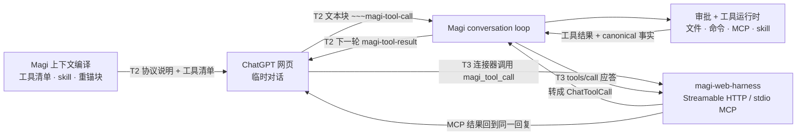

# Magi Web 模型浏览器 · 设计基线

> 状态：**最终设计基线**（未实现）。设计结论、状态所有权、上下文一致性与安全边界以本文为准；阶段划分、实测清单、接口草案、错误码、验收与代码索引见《[实现计划](./web-model-browser-product-implementation-plan.md)》。
> 更新日期：2026-09-28（**第五轮源码复核后定版**）。历史轮次：第一轮 R1–R21、第二轮 R22–R35、第三轮 R36–R46；第四轮为用户裁决 **R47「A10 改判：Connect 优先、未就绪时以 OpenAI Tunnel 正式交付」** 与 **R48「删除 T1」**；第五轮按源码事实修正 **R49 后台可驱动宿主（方案 A）**、**R50 绑定键加 thread**、**R51 累计账不走 `ModelResponse.usage`**、**R52 重锚块下发每次发送的随机串**、**R53 删除 T3 v1**、**R54 stdio 中继经本地 socket 连 daemon**、**R55 绑定表只驻内存**、**R56 最小分片排进阶段 3**、**R57 工具调用块改长围栏**、**R58 T3 `tool_call_id` 与去重口径**、**R59 `pending_tools` 不存明文令牌**，以及一致性修复 R60–R62。修改依据见《实现计划》附录 B。
> 相关文档：[工程约束与运行入口](./README.md)、[内置浏览器完整设计](./browser-runtime-design.md)、[上下文压力与压缩架构](./context-pressure-compaction-architecture.md)、[Turn、事件事实与对话执行架构](./conversation-response-core-architecture-redesign.md)、[Magi Connect 与移动端方案](./magi-connect-mobile-plan.md)
>
> 参考实现：[miuuyy/codex-chatgpt-web](https://github.com/miuuyy/codex-chatgpt-web)。本文只借鉴其已验证的机制思路，不照搬形态，不引入其代码或运行时依赖。
>
> 阅读指引：本文是唯一设计基线，只讲「是什么、为什么、边界」；阶段划分、文件级工单、接口字段、错误码、验收与代码索引见《实现计划》。编号约定：**不存在 §4**（原「关键决策」已并入 §0.2），§5.x 沿用既有编号以兼容跨文档引用；原「已关闭的产品问题」章节已合并进 §0.3。


---

## 0. 设计范围与决策

### 0.1 我们要做的是什么

在 Magi Desktop 的**内置浏览器**里登录 ChatGPT 网页账号（应用级、登录态长期保留），把该账号在网页端可用的 GPT 模型接入 Magi 的模型列表。用户在 Magi 对话中选择这些模型时，由内置浏览器中的 ChatGPT 网页完成推理，响应流式回到 Magi 对话；这些模型还能通过 Magi 的工具能力（读改文件、执行命令、调用 MCP / skill）完成真实的项目级开发。

- **为什么做**：ChatGPT 网页版使用账号的订阅额度，不消耗 API token。这是本功能存在的理由。
- **只做 ChatGPT**：其他厂商的网页版没有这一前提，不做，也不为其预留抽象。
- **Magi 仍是 agent**：会话、工具、审批、历史、压缩全部由 Magi 负责；ChatGPT 网页只承担"模型推理"这一步。
- **借助 Magi 已有能力**：登录、页面托管与自动化直接使用 Magi 内置浏览器（右栏宿主、BrowserAuthority、Automation Worker）；工具执行沿用 Magi 的 conversation loop、审批与 canonical 事实。参考项目只提供思路（A11：不新增宿主形态，落地见 §3、§5.2–§5.4）。

---

### 0.2 固定决策

以下决策是唯一结论源；正文只引用编号，确需解释时只补充与本决策直接相关的取舍，不重复展开。任何改动都必须先经用户明确确认并更新本节。

| 编号 | 结论 | 边界与理由 |
| --- | --- | --- |
| A1 | 只接入 ChatGPT 网页版；动机是使用账号订阅额度而不是 API token。 | 其他厂商网页版没有同一前提，不做通用适配器。 |
| A2 | 登录态与浏览器宿主是**应用级**资源；其中的**临时对话实例**按 Magi 会话及其线程隔离。 | 跨项目、跨会话共享登录态；对话隔离避免串上下文，线程维度保证编排者与子代理不共用一条临时对话（R50，§5.6）。 |
| A3 | 唯一入口是右栏“新增”菜单第三项 **GPT Web**；承载页面仍是右栏内容槽里的 `<webview>`。 | 右栏是浏览器 guest 唯一合法宿主；不引入隐藏窗口等第二宿主形态（应用级内容槽的挂载规则见 A25）。 |
| A4 | 关闭该 Tab 只关闭视图，不销毁宿主与登录态；进行中的推理不因关闭视图而取消，后台继续；登录态像浏览器缓存一样跨 Magi 重启保留。 | 与现有“关闭浏览器 Tab = 全局关闭”区分；取消推理是 conversation 的显式动作，另设“退出登录 / 清除 Web 数据”。落地规则见 A25。 |
| A25 | **应用级 Web 内容槽全程挂载（方案 A）**：只要存在应用级 Web 会话，右栏折叠只隐藏不卸载；关闭 GPT Web 视图只从 Tab 条隐藏、保留在 `appTabs`；Desktop Control 为 App 级 owner 提供**不写布局意图、不激活右栏、不抢焦点**的驱动路径。 | 这是对 `docs/browser-runtime-design.md` 的「折叠即卸载」与「关闭 Tab = 全局关闭」两条的**显式例外**，只为应用级 Web 会话引入（§5.1–§5.4）；仍不引入第二宿主形态。理由：`<webview>` guest 随宿主组件卸载而销毁，而自动化命令又会强制激活右栏，两者与 A4/A14 直接冲突（R49）。 |
| A5 | 每个 Magi 会话的**每条线程**使用**一条临时对话**并多轮续接（编排者与子代理各一条，R50）；只有新建、重建或失效时才全量重放。 | 默认不采用每轮新建临时对话；上下文保留在 web 侧，增量发送降低延迟与重复消耗。另提供**默认关闭**的「每轮新建对话」开关（§5.6），只用于隔离保留对话上的工具能力丢失。 |
| A6 | Web 模型清单进入现有 `engines`，标明来源为 Web；不建立第二套模型列表。 | 发现结果先返回候选，用户确认后走现有 `upsert_engine`；未登录或登录过期时不得展示 Web 模型。 |
| A7 | 推理实现为一个 `ModelBridgeClient`（`apiProtocol = chatgpt_web`），不新建消息通道。 | 复用 turn、事件、SSE 与前端渲染；避免第二条写入路径。 |
| A8 | 工具能力是**产品必需**能力，按 T0 无工具、T2 文本协议、T3 MCP 桥接交付；T3 是目标形态。 | T0 只是中间落地态；没有工具能力就不满足项目级开发。**T1「上下文内联」已按用户决定删除**（R48）：它不能调用工具，只会额外发送工具说明并计入额度消耗，收益为零；编号保留空洞以兼容既有引用。 |
| A9 | 工具档位与推理通道解耦，默认开启，可按引擎关闭。 | 用户对是否引入外部可见内容或云端通道保持知情可控。 |
| A10 | T3 通道：**Magi Connect 设备连接层优先；Connect 未就绪时以 OpenAI Tunnel（`openai/tunnel-client`）正式交付**（按参考项目形态）。两者都是正式形态；不以 Quick Tunnel 向用户交付 T3。 | Connect 复用既有出站隧道与安全边界；OpenAI Tunnel 是纯出站的稳定通道，不需要公网地址与入站端口，使 T3 不再被 Connect 排期阻塞。代价是引入第三方二进制与 OpenAI 平台凭据（仅 Tunnels Read + Use，按文件引用），显式记录在 §5.7.4。 |
| A11 | 借助 Magi 内置浏览器与现有运行时实现；参考项目只提供机制思路。 | 不照搬形态，不引入其代码或运行时依赖；不新增宿主形态（落地见 §3、§5.2–§5.4）。 |
| A12 | 临时对话中的上下文与 Magi 保持一致；Magi 按对话实际持有的内容计量，用网页端实测上限做预算，在超出前压缩并重建。 | 不依赖网页端截断，也不把 web 侧当成可恢复状态。 |
| A13 | 压缩由 Magi 现有压缩流程产出（有辅助模型用辅助模型，否则用当前 Web 引擎）；超限自动压缩后重建，不直接失败。 | 压缩后推进上下文 epoch，新建对话实例。 |
| A14 | 并发到达上限时排队并显示等待状态。 | 队列有深度与等待上限，不允许无限排队。 |
| A15 | T3 是产品终态；账号、套餐或 T3 通道不可用时自动降级到 T2，且降档不静默。 | 档位、降档原因与额度影响必须在 UI 可见。 |
| A16 | 档位价值按**完成一个任务消耗的 ChatGPT 消息条数**衡量：T3 约 1 条，T2 约等于工具轮次数。 | 这是把“同回复续接”列为目标形态、而非体验优化的产品理由。 |
| A17 | ChatGPT 自定义连接器由 Magi 在托管浏览器会话中自动配置，用户只确认一次授权说明。 | 用户不需要进入 ChatGPT 设置手动添加；失败 fail closed 并降级。 |
| A18 | T3 的“同回复续接”与“下一轮回填”是两条一等路径。 | 审批或执行超过挂起时限时走回填是常态，不作为异常兜底。 |
| A19 | 产品形态与性能优先，**不做兼容**：不迁移、不双读/双写、不版本协商、不保留旧格式运行期分支，也不支持应用降级。 | 唯一硬要求是可重建状态加载路径全函数：读不出来就重建，绝不让 daemon 加载失败。 |
| A20 | **web 侧不落盘**：不镜像、不缓存、不持久化对话正文与页面副本；Magi canonical 是唯一事实源。 | 从 web 读回并展示的会话记录在 Magi 持久化；绑定指针、累计账与前缀指纹只驻 daemon 进程内存（§5.12），重启即重建；web 侧丢失按正常路径全量重放。 |
| A21 | 应用级 GPT Web 会话使用**带 `persist:` 前缀的专用分区**（`persist:magi-web-model`），登录态才可能跨应用重启保留；宿主侧 partition 白名单与「清理浏览数据」按此调整。 | Electron 中没有 `persist:` 前缀的 partition 是**内存会话**，进程退出即丢；现有 `magi-browser-<id>` 分区不满足 A4。 |
| A22 | Web 模型的选择入口是**会话内主模型选择器**：清单位于现有 `engines`（唯一注册表），会话通过**会话级主模型覆盖新增的引擎绑定**指向该引擎；Web 引擎条目不写 `llm`，也不写入 provider 连接（`orchestrator` 段的 baseUrl / apiKey）。选择器的强度档位改为**按模型动态**：只展示该引擎 `efforts` 里的取值，不支持的置灰。 | 主对话现为「全局连接基座 + 会话级 `model` / `reasoningEffort` 覆盖」，完全不读 `engines`；不补这条绑定就没有可选入口，或会被迫在 UI 造第二套列表（违反 A6）。现前端 strength 是固定四档，需要改成按模型取值（《实现计划》§6）。 |
| A23 | 站点适配失败（selector 漂移）与风控 / 验证页同为**引擎级不可用状态**：引擎必须推进到 `site_blocked`（带 `reason`），不得停留在 `available`。 | 否则站点改版后模型看起来可用、每次发送都失败，用户没有任何持续状态可依据。 |
| A24 | **同一逻辑 Tab 全局只有一个 Primary**（`primary_surfaces` 以 tab 为键），推理只使用承载该 Tab Primary 的窗口；每个窗口各有一份独立的 App 级物理 Surface 集合（同一内容槽内的主页 + 每个活跃对话实例一个推理页，数量 ≤ 并发上限，§5.2；登录态靠同一 partition 共享）。非 Primary 窗口不复制用于推理的 Surface，显示「本窗口未承载当前推理」并提供「打开主窗口」动作。 | 与 `docs/browser-runtime-design.md` §4.1 的既有 Surface 规则一致；见 §5.3、§5.13。当前产品只创建一个窗口入口，多窗口行为按既有架构规则描述，产品化窗口入口由宿主另行提供。 |

---

### 0.3 不做与已否决

| 内容 | 不采用的原因 |
| --- | --- |
| 多厂商站点注册表与通用适配器 | 违反 A1 |
| 取消 T3，只保留 T2 | 违反 A8：T3 是多步项目级开发的目标形态 |
| 恢复 T1 上下文内联档位 | 违反 A8（R48）：T1 不能调用工具、只增加发送内容，收益为零 |
| 完全放弃 OpenAI Tunnel，只等 Magi Connect | 违反 A10：Connect 未就绪时 OpenAI Tunnel 是正式交付路径，T3 不得挂在单一外部排期上 |
| 只做 OpenAI Tunnel，不再推进 Magi Connect | 违反 A10：Connect 就绪时优先复用既有隧道与安全边界 |
| 全局串行（并发为 1） | 原方案为并发上限 + 排队；页面宿主问题已在 §5.3 / §5.6 解决 |
| 复用被保留的会话对话自身产出压缩 checkpoint（参考项目做法） | 用户选定 Magi 现有压缩流程（A13）：由 Magi 判定阈值、用一次性临时对话产出摘要，压缩后重建对话实例，绝不改写正在续接的那条对话 |
| 超限时直接明确失败 | 用户选定自动压缩后重建（A13） |
| 并发达到上限时第 6 个请求直接失败（参考项目做法） | 用户确认排队并显示状态（A14） |
| 超限时无限排队等待 | 队列有深度上限与等待上限，超出即明确失败 |
| 把 T3 的同回复续接当唯一正常路径 | 挂起时长受审批支配，回填是常态路径；两条路径都是一等公民（A18） |
| 要求用户自己进入 ChatGPT 设置添加连接器 | 由 Magi 在托管浏览器会话中自动配置（A17） |
| 按"实测窗口 + 固定 10% 预留"单独设压缩阈值 | 上下文架构要求告警与压缩只用一个 `ContextBudgetPolicy` |
| 用户自备稳定公网地址（自建域名 / 命名隧道等） | A10 已选定两条正式通道（Connect 优先 / OpenAI Tunnel）；要求用户自备域名或公网地址不在产品形态内（§5.7.4） |

> 自 2026-09-28 起，上表所列内容全部关闭；本文是唯一设计基线。重新开启任何一项都需要用户明确确认并修订 §0.2。

---

> 历史修订编号 C1–C42 只保留在《实现计划》附录 B；本文不再要求读者先读修订史才能理解设计。

---

## 1. 目标与场景

### 1.1 用户场景

| 编号 | 场景 | 期望行为 |
| --- | --- | --- |
| S1 | 用户想不配置 `baseUrl/apiKey` 就使用 GPT 的 Web 模型 | 右栏"新增"菜单多一项 **GPT Web**，点击后未登录进登录页、已登录直接显示 |
| S2 | 用户切换项目 / 会话 | 该会话与登录态仍然可用，不需要重新登录、不需要重新绑定 |
| S3 | 用户重开 Magi | 再次点击该项，登录态仍在（等价于"浏览器没有清理缓存"），直接进入可用页面 |
| S4 | 用户想用 Web 账号可用的模型 | Web 模型清单被读出并追加到 Magi 模型列表，明确标注"来自 Web" |
| S5 | 用户在对话框发消息、选了 Web 引擎 | 消息被送进内置浏览器的 Web 会话，响应增量回流到 Magi 对话展示 |
| S6（必需） | 用户要用 Web 模型做**真实项目级开发**（读改文件、跑命令、用 MCP / skill），而不是只能聊天 | 工具能力按 §5.7 分档交付；**T3 是目标形态**，T2 是先行档位；不得以"纯文本引擎"作为最终形态结案 |
| S7（必需） | 用户不想进入 ChatGPT 设置手动添加连接器就能用工具 | 连接器这类**站点配置**由 Magi 在托管浏览器会话中自动完成（A17）；OpenAI Tunnel 的 Tunnel 与仅含 Tunnels Read + Use 的 API 密钥仍需用户在自己的 OpenAI 平台创建（Magi 引导，不可代做）；账号 / 套餐不支持或通道前置未满足时自动降级为 T2，引擎处说明当前档位、降档原因与额度影响（A15） |

### 1.2 非目标

- 不接入 ChatGPT 以外的厂商（A1）。
- 不为 Web / 手机 Web 伪造可接管的浏览器。真实内置浏览器只在 Magi Desktop 存在（`require_desktop_browser_capability`）；无头 daemon 同样不提供。
- 不使用截图、canvas、iframe 或原生浮层投影网页内容（`docs/browser-runtime-design.md` §3.1、§10）。
- 不把 ChatGPT 对话历史当作事实源。对话在 Magi 会话内复用，但 Magi canonical 始终是唯一权威：web 侧一旦截断或漂移，以 Magi 记录为准并走重建路径。
- 不在 web 侧持久化任何状态：不镜像、不缓存临时对话副本，也不把它当作可恢复资源；web 侧丢失按正常路径处理（A20）。
- 不进入用户的 ChatGPT 历史记录：使用临时对话；临时对话的内容仍由 OpenAI 处理。
- 不在 UI 层建立第二套消息、模型或浏览器事实源。
- 不把"纯对话"当作 Web 引擎的最终形态：没有工具能力的 Web 引擎不满足产品要求（S6），阶段 1–3 的纯文本只是中间落地状态。
- 也不把 Web 引擎伪装成完整的 agent：工具能力的边界与可执行范围由 Magi 侧 registry、策略与审批决定，不由 Web 侧决定。
- 不使用任何规避风控、验证码或额度限制的手段。

### 1.3 一句话概括

**Web 模型浏览器是应用级的浏览器资源；模型清单靠"发现通道"读取、落进现有 `engines`；模型调用靠"推理通道"实现为一个 `ModelBridgeClient`；工具能力与推理通道解耦、按 T0 / T2 / T3 分档交付，且是必需能力（S6）；其中只有 T3 需要 MCP 与对外通道（Magi Connect 优先，Connect 未就绪时以 OpenAI Tunnel 正式交付）；任何档位的工具都只由 Magi 现有 conversation loop 执行。**

---

## 2. 名词

| 名词 | 含义 |
| --- | --- |
| Web 模型浏览器 | 应用级、可登录 GPT、登录态持久的内置浏览器会话及其物理 Surface |
| Web 引擎 | 由 Web 发现、标注为 Web 来源、由 Web 模型浏览器执行的模型条目（`apiProtocol = chatgpt_web`） |
| 发现通道 | 读取 Web 侧可用模型清单的只读链路 |
| 推理通道 | 把 Magi 的一次模型调用转成 Web 会话输入/输出的传输实现（`BrowserWebModelBridgeClient`） |
| 对话实例 | 由 `Magi 会话 × 线程 × 引擎 × effort × 上下文 epoch` 唯一确定的 ChatGPT 临时对话；turn 之间复用，工具轮次在同一对话内续接。线程维度保证编排者与子代理各用一条对话（R50） |
| 上下文 epoch | 一次「全量重放」的代数。**本功能新增的运行时代数**（既有上下文架构里没有这个概念，最接近的是 `checkpoint_generation`）：压缩安装检查点会同时推进两者，接管、主动重置、空闲释放只推进 epoch。新建对话、压缩重建、主动重置都会推进 epoch；沿用同一对话则为同一 epoch |
| 推理页面 | 承载对话实例的页面；由应用级 Web 内容槽持有，非活动时隐藏保活；同一对话实例同一时间只服务一次调用 |
| 站点适配层 | 集中维护 ChatGPT 页面 selector、模型菜单映射、effort 映射与完成谓词的唯一模块 |
| T3 通道 | 让 ChatGPT 连接器回调本机 `magi-web-harness` 的出站通道。两条正式形态：**Magi Connect 设备连接层（优先）** 与 **OpenAI Tunnel（Connect 未就绪时的正式交付）**，见 §5.7.4 |
| 工具档位 / 工具回路 | 让 Web 模型调用 Magi 工具 / MCP server / skill 的链路。**产品必需**（S6），按 T0 无工具、T2 文本协议回路、T3 MCP 桥接三档交付（§5.7）；T1 已删除 |
| 挂起式调用 | T3 下 ChatGPT 调用工具时，`tools/call` 应答保持挂起，loop 执行工具后再把结果交回，使模型在同一个 ChatGPT 回复内继续写完的机制（§5.7.3） |
| turn 令牌 | 每次发送生成的一次性能力令牌，T3 桥接工具调用必须携带；只驻 `magi-web-harness` 内存，不落盘、不入 canonical（§5.7.3） |
| 临时对话 | ChatGPT 的 Temporary Chat，不进入用户的历史记录；每个 Magi 会话的每条线程一条（绑定键见 §5.6） |
| 全量重放 | 对话实例失效或需重建时，由 Magi 产出自包含的单条上下文并发送 |
| 重锚 | 在续轮发送中重新附加工具协议、当前任务与关键约束，作为 web 侧意外截断时的保险；正常情况下 Magi 在超出前就压缩并重建 |
| 对话漂移 | web 侧对话内容与 Magi canonical 不一致的状态；由前缀指纹确定性判定，以 Magi 为准并触发重建 |
| 累计账 | 对话实例中实际存在的全部内容（已发送 + 已收到）的 o200k 计数累计，作为该会话上下文压力的锚点；经 `provider_context` 上报，不写 `ModelResponse.usage`（§5.9.4） |
| 续轮封装 | 续轮发送时由站点适配层生成的网页端可读文本块：用户增量块、工具结果块（`magi-tool-result` 块）与重锚块；固定文本格式见 §5.6 |
| 绑定所有权 | 对话实例的 `MagiOwned` / `UserOwned` / `Invalidated` 三态；只有 `MagiOwned` 可续轮 |
| 绑定表 | 推理通道在 daemon 进程内持有的应用级内存表，保存「绑定键 → 对话实例」的指针与计数（累计账、前缀指纹、所有权状态、账号提示）；进程重启即重建，不落盘、不承载用户资产（§5.12） |
| 应用级 | 不属于任何 project/session，不随会话或工作区切换销毁 |

---

## 3. 总体架构

```text
Magi Desktop（当前产品只创建一个窗口；多窗口按既有 per-tab Primary 规则，见 A24）
├── 可信 App Renderer
│   ├── 对话区（不变）
│   └── RightPane
│       ├── 新增菜单：终端 / 浏览器 / GPT Web  ← 本方案新增第三项
│       └── 内容槽（应用级 Web 会话存在时全程挂载，折叠右栏只隐藏不卸载）
│           └── GPT Web：主页 + 每个活跃对话实例一个推理页面（<webview>，非活动时 hidden 保活）
├── Electron Main
│   ├── guest WebContents / CDP / 下载 / 权限（规则不变）
│   └── partition persist:magi-web-model（应用级持久分区，A21；登录态持久）
├── Automation Worker
│   └── ChatGPT 站点适配层（selector、模型菜单、原子写入、快照读取、完成谓词）
└── magi-daemon
    ├── BrowserAuthority
    │   ├── 会话级 Browser Session（现状）
    │   └── 应用级 Web 模型 Browser Session（本方案新增 scope）
    ├── crates/magi-web-model（新增）
    │   ├── 发现通道（只读 → 引擎草稿）
    │   ├── 推理通道 BrowserWebModelBridgeClient : ModelBridgeClient
    │   ├── 工具档位 T2：文本协议渲染与解析（T1 已删除）
    │   └── 工具回路 T3：magi-web-harness（独立端口的 MCP 入口 + turn 令牌）
    ├── conversation loop（不变）：工具执行、审批、canonical、压缩
    └── T3 通道：Magi Connect（优先）/ OpenAI Tunnel（Connect 未就绪时的正式交付，§5.7.4）
```

四个能力的职责边界：

| 能力 | 输入 | 权威事实 | 失败影响 |
| --- | --- | --- | --- |
| 应用级浏览器会话 | 用户登录、手动操作 | BrowserAuthority（逻辑）+ Main（物理） | 该 Tab 不可用；不影响其他会话 |
| 发现通道 | 只读页面 DOM | 读取结果只是"候选"，落库仍走 `engines` | 发现失败时不更新 Web 模型；未登录时 Web 模型不进入常规列表，其他引擎不受影响 |
| 推理通道 | Magi 的一次 `ModelInvocationRequest` | Magi canonical turn/item | 该 turn 失败；不得静默降级到其他模型 |
| 工具能力（必需，分档交付） | Web 侧发起的工具调用 | Magi conversation loop + 工具运行时 + 审批 + canonical 事件 | 调用返回明确错误；不得绕过审批 |

---

> 本文沿用既有 §5 详细设计编号以兼容跨文档引用；原 §4 关键决策已合并进 §0.2，不再单设章节。

---

## 5. 详细设计

### 5.1 状态所有权与生命周期矩阵

| 状态 | 唯一 owner | 持久化 | 备注 |
| --- | --- | --- | --- |
| 登录态（cookie / 存储） | Electron 应用级持久分区 `persist:magi-web-model` | 是 | 现有 `browserPartitionId` 派生出的 `magi-browser-<id>` **没有 `persist:` 前缀，是内存会话，进程退出即丢**；A21 要求应用级会话改用持久分区，并同步 `apps/desktop/src/main/browser-webview-security.ts` 的 partition 白名单、`browser-surface-manager.ts` 的 `configurePartition` 与 `clearBrowsingData` |
| 应用级会话身份、主页 Tab、URL | daemon BrowserAuthority（app scope） | 是 | 见 §5.3 |
| 对话实例（临时对话）与其绑定关系 | 推理通道（按绑定键）+ BrowserAuthority（页面） | 否（daemon 进程内内存表，§5.12） | 一个绑定键（Magi 会话 × 线程 × 引擎 × effort × epoch）一条；**只存指针，不镜像 web 侧副本**：页面 URL、DOM、composer 草稿与 ChatGPT 侧历史都不落盘，页面本身按需重建。内存表丢失即按"无绑定"处理，会话首次使用时新建临时对话并全量重放（A19） |
| 对话实例的累计账与前缀指纹 | 推理通道 | 否（同一内存表） | 见 §5.9.4、§5.9.7 |
| 对话实例的所有权状态（`MagiOwned` / `UserOwned` / `Invalidated`） | 推理通道 | 否（同一内存表） | 只有 `MagiOwned` 可续轮，见 §5.8 |
| 推理页面 | BrowserAuthority（逻辑）+ Main（物理） | 否 | 由推理通道创建、按需重建 |
| 应用级 Web 内容槽与推理页面挂载 | App Renderer（窗口级） | 否 | 只要存在应用级 Web 会话就保持挂载；折叠右栏与关闭视图只改可见性（A25、§5.2） |
| 物理 guest / CDP / 页面 | Electron Main | 否 | 按需物化 |
| 右栏"存在哪个 Tab" | App Renderer（窗口级存储） | 仅窗口内 | 只存指针，不存浏览器实体 |
| Web 引擎清单 | settings `engines` | 是 | `origin` 元数据标注来源 |
| 对话内容、工具调用与结果（含从 web 读回的助手正文与 thinking） | daemon canonical event log | 是 | **展示即落盘**：UI 看到的每一条内容都来自 canonical，含流式 thinking 项的 upsert；不进入的是用户的 ChatGPT 历史记录，不是 Magi 的会话记录 |
| 推理与工具调用中的占用 | BrowserAuthority lease + turn_id | 随 turn | 复用现有租约语义 |
| turn 令牌、挂起的 MCP 调用 | `magi-web-harness` 内存表 | 否 | daemon 重启即失效（§5.8） |
| 引擎可用性与当前工具档位 | daemon 派生投影 | 否 | 见 §5.11 |
| Web 侧上限表（可用窗口、输入框字符上限、推理预留） | 站点适配层 | 随应用发布 | 由阶段 0 标定，见 §5.9.2 |

生命周期矩阵（应用级 Web Tab）：

| 事件 | 行为 |
| --- | --- |
| 切换右栏活动 Tab | guest 保活（沿用现有"非活动 Tab 保留页面"规则）；推理不中断 |
| 切换项目 / 会话 | 应用级 Tab 与推理页面不随会话释放（对现有"跨会话释放当前窗口 guest"规则引入显式例外）；GPT Web Tab 切换到目标会话当前线程的对话实例，其他实例的推理页面继续挂载保活（A25） |
| 点击该 Tab 的关闭按钮 | 仅隐藏视图（从 Tab 条移除、仍留在 `appTabs` 并保持挂载，A25）：不销毁 guest、不取消推理；重新打开可看到最新状态；显式取消才停止该 turn；登录态保留 |
| 折叠右栏 | 只要存在应用级 Web 会话，右栏保留挂载、只做视觉隐藏（A25）：不卸载组件、不销毁 guest、推理不中断；无应用级 Web 会话时维持现有折叠即卸载 |
| `Suspended` 时收到推理调用 | 自动恢复并重新物化页面；GPT Web Tab 在后台回到 Tab 条，不抢焦点 |
| 关闭主窗口（默认行为） | 主窗口只是隐藏到托盘（宿主 `shouldHideWindowOnClose`），不释放 Surface、不释放应用级 guest，进行中的 Web 推理继续在后台；重新显示窗口即可看到最新状态 |
| 退出 Magi / 操作系统退出 | shutdown 释放全部窗口与 Surface；进行中的 Web 推理按 turn 中断收口，重启后会话内保留中断记录与原错误码并可重试，不静默续跑 |
| daemon 重启 | 逻辑会话与主页 URL 恢复，页面按需重新物化；**一律推进上下文 epoch**：现有 Desktop Control 协议没有**带 canonical 消息标识的语义回读**命令（只能读到页面可见文本，无法还原成 Magi 的消息序列），无法重建续轮增量，因此不尝试沿用旧对话，直接由 canonical 全量重放（A20）。代价是重启后首次使用多消耗一条账号消息额度 |
| 对话实例失效 / 漂移 | 以 Magi canonical 为准全量重建；不尝试修补 web 侧对话 |
| Desktop 重启 | 新 `desktopEpoch`；登录态保留，页面重新创建；内存绑定表清空，下一次发送按全量重放处理 |
| 资源回收 `/browser/resources/reclaim` | **默认排除**：`is_reclaimable_tab` 现只看生命周期与租约、没有 owner 维度，需先补 owner 分支，App 级 Tab 一律不可回收；设置 → 浏览器 的页面资源列表对 App 级页面追加常驻说明「Magi 托管的 GPT Web 页面不参与回收，请用『清除数据』处理」，避免出现占用 N/M 却回收 0 个的观感 |
| 清除 Web 数据 | 显式操作：取消进行中的推理，关闭该应用级会话并清理 partition |

### 5.2 右栏 Tab（UI 层）

- `web/src/web/RightPane.svelte` 的 `addablePaneKinds` 增加第三项：`kind: 'webSession'`、`label: i18n.t('rightPane.addPanelWebModel')`、`tabLabel: i18n.t('rightPane.webModelTabLabel')`、`icon`、`enabled: canCreateWebModelPane`。可用性判定沿用同文件 `canCreateBrowserPane` 的 Desktop-only 逻辑。（`webSession` 是 Tab kind 的技术标识，i18n key 是展示文案；两者不要互相替代。）
- **菜单项始终渲染，用 `enabled` + `disabledReason` 表达不可用**：现有实现对 browser 项在不可用时整项不渲染，而「新增」按钮又以 `any enabled` 决定是否存在，等于在 Web / 手机 Web 上功能完全消失且没有解释。新增的第三项必须始终可见，禁用时显示原因（非 Desktop →「仅在 Magi Desktop 可用」）。
- `web/src/stores/right-pane.svelte.ts` 的 `RightPaneTabKind` 增加 `webSession`，并在 `RightPaneTabPayload` 增加对应 payload（承载浏览器会话 ID / Tab ID，不承载页面内容）。
- **app 级 Tab 需要独立的容器**：在右栏 store 增加与 `perSession` 并列的顶层 `appTabs`（窗口级、仅进程内）。`perSession` 仍是会话级 Tab 渲染、持久化与恢复的唯一容器；`webSession` 一律不进 `perSession`，因此也**不进入** `tabsForPersist` / `isRestorableTab`（两个白名单只作用于 `perSession`，不要为它加例外）。`activateRightPaneSession` 切换会话时不动 `appTabs`。
- Tab 的幂等键固定（应用级单例）：同 kind 同 key 再次打开是激活既有 Tab，不新建。
- 视图显示状态不做窗口级持久化：`appTabs` 由 BrowserAuthority 的 app 级会话在每次连接后投影重建，视图的显示与否只在当前窗口进程内有效。
- **新增内容组件 `web/src/components/tabs/WebModelTabContent.svelte`**：现有 Browser Tab 的内容槽是「一个 Tab 一个 `<webview>`」，放不下应用级 Web 的多个宿主。新组件在同一内容槽内维护：**一个主页 webview**，加**每个活跃对话实例一个推理页面 webview**（数量 ≤ §5.6 的并发上限，不设预热池）；当前会话当前线程的推理页面显示、其余 `hidden` 保活（沿用非活动 Tab 的既有规则），「主页 / 推理页面」切换只切可见宿主，不新建页面。该例外同步登记到 `docs/browser-runtime-design.md`。
- **宿主挂载规则（A25，方案 A）**：只要存在应用级 Web 会话，该内容槽与它承载的 guest **不随右栏折叠、也不随关闭视图卸载**。
  - 折叠右栏 = 右栏组件保留挂载、只做视觉隐藏（`display: none` + `aria-hidden`），不销毁任何 `<webview>`。现状是折叠即卸载组件、连带销毁 guest，必须改。
  - 关闭该视图 = 从 Tab 条隐藏、仍留在 `appTabs` 并保持挂载，**不调用 `closeBrowserTab`、不发起任何 Authority 关闭命令**。
  - 只有「退出登录 / 清除 Web 数据」、应用级会话关闭或应用退出才释放这些 guest。
- 推理页面不单独出现在 Tab 条上，推理进行中显示「Magi 正在使用」提示；查看本身不改变所有权，用户一旦在页面里操作即按 §5.8 进入接管。
- 对话实例按绑定键隔离（Magi 会话 × 线程 × 引擎 × effort × epoch）：切换会话时 Tab 显示目标会话当前线程的对话实例，其他实例的页面继续挂载保活；同一对话实例的多次 turn 复用同一条临时对话。
- **关闭按钮走 A4 / A25 语义，且不弹确认**：只做右栏本地隐藏（从 Tab 条移除、保留在 `appTabs`），不销毁宿主与登录态，不取消进行中的推理。这与现有「关闭浏览器 Tab = 全局关闭」是两个不同的 API 与两种不同的后果。实现落点：现有 `handleTabClose`（`web/src/web/RightPane.svelte`）是**所有 kind 共享**的关闭路径，`browser` 分支会调 `closeBrowserTab`；新增的 `webSession` 分支必须在这条共享路径上分叉，同时 `RightPaneCreationKind`、`tabIcon`、`tabTooltip` 需要补分支（否则图标与提示落到默认值）。
- **关闭动作要有即时反馈**：点击关闭时给一次性提示「已隐藏视图，推理仍在后台继续」+「停止推理 / 打开视图」两个动作，避免用户以为点了 × 就等于停止（额度按实际发送次数计，§5.10）。「停止推理」复用会话的显式取消路径。
- **隐藏只在当前窗口进程内有效**：关闭视图即从 Tab 条隐藏该视图；重连或重启后按 S3 由投影恢复为显示，若该会话仍有进行中的推理则同时提示「后台推理中」。用户随时可以从「新增 → GPT Web」再次打开视图。
- 关闭视图后必须有后台指示：GPT Web 视图关闭期间，右栏「新增」菜单的 GPT Web 项与「设置 → 浏览器 → GPT Web 模型」分区显示进行中的推理数量（例如「GPT Web（后台推理中 · N）」），并保留一条可点回的入口；会话内该 turn 的运行指示行同时显示「视图已关闭 · 推理继续」与「打开视图」；推理结束或失败后清除。
- 平台降级：Web / 手机 Web 上该菜单项禁用并给出明确原因，不静默失败。

### 5.3 BrowserAuthority：应用级 owner scope

```rust
pub enum BrowserSessionOwner {
    Session { session_id: SessionId, workspace_id: Option<WorkspaceId> },
    App, // 应用级：不属于任何会话或工作区
}
```

`BrowserSession` 现有 `session_id: SessionId` 的语义被 `owner` 取代；`session_for_magi_session` 只匹配 `Session` 分支。**不迁移旧浏览器状态**（A19）：直接推进 `BROWSER_DURABLE_STATE_SCHEMA_VERSION` 并替换字段，不写 `session_id → owner` 迁移；加载路径按 A19 改为全函数（结构反序列化失败或版本不认识即按「无状态」重建）。因此升级或文件损坏只会丢掉几个浏览器 Tab 指针（用户重新打开即可），Electron partition 里的登录态不受影响；应用降级不在支持范围内（A19）。

| 关注点 | 规则 |
| --- | --- |
| 唯一性 | App 级会话全局唯一，ID 持久稳定；宿主使用**固定分区名** `persist:magi-web-model`，不随 ID 变化（A21），因此 ID 变化不再影响登录态。**创建入口仍必须先查已有 App 级会话再决定是否新建**：现有 `browserSessionId` 由服务端按时间戳 + 序号生成，反复新建会留下无主会话与多余物理 Surface |
| 创建入口 | **固定为新增 `POST /browser/sessions/app`**（不要求 `session_id`，不改既有 `CreateBrowserSessionRequest` 的形状）；请求/响应字段见《实现计划》§7.5 |
| 孤儿回收 | **只有 `Session` 分支参与孤儿判定**：`reconcile_browser_sessions_with_session_store` 与 `close_browser_session_for_magi_session` 现按 `session_id` 匹配，必须按 owner 分支，否则 App 级会话会在一次对账后被转 `Closed` |
| 会话关闭 / 工作区切换 | 只关闭会话拥有的 Browser Session；App 级不受影响 |
| 每会话单会话约束 | 只对 `Session` 分支生效 |
| 页面构成 | 一个主页 Tab + 每个活跃对话实例一个推理页面（按需创建，不做预热池，R38；数量 ≤ 并发上限）；推理页面只能由推理通道创建、按需重建 |
| 对话实例隔离 | 绑定键为 `Magi 会话 × 线程 × 引擎 × effort × 上下文 epoch`，由推理通道维护；不同 Magi 会话、不同线程、不同引擎或不同 effort 都不共享对话实例（R50） |
| 驱动路径 | App 级 owner 新增**不激活路径**：目标 Tab 的 Surface 已在当前窗口注册且 content-slot 绑定有效时，命令直接复用该 binding，**不写 `right_pane_visibility` / `active_panel`**；只有 Surface 尚未注册时才物化，且物化不附带激活意图。现有 `requireRenderablePrimaryBinding → ensureBrowserSurface → activateBrowser`（`apps/desktop/src/main/desktop-control-server.ts`、`window-manager.ts`）对 App 级 owner 必须走这条分支，否则每次推理都会抢走右栏（A25、§5.4） |
| 配额 | 不适用 `MAX_BROWSER_TABS_PER_SESSION`；主页与推理页面计入 `MAX_BROWSER_TABS_TOTAL`；推理页面按需创建（不做预热池），同时存在的数量受 §5.6 的并发上限约束 |
| 资源回收 | `is_reclaimable_tab` 需补 owner 维度：App 级一律排除，并在设置 → 浏览器 的页面资源列表里说明原因 |
| Primary / `surfaceRevision` | 沿用现有规则：每个窗口可各有一份物理 Surface，**同一逻辑 Tab 全局只有一个 Primary（`primary_surfaces` 以 tab 为键）**，`surfaceRevision` 单调推进；推理只使用当前 Primary（A24） |
| 持久化 | App 级会话与主页 Tab 进入持久化；恢复时不得因「没有对应会话」被判为孤儿清除 |
| 浏览器工具可见性 | App 级会话**不暴露**给任何会话的 `browser_*` 工具，避免 agent 读取或操作已登录页面 |
| 数据清理 | 「清理浏览数据」现会清掉所有已知 partition 的 storage；执行时必须先取消进行中的 Web 推理、失效全部绑定，并把 Web 引擎推进到 `login_required`（§5.13） |

### 5.4 Desktop / Main

- 应用级会话使用**稳定** `browserSessionId`，并落在**带 `persist:` 前缀的专用分区** `persist:magi-web-model`（A21）：Electron 的 partition 只有带 `persist:` 才落盘，现有 `magi-browser-<id>` 是内存会话，退出即丢。该分区不与其他 Browser Tab 共用，也不参与通用 partition 清理之外的任何隐式回收。
- 宿主侧同步改动：`apps/desktop/src/main/browser-webview-security.ts` 的 `BROWSER_PARTITION_PATTERN` 需接受应用级持久分区；`browser-surface-manager.ts` 的 `browserPartitionId` / `configurePartition` 需区分应用级分区；**分区注册表（`readPartitionRegistry` / `persistPartitionRegistry`）的分区过滤规则必须同步放行**，否则 `persist:magi-web-model` 会被静默丢弃，导致无 guest 挂载时「清理浏览数据」漏清该分区；`clearBrowsingData` 需支持按应用级分区粒度清除（§5.13 的「清除数据」复用同一个入口，不新增第二个按钮）。
- 页面仍来自右栏内容槽的 `<webview>`；Main 的安全边界、URL allow-list、popup 决策、下载与权限规则**完全不变**。
- **应用级内容槽全程挂载（A25）**：折叠右栏只隐藏右栏容器，不卸载组件、不销毁 guest；关闭视图只在 Tab 条上隐藏该视图。受管 guest 已关闭后台节流（`setBackgroundThrottling(false)`），隐藏期间仍可生成与读取。
- **不激活驱动路径**：`window-manager.ts` 的 `activateBrowser` 会固定写 `right_pane_visibility: true` 与 `active_panel: browser/<tabId>`，因此现有 `requireRenderablePrimaryBinding` 路径每次命令都会抢走右栏；Main 必须为 App 级 owner 提供 `ensureBrowserSurfaceInBackground`（或等价参数）：Surface 已注册时直接返回 binding，未注册时只物化、不写布局意图。渲染层由 `WebModelTabContent.svelte` 挂载隐藏的 `<webview>` 完成注册，因此常规推理不需要任何激活动作。
- 该 Tab 不随会话关闭被级联释放；窗口关闭仍按现有规则释放该窗口 Surface（隐藏到托盘不释放，见 §5.1）。
- **登录弹窗**：现有 popup 单一决策链会阻止命名窗口和带独立窗口特性的弹窗，典型 OAuth 弹窗属于此类。Magi **不向 ChatGPT 页面注入或筛选登录方式**（那是第三方页面的 DOM）；正确做法是：阶段 0 实测邮箱、Google、Microsoft、Apple 等登录方式在该规则下是否可用，把结论写进 Magi 自己的登录提示条，并在 popup 被阻止时在 GPT Web 主页叠加一条**持久提示条**（列出可用方式与替代建议，直到登录成功），避免用户只看到一闪而过的页面内提示。不为登录新增宿主形态或放宽 popup 规则。

### 5.5 发现通道

```text
「设置 → 浏览器 → GPT Web 模型」点击「连接 / 刷新 Web 模型」
  → daemon 解析应用级会话与 Primary Surface
  → 确保已登录（页面探测，见下）
  → 读取站点模型选择器（菜单项 + effort 档位 + 账号能力）
  → 归一化为引擎草稿（带 origin=web）
  → 返回设置页展示 → 用户确认 → 写入 `engines`（唯一注册表）
```

接口形状见《实现计划》§7.1；本节只约束「只返回候选、不落库、失败显式」。

- 失败时返回明确的 `status` 与原因，不回退到旧列表、不猜模型。`status` 是**这一次探测的结果**（含 `ok` / `failed` 这类单次结果），不等于 §5.11 的引擎长期状态；两者的映射以《实现计划》§7.1 的映射表为准，引擎状态只以 §5.11 为唯一枚举。
- **未登录或登录过期时，发现结果必须是 `status = login_required` 且 `engines = []`**；不得用上次缓存的 Web 模型列表冒充可用结果。
- 已落库的 Web 引擎在登录态无效时只保留在 `settings.engines` 作为可重建记录，不投影到会话内模型选择器；「设置 → 浏览器 → GPT Web 模型」只显示一条「Web 模型未登录，已隐藏」的状态与登录入口。
- 登录成功并完成一次有效发现后，才把 Web 模型重新投影到模型选择器；发现失败或未登录时，选择器里不能出现任何 Web 模型。

约定：

- 只读探测，绝不写页面、绝不下单、绝不改变用户当前会话状态。
- 登录态判定由 daemon 做一次页面探测并把结果作为状态回传：需要服务端会话有效与临时对话输入框可用两项证据；UI 只展示，不自造结论。
- 站点的模型菜单是 DOM 事实，必须集中实现，不得散落到 UI、daemon、Worker 多处。站点适配层分两半且各只有一处实现：**DOM 事实**（selector、命名、effort 映射、原子写入与回读、完成谓词）在 `browser-automation-worker`；**文本协议**（续轮封装、`magi-tool-call` 解析、重锚块、`tool_call_id` 生成）在 `crates/magi-web-model`。
- 读取真实菜单是本方案的产品要求（S4：把该账号可用的模型追加进 Magi 列表），代价是承担 selector 维护成本，用「录制 DOM 快照 fixture + 单测」控制漂移（《实现计划》§9.4）。参考项目走的是「随应用发布的静态路由表 × 账号能力」、DOM 只用于选择与校验；Magi 不采用该做法，因为它无法发现账号新开放的模型。
- 归一化结果带命名空间与稳定身份（`chatgpt-web/<family>`），避免与用户自填模型在身份与用量统计上串味（用量归 `magi-usage-authority`）。
- 站点改版导致的探测失败必须显式报错并可重试（引擎转 `site_blocked`、`reason = selectors_drift`，A23），不允许「猜一个模型顶上」。
- **Web 引擎的条目形状与现有引擎不同**：现有 `engines[*]` 的形状是 `{ id, displayName, llm: { baseUrl, apiKey, model, urlMode, apiProtocol, … } }`。三处真实约束必须同时改：① `normalize_engine_entry` 只保留 `id / displayName / llm / runtime`，会**丢弃顶层新字段**、并在缺 `llm` 时写入空对象 `{}`，因此必须按 `chatgpt_web` 保留 `apiProtocol / origin / contextWindowTokens / efforts` 与引擎级开关；② `NormalizedModelConfig::from_settings_value` 对未知 `apiProtocol`、以及「有连接字段但缺 `apiProtocol`」都**直接报错**（不会静默补），所以需要新增 `ChatGptWeb` 变体，并让 `to_http_protocol` / `to_http_model_client` 能表达「非 HTTP」而不是落入既有枚举；③ `magi-settings-store` 的规范化只作用于 `llm` 子对象——Web 引擎**不写 `llm`**，来源与协议写在顶层（`apiProtocol = chatgpt_web`、`origin`、`contextWindowTokens`），因此不进入该分支；但一旦实现把连接字段写进 `llm`，它会被补成 `openai_chat`，这是必须避免的回退。
- `origin` 是附加元数据，落在 settings `engines`（Rust 侧无类型 JSON）与前端类型 `web/src/shared/types/registry-types.ts` 上；**它不经过 App Server schema，也不产生生成物变更**，不为其做字段级兼容开关（§6）。字段形状与缺省规则见《实现计划》§7.1；没有 `origin` 的旧引擎等价于用户自填。
- `accountHint` 记录发现时的账号等级，用于 `refresh_required` 判定（§5.9.2）；`connector` 是连接器自动配置的结果记录（§5.7.3），配置失败时不写该字段。
- 发现时按账号等级、模型族与档位查 Web 侧上限表，把可用窗口写入每个引擎草稿的 `contextWindowTokens`（§5.9.2）。
- **每个模型族的 `efforts` 取值域由发现结果给出**，会话内选择器只展示该族支持的档位（其余置灰），避免用户选到站点不支持的强度：绑定键含 effort，切档会重建对话并多消耗一条账号消息。
- 刷新时机（探测触发矩阵）：应用启动后首次进入 GPT Web、窗口重新获得焦点后、登录成功后、从登录页返回后、用户手动「刷新 Web 模型」。**不做周期性轮询**；每次发送前另做一次轻量登录态与档位复核（§5.6 步骤 2），失败即按 `login_required` / `site_blocked` 收口，不静默重试。
- **无有效探测结果时 fail closed**：启动后尚未探测、探测进行中、或探测失败未归类时，一律不投影 Web 模型（不得用上一次结果占位）；已落库的 Web 引擎条目照常保留在 `settings.engines` 中作为可重建记录。
- 账号能力交叉校验：探测读到的账号等级与 `origin.accountHint` 或上限表不一致时，引擎转 `refresh_required`，由用户刷新确认，不自动改写引擎条目。

### 5.6 推理通道

`BrowserWebModelBridgeClient` 位于 `crates/magi-web-model`，只提供流式 + 可取消语义；非流式 `invoke` 返回显式错误（遵循 trait "不静默降级"的要求）。

**身份绑定（A22）**：`ModelInvocationRequest` 只有 `provider / prompt / messages / tools / tool_choice`，不携带会话身份，绑定键的五个分量按下列路径取得：

| 分量 | 来源 | 事实核对 |
| --- | --- | --- |
| Magi 会话 | 调用方已有的 `session_id` | 既有 |
| 线程 | 调用方已有的 `thread_id`（编排者为会话主线程，子代理为各自 thread） | 既有概念：上下文架构的锚点键已含 `thread_id`（`docs/context-pressure-compaction-architecture.md` §6.1）。不加这一维时，子代理继承 Web 引擎会与编排者落进同一条临时对话（R50） |
| 引擎 | **会话级主模型覆盖里的引擎绑定**（`engineId`） | 现状：会话级 `orchestrator` 覆盖只接受 `model` / `reasoningEffort`，主对话解析全程不读 `engines`，因此这个字段是**新增项**，不是既有能力 |
| effort | 会话级覆盖里的 `reasoningEffort`，取值域由发现结果限定 | 既有字段、新增取值约束 |
| 上下文 epoch | 推理通道自持的运行时状态 | 不进 DTO |

- 构造 client 的路径是 `resolve_target_for_role` → `build_orchestrator_client` → `resolve_orchestrator_model_config`。这三处都必须改，不能只「保持不变」：① `build_orchestrator_client` 新增 `chatgpt_web` 分支构造 `BrowserWebModelBridgeClient`，**不能返回 `None`**——现有实现在 orchestrator 解析返回 `None` 时会回退到 daemon 注入的 `default_client`（HTTP 模型），那正是"静默降级到其他模型"；② `resolve_orchestrator_model_config` 产出的配置仍会带全局基座的 `baseUrl / apiKey`，`chatgpt_web` 分支必须**忽略**它们、不得因此走 HTTP；③ `RoleTarget::Agent` 显式配 `engineId` 时仍走 `agents[*].engineId → engines[*].llm`，但**角色 `engineId` 为空时会显式继承 orchestrator 模型**，因此子代理会继承 Web 引擎：本方案明确**支持继承**（子代理同样由浏览器 client 承载，沿用同一并发、队列与 epoch 规则），且**子代理使用自己的 `thread_id` 参与绑定键**，与编排者各用一条临时对话，不串行、不互相拆台（R50）；同时在子代理创建前置检查里拒绝「继承到的 Web 引擎当前不可用」的情况。
- `ModelApiProtocol` 新增 `ChatGptWeb` 变体，`to_http_protocol` / `to_http_model_client` 对它显式返回「非 HTTP 协议」，**不得落入 `openai_chat` 默认分支**；`HttpModelBridgeProtocol` 不新增取值。
- **上下文 epoch 与工具档位由这个 client 自己维护，不作为 `ModelInvocationRequest` 字段（不扩 DTO）；epoch 同时是绑定键的一部分，随绑定持久化（§5.12）。**
- 绑定记录（绑定键、页面身份、累计账、前缀指纹、最近一次已接受发送、所有权状态、账号提示）只保存在 daemon 进程内的**应用级内存表**（§5.12）：不落盘、不新增文件、不写会话 sidecar、不写 settings。进程重启即按「无绑定」重建；去重与副作用保护始终以 canonical 的 `turn_id + tool_call_id` 账本为准，不依赖内存表跨重启（R55）。
- 「最近一次已接受发送」的用途**只有发送去重与崩溃恢复判定**：现有 Desktop Control 协议没有**带 canonical 消息标识的语义回读**命令（只能读到页面可见文本，无法还原成 Magi 的消息序列），因此 daemon / Desktop 重启后**不尝试回读 web 侧历史**，一律推进 epoch 并按 canonical 全量重放（§5.1、§5.9.7）。

对应变更见《实现计划》§6。

**对话选择**

| 情况 | 行为 |
| --- | --- |
| 该键没有对话实例 | 新建推理页面 → 导航到 Temporary Chat → 发送**完整上下文**（全量重放） |
| 已有该键的对话且未失效 | 复用同一页面 → 只发送**上次助手回复之后的增量 + 重锚块** |
| 对话失效 / 已发送内容在 Magi 一侧变化（压缩、回退、改写）/ 用户接管或页面内改模型与 effort（`UserOwned`）/ 换账号或账号级能力变化（`Invalidated`）/ 用户主动重置 / 空闲触发释放 / daemon 重启后不可恢复 | 推进**上下文 epoch**，旧对话退场，按"新建"路径全量重放（§5.8） |

内部步骤：

1. **取用对话**：按绑定键 `<session_id>|<thread_id>|<engine_id>|<effort>|<epoch>` 查找对话实例；命中则复用其页面（已挂载则直接驱动，不激活右栏），未命中则新建推理页面、导航到 `?temporary-chat=true` 并等待 composer 就绪。
2. **校验档位**：每次提交前复核模型与 effort（用户可能在页面上手动改过）；不一致即把绑定判为 `UserOwned`（§5.8）、推进 epoch 后按"新建"路径全量重放，绝不改用其他模型。
3. **注入内容**：新建或重建时注入完整上下文；续轮时注入"上次助手回复之后的增量 + 重锚块"。两者都由站点适配层统一渲染，避免各档位各自拼字符串。
   - **续轮封装**：网页端只能接收 composer 文本、没有 `role` 概念，所以增量一律表示为可读文本块，由站点适配层统一生成：**用户增量块**（Magi 的新用户消息）、**工具结果块**（含 `turn_id`、`tool_call_id`、工具名与结果正文）、**重锚块**（协议与档位、当前任务目标、关键约束，以及**每轮重新生成的 `turn_nonce`**——T2 工具块必须把它原样回带作为 `turn_id`，否则整块忽略，R52）。T2 的每个工具轮次与 T3 超时后的回填共用同一封装；对话历史留在网页端，不重复回放，也不发送 `role=tool` 这类网页端无法接收的消息。
   - 续轮封装的固定格式、定界规则与注入防护由站点适配层唯一实现，literal 契约与字段语义见《实现计划》§7.3；其他层不得自行拼装字符串。

   - 定界用 `<<<` / `>>>` 而不是 Markdown 围栏，避免工具结果正文里的反引号破坏解析；块外内容忽略。用户原文与工具结果正文都可能自带定界符或伪造的工具调用块，站点适配层必须用长度前缀包裹正文，并拒绝任何嵌套块（格式与解析规则见《实现计划》§7.3）。
   - 重锚块每轮必发；`protocol` 与 `tools_revision` 必须与当前档位一致，档位变化即推进 epoch（§5.7.0）。
   - 工具结果正文超长时不做本地截断，按 §5.9.6 走超限路径（压缩后重建）。
   - 发送前做 **composer 预检**：用 Web 计数器计算发送后该对话的累计占用（续轮为累计账 + 续轮封装，新建或重建为完整上下文），并校验单条内容的输入框字符上限（`composer_char_limit`）与**单条提交的 token 预算**（`single_submission_token_budget`，§5.9.2；部分账号的浏览器单条提交预算远小于模型窗口）。写入后回读确认文本以内联形式留在输入框中，没有被转为附件。任一不满足即返回 `ContextLengthExceeded`，由 Magi 压缩后重建（§5.9.6）；若压缩后的自包含上下文仍超过单条提交预算，走 §5.9.6 的最小分片路径，绝不截断；此时尚未提交，没有副作用。
   - `browser_type` 对 contenteditable + 富文本编辑器的长文本不可靠；需要新增“页面内原子纯文本写入 + 回读校验”命令，契约与生成流程见《实现计划》§6。
4. **提交并确认接受**：以语义证据判定提交被接受（以 ChatGPT 页面的逻辑回合标识确认出现新的用户消息，或出现生成中状态），不以"命令返回成功"为准。
5. **流式读取**：短周期读取助手回复的可见文本，把**累积快照**交给 `on_delta`；reasoning/status 区块映射到 `thinking`。
6. **完成判定**：站点适配层给出完成谓词（生成控件消失 / 完成控件出现 / 文本稳定且无生成标志），并叠加超时上限。T3 下若本回复发生过工具调用，完成还要求最后一个工具结果之后出现新的稳定正文。
7. **收尾**：返回 `ModelResponse` 并**保留对话**，同一 epoch 内后续 turn 继续复用；释放命令 lane。页面保留到该对话被替换、空闲释放或会话结束为止。T3 下遇到工具调用时按 §5.7.3 处理。

**重锚**：每次续轮发送都必须重新附加工具协议版本、当前任务目标与关键约束。理由：web 侧对长对话的截断是黑盒，首当其冲丢掉的正是首条消息里的协议与约束；重锚让多轮续接获得全量重放的一部分确定性。重锚块计入累计账。正常情况下 Magi 在对话超出前就压缩并重建（§5.9.5），重锚只是意外截断时的保险。

- **重锚块必须封顶**：它每轮重复发送，不封顶会白吃额度。默认不超过该引擎 `effective_request_limit` 的 5%，且不超过 composer 字符上限的 5%；超出时按优先级从低到高裁剪 `constraints`，不得挤占用户内容。上限按引擎可配置。

**对话生命周期**：

- 空闲对话实例超过空闲阈值后释放页面并推进 epoch（下次使用走全量重放）。默认 30 分钟、按引擎可配置；阶段 0 用实测的冷启动延迟与页面配额一起定价（见《实现计划》§2）——阈值过短会把常态续轮退化成每轮全量重放，过长则白占 `MAX_BROWSER_TABS_TOTAL` 配额。
- 对话的可恢复性只影响是否省下一条消息额度，不影响正确性（A20）：临时对话不能跨重启恢复时，daemon / Desktop 重启一律推进 epoch 并按 canonical 全量重放；实测结论只用于定默认空闲阈值。
- 对话漂移由前缀指纹确定性判定：已发送部分在 Magi 一侧发生变化即推进 epoch；不依赖"工具结果对不上"一类的语义猜测，也不尝试修补 web 侧对话。
- 引擎设置提供默认关闭的"每轮新建对话"开关：开启后每个 turn 都推进 epoch、按新建路径全量重放，用于隔离保留对话上的工具能力丢失。
- **不设预热池**：推理页面按需创建，同一绑定键复用其已有页面。同时挂载的推理页面数 = 活跃对话实例数 ≤ 并发上限（§5.2 的内容槽承载规则）；不额外创建预热 guest。

并发与调度：

- 并发单位是**对话实例**，不是页面；每个活跃对话实例都必须有真实挂载的推理页面（内容槽内 `hidden` 保活，A25），因此同时挂载的推理页面数 = 活跃对话实例数 ≤ 并发上限。
- 同一对话同一时间只允许一个调用（现有 Worker 按 surface 串行 lane）；App 级驱动走不激活路径，不因并发切换右栏可见 Tab（§5.3、§5.4）。
- 全局并发上限默认 5、可配置；超限的调用排队，并向对应 turn 投影"等待 Web 引擎"状态（A14）。排队不增加同时工作的页面数，因此不会放大账号侧的并行流量。
- 等待队列有上限（默认 16、可配置）与等待上限（取该 turn 的剩余时限）；队列满或等待超时以明确错误收口（`web_queue_full` / `web_queue_timeout`），不允许无限排队。
- 出队顺序按到达先后，同一对话实例不插队；等待期间用户取消或 turn 进入终态即从队列移除。

**注意**：现有 worker 命令是请求/响应模型，长等待会占住该 surface 的命令 lane。因此长驻观察拆成短轮询，或新增独立的观察命令，不要用长 `wait_for` 阻塞同一页面的操作。

### 5.7 工具能力（必需，分档交付）

#### 5.7.0 档位总览

工具能力是产品必需能力。**T1 已删除**（R48，见 §5.7.1），剩下三档的含义是**交付顺序与降级策略**，不是"要不要做"的选项。

| 档位 | 能力 | 新增对外暴露面 | 需要 MCP | 相对 T0 的增量成本 |
| --- | --- | --- | --- | --- |
| **T0 纯文本**（阶段 1–3 的中间状态，**不是可交付终态**） | 不渲染工具，不支持工具调用；也是用户关闭工具能力时的行为 | 无 | 否 | 0 |
| **T2 文本协议回路** | 提示词约定工具调用文本块；推理通道解析为 `tool_calls`，由现有 loop 执行；工具结果作为**同一对话的下一轮**续接（之后不再重发全量上下文） | 无 | 否 | 中：协议渲染与解析、轮数上限；每个工具轮次多消耗一条消息 |
| **T3 MCP 桥接回路**（**目标形态；工具开启且连接器与通道就绪时默认取它**） | ChatGPT 自定义 connector（由 Magi 自动配置）+ T3 通道（Magi Connect 优先 / OpenAI Tunnel）+ `magi-web-harness` + turn 令牌；工具调用与结果留在同一个 ChatGPT 回复内；超过挂起时限时按 §5.7.3 回填到同一对话的下一轮 | **有**（云端可达通道） | **是** | 高：新组件、通道、令牌、两条一等收口路径 |

三条必须写进实现约束的事实：

1. **T0 / T2 不需要 MCP 入口、云端通道与 turn 令牌**，也不改动任何对外暴露面。
2. **T3 是唯一需要"云端可达通道"的档位**。让外部平台回调本机，就必须有一条外部能访问到的通道。它是目标形态的必要条件，因此 T3 的通道依赖是**关键路径能力**；两条正式形态（Connect / OpenAI Tunnel）互为交付备份，不再是单一排期阻塞（§5.7.4、§7）。
3. **方向不要搞混**：Magi 已有的是 MCP **客户端**（Magi 调别人），T3 需要的是 MCP **服务端**（别人调 Magi）。

**档位价值按消耗衡量（A16）**：Web 引擎存在的理由是使用账号订阅额度，所以档位的核心指标是**完成一个任务消耗的 ChatGPT 消息条数**。T3 的工具往返发生在同一个 ChatGPT 回复内，一个任务通常只消耗 1 条；T2 的每个工具轮次都要发一条新消息，一个 20 步的工具任务接近 20 条，且其中任何一条撞上账号限流都会让任务中断在中间。这是"同回复续接"被列为目标形态、而不是体验优化的原因；T2 的价值在于零组件、零暴露面、可先落地，并且它的发送形态与 T3 的回填路径同构（§5.7.3）。

档位选择：引擎工具能力开启时取当前可用的最高档位——连接器已验证且 T3 通道就绪取 T3，否则 T2；关闭时为 T0。**T3 只有一种可交付形态：`tools/call` 挂起、工具结果在同一条 ChatGPT 回复内交回**（参考项目的 `codex_tool_call` 即此形态：`tools/call` 阻塞等待，结果回到同一回复，而不是「立即应答 + 下一轮回填」）；审批或执行超过挂起时限时按 §5.7.3 回填到同一对话的下一轮，那是 A18 的一等超时路径，不是另一种交付档位。**只有这条形态满足 A16**：任何「立即应答 + 下一轮回填」的过渡实现，每个工具轮次都要多消耗一条账号消息（与 T2 同价），却要背上 T3 全部组件成本，因此不作为交付档位存在（原「T3 v1」已删除，R53）；实现顺序上可以先打通通道与回填作为内部里程碑，但不得对外宣称 T3 可用。**降档不静默**：当前档位、降档原因（账号 / 套餐不支持自定义连接器、连接器自动配置或回读失败、T3 通道未就绪：Tunnel 未创建 / 凭据缺失或无 Tunnels 权限 / `tunnel-client` 校验失败 / Developer Mode 或工作区策略不允许）与额度影响都在引擎与会话内可见。一次调用内不切换档位；档位变化会改变发送形态，因此切换档位时推进上下文 epoch，下一次发送按"新建"路径全量重放。

#### 5.7.1 T1：已删除

**用户决定（2026-09-28，R48）删除 T1「上下文内联」。** 理由：它不能调用工具，只会把工具说明额外发送给 ChatGPT 并计入按条计费的额度消耗，收益为零。编号保留空洞，避免破坏既有跨文档引用。

唯一需要保留的约束并入 §5.7.0：**T0（用户关闭工具能力）下推理通道永远不返回 `tool_calls`**；skill 指令本身仍由 Magi 上下文编译注入（与其他引擎一致），这不是一个工具档位。

#### 5.7.2 T2：文本协议回路

请求侧：**新建或重建**时的提示词由三段组成——协议说明（固定模板，带版本号）、工具清单（逐个渲染 `ChatToolDefinition` 的 name、description、JSON schema）、Magi 编译出的完整上下文。**续轮**时只发送 §5.6 的续轮封装（用户增量块，或带 `turn_id` / `tool_call_id` 的工具结果块，外加重锚块）：对话历史与协议说明本来就留在网页端，不再回放整段对话记录，也不存在 `role=tool` 这类网页端无法接收的消息。

响应侧：模型用以下块表达工具调用，一次回复可以包含多个块：

```text
~~~magi-tool-call
{"turn_id": "<本次发送的随机串，取自重锚块>", "name": "read_file", "arguments": {"path": "src/main.rs"}}
~~~
```

| 情况 | 处理 |
| --- | --- |
| 无工具块 | `status = Completed`，全文为 `content` |
| 一个或多个合法块 | 块外文字为 `content`；每块生成一个 `ChatToolCall`；`status = RequiresToolExecution`，由现有 loop 审批与执行 |
| JSON 不合法 / name 不在 `request.tools` 中 / 块未闭合 / `turn_id` 缺失或不匹配 | 调用失败，错误码 `web_tool_protocol_invalid`；不追加纠错消息，避免协议污染，由 Magi 侧按失败收口 |

- **`tool_call_id` 由推理通道生成且稳定**：`web-<turn_id>-<block_index>`（按块出现顺序）。`ChatToolCall.id` 是必填字段，且 T3 与《实现计划》§8 的去重账本都以 `turn_id + tool_call_id` 为键；不冻结这条规则，去重、回填与错误码都无法对账。
- **围栏用 `~~~magi-tool-call`，不用三反引号**：工具参数里常带 Markdown 代码围栏，三反引号会被提前闭合。解析层以行首 `~~~magi-tool-call` 开始、行首 `~~~` 结束，JSON 字符串里的三个波浪号不构成围栏；这一点在阶段 0 用真实模型验证它能稳定遵守（R57）。
- **解析防护**：工具调用块必须携带 `turn_id` 且与本次发送一致，否则整块忽略；`turn_id` 是**重锚块每轮下发的一次性随机串**（≥128 bit 熵，见 §5.6 与《实现计划》§7.3），模型必须原样回带，Magi 不接受任何其他来源的值；块外内容一律不解析为调用；工具结果正文按 §5.6 的包裹规则注入，解析层拒绝任何嵌套定界符（R52）。
- **未闭合块有时限**：块开始后在固定窗口（默认 3 个读取周期）内仍未闭合，即以 `web_tool_protocol_invalid` 收口，不写入 canonical。

- **轮数上限**：推理通道统计同一 Magi turn 内已发生的 T2 工具轮次；超过上限即以 `web_tool_round_limit` 明确失败。上限按引擎可配置，默认 20；每个 T2 工具轮次都会多消耗一条 ChatGPT 消息额度，额度敏感场景应取更小值。
- **终止条件**：模型不再输出工具块；达到轮数上限；协议不合法；用户取消。
- **可见状态**：每个轮次在 Magi 对话中以普通工具调用呈现；引擎标注当前档位为 T2。
- 流式展示时隐藏未闭合的工具块原文。

#### 5.7.3 T3：MCP 桥接回路（目标形态）

**组件**：`magi-web-harness` 是 daemon 内的 MCP 入口，**同一套桥接工具、turn 令牌与去重账本支持两种传输**：① **Streamable HTTP**，**只监听 `127.0.0.1` 的随机高端口**（端口号写入 `state_root` 下的端口文件，供 Connect 的本地转发进程读取）；② **stdio**（`magi-web-harness --stdio`），由 `openai/tunnel-client` 以子进程方式拉起——参考项目的 MCP server 就是 stdio 形态，OpenAI Tunnel 因此不需要本机开放任何端口。**stdio 进程只是轻量中继，不自己持有令牌与挂起调用**：它通过**仅当前 OS 用户可访问的本地 socket（Unix domain socket；Windows 下为命名管道）**连接 daemon 内的 harness 会话表，令牌校验、挂起调用与去重账本都在 daemon 侧完成。这条本地 socket 是 stdio 形态唯一的本机接口：不监听 TCP、不写端口文件、不经过任何 HTTP 路由；HTTP 形态才使用 `127.0.0.1` 随机高端口与端口文件（R54）。两种传输都是**独立入口**：不挂到主 app、不共享鉴权中间件、不暴露任何 `/api/*` 路由。启动失败即禁用 T3 并按 §5.7.0 降档，不隐式重试。T3 通道只指向这个入口，因此经由通道无法访问 daemon 的任何其他路径。本机信任边界与参考项目一致：**同 OS 用户下的其他进程在信任边界之内**，除 turn 令牌外不叠加本机身份校验——这是显式取舍，不是遗漏。

**桥接工具**（固定集合，schema 冻结）：

| 工具 | 参数 | 行为 | 注解 |
| --- | --- | --- | --- |
| `magi_tool_inventory` | `turn_token`、`query?`、`offset?`、`limit?` | 检索本次调用允许的工具（即 `request.tools`），返回名称、说明与参数 schema | 只读 |
| `magi_tool_call` | `turn_token`、`name`、`arguments` | 转为 `ChatToolCall` 交给挂起式调用；等待 Magi 执行结果后返回 | 非只读 |

实际可调用的工具完全由本次 `request.tools` 决定，而它来自 Magi 的 registry 与策略；skill 工具同样在其中。桥接工具 schema 若必须变更，发布新的连接器名称并由 Magi 自动替换配置（用户确认一次），不复用旧连接器。

**turn 令牌**：每次发送生成一个，**≥128 bit 熵、恒定时间比较**，绑定 `(Magi 会话, 线程, 引擎, 上下文 epoch, turn_id)`，仅在该回复（含续接与回填）存续期间有效，写入发送的上下文，转终态即撤销；**不得写入日志、UI 或诊断输出**。`magi-web-harness` 依次校验：令牌有效且未撤销 → 所属调用处于可接收状态 → `name` 在该调用的 `request.tools` 中；任一失败都返回 MCP 错误结果，不执行任何东西。令牌是**归属与生命周期绑定**，不是"防止本机其他进程"的屏障。它保证只有 Magi 发出的那个回复能调用工具，即使同一账号在其他地方（例如手机上的 ChatGPT）也启用了该连接器。

**两条一等路径（A18）**：T3 的每一次工具往返有两条收口方式，二者都按正常路径实现与验收，不把任何一条当异常兜底。

| 路径 | 触发 | 形态 | 消耗 |
| --- | --- | --- | --- |
| 同回复续接 | 工具在挂起时限内执行完成 | `tools/call` 应答回到同一个 ChatGPT 回复，模型继续写完这条回复 | 同一回复，不额外消耗消息 |
| 下一轮回填 | 审批或执行超过挂起时限、页面状态不确定 | harness 返回 `magi_tool_timeout`，结果用 §5.6 的续轮封装在同一对话的下一轮回填 | 多消耗一条消息 |

走哪条路径由用户侧的实际耗时决定：自动放行的读操作通常走同回复续接，需要人工确认的写操作与命令常常走回填。因此回填是 T3 的常规组成，不是降级兜底；它与 T2 的发送形态同构，可以作为实现顺序上的内部里程碑先行打通，但**它不是可交付档位**：只有同回复续接满足 A16（R53）。

**挂起式调用**：

```text
loop                          BrowserWebModelBridgeClient        magi-web-harness ◄── 通道 ◄── ChatGPT
 │ invoke(req#1) ────────────►│ 提交、流式读取                    │                              │
 │                            │◄── 工具批次 [c1, c2] ─────────────┤◄── tools/call ×2（挂起）──────┤ 模型调用工具
 │◄─ RequiresToolExecution    │ 确认页面已呈现调用前的正文后返回    │                              │
 │   content 段 + tool_calls  │ （页面与并发名额保持占用）          │                              │
 │   + provider_context       │                                   │                              │
 │ 审批 / 执行 c1、c2（现有）  │                                   │                              │
 │ invoke(req#2 含结果) ──────►│ 续接：结果交给 harness ───────────►│── tools/call 应答 ──────────►│ 同一回复继续
 │                            │ 继续读取同一回复                   │                              │
 │◄─ Completed / 下一批工具    │                                   │                              │
```

1. **只有 loop 执行工具**。`magi-web-harness` 把每个 `magi_tool_call` 转成 `ChatToolCall`，HTTP 应答保持挂起。
2. **因果顺序**：返回工具批次前，先确认页面已呈现这些调用之前的正文；本次返回的 `content` 只含该段正文。
3. **并行调用**：同一时刻到达的调用作为一个批次返回；续接时结果数量必须与批次一致，否则失败。
4. **续接凭据**：返回时附 `provider_context { provider: "chatgpt_web", kind: "pending_tools", data: { pageId, turnTokenRef, callIds, prefixFingerprint } }`。`turnTokenRef` 是令牌的**不可逆引用**（哈希或 harness 侧句柄），只用于把续接请求对回 `magi-web-harness` 内存里的真令牌；**真令牌不进入 `provider_context`**，因为 `provider_context` 会随 canonical 落盘（R59）。其中 `prefixFingerprint` 是该临时对话当前持有内容（已发送的消息与本回复已产生的片段）的指纹；loop 原样持久化并在下一次调用时回放（现有语义：`provider_context` 会写入 canonical 并在后续请求中重新带上，见 `crates/magi-conversation-runtime/src/conversation_loop.rs`）。`ModelProviderContext` 的 `provider` / `kind` 是自由字符串、`data` 是无类型 `Value` 且业务运行时只负责持久化（`crates/magi-bridge-client/src/types.rs`），因此 `chatgpt_web` / `pending_tools` 是纯新增取值，不需要改 bridge DTO 或任何 schema；`data` 的字段由适配器自己校验与解释。续接前核对请求中对应前缀的指纹：一致时才从本次请求的 `role=tool` 消息中取出结果交给 harness（这是 Magi 内部 canonical 消息，不发给网页端），继续读取同一回复；不一致（Magi 已压缩、回退或改写已发送部分）时按 §5.9.7 推进 epoch、重建对话实例。
5. **时限与回填**（A18）：挂起的 MCP 调用必须在 ChatGPT 侧与通道侧的超时之前应答。参考实现给出可直接采用的量级：OpenAI 隧道侧约 2 分钟命令—响应上限、本地 90 秒收口；因此**本地挂起时限默认 90 秒、按引擎可配**，阶段 4 spike 用真实用量复核后回填（《实现计划》§4.3 4.7b）。到时 loop 仍未交回结果（例如用户审批未完成）时，harness 返回 `magi_tool_timeout` 并撤销令牌，**但对话保留**：loop 带着结果发起下一次调用时，推理通道在**同一对话的下一轮**用 §5.6 的续轮封装把工具结果回填，从该处继续，而不是重开对话、重发全量上下文。回填是常规路径，必须在 UI 可见，并按实际发送次数计入额度。去重以 `turn_id + tool_call_id` 执行账本为准：**T3 的 `tool_call_id` 由 harness 按到达顺序生成（`t3-<turn_id>-<n>`），与 T2 的 `web-<turn_id>-<block_index>` 同构**；去重只针对传输层重试、超时后回填与 daemon 重启后重放这些**同一次调用**，直接返回账本中的既有结果、不重复执行，**禁止按内容哈希去重**——连续两次相同的合法调用（例如连续两次跑同一个测试）是两次真实调用（R58）。账本随 turn 持久化（canonical 事实，不走内存绑定表）。
6. **turn 结束**：turn 进入终态时，应答全部挂起调用、撤销令牌；**对话保留**给同一 epoch 内的后续 turn。
7. **挂起期间**：页面与并发名额保持占用。

**连接器配置由 Magi 自动完成（A17）**：自定义连接器本来要求用户进入 ChatGPT 设置手动添加，但承载它的浏览器就是 Magi 托管的会话，所以这一步由站点适配层自动完成：探测账号与套餐是否支持自定义连接器 → 按当前通道写入连接器配置（Magi Connect 的设备地址与凭据，或 OpenAI Tunnel 的 **Tunnel 类型 + 选择用户已创建的 Tunnel + Authentication: None**）→ 回读确认连接器已启用 → 记录 `connectorId`、通道类型与配置版本。用户侧只保留一次说明与确认，不需要进入 ChatGPT 设置（S7）。**通道差异**：OpenAI Tunnel 需要用户先在自己的 OpenAI 账号创建 Tunnel 与仅含 **Tunnels Read + Use** 的 API 密钥（Magi 在设置页引导并显示进度，这一步不可代替用户完成）；Connect 由 Magi 签发设备凭据。配置失败（套餐不支持、站点改版、地址 / 凭据校验不通过、Tunnel 与工作区账号不一致、Developer Mode 或工作区策略不允许）时**必须显式降级为 T2** 并在引擎处说明**具体缺哪一项**，不得假装 T3 可用；该流程只写连接器设置，不改动用户的其他 ChatGPT 设置。

**前置条件不由 Magi 保证**：Developer Mode、工作区 / 管理员策略是否允许自定义连接器、OAuth 同意（若需要）、OpenAI Tunnel 是否已创建且 API 密钥具备 Tunnels Read + Use、Connect 是否就绪，任一不满足都 fail closed 并降档，且引擎处必须说明**具体缺哪一项**。**Developer Mode 的归属写死**：由 Magi 在托管浏览器会话中尝试打开并回读确认（与连接器配置同一条页面自动化路径，不要求用户手动进入设置）；打不开或回读不到即视为不可用，fail closed 降档，不自动重试。参考项目证明其余步骤中存在只能由用户或管理员完成的环节（Tunnel 与 API 密钥的创建、工作区策略）；本方案的"自动配置"仅指 Magi 自动完成**页面操作**。

**站点侧确认**：执行授权只由 Magi 审批决定。参考项目要求连接器权限设为「Allow all actions」；Magi 在自动配置时按该形态写入并回读确认，它只决定 ChatGPT 是否把调用送来，**不替代 Magi 自己的审批**。阶段 4 确认 ChatGPT 侧最小拦截设置并写入配置说明。若 ChatGPT 仍弹出确认，默认 fail closed：由用户在右栏处理，超时视为拒绝；用户可显式开启"自动单次允许"，它只对 Magi 连接器的桥接工具点击"单次允许"，从不点击"始终允许"。

设计约束：

1. **必须做 turn 绑定**：不接受无归属的工具调用。
2. **必须走 Magi 现有授权入口**：不因为来自 Web 就跳过审批；执行只在 loop 中发生。
3. **必须进 canonical 事实**：由 loop 执行保证；外部临时对话不会替我们保存。
4. **超时必须早于通道上限**：本地先收口。
5. **只有可信 Desktop 传输可绑定**：远端 Web / Mobile 不得借用本机 Desktop Host（`crates/magi-browser-authority/AGENTS.md` 与 `docs/browser-runtime-design.md` §9）。
6. **暴露面最小化**：桥接工具集固定，实际可调用工具由 Magi 侧 registry 决定。

#### 5.7.4 T3 通道：Magi Connect（优先）与 OpenAI Tunnel（正式交付）

T3 需要一条"外部平台能回调本机"的通道。本方案有**两条正式形态**（A10）：

| 通道 | 形态 | 稳定性 | 前置条件 | 定位 |
| --- | --- | --- | --- | --- |
| **Magi Connect 设备连接层** | 既有出站隧道 + Connection Broker 提供每台 Desktop 的稳定公网 HTTPS MCP 地址与可吊销设备凭据 | 稳定 | Connect 需新增「稳定 MCP 地址 + 设备凭据」（§7.2，外部依赖） | **优先**：复用既有隧道、安全边界与移动端远程访问能力 |
| **OpenAI Tunnel**（参考项目做法） | 本机 `openai/tunnel-client` 以 **stdio** 拉起 `magi-web-harness`；ChatGPT 侧用 **Tunnel 类型**连接器接入 | 稳定（Tunnel 由 OpenAI 托管，不随本机重启变化） | 用户在自己的 OpenAI 账号创建 Tunnel 与仅含 **Tunnels Read + Use** 的 API 密钥；Developer Mode 与工作区策略允许自定义连接器 | **Connect 未就绪时的正式交付路径**，不是开发态备选（R47） |
| 复用现有 cloudflared Quick Tunnel | 本机 cloudflared Quick Tunnel | **不稳定**，每次启动地址都变 | 无 | **只用于开发态 spike**，不向用户交付 |

两条正式通道的共同底线：只暴露 `magi-web-harness` 的固定桥接工具，turn 令牌仍然生效，执行仍经 Magi 审批与 canonical（§5.7.3）。差异只在"谁提供稳定地址与凭据"。

现状事实（Connect 侧可借用的部分）：`crates/magi-api/src/tunnel.rs` 的 `TunnelManager`（cloudflared 检测 / 安装 / 启动 / 公网 URL 解析）、`POST /api/tunnel/start|stop`、`GET /api/tunnel/status`，以及 `crates/magi-api/src/routes/mod.rs` 的公网鉴权与受保护路径白名单；既有产品结论是 Quick Tunnel 只用于开发与临时访问（`docs/magi-connect-mobile-plan.md` §9、§13）。**可直接复用**的是 cloudflared 托管与"只出站、不开放入站端口"的拓扑；**不可直接复用**的是传输协议（现有隧道暴露浏览器用 HTTP API 与 `/events` SSE，MCP 需要独立入口）、鉴权粒度（现有 `tunnel_token` 是整站通行证，T3 要求 turn 绑定令牌与固定工具白名单）与 URL 稳定性（Quick Tunnel 每次启动地址都变）。逐项细节见《实现计划》附录 A。

**OpenAI Tunnel 的事实（参考项目已验证，阶段 0 复测）**：

- **纯出站**：不暴露公网 IP、不开放入站端口、不需要路由器端口转发，也不需要用户自备域名。
- **地址稳定**：Tunnel 由 OpenAI 托管，ChatGPT 连接器保存的地址不随本机进程重启变化，因此不存在 Quick Tunnel"每次重启都要重配连接器"的问题。
- **连接器形态**：ChatGPT 侧新建 **Tunnel 类型**连接器，Authentication 选择 **None**；Tunnel 与 API 密钥必须与 ChatGPT 工作区**同一账号**。
- **凭据形态**：API 密钥只需 **Tunnels Read + Use**；按参考项目口径以用户私有权限存储、**按文件引用**，绝不进命令行参数、不写日志 / 诊断输出、不进 `state_root`、不写 settings；可随时吊销。
- **二进制托管**：`openai/tunnel-client` **固定版本并校验 SHA-256**；仅在启用 T3 且通道就绪时按需启动，随应用退出停止（复用既有 sidecar / 托管模式，不新增常驻服务）。
- **时限**：隧道侧命令—响应上限约 2 分钟，本地挂起时限必须更早（默认 90 秒，§5.7.3、A18）。

**引入 OpenAI Tunnel 的代价（显式记录，不遮掩）**：新增第三方二进制与供应链面；新增 OpenAI 平台凭据管理；其安全边界与 Magi Connect 的设备凭据不共用，吊销路径也不同。换取的是 **T3 不再被 Connect 排期阻塞**（§7 风险表已按此更新）。

**选择顺序**：Connect 验证可用时优先用 Connect（复用既有隧道与凭据治理）；Connect 未就绪或不可用时用 OpenAI Tunnel 正式交付；两条都不可用时降级 T2，并在引擎处显示**具体缺哪一项**。用户在「设置 → 浏览器 → GPT Web 模型 → T3 通道」可查看状态并显式切换；**一次调用内不切换通道**，切换通道与切换档位一样推进 epoch（连接器身份与凭据变了）。

对 Connect 的新增需求（Connect 就绪时采用；未就绪不阻塞交付）：

1. 每台 Desktop 一个**稳定的公网 HTTPS MCP 地址**，不随重启变化，只转发到 `magi-web-harness`；实现方式（Magi 域名下的托管隧道，或 Connection Broker 路由）与 Connect 负责人共同确定。
2. **可吊销、可审计的连接器凭据**。ChatGPT 连接器鉴权方式（已知至少有"无"与 OAuth 两种，阶段 4 确认）决定凭据形态：OAuth 时由 Connect 作为授权方签发与设备绑定的短期令牌；"无"时使用带密钥的地址。两者都叠加 turn 令牌。
3. **不要求用户配置 Cloudflare**（`docs/magi-connect-mobile-plan.md` §13）。
4. 接口与排期写回 Connect 方案；Connect 未就绪期间按上面的选择顺序走 OpenAI Tunnel，T3 交付不被阻塞。

接口草案与评审项见《实现计划》§7.2；设计边界只有三条：稳定地址、可吊销凭据、只转发到 `magi-web-harness`。

#### 5.7.5 skill 内容与工具档位

skill 指令本身（`SkillPromptInjection`）在**所有档位**都由 Magi 上下文编译注入（与其他引擎一致），T2 / T3 同样如此；需要常驻的约束进入重锚块。skill 的**工具调用**路径只有两条，紧随工具档位：

| 路径 | 所属档位 | 做法 | 代价 |
| --- | --- | --- | --- |
| 文本回路 | T2 | skill 工具出现在工具清单中，模型按文本协议调用 | 每次调用多一轮发送 |
| 桥接工具 | T3 | skill 工具经 `magi_tool_call` 调用 | 需要 T3 通道；内容仍会进入外部平台 |

两条路径都必须让用户可见"哪些内容会离开本机"；敏感 skill 默认不发送，只读 skill 可随上下文注入。

### 5.8 取消、超时、接管与失效

| 事件 | 唯一行为 |
| --- | --- |
| 用户在 Magi 取消该 turn | 触发站点停止生成；应答全部挂起的 MCP 调用；写操作不重放；turn 以取消收口 |
| 用户在推理页面里操作 | 视为用户接管：停止写入与流式读取，把 Magi 侧 turn 明确收口；绑定转入 `UserOwned`，该页面不再由 Magi 使用（见下） |
| 页面崩溃 / 导航失败 | 该次调用失败；可重试读操作，不重试已开始的写操作（`docs/browser-runtime-design.md` §5.2）；已被接受的发送不重放到同一页面 |
| Primary 切换 / 多窗口 | `surfaceRevision` 推进，旧命令 stale；调用方重新取得 binding 后显式重试 |
| Worker 重启 | 旧节点引用与 pending 结果失效，按现有规则重新握手与重绑 |
| daemon 重启 | turn 令牌与挂起调用全部失效；对话实例不依赖 web 侧状态（A20）：**一律推进 epoch、按 canonical 全量重放**（§5.1、§5.6、§5.9.7），不尝试续用旧临时对话 |
| 登录失效 / 风控提示 / 额度用尽 | 明确错误状态（登录过期 / 需要用户操作），不静默重试 |
| 选择器漂移 | fail closed，报明确错误并提供重试与诊断入口 |
| T2 协议不合法 / 超过轮数上限 | 明确错误（`web_tool_protocol_invalid` / `web_tool_round_limit`），turn 收口 |
| T3 挂起调用超过时限 | harness 返回 `magi_tool_timeout` 并撤销令牌，对话保留；loop 带着结果发起下一次调用时，在同一对话的下一轮回填工具结果（§5.7.3），已执行的工具不重复执行 |
| 超出 Web 侧上限（发送前校验不通过、页面提示过长、输入框转为附件） | 映射为 `ContextLengthExceeded`，由 Magi 现有恢复状态机压缩后重建：推进 epoch，用压缩后的上下文新建对话实例（§5.9.6） |

**对话绑定的所有权状态**：每个对话实例的绑定只有三种状态。

| 状态 | 含义 | 进入条件 | Magi 的行为 |
| --- | --- | --- | --- |
| `MagiOwned` | 对话内容完全由 Magi 的发送与读取产生 | 新建对话实例；或用户执行"重置为 Magi 对话" | 可复用、可续轮 |
| `UserOwned` | 用户已介入该页面 | 用户在推理页面里操作；或页面模型 / effort 与档位校验不一致（§5.6 步骤 2） | 停止读写该页面；下一次调用推进 epoch、按"新建"路径全量重放 |
| `Invalidated` | 对话内容已不可信或不可用 | 登录态变化 / 换账号、页面被导航走、页面崩溃且状态不确定、账号级能力变化 | 推进 epoch 重建；不可恢复时按 canonical 全量重放 |

- 只有 `MagiOwned` 可以续轮；`UserOwned` / `Invalidated` 一律推进上下文 epoch，不尝试修补网页端对话。
- 账号身份是绑定的一部分：登录探测发现当前账号与对话实例建立时不一致（登出、换号、账号级能力变化）时直接判为 `Invalidated`，既不沿用旧对话实例，也不沿用旧累计账。
- GPT Web Tab 提供"重置为 Magi 对话"：把当前会话的绑定标为 `Invalidated` 并推进 epoch，下一次发送走全量重放；这是用户从接管状态回到 Magi 使用的唯一入口。

所有失败都不得静默降级到其他模型。

### 5.9 上下文一致性与长度预算

每个 Magi 会话的对话实例在多轮之间累积内容（A5），相当于 Magi 活动上下文在网页端的一份副本。它受两个独立上限约束：**ChatGPT composer 的单条字符上限** 与 **模型上下文窗口**。本节规定 Magi 如何与对话实例保持一致，从而不会超出（A12）。

#### 5.9.1 一致性不变量

1. **展示即落盘**：从 web 读回并被 Magi 展示的一切（助手正文、thinking、工具调用与结果、状态与错误）都先写成 canonical turn/item 才算落地；UI 只投影 canonical，不另存一份。web 侧副本（页面 URL、DOM、composer 草稿、ChatGPT 侧历史）不落盘，也不作为任何判定的依据。
2. **内容一致**：对话实例里只有来自 Magi canonical 的内容——新建或重建时发送的自包含上下文、之后每轮的增量（含工具结果块）与重锚块，以及 Web 模型自己的回复。Magi 不假设对话记得任何没有发送过的内容。
3. **计量一致**：Magi 按对话实际持有的内容计量占用（§5.9.4），窗口用网页端实测值（§5.9.2），计数方式与网页端一致（§5.9.3）。
4. **不超出**：每次发送前保证发送后的占用不超过上限；接近上限时先压缩并重建（§5.9.5）。网页端即使接受了超限内容（例如静默截断），Magi 也不依赖这种行为。
5. **一变即重建**：已发送的部分在 Magi 一侧发生变化时，对话实例不再可信，推进 epoch 重建（§5.9.7）。

#### 5.9.2 Web 侧上限的来源

- 网页端的上限不同于 API 的模型窗口，并且随**账号等级 × 模型族 × 档位**变化。只能在实际使用的条件下实测：临时对话、相同的账号等级、相同的模型族与档位；T3 引擎附带 Magi 连接器（连接器的工具 schema 也占用上下文）。
- 标定方法：用 o200k 计数构造递增长度的混合内容（代码、JSON、中英文），首尾各放一个唯一标记，要求模型原样复述两个标记。多次采样中能稳定复述两个标记的最大长度，就是该组合的可用窗口。多轮对话的可用窗口也按同一方法验证：把同样的内容分多轮发送，确认最早一轮的标记仍能被复述。同时记录超过上限时网页端的表现（报错、转为附件或静默截断），以及输入框的单条字符上限。
- 标定结果组成 Web 侧上限表，作为站点适配层的数据文件随应用发布（`browser-automation-worker/` 内），由发现命令一并回传 `limitsRevision` 与各引擎的 `contextWindowTokens`；daemon 不再维护第二份上限数据。每条记录按 `账号等级 × 模型族 × effort × 是否附带连接器` 索引，字段至少包含：`input_token_budget`（可用窗口）、`composer_char_limit`（输入框单条字符上限）、**`single_submission_token_budget`（单条提交的 token 预算；部分账号远小于模型窗口，参考实现记录 Luna 类账号约 28k）**、`response_reserve`（该档位的输出与隐藏推理预留）、`tokenizer_revision`（标定所用计数器版本，当前为 o200k）、`limit_behaviour`（超限时是报错、转附件还是静默截断）、`measured_at` 与 `measured_by`。参考项目的实测值只作为初值（Plus 的 Medium/High 约 90k tokens、单条约 105 万字符；Instant 约 41k tokens、单条约 21 万字符；Pro 约 112k tokens），全部以阶段 0 复测为准。
- 发现通道按账号等级查表，把可用窗口写入每个引擎的 `contextWindowTokens`。`chatgpt_web` 引擎的这个字段只由发现通道写入，设置页只读。
- **读取路径与既有引擎不同**：既有 `contextWindowTokens` 是 `engines[*].llm` 子对象里的 wire 字段，由 `NormalizedModelConfig::from_settings_value` 读取；Web 引擎不写 `llm`，因此它的**顶层** `contextWindowTokens` 必须由新增的 Web 引擎解析路径读取后交给 `ContextAuthority`，不经过 `NormalizedModelConfig`（该函数只服务 `llm` 段）。
- 登录探测与发现都会读取账号能力。账号等级与发现时记录的不一致（`origin.accountHint`），或随应用更新的上限表发生变化时，引擎转为 `refresh_required`，用户刷新并确认后才能继续发送（§5.11）。

#### 5.9.3 计数口径

- HTTP 引擎每次调用都会返回 provider usage，Magi 用它作为锚点校正估算。网页不返回用量。
- Magi 当前的通用估算（`magi-core` 的 `estimate_text_tokens`）跳过空白字符，非中文字符按每 4 个算 1 token。代码缩进、符号与 JSON 在真实分词中占用更多 token，会被明显低估；而工具结果与文件内容恰好以这类内容为主。
- 因此 Web 引擎绑定 o200k 词表计数器（GPT-4o 以来的 OpenAI 模型使用该分词方式；网页端当前模型是否仍沿用，阶段 0 用标定结果复核误差）。这就是上下文架构要求的"没有锚点时使用绑定模型的保守估算器"：计数器在 `ContextAuthority` 的估算入口按引擎选择，其他引擎的行为不变。
- 预检、累计账与推理通道的发送前硬校验使用同一个计数器。
- 计数器的落地方式（阶段 3 定）：优先引入成熟的 Rust 分词 crate（tiktoken 类，固定版本）；仓库依赖评审不通过时，改为随应用携带 o200k 词表资源并用纯 Rust BPE 实现。**两条路都不允许退回通用估算器**——通用估算器会低估代码与 JSON，直接导致网页端超限。词表体积与首次构造耗时在阶段 3 一并验证（计数器只在实际使用 Web 引擎时构造，不进入 daemon 启动路径）。
- 阶段 0 复核发现计数器与网页端真实分词不一致时，按标定记录给该引擎加安全系数：`effective_request_limit` 取实测窗口乘以随标定发布的系数（小于 1）；不允许"按 Magi 估算看似未满就直接发送"。

#### 5.9.4 累计账

- 每个对话实例维护一本累计账，用 o200k 计数器累加该实例中实际存在的全部内容：新建或重建时发送的完整上下文、每轮的增量、工具结果块与重锚块、Web 模型的可见回复、T3 经桥接工具交回的工具结果，以及协议说明等传输层内容。
- 多轮续接时必须以累计账为准，不能用 Magi 当前的模型视图估算：Magi 的模型视图会随时间缩减旧工具结果（`model_visible_tool_history_budget_bytes`），而对话里仍是当初发出的完整内容，按视图估算会低于实际占用。
- 累计账的载体是 **`provider_context` 新增 kind**（`provider: "chatgpt_web"`, `kind: "web_ledger"`），**不是 `ModelResponse.usage`**：`usage` 会被 `publish_model_usage_record_for_turn` 当成计费与预算用量写入账本，并进入目标预算与 mission 指标（`crates/magi-conversation-runtime/src/conversation_loop.rs`），与「Web 额度按账号消息条数计、不参与 token 聚合」（§5.11）直接冲突（R51）。`ModelProviderContext` 的 `provider` / `kind` 是自由字符串、`data` 是无类型 `Value`，新增取值不改 bridge DTO、不改任何 schema。上下文权威把它作为该对话实例的锚点（新增锚点来源：`ContextMeasurement` 需要新增取值，与 provider 报告区分，压力快照的测量来源显示为估算）。**锚点匹配键必须扩展为含 `epoch`**（既有键为 `provider / model / binding_revision / thread_id / checkpoint_generation`），否则接管、主动重置或空闲释放推进 epoch 后锚点不会失效。锚点键与新增取值的口径要同步写回 `docs/context-pressure-compaction-architecture.md`（§6.1 与 DTO 章节），避免出现第二套事实源。
- 累计账与前缀指纹只驻内存（§5.12）：Web 侧不落盘（A20）；进程重启或内存表丢失后按「无绑定」处理并推进 epoch 全量重放，不尝试续用旧对话。
- ChatGPT 自身的隐藏提示词与连接器 schema 不在累计账中，已包含在实测的可用窗口里；隐藏推理由 `response_reserve` 覆盖（§5.9.5）。

#### 5.9.5 预算与压缩触发（A13）

- 预算沿用 Magi 的 `ContextBudgetPolicy`：**窗口与 `response_reserve` 都取 Web 侧上限表**（现有实现的 `response_reserve` 由 `max_output_tokens` / 工具预留决定，不是固定常数），`effective_request_limit = 可用窗口 − response_reserve`，主动压缩阈值与保留历史目标仍按上下文架构 §7 计算，不另设「实测窗口 + 固定预留」之类的第二套阈值。
- `response_reserve` 由上限表给出：输出预留加该档位的推理预留（网页端的隐藏推理也占用当前回复的上下文）。
- 每次调用前，上下文权威按"累计账 + 本次增量 + 重锚块"做预检（新建或重建时按完整上下文）：
  - 未到主动阈值：在同一对话实例中续轮；
  - 到达主动阈值：Magi 按现有压缩流程压缩（§5.9.8），安装检查点后推进 epoch，用压缩后的自包含上下文新建对话实例。
- 对话实例内部无法改写，续轮本身从不"在对话里压缩"；压缩一定伴随重建。
- T2 的工具结果作为下一轮增量发送，T3 的工具结果经桥接工具进入同一回复，两者都计入累计账；很大的工具结果会在下一次预检时触发压缩与重建。T3 续接同一回复时若触发压缩，旧回复中的挂起调用以明确错误应答、旧页面停止，工具结果随压缩后的上下文进入新的对话实例，已执行的工具不重复执行。

#### 5.9.6 超限处理

- 以下三种情况统一映射为类型化的 `ContextLengthExceeded`，交给 Magi 现有的有界恢复状态机：压缩、推进 epoch、用压缩后的上下文新建对话实例后重试（A13）：
  1. 发送前硬校验不通过：发送后的累计占用超过 `effective_request_limit`，或单条内容的字符数超过输入框上限；
  2. 写入后回读发现输入框把文本转成了附件（附件不保证全部进入上下文）；
  3. 页面提示消息或对话过长。
- 这三种情况都发生在提交之前或提交被拒绝时，没有工具副作用，满足上下文架构"没有副作用才允许重试"的约束；第二次恢复仍失败时，按架构以明确错误收口。
- **最小分片是重建路径的组成部分**：当压缩后的自包含上下文仍超过 `single_submission_token_budget` 时，推理通道必须按「分段 stage + 逐段回读确认 + commit」发送（参考实现的 `formatChatGptWebMultipartStage/Commit`），否则这类账号的重建路径无解。**它是阶段 3 的交付项**（《实现计划》工单 3.13、验收 #31），不是阶段 5 的优化。
- 完整的分片优化（分片读取、多块上下文的一致性校验）在阶段 5 单独立项。

#### 5.9.7 重建判定

- 对话实例只能追加、不能改写。推理通道为每个对话实例记录前缀指纹：已发送消息在 Magi canonical 中的标识序列，加上指令部分（系统与开发者指令、工具清单、协议说明）的内容哈希。
- 指纹口径由实现冻结：输入是“按发送顺序排列的已发送消息标识 + 指令（系统/开发者指令、工具清单、协议说明）的稳定哈希”，只做相等性比较，不用于加密或鉴权。
- 每次续轮（包括 T3 续接同一回复）前核对：请求中已发送部分的消息标识序列与指令哈希都与记录一致，才继续使用该对话；否则说明 Magi 一侧已压缩、回退、编辑或改写了已发送部分，推进 epoch，用 Magi 当前的活动上下文重建。
- Magi 模型视图对旧工具结果的缩减只影响后续请求的渲染，不改变已发送消息的标识，不触发重建；由此产生的占用差异由累计账覆盖（§5.9.4）。
- 指令中随轮次变化的内容（例如当前任务目标）放入重锚块逐轮发送，不计入指令哈希；其余指令发生变化即重建。

#### 5.9.8 压缩调用本身

- 压缩按上下文架构执行（A13）：配置了辅助模型时由辅助模型完成，不消耗 ChatGPT 额度；否则由当前 Web 引擎完成。
- 由 Web 引擎执行压缩时，用一条一次性的临时对话发送 Magi 组装的压缩输入，用完即弃；它不写入会话的对话实例，也不计入其累计账，但同样受本节的计数与上限约束。

### 5.10 额度与记账

- Web 额度是**账号级**，不是会话级预算。展示与统计必须区分，不能把它的消耗记进某个会话的预算，否则统计失真。
- 按实际发送次数计数：新建与重建、每次续轮、T2 的每个工具轮次、T3 超时后的回填轮次、由 Web 引擎执行的压缩调用，各计一次；T3 同一回复内的工具往返不增加计数。
- Web 引擎的模型身份必须打命名空间，避免与用户自填模型在用量聚合中混淆。

### 5.11 可用性

daemon 派生并投影 Web 引擎状态，UI 只负责展示；**Web 模型是否出现在会话内主模型选择器，由 daemon 的可用性投影决定，前端不得自行根据本地状态猜测**：

| 状态 | 条件 | 行为 |
| --- | --- | --- |
| `available` | 可信 Desktop 已连接、已登录、已确认首次说明 | 可选可发送；同时展示当前工具档位 |
| `desktop_unavailable` | 无可信 Desktop 连接（Web / 手机 Web / 无头 daemon / Desktop 未运行 / 没有窗口） | 不进入模型选择器；「设置 → 浏览器 → GPT Web 模型」说明「需要 Magi Desktop」；发送前拒绝 |
| `login_required` | 登录探测失败或登录过期 | 不进入模型选择器；设置分区只显示登录入口与「已隐藏」状态，登录并刷新后才重新出现 |
| `consent_required` | 尚未确认首次说明 | 不进入模型选择器；点击「新增 → GPT Web」时先引导确认 |
| `refresh_required` | 账号等级或随应用更新的上限表与引擎记录不一致（§5.9.2） | 选择器内可见但**置灰不可发送**，提示刷新 Web 模型；刷新并确认后恢复 |
| `site_blocked` | 风控 / 验证页，或站点适配失败（`reason = selectors_drift`，A23） | 不进入模型选择器；设置分区提示去 GPT Web 主页手动处理或运行诊断，不自动重试 |
| `quota_exhausted` | ChatGPT 账号额度用尽 | 不进入模型选择器；失败卡片主行动为「切换其他模型」，并说明额度重置后可重新出现 |
| `tool_degraded` | 连接器不可用（账号 / 套餐不支持、自动配置或回读失败、T3 通道未就绪：Tunnel 未创建 / 凭据缺失或无 Tunnels 权限 / `tunnel-client` 校验失败 / Developer Mode 或工作区策略不允许） | 引擎仍可发送，工具档位显示为 T2 并说明**具体缺哪一项**与额度影响（A15） |

模型列表可见性由 daemon 状态投影决定：`available` 与 `tool_degraded` 可见、可选择；`refresh_required` 可见但不可发送，并提供刷新入口；`desktop_unavailable` / `login_required` / `consent_required` / `site_blocked` / `quota_exhausted` 不进入模型选择器，只在「设置 → 浏览器 → GPT Web 模型」显示状态与行动入口。

- **无有效探测结果时 fail closed**：应用刚启动、探测进行中或探测失败未归类时，一律按不可见处理，不得用上一次结果占位（§5.5）。
- **当前会话已绑定一个不可用的 Web 引擎时**：选择器按钮显示该引擎名、不可用原因与「切换其他模型」主行动；发送前同样拒绝。不允许出现「看起来能用、一点就失败」的状态。

- 该设置分区承载全部非 `available` 状态的卡片与主行动：`login_required` →「Web 模型未登录，已隐藏」+「登录 ChatGPT」+「重新发现」；`consent_required` →「确认使用说明」；`desktop_unavailable` →「需要 Magi Desktop」+「了解详情」（沿用现有 `settings.browser.webUnavailable*` 的语气）；`site_blocked` →「打开 GPT Web 主页处理」/「运行诊断」；`quota_exhausted` →「切换其他模型」；`refresh_required` →「刷新 Web 模型」。该分区只在该引擎不处于 `available` 时显示；引擎可用时隐藏整段。
- 引擎状态同时展示当前工具档位，以及「每轮新建对话」开关是否开启。

首次启用 GPT Web 时展示一次说明并需要用户确认（A9），**触发点固定在「点击 新增 → GPT Web 且尚未确认」这一步**（先确认、再进登录页/主页）。说明内容：本功能自动化操作 ChatGPT 网页，属于非官方用法，可能不符合其服务条款并导致账号受限；上下文（含代码与 skill 内容）会发送给 ChatGPT；T3 会通过 Magi Connect 或 OpenAI Tunnel 通道让 ChatGPT 调用本机工具（ChatGPT 侧显示为自定义连接器），执行前均经 Magi 审批；仓库内容与工具输出可能包含恶意指令，请只在可信工作区中使用。

引擎可用性投影首次判定该账号最高档位为 T3 时（即“启用 T3”），Magi 先确定通道（Connect 优先，未就绪则用 OpenAI Tunnel），再在托管浏览器会话里自动配置连接器（A17）：用户不需要进入 ChatGPT 设置；OpenAI Tunnel 需要用户先在 OpenAI 平台创建 Tunnel 与仅含 Tunnels Read + Use 的 API 密钥（Magi 引导，不可代做）；连接器可在同一处查看状态、关闭与移除；**配置过程中在会话内与设置分区同时显示「正在为 ChatGPT 配置 Magi 连接器…」**；通道不可用或配置失败时引擎自动落到 T2，并在会话内与引擎处同时显示当前档位、**具体缺哪一项**与额度影响（A15）。

**用量口径**：Web 额度是账号级、按账号消息条数计，与会话 token 预算完全分离。会话内显示本次任务已消耗的账号消息条数；「设置 → 统计」中 Web 引擎不参与 token 聚合，按「账号消息条数」单独展示并标注「不计入会话预算」，避免出现 0 token 的模型行。

**自检与诊断**（阶段 5 交付，入口为「设置 → 浏览器 → GPT Web 模型 → 运行自检」与失败卡片上的「打开诊断」，也可手动触发）：登录探测、站点结构探测（模型选择器与 composer 是否可达）、一次接近上限的标记回读（见《实现计划》§9.2）、T3 通道连通性（仅 T3 引擎）。自检全程只读，不改变会话状态、不写入 canonical，结果进诊断日志并展示在该分区内。

### 5.12 持久化与存储布局

本方案新增的持久化产物只有 **OpenAI Tunnel 的用户凭据引用**一项；绑定表只驻内存，其余状态下落要么按 A20 不落盘，要么复用既有事实源。

| 内容 | 位置 | 写入时机 | 读失败时的行为 |
| --- | --- | --- | --- |
| 对话绑定记录：绑定键（`Magi 会话 × 线程 × 引擎 × effort × 上下文 epoch`）、页面标识、累计账、前缀指纹、最近一次已接受发送、所有权状态、账号提示 | **daemon 进程内应用级内存表**（不落盘） | 绑定建立、每次发送被接受、每次回复读回、所有权状态变更 | 进程重启即整体重建；没有文件、没有 `schema_version`、没有写放大（R55） |
| Web 侧副本（页面 URL、DOM、composer 草稿、ChatGPT 侧历史） | 不落盘（A20） | — | — |
| ChatGPT 登录态（cookie / 站点存储） | Electron 应用级持久分区 `persist:magi-web-model`（A21） | 由 Chromium 管理，随登录 / 登出变化 | 分区丢失等于需要重新登录，不影响 Magi 事实 |
| 对话内容、工具调用与结果 | daemon canonical event log（既有） | 现有 conversation loop | 既有行为；这是用户资产，不得静默丢弃 |
| 模型清单、`apiProtocol = chatgpt_web`、`origin` 来源标注 | settings `engines`（既有，Web 引擎不写 `llm`） | 发现后由用户确认后写入 | 既有行为 |
| 引擎级设置：工具能力开关、「每轮新建对话」开关 | settings `engines` 的引擎条目字段（既有存储） | 用户在设置页修改 | 缺省 = 工具开启、每轮新建对话关闭 |
| 首次说明的确认状态（consent） | settings（应用级设置，既有存储） | 用户确认一次 | 缺失即视为未确认，引擎为 `consent_required`（§5.11） |
| OpenAI Tunnel 的 API 密钥与 Tunnel ID | 用户私有权限文件（仅 **Tunnels Read + Use**；按文件引用，不进 `state_root`、不写 settings、不进日志 / 诊断输出） | 用户在「设置 → 浏览器 → GPT Web 模型 → T3 通道」提供 | 缺失或校验失败即 T3 不可用并降级 T2；凭据可吊销 |
| `magi-web-harness` 端口文件 | `<state_root>/web-model/harness.port`（只有 Streamable HTTP 传输需要） | harness 启动时写入 | 读不出来即按未启动重建；stdio 传输不经过该文件 |
| 引擎当前档位与可用性 | daemon 派生投影（不落盘） | — | 每次按实际探测重新派生（§5.11） |

约定：

- **本方案不新增任何持久化文件，也不新增写路径**：绑定表只驻内存，因此不需要复用 `RuntimeStatePersistence::save_json`，不新增 `state-layout` 登记项，也不推进其版本。之所以不落盘：daemon / Desktop 重启一律推进 epoch（§5.1、§5.6、§7.6），落盘内容重启后永远不会被读回，只会带来一套 schema 与写放大（R55）。
- 绑定键是字符串 `<session_id>|<thread_id>|<engine_id>|<effort>|<epoch>`，作为内存表的 key；换会话、换线程、换引擎、换 effort 或推进 epoch 都会生成新键（R50）。
- 记录里的页面标识与 `provider_context.pending_tools.pageId` 都只是 BrowserAuthority 逻辑 Tab / 页面的**只读引用**：Surface、Primary、`surfaceRevision` 一律以 BrowserAuthority 为准，引用失效时按 §5.8 推进 epoch 重建，不以记录为准（不得成为 Browser 实体的第二事实源）。
- 「最近一次已接受发送」只用于**发送去重与崩溃恢复判定**，不用于重建续轮增量：没有带 canonical 消息标识的语义回读命令，重启后一律按「无绑定 + 全量重放」处理（§5.1、§5.9.7）。
- 「显示即落盘」的边界：Magi 展示的一切都来自 canonical 且已落盘（助手正文、thinking、工具调用与结果、状态与错误）；不落盘的只有 web 侧副本与 ChatGPT 登录态，以及 OpenAI Tunnel 凭据的明文（只以用户私有权限文件存在，不进本表任何文件）。这不会把 `SessionRuntimeSidecar` / `SessionDurableState` 变成第二写入路径——它们**完全不改**。
- 未收口 turn 的绑定变化允许丢失：恢复后按「无绑定」或上一次已确认状态处理，最多多消耗一条全量消息；**不得因此产生重复的工具副作用**——去重始终以 canonical 的 `turn_id + tool_call_id` 账本为准（§5.7.3）。
- 会话删除时按绑定键的会话分量清理内存记录；它只是可重建状态，清理不影响会话删除。
- 该内存表不进入 App Server schema、不进入 settings、不进入会话 sidecar 与 canonical：它承载可重建状态，不属于用户资产，也不允许 UI 直接消费——UI 只读 daemon 的投影。
- 记录条数随活跃 Web 会话增长，每条只存指针与计数，不存对话正文（正文只在 canonical）；进程重启后按需重建。

### 5.13 交互与状态反馈

本节只定义用户可感知的交互边界与「状态 → 控件 → 主行动」映射；控件样式由前端实现决定，但状态不能由前端自造。状态定义见 §5.11，错误码与逐码主行动见《实现计划》§8。

| 时机 | 交互要求 | 事实源 |
| --- | --- | --- |
| 右栏「新增」菜单 | 第三项 **GPT Web** 始终渲染；未登录进入登录页，已登录直接打开；非 Desktop 禁用并显示原因。现有实现对 browser 项是「不可用即整项不渲染」，需要改成「始终渲染 + `enabled` + `disabledReason`」 | daemon 可用性投影 |
| 首次使用闭环 | 点「新增 → GPT Web」→ 未确认则先弹说明 → 登录 → 登录成功后自动发现 → 用户确认候选 → 模型出现在会话内选择器 → 首条消息发送成功；每一步失败都停在当前步骤并给出重试入口。**拒绝说明**时停在 `consent_required`（不投影模型），再次点击「新增 → GPT Web」可重新触发说明 | consent / discovery |
| 首次说明内容 | 除现有四条（非官方用法、上下文外发、T3 工具经审批、仓库内容可能含恶意指令）外，必须包含**额度口径**：消耗 ChatGPT 账号额度、按账号消息条数计量、不计入会话预算 | A9 / §5.10 |
| 登录提示条 | Magi 不向 ChatGPT 登录页注入或筛选方式；在 GPT Web 主页叠加提示条，列出阶段 0 实测可用的方式，并说明「使用其他方式时弹窗会被内置浏览器阻止」；popup 被阻止时追加持久提示条直到登录成功 | popup 规则 |
| 登录 / 登出 / 换号 | 登录成功后自动发现；登出或换号立即隐藏 Web 模型、失效绑定；Magi 不提供「切换账号」，需在 GPT Web 主页登出；登出 ≠ 清除数据（不删除 Magi 会话记录） | login_required / Invalidated |
| 模型发现 | 「设置 → 浏览器 → GPT Web 模型」提供「连接 / 刷新 Web 模型」并展示候选，确认后写入 `engines`；未登录不展示旧列表；无有效探测结果时 fail closed（§5.5） | discovery |
| 模型选择（会话内） | Web 引擎并入**会话内主模型选择器**，带「来自 Web」标识、账号提示与当前工具档位。现在选择器只列 provider `/settings/models/fetch` 返回的模型名、与 `engines` 无关；改为「provider 模型列表 ∪ daemon 投影的 Web 引擎条目」，Web 条目不写 provider 连接。选择写入会话的主模型覆盖（引擎绑定 + effort）。**注意现有语义**：写入会话 section 的同时会同步更新新会话默认值（`ORCHESTRATOR_SESSION_DEFAULTS_SECTION`），因此必须决定 `engineId` 是否允许进入默认值——默认**不允许**，避免新会话继承一个可能不可用的 Web 引擎。强度档位按该引擎 `efforts` 动态渲染、不支持置灰；切换强度会重建 Web 侧对话并多消耗 1 条账号消息；已选引擎不可用时按钮置灰并提供「切换其他模型」 | `origin=web` + 状态投影（A22） |
| 工具档位徽标 | **选择器条目与会话 turn 运行指示行各一处**，取值覆盖 T0 / T2 / T3；降档必须在两处同时显示原因与额度影响 | A15 / §5.7.0 |
| 额度提示 | 选择 / 使用 Web 模型时说明消耗 ChatGPT 账号额度、不计入会话预算；会话内显示本次任务已消耗的账号消息条数 | §5.10 |
| 发送 / 等待 / 排队 | turn 运行指示行显示 daemon 投影的阶段文案：「等待 Web 引擎」「浏览器生成中」「排队中 · 当前第 N 位」；排队期间 turn 行提供**取消**入口（取消即出队），接近等待上限时给出预警 | turn 状态 |
| 关闭视图 | 关闭 GPT Web Tab 只做右栏本地隐藏（A4）：不弹确认、不调用 `closeBrowserTab`，并给一次性即时反馈「已隐藏视图，推理仍在后台继续」+「停止推理 / 打开视图」；隐藏只在当前窗口进程内有效（不做窗口级持久化），重连或重启后按 S3 由投影恢复为显示；若该会话仍有进行中的推理，同时提示「后台推理中」（§5.2） | A4 / §5.2 |
| 关闭视图后的后台可见性 | 视图关闭期间，「新增」菜单的 GPT Web 项与设置分区显示「GPT Web（后台推理中 · N）」并可点回；会话 turn 行同时显示「视图已关闭 · 推理继续」与「打开视图」；推理结束或失败后清除 | turn 状态 |
| 三种操作的语义对照 | 折叠右栏 = 保留全部状态与后台推理（应用级内容槽全程挂载、只隐藏不卸载，A25）；关闭 GPT Web Tab = 保留登录态与后台推理、仅隐藏视图；清除数据 = 取消进行中推理 + 登出 + 隐藏模型（二次确认）。该语义沿用 `docs/browser-runtime-design.md` §4.1 既有 Agent Tab 的「只关闭观察视图、不取消任务」先例 | A4 / A25 / §5.2 |
| 查看 / 接管 | 可从对话或 GPT Web Tab 打开当前会话的临时对话；用户一旦在页面内操作即提示「已接管」，提示同时出现在会话内该 turn 顶部条与 GPT Web Tab 标题条，并附「重置为 Magi 对话」；下一次发送前重建 | `MagiOwned` / `UserOwned` |
| T3 通道与连接器 | 先显示通道（Magi Connect / OpenAI Tunnel）与状态；OpenAI Tunnel 需要用户创建 Tunnel 与仅含 Tunnels Read + Use 的 API 密钥，Magi 给出引导与进度，**不替用户创建平台资源**。自动配置指**页面操作自动化**：配置中显示「正在为 ChatGPT 配置 Magi 连接器…」并提示 Magi 会短暂操作 ChatGPT 设置页、请勿介入；失败时 fail closed、降级并显示**具体缺哪一项**（Developer Mode / 工作区策略 / OAuth 同意 / Tunnel 未创建 / 凭据缺失或无权限 / `tunnel-client` 校验失败），不显示「T3 可用」 | A17 / §5.7.3 |
| 清除数据 | 与既有「设置 → 浏览器 → 清理浏览数据」是**同一个操作**，不新增第二个按钮；文案追加「包含 ChatGPT 登录态，Web 模型将被隐藏并需要重新登录」，执行时先取消进行中的 Web 推理，再把 Web 引擎转入 `login_required` 并失效全部绑定 | A4 / A20 / A21 |
| 错误与恢复 | 每个会到达用户的错误码都必须有一条主行动并渲染在会话内失败卡片上，清单与逐码动作以《实现计划》§8 为准（`ContextLengthExceeded` 不出现在失败卡片，由 Magi 自动压缩重建）。无动作的错误不得只显示 code | §5.11 / 《实现计划》§8 |
| 多窗口 | 沿用 `docs/browser-runtime-design.md` §4.1 既有规则：同一逻辑 Tab 全局只有一个 Primary，每个窗口可各有一份物理 Surface，登录态通过同一 partition 共享。非 Primary 窗口显示「本窗口未承载当前推理」并提供**「打开主窗口」**（复用宿主既有窗口聚焦能力），不复制第二份用于推理的 Surface。**现状约束**：当前产品只创建一个窗口入口，本行描述的是既有架构规则；产品化窗口入口由宿主另行提供，阶段 1 确认后再把该行列入人工验收 | A24 |
| 重启应用 | 登录态保留（A21）；GPT Web Tab 由 BrowserAuthority 投影回 `appTabs`；上一轮未收口的 turn 显示为中断记录并可重试；下一次发送推进 epoch 全量重放 | §5.1 |
| 诊断入口 | 「设置 → 浏览器 → GPT Web 模型 → 运行自检」与会话内失败卡片的「打开诊断」；运行中显示状态，结果落在该分区与诊断日志 | §5.11 |

---

## 6. 兼容性：不做兼容，只保证加载不崩（A19）

**产品形态与性能优先，不为兼容旧数据付出任何运行期成本。** 不写迁移、不做双读 / 双写、不做版本协商、不为旧格式保留运行期分支或兜底路径，也不支持应用降级（旧版本读到新格式会怎么失败不属于支持范围）。

与「兼容」有关的唯一硬要求属于**启动健壮性**，不是兼容层：

> **加载路径必须是全函数。** 可重建状态（浏览器 durable state、右栏 Tab 指针）在文件损坏、字段不认识或 schema 版本不认识时，一律按「无此状态」处理并重建，**绝不能让 daemon 加载失败**；Web 对话绑定与其累计账只驻内存，进程重启即重建，不产生任何文件。用户资产（会话、canonical 事实、对话历史）相反，永不静默丢弃，也不接受本功能往它们的结构里写任何东西。

后半句正是「不做兼容」的取舍依据：**不往用户资产的结构里塞本功能的状态，就不需要任何字段级兼容开关。**

| 变更 | 结论 |
| --- | --- |
| Web 对话绑定与累计账 | 只驻 daemon 进程内内存表（§5.12），**不落盘**；不进会话 sidecar、不写字段迁移、不新增文件。进程重启 = 无绑定，首次使用时新建临时对话并全量重放一次 |
| `BrowserSession.session_id → owner` | **不迁移**：推进 `BROWSER_DURABLE_STATE_SCHEMA_VERSION`，旧记录按「无状态」重建（代价只是几个浏览器 Tab 指针）；加载路径按 §5.3 改为全函数 |
| 登录态分区（A21） | 分区名固定为 `persist:magi-web-model`，不随 ID 变化，因此不存在需要迁移的旧登录态：旧的 `magi-browser-*` 没有 `persist:` 前缀，本就是内存会话、退出即丢；宿主 partition 白名单与分区注册表过滤器同步放行 |
| `apiProtocol = chatgpt_web` | 新增值：`ModelApiProtocol` 增 `ChatGptWeb` 变体，`to_http_protocol` / `to_http_model_client` 必须能表达「非 HTTP」（签名改为 `Option` / `Result`）并显式拒绝，**不得落回 `openai_chat`**；`upsert_engine` / `normalize_engine_entry` 按该值保留顶层字段且不回退 |
| `ModelEngine.origin` / `provider_context.pending_tools` | `origin` 是 settings `engines`（Rust 侧无类型 JSON）上的附加元数据，无 `origin` 即等价用户自填；`provider_context` 的 `provider` / `kind` 本是自由字符串、`data` 是无类型 `Value`，T3 只是新增取值 |
| `ModelInvocationRequest` / `ModelResponse` / `SessionRuntimeSidecar` / `SessionDurableState` / App Server schema / canonical 事件 | 均不变——本功能的状态不写入这些结构，因此不需要任何字段级兼容开关 |

评审拒绝项（出现即打回）：把 Web 功能的状态写进 `SessionRuntimeSidecar` / `SessionDurableState`；「读旧文件再转换」的迁移函数或 `session_id → owner` 一类字段搬迁；「旧格式走另一条路」的运行期分支与第二条写入路径；以兼容为由把可重建状态提升为用户资产。

底线：允许丢弃的只有浏览器与绑定状态（Tab 指针、durable state、Web 对话绑定、累计账、前缀指纹）。会话、对话历史与 canonical 事实属于用户资产，任何路径都不得让它们不可读或被清除。

---

## 7. 风险与缓解

| 风险 | 影响 | 缓解 |
| --- | --- | --- |
| 站点 DOM / selector 漂移 | 发现或推理直接失败 | 集中适配层；fail closed；明确错误与诊断；不猜模型 |
| 登录态是敏感产物 | 账号与隐私风险 | 独立 partition；不导出、不共享、不注入到其他 guest；不暴露给浏览器工具；仅本机可信 Desktop 可用 |
| 风控与额度 | 账号受限 | 并发上限、排队、不使用规避手段；首次说明中告知 |
| 多轮对话的上下文持续增长 | 超出网页端上限或被静默截断 | 按累计账计量；到达阈值前压缩并重建；超限映射为 `ContextLengthExceeded` 自动压缩后重建；重建路径的最小分片是阶段 3 交付项（§5.9.6），完整分片优化单独立项 |
| 网页端上限被 OpenAI 调整，或超限时静默截断 | 模型丢失上下文而 Magi 不知情 | 上限表随应用更新；按首尾标记法标定；发送前硬校验，绝不依赖超限行为；自检包含一次接近上限的标记回读 |
| 计数口径与网页端不一致 | 低估导致超出 | Web 引擎绑定 o200k 计数器；阶段 0 复核误差 |
| Magi 模型视图与对话实际内容不一致 | 低估占用导致超出 | 累计账作为锚点；前缀指纹判定重建 |
| T2 每个工具轮次多消耗一条消息额度（之后不再重发完整上下文） | 长链路慢、额度消耗快，单个任务可能吃掉账号的限流窗口 | 轮数上限；T2 定位为自动降级档，多步开发以 T3 为默认（A15、A16）；UI 显示当前档位与累计发送次数 |
| 登录方式依赖弹窗 | 部分登录方式不可用 | 阶段 0 实测；结论写进 Magi 自己的登录提示条；popup 被阻止时给出持久提示；不为登录放宽 popup 规则 |
| 应用级登录态依赖持久分区（A21） | 若沿用现有分区命名，登录态是内存会话，重启即丢，A4 直接落空 | 专用 `persist:magi-web-model` 分区 + 宿主 partition 白名单同步；阶段 0 用一次真实重启验收 |
| 「清理浏览数据」与「清除 Web 数据」是同一入口 | 用户清理别的站点缓存时被静默登出、正在跑的 turn 静默失败 | 同一按钮、追加文案、先取消进行中推理、再把引擎推进 `login_required` 并失效绑定（§5.13） |
| 主对话缺少引擎绑定路径（A22） | Web 模型没有可选入口，或实现者被迫在 UI 造第二套模型列表 | 会话级主模型覆盖新增引擎绑定；`apiProtocol = chatgpt_web` 时 orchestrator 解析必须构造浏览器 client；三处改动点写进《实现计划》§6 |
| 站点 DOM 改版没有回归防线 | 改版后每次发送都失败，且引擎仍显示可用（A23） | 选择器漂移推进 `site_blocked`；站点适配层建立「录制 DOM 快照 fixture + 单测」；补真实 Electron 验收脚本（《实现计划》§9） |
| 工具回路开启云端可达通道（仅 T3） | 最严重的安全面 | 独立端口的 MCP 入口；turn 令牌；只暴露两个桥接工具；执行经 Magi 审批；站点侧确认默认 fail closed |
| T3 挂起调用时限短于人工审批时间 | 改走回填路径，额度消耗上升 | 回填是两条一等路径之一（A18）；阶段 0 实测审批耗时分布，据此定挂起时限；UI 显示当前走的是哪条路径 |
| 账号或套餐不支持自定义连接器 | T3 不可用，工具能力只剩 T2 | 启用前探测；自动降级为 T2 并在 UI 说明原因与额度影响；不假装 T3 可用 |
| 连接器自动配置被站点改版破坏 | 新用户无法启用 T3，或已有配置失效 | 配置流程集中在站点适配层；失败 fail closed 并降级 T2；回读确认 + 诊断入口 + 重试 |
| T3 通道不可用 | 多步项目级开发体验无法达成 | 两条正式形态（A10）：Connect 就绪则优先用它；未就绪或不可用则用 OpenAI Tunnel 正式交付，两条都不可用才降级 T2 并显示**具体缺哪一项**；与 Connect 并行立项但不阻塞 T3 |
| 引入第三方二进制 `openai/tunnel-client` | 供应链与信任面扩大 | 固定版本 + SHA-256 校验；仅启用 T3 时按需启动并随应用退出停止；复用既有 sidecar 托管模式；可整体关闭 T3 |
| OpenAI Tunnel 凭据泄露 | 他人可向本机 harness 注入调用 | 凭据仅需 Tunnels Read + Use；用户私有权限存储、按文件引用，不进命令行 / 日志 / 诊断；turn 令牌仍绑定具体回复；可随时吊销；疑似泄露时引导用户重建 Tunnel 与密钥 |
| OpenAI Tunnel 前置未满足（Tunnel 未创建 / 账号不一致 / Developer Mode 关闭） | T3 无法启用 | 启用前探测并显示**具体缺哪一项**；fail closed 降级 T2；设置页给出引导与重试入口，不静默假装 T3 可用 |
| 工具能力缺失导致产品定位落空 | 用户只能纯对话 | 工具能力列为必需阶段；不以纯文本引擎结案 |
| 与现有浏览器规则冲突 | 引用失效、事件污染 | 不改全局规则，只对应用级资源引入显式例外并逐条验收；同步权威文档 |
| 双事实源 | 状态不一致 | 前端只存指针；模型清单只落 `engines`；对话与工具事实只落 canonical；Web 侧不落盘、不承担持久化（A20），临时对话也不进入用户的 ChatGPT 历史 |
| 为兼容旧格式保留迁移与运行期分支 | 第二条路径、实现变慢、性能被旧格式拖累 | 明确不做兼容：不写迁移、不做双读 / 双写、不保留运行期分支；可重建状态按 §6 直接丢弃重建；用户资产的结构不被本功能改动（A19） |
| 把 Web 状态写进带 `deny_unknown_fields` 的用户资产结构 | 新旧版本互读直接失败；每次绑定变化都重写整份会话状态，造成写放大 | Web 对话绑定落在独立的应用级存储；`SessionRuntimeSidecar` / `SessionDurableState` 完全不改 |
| 可重建状态导致 daemon 加载失败 | 浏览器 durable state 损坏或版本不认识时整个 daemon 起不来 | 加载路径改为全函数：解析失败 / 版本不认识即按"无状态"重建并写回，绝不冒泡为加载错误（§6）；绑定表不落盘，天然不存在这条路径 |
| 内存绑定表丢失（进程重启） | 该会话重新新建临时对话并全量重放，多消耗一条消息额度 | 内存表没有文件、没有损坏面（§5.12）；工具副作用不会重复（去重以 canonical 的 `turn_id + tool_call_id` 账本为准）；不影响 canonical 事实 |
| 后台推理与现有宿主模型冲突（R49） | 隐藏页面被强制激活或随折叠卸载，A4/A14 直接落空 | A25：应用级内容槽全程挂载、关闭视图只隐藏；App 级 owner 走不激活驱动路径；同步登记 `docs/browser-runtime-design.md` 例外并单独验收 |
| 重锚块逐轮重复发送 | 长会话里累积成固定 token 开销 | 重锚块封顶（默认 ≤ `effective_request_limit` 的 5%，§5.6）；正常情况下到阈值前已压缩重建（§5.9.5），重锚只是保险 |

---

## 8. 已关闭的产品问题（取值与落点）

> 结构性结论已并入 §0.2（决策）与 §0.3（已否决）；本节只保留仍需查证的**具体取值与落点**。

| 问题 | 结论 |
| --- | --- |
| App 级会话的配额计量 | 不适用 `MAX_BROWSER_TABS_PER_SESSION`；主页与推理页面计入 `MAX_BROWSER_TABS_TOTAL` |
| 全局并发上限与推理页面数量 | 并发上限默认 5、可配置，超限排队并投影状态（A14）；每个活跃对话实例对应一个真实挂载的推理页面（内容槽内 `hidden` 保活，A25），不设预热池（R38），同时存在的数量受并发上限约束，具体取值由阶段 0 实测确定 |
| 发现结果的刷新时机 | 按 §5.5 的探测触发矩阵；不做 TTL 与周期轮询 |
| T2 的轮数上限、终止条件与失败呈现 | 每个 Magi turn 默认 20 轮、按引擎可配置；终止条件与失败呈现见 §5.7.2 |
| 引擎级工具能力开关的默认值与 UI 表达 | 按引擎开关，默认开启；UI 在模型选择与会话中显示当前档位（T0 / T2 / T3）及未达更高档位的原因 |
| 等待队列的深度与等待上限 | 队列默认 16、可配置；等待上限取该 turn 的剩余时限；队列满或超时以 `web_queue_full` / `web_queue_timeout` 明确失败，不无限排队 |
| T3 挂起时限默认值 | 默认 90 秒、按引擎可配（§5.7.3）；阶段 4 spike 复核后回填 |

---

## 附录 A：参考项目机制对照

参考项目：[miuuyy/codex-chatgpt-web](https://github.com/miuuyy/codex-chatgpt-web)（第三方开源项目，为 Codex 服务；下列对照仅用于说明可行形态，Magi 不引入其代码或运行时依赖）。

| 能力 | codex-chatgpt-web 的做法 | 对应到 Magi |
| --- | --- | --- |
| 模型暴露 | 本地 Responses 代理 + `/models` 透传并追加 `chatgpt-web/*` | `ModelEngine` + `apiProtocol = chatgpt_web`；不做代理 |
| 模型清单来源 | 随应用发布的静态 slug 路由表 × 账号能力（`/api/auth/session`），DOM 只用于选择校验 | 读真实菜单（产品要求 S4），接受 selector 维护成本并用 DOM fixture 单测控制漂移（§5.5） |
| 登录 | 独立启动器内的 Electron 持久 partition；登录弹窗被吸收为临时 View | 右栏 GPT Web Tab；弹窗遵循 Magi popup 规则 |
| 提交 | 页面内 `execCommand("insertText")` + 回读校验；再以逻辑回合标识确认接受 | 新增原子写入命令 + 语义接受判定 |
| 读取 | 轮询助手回复 DOM 快照 | 累积快照直接喂 `on_delta` |
| 完成 | 停止控件 + 完成控件 + 文本稳定；工具调用后要求新的稳定答复 | 站点适配层完成谓词 |
| 会话复用 | 默认复用同一任务的对话、只发增量；可选每轮新对话；压缩后换新对话 | 每个 Magi 会话的每条线程一条临时对话、多轮续接，按 epoch 重建（A5、R50）；同样提供默认关闭的"每轮新建对话"开关 |
| 压缩 | 由保留的源对话产出一次性 checkpoint | Magi 现有压缩流程产出摘要，压缩后重建对话实例（A13） |
| 工具 | stdio MCP server + `openai/tunnel-client` + Tunnel 类型连接器 + 每条消息一个 turn 令牌；`codex_tool_call` 的 `tools/call` **挂起阻塞**，Codex 执行工具后把结果交回，模型在同一回复内继续写完 | T2 无需等价物；T3：`magi-web-harness`（HTTP / stdio 两种传输）+ 通道（Magi Connect 优先 / OpenAI Tunnel）+ turn 令牌；**同回复续接是唯一交付形态**，下一轮回填是 A18 的超时一等路径；不存在「立即应答」的过渡档位（R53） |
| 连接器配置 | 用户自行在 ChatGPT 侧添加连接器 / Tunnel（Authentication: None） | 由 Magi 自动完成**页面操作**并回读确认；Tunnel / API 密钥由用户在 OpenAI 平台创建（Magi 引导），Developer Mode、工作区策略、OAuth 同意与通道就绪是前置条件，不满足即 fail closed 并降级（A17、§5.7.3） |
| 隧道 | `openai/tunnel-client`，固定版本 + SHA-256；纯出站、无公网地址；API 密钥仅 Tunnels Read + Use、按文件引用 | T3 通道的正式形态之一（A10、§5.7.4）；另一形态是 Magi Connect 设备连接层（优先） |
| 分片发送 | `formatChatGptWebMultipartStage/Commit`：分段 stage（带 sha256）+ 逐段确认 + commit | 只在**重建路径**超过单条提交预算时使用最小分片（§5.9.6）；完整分片另立专项 |
| 站点侧确认 | 默认等待用户处理、超时拒绝；可显式开启只点"单次允许" | 相同策略，由用户在右栏处理 |
| 并发 | 最多 5 个页面 | 默认 5，超限排队 |
| 失败处理 | selector 漂移显式失败；限流/登录失效/停止思考一等错误 | 相同 |

---

## 附录 B：Web 模型使用 Magi 工具的通路示意图

两条通路（§5.7）共用一条底线：**工具只由 Magi conversation loop 执行**；可调用集合、工作区范围、审批与 canonical 工具事实都在 Magi 侧，ChatGPT 网页只负责"决定调用什么"。网页端能接收的输入只有 composer 文本，所以工具调用与工具结果都必须表达为文本（T2）或 MCP 协议消息（T3）。

### B.1 通路总览



- **T2**：回路走网页端文本，零对外暴露面；每个工具轮次多消耗一条消息额度。
- **T3**：回路走 MCP 连接器，工具调用与结果留在同一个 ChatGPT 回复内；通道为 Magi Connect（优先）或 OpenAI Tunnel（Connect 未就绪时的正式交付）。

### B.2 T3 一次工具往返

```mermaid
sequenceDiagram
  participant Loop as Magi loop
  participant BC as BrowserWebModelBridgeClient
  participant Web as ChatGPT 网页
  participant H as magi-web-harness
  participant Tool as 工具运行时

  Loop->>BC: invoke(req#1)，正文含 turn_token
  BC->>Web: 提交并流式读取
  Web->>H: 连接器发起 magi_tool_call
  Note over H: tools/call 应答保持挂起，页面与并发名额占用
  H->>BC: 工具批次转 ChatToolCall
  BC-->>Loop: RequiresToolExecution（正文段 + tool_calls + provider_context.pending_tools）
  Loop->>Tool: 审批通过后执行，结果写入 canonical 事实
  alt 在挂起时限内完成
    Loop->>BC: invoke(req#2)，请求里带 role=tool 结果
    BC->>H: 交回工具结果
    H-->>Web: tools/call 应答，同一回复继续
    BC-->>Loop: 继续读取同一回复
  else 超过挂起时限
    H-->>Web: magi_tool_timeout，撤销 turn 令牌
    Loop->>BC: invoke(req#2)，同一对话的下一轮
    BC->>Web: 用 magi-tool-result 续轮封装回填结果
  end
  Web-->>BC: 回复文本
  BC-->>Loop: Completed 或下一批工具调用
```

时钟对齐（§5.7.3）：`magi-web-harness` 的挂起时限必须早于 ChatGPT 侧与通道侧的超时；届时仍未拿到结果时返回 `magi_tool_timeout` 并撤销 turn 令牌，对话保留，loop 下一次调用用 `magi-tool-result` 块（格式见 §5.6）在**同一对话的下一轮**回填，已执行的工具不重复执行（`turn_id + tool_call_id` 账本）。
