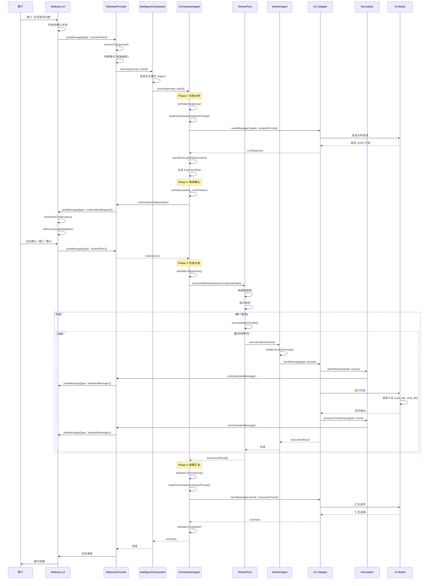

# MultiCLI 编排系统核心流程深度分析（代码级别）

> **作者**: 高级架构工程师  
> **日期**: 2026-01-17  
> **目标**: 从代码实现角度彻底分析用户消息的完整生命周期

---

## 目录

1. [系统架构概览](#1-系统架构概览)
2. [消息生命周期完整流程](#2-消息生命周期完整流程)
3. [对话解析与格式处理](#3-对话解析与格式处理)
4. [角色画像与能力分配](#4-角色画像与能力分配)
5. [需求拆解机制](#5-需求拆解机制)
6. [任务分配策略](#6-任务分配策略)
7. [子代理工作机制](#7-子代理工作机制)
8. [工具使用流程](#8-工具使用流程)
9. [结果反馈与汇总](#9-结果反馈与汇总)
10. [关键设计模式](#10-关键设计模式)

---

## 1. 系统架构概览

### 1.1 核心组件层次结构

```
┌─────────────────────────────────────────────────────────────┐
│                    前端 UI 层 (Webview)                        │
│  - 消息输入/显示                                               │
│  - 计划确认交互                                                │
│  - 自然语言确认解析                                            │
│  - 双面板展示 (Thread + CLI)                                  │
└─────────────────────────────────────────────────────────────┘
                            ↕ postMessage
┌─────────────────────────────────────────────────────────────┐
│              通信协调层 (WebviewProvider)                      │
│  - executeTask() 入口                                         │
│  - 模式路由 (智能编排 vs 直接执行)                             │
│  - 确认回调管理                                                │
│  - 状态同步                                                    │
└─────────────────────────────────────────────────────────────┘
                            ↕
┌─────────────────────────────────────────────────────────────┐
│           编排决策层 (IntelligentOrchestrator)                │
│  - 交互模式管理 (ask/agent/auto)                              │
│  - OrchestratorAgent 协调                                     │
│  - 任务生命周期管理                                            │
└─────────────────────────────────────────────────────────────┘
                            ↕
┌─────────────────────────────────────────────────────────────┐
│              任务编排层 (OrchestratorAgent)                    │
│  - 任务分析 (analyzeTask)                                     │
│  - 计划生成 (parseExecutionPlan)                              │
│  - 用户确认 (waitForConfirmation)                             │
│  - 任务分发 (dispatchTasks)                                   │
│  - 结果汇总 (summarizeResults)                                │
└─────────────────────────────────────────────────────────────┘
                            ↕
┌─────────────────────────────────────────────────────────────┐
│              执行协调层 (WorkerPool)                           │
│  - Worker 管理                                                │
│  - 依赖图调度 (executeWithDependencyGraph)                    │
│  - 并发控制                                                    │
│  - 重试机制                                                    │
└─────────────────────────────────────────────────────────────┘
                            ↕
┌─────────────────────────────────────────────────────────────┐
│              工作代理层 (WorkerAgent)                          │
│  - 任务执行 (executeTask)                                     │
│  - Prompt 构建                                                │
│  - CLI 调用                                                    │
└─────────────────────────────────────────────────────────────┘
                            ↕
┌─────────────────────────────────────────────────────────────┐
│              CLI 适配层 (CLIAdapterFactory)                   │
│  - 适配器管理 (Claude/Codex/Gemini)                           │
│  - 消息标准化 (Normalizer)                                    │
│  - 事件转发                                                    │
└─────────────────────────────────────────────────────────────┘
                            ↕
┌─────────────────────────────────────────────────────────────┐
│              外部 CLI 层                                       │
│  - Claude CLI / Codex CLI / Gemini CLI                       │
│  - 实际的 AI 模型交互                                          │
│  - 工具执行                                                    │
└─────────────────────────────────────────────────────────────┘
```

### 1.2 数据流向图

```
用户输入
  ↓
前端解析 (自然语言确认检测)
  ↓
WebviewProvider.executeTask()
  ↓
模式判断 (智能编排 vs 直接执行)
  ↓
IntelligentOrchestrator.execute()
  ↓
交互模式选择 (ask vs agent)
  ↓
OrchestratorAgent.execute()
  ├─ Phase 1: analyzeTask() → Claude 分析
  ├─ Phase 2: waitForConfirmation() → 用户确认
  ├─ Phase 3: dispatchTasks() → WorkerPool
  │   └─ executeWithDependencyGraph()
  │       ├─ 构建依赖图
  │       ├─ 拓扑排序
  │       └─ 批次执行
  │           └─ WorkerAgent.executeTask()
  │               └─ CLIAdapter.sendMessage()
  │                   └─ Normalizer 标准化
  │                       └─ StandardMessage 事件
  └─ Phase 4: summarizeResults() → Claude 汇总
      ↓
前端展示 (Thread + CLI 面板)
```

---

## 2. 消息生命周期完整流程

### 2.1 阶段划分

| 阶段 | 组件 | 关键方法 | 输入 | 输出 |
|------|------|---------|------|------|
| 1. 前端接收 | Webview | handleExecuteClick | 用户输入 | executeTask 消息 |
| 2. 路由分发 | WebviewProvider | executeTask | prompt | 模式选择 |
| 3. 模式选择 | IntelligentOrchestrator | execute | prompt | ask/agent 模式 |
| 4. 任务分析 | OrchestratorAgent | analyzeTask | prompt | ExecutionPlan |
| 5. 用户确认 | OrchestratorAgent | waitForConfirmation | plan | boolean |
| 6. 任务分发 | WorkerPool | executeWithDependencyGraph | subTasks | ExecutionResult[] |
| 7. Worker执行 | WorkerAgent | executeTask | subTask | ExecutionResult |
| 8. 消息标准化 | Normalizer | processChunk | raw output | StandardMessage |
| 9. 结果汇总 | OrchestratorAgent | summarizeResults | results | summary |
| 10. 前端展示 | Webview | handleStandardMessage | StandardMessage | UI 更新 |

### 2.2 详细时序图



---

## 3. 对话解析与格式处理

### 3.1 前端消息输入处理

**文件**: `src/ui/webview/index.html` (行 5470-5520)

```javascript
// 用户点击执行按钮
document.getElementById('execute-btn').addEventListener('click', () => {
    const promptText = input.value.trim();

    // 🔑 关键1: 检查是否有待确认状态
    if (hasPendingConfirmation()) {
        // 自然语言确认处理
        const userInput = promptText.toLowerCase();
        const confirmKeywords = ['y', 'yes', '确认', '好的', '可以', '继续', 'ok', 'proceed'];
        const cancelKeywords = ['n', 'no', '取消', '不', '否', 'cancel'];

        if (confirmKeywords.some(k => userInput.includes(k))) {
            handlePlanConfirmation(true);
            return;
        } else if (cancelKeywords.some(k => userInput.includes(k))) {
            handlePlanConfirmation(false);
            return;
        }
    }

    // 🔑 关键2: 创建用户消息对象
    const userMsg = {
        role: 'user',
        content: promptText,
        time: new Date().toLocaleTimeString().slice(0,5),
        timestamp: Date.now(),
        images: imageDataUrls  // 支持图片
    };
    threadMessages.push(userMsg);

    // 🔑 关键3: 设置处理状态
    setProcessingState(true);

    // 🔑 关键4: 发送到后端
    vscode.postMessage({
        type: 'executeTask',
        prompt: promptText,
        images: imageData
    });
});
```

**核心机制**:
1. **自然语言确认**: 支持中英文确认关键词，无需点击按钮
2. **状态检测**: 优先检查是否有待确认的计划
3. **图片支持**: 可以附带图片数据
4. **状态管理**: 立即设置处理状态，显示加载动画

### 3.2 WebviewProvider 消息路由

**文件**: `src/ui/webview-provider.ts` (行 466-474, 1163-1174)

```typescript
// 消息处理入口
private async handleMessage(message: WebviewToExtensionMessage): Promise<void> {
    switch (message.type) {
        case 'executeTask':
            console.log('[MultiCLI] 处理 executeTask, prompt:', message.prompt);
            const images = message.images || [];
            await this.executeTask(message.prompt, undefined, images);
            break;
        // ... 其他消息类型
    }
}

// 执行任务 - 核心路由逻辑
private async executeTask(
    prompt: string,
    forceCli?: CLIType,
    imagePaths?: string[]
): Promise<void> {
    // 🔑 关键: 判断执行模式
    const useIntelligentMode = !forceCli && !this.selectedCli;

    if (useIntelligentMode) {
        // 智能编排模式：Claude 分析 → 分配 CLI → 执行 → 总结
        await this.executeWithIntelligentOrchestrator(prompt, imagePaths);
    } else {
        // 直接执行模式：指定 CLI 直接执行
        await this.executeWithDirectCli(prompt, forceCli || this.selectedCli!, imagePaths);
    }
}
```

**路由决策**:
- **智能编排模式**: 未选择特定 CLI → 使用 IntelligentOrchestrator
- **直接执行模式**: 已选择 CLI → 直接调用该 CLI

### 3.3 消息标准化协议

**文件**: `src/protocol/message-protocol.ts` (行 1-150)

```typescript
// 标准消息结构
export interface StandardMessage {
    id: string;                          // 消息唯一ID
    traceId: string;                     // 追踪ID（用于关联）
    type: MessageType;                   // 消息类型
    source: MessageSource;               // 来源 (orchestrator/worker)
    cli: CLIType;                        // CLI类型 (claude/codex/gemini)
    lifecycle: MessageLifecycle;         // 生命周期状态
    timestamp: number;                   // 时间戳
    updatedAt: number;                   // 更新时间
    blocks: ContentBlock[];              // 内容块数组
    metadata?: MessageMetadata;          // 元数据
}

// 消息类型枚举
export enum MessageType {
    TEXT = 'text',           // 普通文本
    PLAN = 'plan',           // 执行计划
    PROGRESS = 'progress',   // 进度更新
    RESULT = 'result',       // 执行结果
    ERROR = 'error',         // 错误消息
    INTERACTION = 'interaction',  // 需要交互
    SYSTEM = 'system',       // 系统通知
    TOOL_CALL = 'tool_call', // 工具调用
    THINKING = 'thinking',   // 思考过程
}

// 生命周期状态
export enum MessageLifecycle {
    STARTED = 'started',         // 开始
    STREAMING = 'streaming',     // 流式输出中
    COMPLETED = 'completed',     // 完成
    FAILED = 'failed',           // 失败
    INTERRUPTED = 'interrupted', // 中断
}
```

**设计理念**:
1. **统一格式**: 所有 CLI 输出都转换为 StandardMessage
2. **明确类型**: 使用枚举消除格式猜测
3. **生命周期**: 清晰的状态机管理
4. **可扩展**: 支持各种富文本元素

---

## 4. 角色画像与能力分配

### 4.1 CLI 角色定义

**文件**: `src/orchestrator/prompts.ts` (行 187-203)

```typescript
function getCliDescription(cli: CLIType): string {
    const descriptions: Record<CLIType, string> = {
        claude: `主控模型/架构师
            - 擅长: 复杂推理、架构设计、长上下文理解、代码审查、多步骤任务分解
            - 最适合: 架构设计、重构规划、复杂问题分析、文档编写、代码审查
            - 特点: 推理能力强，适合需要深度思考的任务`,

        codex: `后端专家/修复专家
            - 擅长: 快速代码生成、Bug 修复、代码补全、测试编写、算法实现
            - 最适合: 简单 Bug 修复、功能实现、单元测试、代码调试
            - 特点: 执行速度快，适合明确的编码任务`,

        gemini: `前端专家/多模态专家
            - 擅长: 多模态理解、前端 UI/UX、CSS 样式、React/Vue 组件、创意任务
            - 最适合: 前端开发、UI 组件、样式优化、图片理解、创意设计
            - 特点: 多模态能力强，适合视觉相关任务`,
    };
    return descriptions[cli] || '通用编程助手';
}
```

### 4.2 任务分配规则

**文件**: `src/orchestrator/prompts.ts` (行 62-68)

```typescript
## 重要约束
- **前端/UI/样式任务** → 分配给 Gemini
- **后端/逻辑/算法/Bug修复任务** → 分配给 Codex
- **架构设计/复杂分析/文档任务** → 分配给 Claude
- **各 CLI 独立执行**：每个 CLI 直接修改文件，拥有完整写入权限
- **避免文件冲突**：不同 CLI 负责不同文件，有冲突时改为串行执行
```

**分配策略**:

1. **能力匹配**: 根据任务类型选择最擅长的 CLI
2. **文件隔离**: 不同 CLI 负责不同文件，避免冲突
3. **执行模式**: 有依赖关系时串行，否则并行

---

## 5. 需求拆解机制

### 5.1 任务分析流程

**文件**: `src/orchestrator/orchestrator-agent.ts` (行 478-513)

```typescript
private async analyzeTask(userPrompt: string): Promise<ExecutionPlan | null> {
    console.log('[OrchestratorAgent] Phase 1: 任务分析...');

    // 🔑 关键1: 获取可用 Worker
    const availableWorkers: WorkerType[] = ['claude', 'codex', 'gemini'];

    // 🔑 关键2: 构建分析 Prompt
    const analysisPrompt = buildOrchestratorAnalysisPrompt(userPrompt, availableWorkers);

    try {
        // 🔑 关键3: 使用 Claude 进行分析（编排者专用会话）
        const response = await this.cliFactory.sendMessage(
            'claude',
            analysisPrompt,
            undefined,
            { source: 'orchestrator', streamToUI: false }
        );

        if (response.error) {
            console.error('[OrchestratorAgent] 分析失败:', response.error);
            return null;
        }

        // 🔑 关键4: 解析执行计划
        const plan = this.parseExecutionPlan(response.content);

        if (plan) {
            // 🔑 关键5: 发送计划就绪事件
            this.emitUIMessage('plan_ready', formatPlanForUser(plan), { plan });
            globalEventBus.emitEvent('orchestrator:plan_ready', {
                taskId: this.currentContext?.taskId,
                data: { plan },
            });
        }

        return plan;
    } catch (error) {
        console.error('[OrchestratorAgent] 分析异常:', error);
        return null;
    }
}
```

**分析流程**:

1. **准备阶段**: 获取可用 Worker 列表
2. **Prompt 构建**: 使用模板生成分析 Prompt
3. **Claude 分析**: 调用 Claude 进行任务分解
4. **计划解析**: 提取 JSON 格式的执行计划
5. **事件通知**: 发送计划就绪事件到前端

### 5.2 执行计划解析

**文件**: `src/orchestrator/orchestrator-agent.ts` (行 518-568)

```typescript
private parseExecutionPlan(content: string): ExecutionPlan | null {
    try {
        // 🔑 关键1: 提取 JSON（支持 markdown 代码块）
        const jsonMatch = content.match(/```json\s*([\s\S]*?)\s*```/);
        const jsonStr = jsonMatch ? jsonMatch[1] : content;
        const parsed = JSON.parse(jsonStr);

        // 🔑 关键2: 验证必要字段
        const featureContract = typeof parsed.featureContract === 'string'
            ? parsed.featureContract.trim()
            : '';
        const acceptanceCriteria = Array.isArray(parsed.acceptanceCriteria)
            ? parsed.acceptanceCriteria
                .filter((item: unknown) => typeof item === 'string')
                .map((item: string) => item.trim())
                .filter(Boolean)
            : [];

        if (!featureContract || acceptanceCriteria.length === 0) {
            throw new Error('执行计划缺少功能契约或验收清单');
        }

        // 🔑 关键3: 构建标准化的 ExecutionPlan 对象
        return {
            id: `plan_${Date.now()}`,
            analysis: parsed.analysis || '',
            isSimpleTask: parsed.isSimpleTask || false,
            skipReason: parsed.skipReason,
            needsCollaboration: parsed.needsCollaboration ?? true,
            subTasks: (parsed.subTasks || []).map((t: any, i: number) => ({
                id: t.id || String(i + 1),
                taskId: this.currentContext?.taskId || '',
                description: t.description || '',
                assignedWorker: t.assignedWorker || t.assignedCli || 'claude',
                reason: t.reason || '',
                targetFiles: t.targetFiles || [],
                dependencies: t.dependencies || [],
                prompt: t.prompt || '',
                priority: t.priority,
                kind: t.kind || 'implementation',
                featureId: t.featureId || `feature_${this.currentContext?.taskId}`,
                status: 'pending',
                output: [],
            })),
            executionMode: parsed.executionMode || 'sequential',
            summary: parsed.summary || '',
            featureContract,
            acceptanceCriteria,
            createdAt: Date.now(),
        };
    } catch (error) {
        console.error('[OrchestratorAgent] 解析执行计划失败:', error);
        return null;
    }
}
```

**解析步骤**:

1. **提取 JSON**: 支持 markdown 代码块包裹
2. **字段验证**: 确保功能契约和验收标准存在
3. **数据清洗**: 过滤无效数据，设置默认值
4. **标准化**: 转换为内部 ExecutionPlan 结构

### 5.3 用户确认机制

**文件**: `src/orchestrator/orchestrator-agent.ts` (行 577-598)

```typescript
private async waitForConfirmation(plan: ExecutionPlan): Promise<boolean> {
    if (!this.confirmationCallback) {
        console.log('[OrchestratorAgent] 未设置确认回调，自动确认');
        return true;
    }

    // 🔑 关键1: 格式化计划为用户可读文本
    const formattedPlan = formatPlanForUser(plan);

    // 🔑 关键2: 发送等待确认事件
    globalEventBus.emitEvent('orchestrator:waiting_confirmation', {
        taskId: this.currentContext?.taskId,
        data: { plan, formattedPlan },
    });

    try {
        // 🔑 关键3: 调用确认回调（Promise-based 异步等待）
        const confirmed = await this.confirmationCallback(plan, formattedPlan);
        console.log(`[OrchestratorAgent] 用户确认结果: ${confirmed ? 'Y' : 'N'}`);
        return confirmed;
    } catch (error) {
        console.error('[OrchestratorAgent] 等待确认异常:', error);
        return false;
    }
}
```

**确认流程**:

1. **格式化计划**: 转换为用户友好的 Markdown 格式
2. **发送事件**: 通知前端显示确认卡片
3. **异步等待**: 使用 Promise 等待用户操作
4. **返回结果**: 用户确认或取消

---

## 6. 任务分配策略

### 6.1 依赖图调度

**文件**: `src/orchestrator/worker-pool.ts` (行 790-859)

```typescript
async executeWithDependencyGraph(
    taskId: string,
    subTasks: SubTask[],
    context?: string
): Promise<ExecutionResult[]> {
    // 🔑 关键1: 构建依赖图
    const graph = new TaskDependencyGraph();

    // 添加所有任务到图中
    for (const subTask of subTasks) {
        graph.addTask(subTask.id, subTask.description, subTask);
    }

    // 添加依赖关系
    for (const subTask of subTasks) {
        if (subTask.dependencies && subTask.dependencies.length > 0) {
            graph.addDependencies(subTask.id, subTask.dependencies);
        }
    }

    // 🔑 关键2: 分析依赖图
    const analysis = graph.analyze();

    if (analysis.hasCycle) {
        console.error('[WorkerPool] 检测到循环依赖:', analysis.cycleNodes);
        throw new Error(`任务存在循环依赖: ${analysis.cycleNodes?.join(', ')}`);
    }

    console.log(`[WorkerPool] 依赖图分析完成:`);
    console.log(`  - 任务总数: ${subTasks.length}`);
    console.log(`  - 执行批次: ${analysis.executionBatches.length}`);
    console.log(`  - 关键路径: ${analysis.criticalPath.join(' -> ')}`);

    // 🔑 关键3: 按批次执行任务
    const allResults: ExecutionResult[] = [];

    for (const batch of analysis.executionBatches) {
        console.log(`[WorkerPool] 执行批次 ${batch.batchIndex + 1}/${analysis.executionBatches.length}:`,
            batch.taskIds.join(', '));

        // 获取批次中的任务
        const batchTasks = batch.taskIds
            .map(id => graph.getTask(id)?.data as SubTask)
            .filter((t): t is SubTask => t !== undefined);

        // 🔑 关键4: 并行执行批次内的任务
        const batchResults = await this.executeBatchParallel(taskId, batchTasks, context);
        allResults.push(...batchResults);

        // 更新图中的任务状态
        for (const result of batchResults) {
            graph.updateTaskStatus(
                result.subTaskId,
                result.success ? 'completed' : 'failed'
            );
        }
    }

    return allResults;
}
```

**调度策略**:

1. **构建依赖图**: 使用 TaskDependencyGraph 管理任务依赖
2. **拓扑排序**: 分析依赖关系，生成执行批次
3. **循环检测**: 检测并拒绝循环依赖
4. **批次执行**: 按批次顺序执行，批次内并行

### 6.2 依赖图示例

```
任务依赖关系:
  Task 1 (创建数据模型)
    ↓
  Task 2 (实现API接口) ← 依赖 Task 1
    ↓
  Task 3 (前端集成) ← 依赖 Task 2

执行批次:
  Batch 0: [Task 1]           // 无依赖，先执行
  Batch 1: [Task 2]           // 依赖 Task 1
  Batch 2: [Task 3]           // 依赖 Task 2
```

---

## 7. 子代理工作机制

### 7.1 WorkerAgent 执行流程

**文件**: `src/orchestrator/worker-agent.ts` (行 127-136, 254-281)

```typescript
// 处理任务分发
private async handleTaskDispatch(message: TaskDispatchMessage): Promise<void> {
    const { taskId, subTask, context } = message.payload;

    if (this._state !== 'idle') {
        console.warn(`[WorkerAgent ${this.id}] 收到任务但当前状态为 ${this._state}，忽略`);
        return;
    }

    await this.executeTask(taskId, subTask, context);
}

// 构建执行 Prompt
protected buildExecutionPrompt(subTask: SubTask, context?: string): string {
    const filesHint = subTask.targetFiles?.length
        ? `\n\n**目标文件**: ${subTask.targetFiles.join(', ')}`
        : '';

    const contextHint = context ? `\n\n**上下文**:\n${context}` : '';

    return `${subTask.prompt}${filesHint}${contextHint}

**执行模式**: 直接修改
- 你拥有完整的文件写入权限，可以直接修改文件
- 完成必要的更改以完成任务
- 完成后提供简要的更改说明

**重要**: 请使用中文回复，包括代码注释也使用中文。`;
}
```

**执行步骤**:

1. **接收任务**: 通过消息总线接收任务分发
2. **状态检查**: 确保 Worker 处于空闲状态
3. **构建 Prompt**: 根据任务类型构建执行指令
4. **调用 CLI**: 发送到对应的 CLI 执行
5. **收集结果**: 返回 ExecutionResult

---

## 8. 工具使用流程

### 8.1 工具调用机制

**工具调用流程**:

1. **CLI 执行**: AI 模型决定调用工具（如 read_file, write_file）
2. **工具执行**: CLI 本身执行工具调用
3. **结果返回**: 工具结果返回给 AI 模型
4. **继续生成**: AI 模型基于工具结果继续生成

**注意**: 工具由 CLI 本身执行，编排系统不直接执行工具。

### 8.2 支持的工具类型

| 工具名称 | 功能 | 使用场景 |
|---------|------|---------|
| read_file | 读取文件内容 | 查看现有代码 |
| write_file | 写入文件 | 创建或修改文件 |
| list_directory | 列出目录 | 浏览项目结构 |
| search_files | 搜索文件 | 查找特定代码 |
| run_bash_command | 执行命令 | 运行测试、编译等 |
| edit_file | 编辑文件 | 精确修改代码 |

---

## 9. 结果反馈与汇总

### 9.1 消息标准化流程

**文件**: `src/normalizer/base-normalizer.ts` + 各 CLI Normalizer

```typescript
// 1. 开始流式消息
startStream(traceId: string, source?: MessageSource): string {
    const messageId = generateMessageId();
    const message = createStreamingMessage(source, this.config.cli, traceId, { id: messageId });
    this.emit('message', message);
    return messageId;
}

// 2. 处理输出块
processChunk(messageId: string, chunk: string): void {
    const context = this.activeContexts.get(messageId);
    context.rawBuffer += chunk;
    const updates = this.parseChunk(context, chunk);
    for (const update of updates) {
        this.emit('update', update);
    }
}

// 3. 结束流式消息
endStream(messageId: string, error?: string): StandardMessage | null {
    const context = this.activeContexts.get(messageId);
    this.finalizeContext(context);
    const message = this.buildFinalMessage(context, error);
    this.emit('complete', messageId, message);
    return message;
}
```

**标准化流程**:

1. **开始流**: 创建 StandardMessage，设置 lifecycle 为 streaming
2. **处理块**: 解析原始输出，提取文本/代码/工具调用等
3. **发送更新**: 通过事件发送增量更新
4. **结束流**: 设置 lifecycle 为 completed，发送完整消息

### 9.2 消息路由机制

```typescript
// 后端: CLIAdapterFactory 转发标准消息
normalizer.on('message', (message: StandardMessage) => {
    this.emit('standardMessage', message);
});

// 后端: WebviewProvider 转发到前端
this.cliFactory.on('standardMessage', (message: any) => {
    this.postMessage({
        type: 'standardMessage',
        message,
        sessionId: this.activeSessionId
    });
});

// 前端: 接收并路由消息
window.addEventListener('message', event => {
    const msg = event.data;
    if (msg.type === 'standardMessage') {
        handleStandardMessage(msg.message);
    }
});

// 前端: 根据 source 路由到不同面板
function handleStandardMessage(message) {
    const isOrchestrator = message.source === 'orchestrator';
    const cli = message.cli || 'claude';

    if (isOrchestrator) {
        // 编排者消息 -> Thread 面板
        threadMessages.push(webviewMsg);
    } else {
        // Worker 消息 -> CLI 面板
        cliOutputs[cli].push(webviewMsg);
    }

    renderMainContent();
}
```

**路由规则**:

- **source === 'orchestrator'** → Thread 面板（主对话）
- **source === 'worker'** → CLI 面板（按 CLI 类型分组）

### 9.3 结果汇总

**文件**: `src/orchestrator/orchestrator-agent.ts` (汇总阶段)

```typescript
private async summarizeResults(
    userPrompt: string,
    results: ExecutionResult[]
): Promise<string> {
    // 构建汇总 Prompt
    const summaryPrompt = buildOrchestratorSummaryPrompt(userPrompt, results);

    // 调用 Claude 汇总
    const response = await this.cliFactory.sendMessage(
        'claude',
        summaryPrompt,
        undefined,
        { source: 'orchestrator', streamToUI: true }
    );

    return response.content;
}
```

**汇总流程**:

1. **收集结果**: 汇总所有 Worker 的执行结果
2. **构建 Prompt**: 包含原始需求和各 Worker 输出
3. **Claude 汇总**: 生成简洁的总结报告
4. **发送到前端**: 显示在 Thread 面板

---

## 10. 关键设计模式

### 10.1 消息标准化模式

**问题**: 不同 CLI 输出格式不一致

**解决方案**: Normalizer 模式

```
原始输出 → Normalizer → StandardMessage → 统一处理
```

### 10.2 状态机模式

**OrchestratorAgent 状态转换**:

```
idle → analyzing → waiting_confirmation → dispatching →
monitoring → verifying → summarizing → completed/failed
```

### 10.3 依赖图调度模式

**问题**: 任务间有依赖关系

**解决方案**: 拓扑排序 + 批次执行

```
任务依赖图 → 拓扑排序 → 执行批次 → 批次内并行执行
```

### 10.4 Promise-based 确认模式

**问题**: 异步等待用户确认

**解决方案**: Promise + Callback

```typescript
// 后端
const confirmed = await this.confirmationCallback(plan, formattedPlan);

// 前端
this.pendingConfirmation = { resolve };
// ... 用户操作 ...
this.pendingConfirmation.resolve(confirmed);
```

---

## 11. 完整示例：用户消息生命周期

### 11.1 示例场景

**用户输入**: "实现一个用户登录功能，包括前端表单和后端API"

### 11.2 执行流程追踪

#### Step 1: 前端接收 (0ms)

```javascript
// 用户点击执行按钮
const userMsg = { role: 'user', content: '实现一个用户登录功能...' };
threadMessages.push(userMsg);
vscode.postMessage({ type: 'executeTask', prompt: '实现一个用户登录功能...' });
```

#### Step 2: WebviewProvider 路由 (5ms)

```typescript
// 判断执行模式
const useIntelligentMode = !this.selectedCli;  // true
await this.executeWithIntelligentOrchestrator(prompt, []);
```

#### Step 3: IntelligentOrchestrator 模式选择 (10ms)

```typescript
// 检查交互模式
if (this.interactionMode === 'ask') {
    // ask 模式：仅对话
} else {
    // agent 模式：完整编排
    const result = await this.orchestratorAgent.execute(userPrompt, taskId);
}
```

#### Step 4: OrchestratorAgent 任务分析 (15ms - 3000ms)

```typescript
// Phase 1: 任务分析
this.setState('analyzing');
const plan = await this.analyzeTask(userPrompt);

// Claude 返回的执行计划:
{
  "analysis": "需要创建前端登录表单和后端API接口",
  "subTasks": [
    {
      "id": "1",
      "description": "创建登录表单组件",
      "assignedCli": "gemini",
      "targetFiles": ["src/components/LoginForm.tsx"]
    },
    {
      "id": "2",
      "description": "实现登录API接口",
      "assignedCli": "codex",
      "targetFiles": ["src/api/auth.ts"],
      "dependencies": ["1"]
    }
  ],
  "executionMode": "sequential"
}
```

#### Step 5: 用户确认 (3000ms - 用户操作)

```typescript
// Phase 2: 等待确认
this.setState('waiting_confirmation');
const confirmed = await this.waitForConfirmation(plan);

// 前端显示确认卡片
showPlanConfirmation(plan, formattedPlan);

// 用户点击确认或输入 "确认"
handlePlanConfirmation(true);
```

#### Step 6: 任务分发 (用户确认后 + 10ms)

```typescript
// Phase 3: 分发任务
this.setState('dispatching');
await this.dispatchWithDependencyGraph(plan.subTasks);

// 依赖图分析:
// Batch 0: [Task 1]
// Batch 1: [Task 2]
```

#### Step 7: Worker 执行 (批次执行)

```typescript
// Batch 0: Task 1 (Gemini)
Worker->>CLI: sendMessage('gemini', '创建登录表单组件...')
CLI->>Normalizer: startStream()
Normalizer->>Frontend: standardMessage (streaming)
// ... Gemini 生成代码 ...
CLI->>Normalizer: endStream()
Normalizer->>Frontend: standardMessage (completed)

// Batch 1: Task 2 (Codex)
Worker->>CLI: sendMessage('codex', '实现登录API接口...')
// ... 同样的流程 ...
```

#### Step 8: 结果汇总 (所有任务完成后)

```typescript
// Phase 4: 汇总结果
this.setState('summarizing');
const summary = await this.summarizeResults(userPrompt, results);

// Claude 生成总结:
"已完成用户登录功能的实现：
1. ✅ 创建了登录表单组件 (src/components/LoginForm.tsx)
2. ✅ 实现了登录API接口 (src/api/auth.ts)

所有功能已就绪，可以开始测试。"
```

#### Step 9: 前端展示

```javascript
// 汇总消息显示在 Thread 面板
threadMessages.push({
    role: 'assistant',
    content: summary,
    source: 'orchestrator'
});
renderMainContent();
```

---

## 12. 总结

### 12.1 核心流程回顾

```
用户输入
  ↓
前端处理 (自然语言确认、状态检查)
  ↓
WebviewProvider 路由 (智能模式 vs 直接模式)
  ↓
IntelligentOrchestrator 模式选择 (ask vs agent)
  ↓
OrchestratorAgent 任务分析 (调用 Claude 生成计划)
  ↓
用户确认 (Promise-based 异步等待)
  ↓
WorkerPool 任务分发 (依赖图调度)
  ↓
WorkerAgent 执行任务 (调用 CLI)
  ↓
CLI Adapter 消息处理 (Normalizer 标准化)
  ↓
消息路由 (orchestrator → Thread, worker → CLI)
  ↓
结果汇总 (Claude 生成总结)
  ↓
前端展示 (状态清理、UI更新)
```

### 12.2 关键设计特点

1. **分层架构**: 清晰的职责分离
2. **消息标准化**: Normalizer 统一处理
3. **状态驱动**: 明确的状态转换
4. **异步协调**: Promise-based 确认机制
5. **灵活路由**: 基于 source 的消息路由
6. **依赖管理**: 拓扑排序 + 批次执行
7. **工具集成**: CLI 原生工具调用
8. **性能优化**: 批处理、去重、状态比较

### 12.3 扩展点

1. **新增 CLI**: 实现 ICLIAdapter 接口 + Normalizer
2. **新增交互模式**: 在 IntelligentOrchestrator 中添加
3. **新增意图类型**: 在 Intent Gate 中扩展
4. **新增验证器**: 实现 VerificationRunner 接口
5. **新增调度策略**: 在 WorkerPool 中添加

---

**文档版本**: v2.0
**最后更新**: 2026-01-17
**作者**: 高级架构工程师

