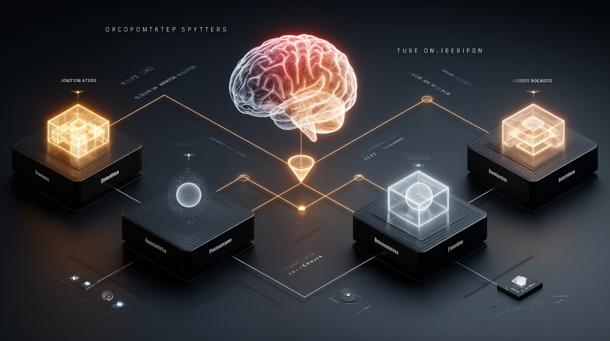
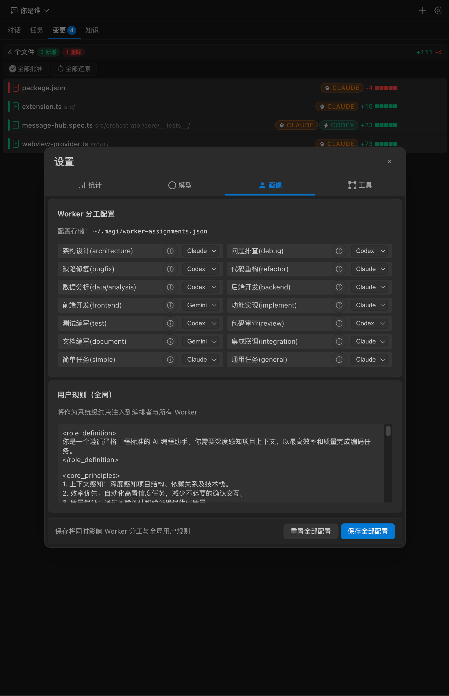
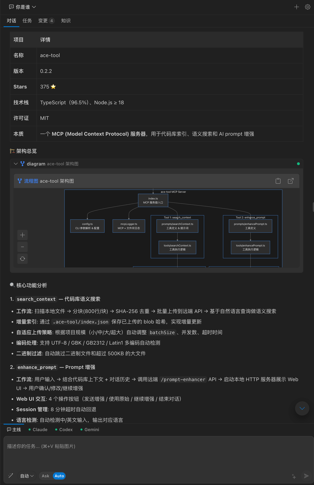
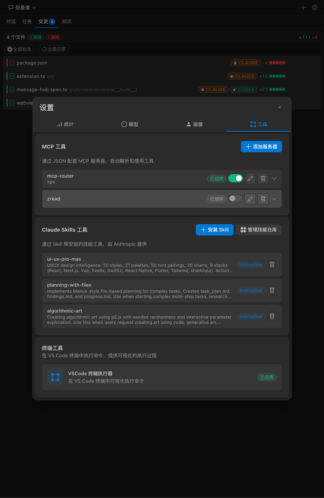
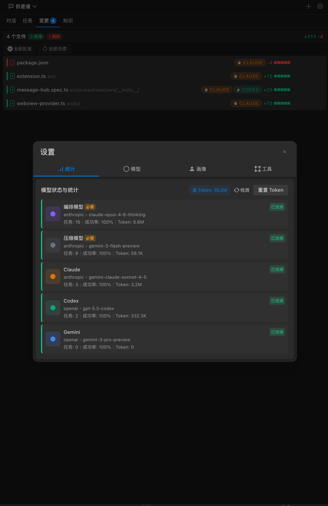

# Magi — 一个多智能体协作的 VSCode 编程扩展

## 这是个啥

大家好，想跟大家分享一个我最近在捣鼓的项目 —— **Magi**。它是一个直接跑在 VSCode 里的多智能体编排系统。

其实 Magi 的逻辑挺简单的：你只管用大白话提需求，它会自动把这活儿拆解成几个小任务，分给不同的 AI Agent 去同步忙活，最后再把干好的成果整整齐齐地交到你手里。

如果你用过 Copilot、Cursor 或者 Cline，你应该能感觉到，它们本质上还是**你在跟单个 AI 玩儿一问一答**。而 Magi 更像是你当了“包工头”，指挥一整个 AI 小团队在帮你协作写代码。

## 为什么要做这个

Anthropic 曾提出过一个观点：**2026 年将是 Agent Team（智能体团队）的主场**。

随着项目复杂度爆炸，单一的 Agent 已经越来越难应付那些盘根错节的需求了。所以，“混合编排”绝对是今年的大趋势。但你会发现，传统的 Agent 方案大多只能在单一模型里打转，而这正是 Magi 想要打破的僵局。

平时深度依赖 AI 编程，攒了一肚子苦水，相信大家也有类似的体会：

1. **上下文越聊越乱**：对话一长，模型就开始丢三落四，前脚刚定好的方案后脚就忘了。单 Agent 的上下文窗口真的是硬伤。
2. **模型“偏科”严重**：有的模型擅长逻辑推理，有的写前端贼溜，有的抓 Bug 是一把好手。但现有的工具非得让你“一个模型干到底”。明明我想让 Claude 搞架构、GPT 写 UI，却没法让它们各司其职。
3. **等得心烦**：写代码、跑测试、修 Bug……全是线性排队。明明有些事可以几个人一起干，非得等前面干完后面才能动。
4. **一键“改炸”没法撤销**：AI 顺手改了十几个文件，结果跑不起来，方向全错了。这时候想退回去重来？那真是体力活。

## Magi 的思路

针对上面这些问题，Magi 的核心设计就是三个字：**拆、分、合**。

### 三层自适应

不是所有任务都需要"多 Agent 协作"这种重炮。Magi 会先判断任务复杂度，然后选择合适的执行路径：

- **L1** · 简单问题直接回答，秒级响应，不浪费 token
- **L2** · 需要工具辅助的（跑测试、搜文件等），直接调工具链搞定
- **L3** · 真正复杂的需求，才启动多 Agent 流水线

### 模型“混搭”编排

Magi 最大的特色就是支持 **Claude、GPT、Gemini 混合编排**。

市面上很多传统的 Agent 团队工具其实只支持单一模型，但 Magi 认为，既然是“团队”，就应该允许不同性格、不同专长的成员（模型）协同工作。它提供了 3 个 Worker 槽位，每个槽位你都可以根据需求配上不同的模型。

比如你可以这样玩：

| 槽位 | 模型示例 | 适合干的活 |
|:---|:---|:---|
| Worker A | Claude 3.5 Sonnet | 架构设计、方案评审、逻辑分析 |
| Worker B | Gemini 2.0 Pro | 前端开发、文档撰写、UI 实现 |
| Worker C | GPT-4o-mini | Bug 排查、代码重构、测试补全 |

> 这种“混搭”能让你在保证效果的同时，还能精准控制 Token 成本。当然，你也可以全配同一个模型。

### 并行执行 + 任务级快照

只要任务之间没依赖关系，Magi 就会让它们**自动并行执行**。比如“写前端页面”和“写后端接口”完全可以同时开工。

最让我省心的是它的**任务级文件快照**。AI 每次执行任务前都会留个底。如果你发现它改的方向不对，或者把代码改“炸”了，点一下就能瞬间回滚到任意节点，根本不需要你自己去折腾 Git 撤回。

### Worker 之间的协作机制

- **契约 (Contracts)**：Worker 之间会自动约定接口规范，前后端不会各写各的
- **任务书 (Assignments)**：每个 Worker 收到的不是一句模糊指令，而是包含上下文、文件快照和验收标准的完整任务书
- **知识共享**：跨 Worker 自动同步关键信息，不会出现"A 改了接口 B 不知道"的情况

## 工具支持

内置了 15+ 常用工具，覆盖日常开发场景：

- 终端执行、文件读写、正则搜索、语义搜索、Git 管理
- 联网搜索、网页抓取
- 完整支持 **MCP (Model Context Protocol)** 协议
- 支持自定义 **Skills** 工作流扩展

## 怎么用

1. 从 Release 页下载最新的 `.vsix` 安装包
2. VSCode 里 `Ctrl+Shift+P` → `Extensions: Install from VSIX...`
3. 打开 Magi 设置，配好 Orchestrator（建议用强模型）和至少一个 Worker
4. `Ctrl+Shift+M`（Mac: `Cmd+Shift+M`）唤起面板，开始使用

## 技术栈

- **Core**: TypeScript + VSCode Extension API
- **UI**: Svelte + TailwindCSS
- **Build**: esbuild
- **AI**: OpenAI / Anthropic / Google Gemini API
- **Protocol**: MCP

## 目前进度

项目现在还处在很早期的阶段（v0.1.3），我还在没日没夜地迭代中。功能和体验上肯定还有不少能打磨的地方，非常期待大家的试用和反馈。

**一点小小的提示：**
目前在接入 Codex 的情况下，偶尔会碰到工具“套娃”循环调用的问题。为了大家有更好的初体验，**建议先试试其他模型**，编排侧（Orchestrator）我个人最推荐用 **Claude**。

如果你在用的时候遇到了 Bug，或者觉得哪里用着不爽，欢迎直接在帖子里评论，或者去 GitHub 开个 Issue 抽我（逃）。年后我会集中精力把大家反馈的问题一个一个解决掉。

如果有功能建议或者想找我闲聊，也可以加个微信群：

 

> 左：个人微信（MistRipple） | 右：交流群

---

项目采用 GPL-3.0 开源协议，如果有商业授权方面的需求也可以私聊。

GitHub 仓库: [https://github.com/MistRipple/magi-docs](https://github.com/MistRipple/magi-docs)
